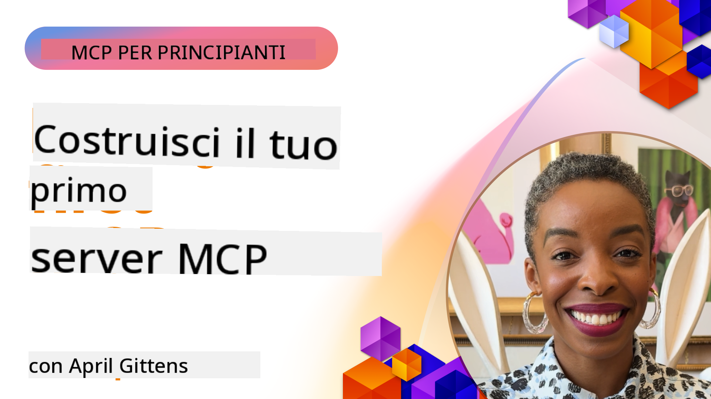

<!--
CO_OP_TRANSLATOR_METADATA:
{
  "original_hash": "1197b6dbde36773e04a5ae826557fdb9",
  "translation_date": "2025-08-26T17:39:46+00:00",
  "source_file": "03-GettingStarted/README.md",
  "language_code": "it"
}
-->
## Iniziare  

_(Clicca sull'immagine sopra per guardare il video di questa lezione)_

Questa sezione è composta da diverse lezioni:

- **1 Il tuo primo server**, in questa prima lezione imparerai a creare il tuo primo server e a ispezionarlo con lo strumento di ispezione, un modo prezioso per testare e fare debug del tuo server, [alla lezione](01-first-server/README.md)

- **2 Client**, in questa lezione imparerai a scrivere un client che può connettersi al tuo server, [alla lezione](02-client/README.md)

- **3 Client con LLM**, un modo ancora migliore per scrivere un client è aggiungere un LLM, così da poter "negoziare" con il tuo server su cosa fare, [alla lezione](03-llm-client/README.md)

- **4 Utilizzo di un server in modalità GitHub Copilot Agent in Visual Studio Code**. Qui vedremo come eseguire il nostro server MCP direttamente da Visual Studio Code, [alla lezione](04-vscode/README.md)

- **5 Server con trasporto stdio**. Il trasporto stdio è lo standard raccomandato per la comunicazione server-client MCP nella specifica attuale, fornendo una comunicazione sicura basata su sottoprocessi, [alla lezione](05-stdio-server/README.md)

- **6 Streaming HTTP con MCP (HTTP Streamable)**. Scopri lo streaming HTTP moderno, le notifiche di progresso e come implementare server e client MCP scalabili e in tempo reale utilizzando HTTP Streamable, [alla lezione](06-http-streaming/README.md)

- **7 Utilizzo dell'AI Toolkit per VSCode** per consumare e testare i tuoi client e server MCP, [alla lezione](07-aitk/README.md)

- **8 Test**. Qui ci concentreremo in particolare su come testare il nostro server e client in modi diversi, [alla lezione](08-testing/README.md)

- **9 Deployment**. Questo capitolo esaminerà i diversi modi per distribuire le tue soluzioni MCP, [alla lezione](09-deployment/README.md)

Il Model Context Protocol (MCP) è un protocollo aperto che standardizza il modo in cui le applicazioni forniscono contesto agli LLM. Pensa a MCP come a una porta USB-C per le applicazioni AI: fornisce un modo standardizzato per connettere i modelli AI a diverse fonti di dati e strumenti.

## Obiettivi di apprendimento

Alla fine di questa lezione, sarai in grado di:

- Configurare ambienti di sviluppo per MCP in C#, Java, Python, TypeScript e JavaScript
- Creare e distribuire server MCP di base con funzionalità personalizzate (risorse, prompt e strumenti)
- Creare applicazioni host che si connettono ai server MCP
- Testare e fare debug delle implementazioni MCP
- Comprendere le sfide comuni di configurazione e le loro soluzioni
- Connettere le tue implementazioni MCP ai servizi LLM più popolari

## Configurare il tuo ambiente MCP

Prima di iniziare a lavorare con MCP, è importante preparare il tuo ambiente di sviluppo e comprendere il flusso di lavoro di base. Questa sezione ti guiderà attraverso i passaggi iniziali per garantire un avvio senza problemi con MCP.

### Prerequisiti

Prima di immergerti nello sviluppo MCP, assicurati di avere:

- **Ambiente di sviluppo**: Per il linguaggio scelto (C#, Java, Python, TypeScript o JavaScript)
- **IDE/Editor**: Visual Studio, Visual Studio Code, IntelliJ, Eclipse, PyCharm o qualsiasi editor di codice moderno
- **Gestori di pacchetti**: NuGet, Maven/Gradle, pip o npm/yarn
- **Chiavi API**: Per qualsiasi servizio AI che intendi utilizzare nelle tue applicazioni host

### SDK ufficiali

Nei capitoli successivi vedrai soluzioni costruite utilizzando Python, TypeScript, Java e .NET. Ecco tutti gli SDK ufficialmente supportati.

MCP fornisce SDK ufficiali per diversi linguaggi:
- [C# SDK](https://github.com/modelcontextprotocol/csharp-sdk) - Mantenuto in collaborazione con Microsoft
- [Java SDK](https://github.com/modelcontextprotocol/java-sdk) - Mantenuto in collaborazione con Spring AI
- [TypeScript SDK](https://github.com/modelcontextprotocol/typescript-sdk) - L'implementazione ufficiale in TypeScript
- [Python SDK](https://github.com/modelcontextprotocol/python-sdk) - L'implementazione ufficiale in Python
- [Kotlin SDK](https://github.com/modelcontextprotocol/kotlin-sdk) - L'implementazione ufficiale in Kotlin
- [Swift SDK](https://github.com/modelcontextprotocol/swift-sdk) - Mantenuto in collaborazione con Loopwork AI
- [Rust SDK](https://github.com/modelcontextprotocol/rust-sdk) - L'implementazione ufficiale in Rust

## Punti chiave

- Configurare un ambiente di sviluppo MCP è semplice con gli SDK specifici per linguaggio
- Creare server MCP implica la creazione e la registrazione di strumenti con schemi chiari
- I client MCP si connettono ai server e ai modelli per sfruttare capacità estese
- Testare e fare debug è essenziale per implementazioni MCP affidabili
- Le opzioni di distribuzione vanno dallo sviluppo locale a soluzioni basate su cloud

## Pratica

Abbiamo un set di esempi che integra gli esercizi che vedrai in tutti i capitoli di questa sezione. Inoltre, ogni capitolo ha i propri esercizi e compiti.

- [Calcolatrice in Java](./samples/java/calculator/README.md)
- [Calcolatrice in .Net](../../../03-GettingStarted/samples/csharp)
- [Calcolatrice in JavaScript](./samples/javascript/README.md)
- [Calcolatrice in TypeScript](./samples/typescript/README.md)
- [Calcolatrice in Python](../../../03-GettingStarted/samples/python)

## Risorse aggiuntive

- [Crea agenti utilizzando il Model Context Protocol su Azure](https://learn.microsoft.com/azure/developer/ai/intro-agents-mcp)
- [MCP remoto con Azure Container Apps (Node.js/TypeScript/JavaScript)](https://learn.microsoft.com/samples/azure-samples/mcp-container-ts/mcp-container-ts/)
- [.NET OpenAI MCP Agent](https://learn.microsoft.com/samples/azure-samples/openai-mcp-agent-dotnet/openai-mcp-agent-dotnet/)

## Cosa c'è dopo

Prossimo: [Creare il tuo primo server MCP](01-first-server/README.md)

---

**Disclaimer**:  
Questo documento è stato tradotto utilizzando il servizio di traduzione automatica [Co-op Translator](https://github.com/Azure/co-op-translator). Sebbene ci impegniamo per garantire l'accuratezza, si prega di notare che le traduzioni automatiche possono contenere errori o imprecisioni. Il documento originale nella sua lingua nativa dovrebbe essere considerato la fonte autorevole. Per informazioni critiche, si raccomanda una traduzione professionale effettuata da un traduttore umano. Non siamo responsabili per eventuali incomprensioni o interpretazioni errate derivanti dall'uso di questa traduzione.