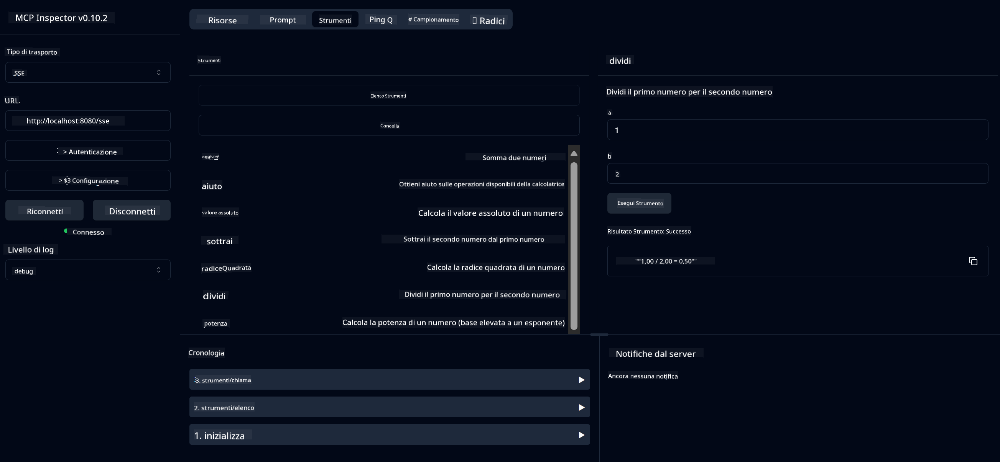

<!--
CO_OP_TRANSLATOR_METADATA:
{
  "original_hash": "13231e9951b68efd9df8c56bd5cdb27e",
  "translation_date": "2025-05-17T13:10:23+00:00",
  "source_file": "03-GettingStarted/samples/java/calculator/README.md",
  "language_code": "it"
}
-->
# Servizio MCP di Calcolatrice Base

Questo servizio offre operazioni di calcolatrice di base tramite il Model Context Protocol (MCP) utilizzando Spring Boot con trasporto WebFlux. È progettato come un semplice esempio per principianti che apprendono le implementazioni MCP.

Per ulteriori informazioni, consulta la documentazione di riferimento del [MCP Server Boot Starter](https://docs.spring.io/spring-ai/reference/api/mcp/mcp-server-boot-starter-docs.html).

## Panoramica

Il servizio mostra:
- Supporto per SSE (Server-Sent Events)
- Registrazione automatica degli strumenti utilizzando l'annotazione `@Tool` di Spring AI
- Funzioni di calcolatrice di base:
  - Addizione, sottrazione, moltiplicazione, divisione
  - Calcolo della potenza e radice quadrata
  - Modulo (resto) e valore assoluto
  - Funzione di aiuto per le descrizioni delle operazioni

## Funzionalità

Questo servizio di calcolatrice offre le seguenti capacità:

1. **Operazioni Aritmetiche di Base**:
   - Addizione di due numeri
   - Sottrazione di un numero da un altro
   - Moltiplicazione di due numeri
   - Divisione di un numero per un altro (con controllo divisione per zero)

2. **Operazioni Avanzate**:
   - Calcolo della potenza (sollevare una base a un esponente)
   - Calcolo della radice quadrata (con controllo numero negativo)
   - Calcolo del modulo (resto)
   - Calcolo del valore assoluto

3. **Sistema di Aiuto**:
   - Funzione di aiuto integrata che spiega tutte le operazioni disponibili

## Utilizzo del Servizio

Il servizio espone i seguenti endpoint API tramite il protocollo MCP:

- `add(a, b)`: Sommare due numeri
- `subtract(a, b)`: Sottrarre il secondo numero dal primo
- `multiply(a, b)`: Moltiplicare due numeri
- `divide(a, b)`: Dividere il primo numero per il secondo (con controllo zero)
- `power(base, exponent)`: Calcolare la potenza di un numero
- `squareRoot(number)`: Calcolare la radice quadrata (con controllo numero negativo)
- `modulus(a, b)`: Calcolare il resto della divisione
- `absolute(number)`: Calcolare il valore assoluto
- `help()`: Ottenere informazioni sulle operazioni disponibili

## Client di Test

Un semplice client di test è incluso nel pacchetto `com.microsoft.mcp.sample.client`. La classe `SampleCalculatorClient` dimostra le operazioni disponibili del servizio calcolatrice.

## Utilizzo del Client LangChain4j

Il progetto include un client di esempio LangChain4j in `com.microsoft.mcp.sample.client.LangChain4jClient` che dimostra come integrare il servizio calcolatrice con LangChain4j e modelli GitHub:

### Prerequisiti

1. **Configurazione del Token GitHub**:
   
   Per utilizzare i modelli AI di GitHub (come phi-4), è necessario un token di accesso personale GitHub:

   a. Vai alle impostazioni del tuo account GitHub: https://github.com/settings/tokens
   
   b. Clicca su "Genera nuovo token" → "Genera nuovo token (classico)"
   
   c. Dai al tuo token un nome descrittivo
   
   d. Seleziona i seguenti ambiti:
      - `repo` (Controllo completo dei repository privati)
      - `read:org` (Lettura appartenenza a organizzazioni e team, lettura progetti organizzativi)
      - `gist` (Creazione di gists)
      - `user:email` (Accesso agli indirizzi email degli utenti (solo lettura))
   
   e. Clicca su "Genera token" e copia il tuo nuovo token
   
   f. Impostalo come variabile d'ambiente:
      
      Su Windows:
      ```
      set GITHUB_TOKEN=your-github-token
      ```
      
      Su macOS/Linux:
      ```bash
      export GITHUB_TOKEN=your-github-token
      ```

   g. Per una configurazione persistente, aggiungilo alle tue variabili d'ambiente tramite le impostazioni di sistema

2. Aggiungi la dipendenza GitHub LangChain4j al tuo progetto (già inclusa in pom.xml):
   ```xml
   <dependency>
       <groupId>dev.langchain4j</groupId>
       <artifactId>langchain4j-github</artifactId>
       <version>${langchain4j.version}</version>
   </dependency>
   ```

3. Assicurati che il server della calcolatrice sia in esecuzione su `localhost:8080`

### Esecuzione del Client LangChain4j

Questo esempio dimostra:
- Connessione al server MCP della calcolatrice tramite trasporto SSE
- Utilizzo di LangChain4j per creare un chatbot che sfrutta le operazioni della calcolatrice
- Integrazione con i modelli AI di GitHub (ora utilizzando il modello phi-4)

Il client invia le seguenti query di esempio per dimostrare la funzionalità:
1. Calcolare la somma di due numeri
2. Trovare la radice quadrata di un numero
3. Ottenere informazioni di aiuto sulle operazioni disponibili della calcolatrice

Esegui l'esempio e controlla l'output della console per vedere come il modello AI utilizza gli strumenti della calcolatrice per rispondere alle query.

### Configurazione del Modello GitHub

Il client LangChain4j è configurato per utilizzare il modello phi-4 di GitHub con le seguenti impostazioni:

```java
ChatLanguageModel model = GitHubChatModel.builder()
    .apiKey(System.getenv("GITHUB_TOKEN"))
    .timeout(Duration.ofSeconds(60))
    .modelName("phi-4")
    .logRequests(true)
    .logResponses(true)
    .build();
```

Per utilizzare diversi modelli GitHub, cambia semplicemente il parametro `modelName` con un altro modello supportato (ad es., "claude-3-haiku-20240307", "llama-3-70b-8192", ecc.).

## Dipendenze

Il progetto richiede le seguenti dipendenze chiave:

```xml
<!-- For MCP Server -->
<dependency>
    <groupId>org.springframework.ai</groupId>
    <artifactId>spring-ai-starter-mcp-server-webflux</artifactId>
</dependency>

<!-- For LangChain4j integration -->
<dependency>
    <groupId>dev.langchain4j</groupId>
    <artifactId>langchain4j-mcp</artifactId>
    <version>${langchain4j.version}</version>
</dependency>

<!-- For GitHub models support -->
<dependency>
    <groupId>dev.langchain4j</groupId>
    <artifactId>langchain4j-github</artifactId>
    <version>${langchain4j.version}</version>
</dependency>
```

## Compilazione del Progetto

Compila il progetto utilizzando Maven:
```bash
./mvnw clean install -DskipTests
```

## Esecuzione del Server

### Utilizzo di Java

```bash
java -jar target/calculator-server-0.0.1-SNAPSHOT.jar
```

### Utilizzo di MCP Inspector

L'MCP Inspector è uno strumento utile per interagire con i servizi MCP. Per utilizzarlo con questo servizio calcolatrice:

1. **Installa ed esegui MCP Inspector** in una nuova finestra di terminale:
   ```bash
   npx @modelcontextprotocol/inspector
   ```

2. **Accedi all'interfaccia web** cliccando l'URL visualizzato dall'app (tipicamente http://localhost:6274)

3. **Configura la connessione**:
   - Imposta il tipo di trasporto su "SSE"
   - Imposta l'URL all'endpoint SSE del tuo server in esecuzione: `http://localhost:8080/sse`
   - Clicca su "Connetti"

4. **Utilizza gli strumenti**:
   - Clicca su "Elenca Strumenti" per vedere le operazioni disponibili della calcolatrice
   - Seleziona uno strumento e clicca su "Esegui Strumento" per eseguire un'operazione



### Utilizzo di Docker

Il progetto include un Dockerfile per il deployment containerizzato:

1. **Compila l'immagine Docker**:
   ```bash
   docker build -t calculator-mcp-service .
   ```

2. **Esegui il container Docker**:
   ```bash
   docker run -p 8080:8080 calculator-mcp-service
   ```

Questo:
- Compila un'immagine Docker multi-stage con Maven 3.9.9 e Eclipse Temurin 24 JDK
- Crea un'immagine container ottimizzata
- Espone il servizio sulla porta 8080
- Avvia il servizio calcolatrice MCP all'interno del container

Puoi accedere al servizio su `http://localhost:8080` una volta che il container è in esecuzione.

## Risoluzione dei Problemi

### Problemi Comuni con il Token GitHub

1. **Problemi di Permesso del Token**: Se ricevi un errore 403 Forbidden, verifica che il tuo token abbia i permessi corretti come indicato nei prerequisiti.

2. **Token Non Trovato**: Se ricevi un errore "Nessuna chiave API trovata", assicurati che la variabile d'ambiente GITHUB_TOKEN sia correttamente impostata.

3. **Limitazione di Rate**: L'API GitHub ha limiti di rate. Se incontri un errore di limitazione di rate (codice di stato 429), attendi qualche minuto prima di riprovare.

4. **Scadenza del Token**: I token GitHub possono scadere. Se ricevi errori di autenticazione dopo un po' di tempo, genera un nuovo token e aggiorna la tua variabile d'ambiente.

Se hai bisogno di ulteriore assistenza, consulta la [documentazione LangChain4j](https://github.com/langchain4j/langchain4j) o la [documentazione API di GitHub](https://docs.github.com/en/rest).

**Disclaimer**:  
Questo documento è stato tradotto utilizzando il servizio di traduzione AI [Co-op Translator](https://github.com/Azure/co-op-translator). Sebbene ci impegniamo per l'accuratezza, si prega di essere consapevoli che le traduzioni automatizzate possono contenere errori o imprecisioni. Il documento originale nella sua lingua nativa dovrebbe essere considerato la fonte autorevole. Per informazioni critiche, si raccomanda una traduzione professionale umana. Non siamo responsabili per eventuali incomprensioni o interpretazioni errate derivanti dall'uso di questa traduzione.