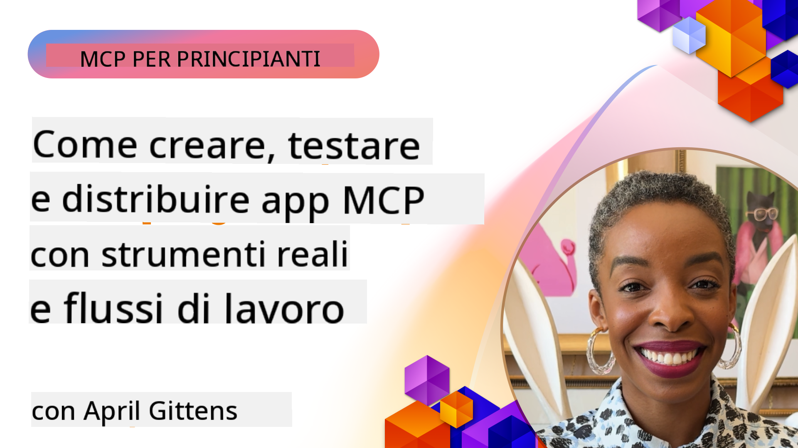

<!--
CO_OP_TRANSLATOR_METADATA:
{
  "original_hash": "83efa75a69bc831277263a6f1ae53669",
  "translation_date": "2025-08-18T17:25:04+00:00",
  "source_file": "04-PracticalImplementation/README.md",
  "language_code": "it"
}
-->
# Implementazione Pratica

[](https://youtu.be/vCN9-mKBDfQ)

_(Clicca sull'immagine sopra per visualizzare il video di questa lezione)_

L'implementazione pratica è il momento in cui il potenziale del Model Context Protocol (MCP) diventa concreto. Sebbene comprendere la teoria e l'architettura dietro MCP sia importante, il vero valore emerge quando si applicano questi concetti per costruire, testare e distribuire soluzioni che risolvono problemi reali. Questo capitolo colma il divario tra conoscenza concettuale e sviluppo pratico, guidandoti nel processo di creazione di applicazioni basate su MCP.

Che tu stia sviluppando assistenti intelligenti, integrando l'IA nei flussi di lavoro aziendali o costruendo strumenti personalizzati per l'elaborazione dei dati, MCP offre una base flessibile. Il suo design indipendente dal linguaggio e gli SDK ufficiali per i linguaggi di programmazione più diffusi lo rendono accessibile a una vasta gamma di sviluppatori. Sfruttando questi SDK, puoi prototipare rapidamente, iterare e scalare le tue soluzioni su diverse piattaforme e ambienti.

Nelle sezioni seguenti troverai esempi pratici, codice di esempio e strategie di distribuzione che dimostrano come implementare MCP in C#, Java con Spring, TypeScript, JavaScript e Python. Imparerai anche come eseguire il debug e testare i server MCP, gestire le API e distribuire soluzioni nel cloud utilizzando Azure. Queste risorse pratiche sono progettate per accelerare il tuo apprendimento e aiutarti a costruire con sicurezza applicazioni MCP robuste e pronte per la produzione.

## Panoramica

Questa lezione si concentra sugli aspetti pratici dell'implementazione di MCP in diversi linguaggi di programmazione. Esploreremo come utilizzare gli SDK MCP in C#, Java con Spring, TypeScript, JavaScript e Python per costruire applicazioni robuste, eseguire il debug e testare i server MCP e creare risorse, prompt e strumenti riutilizzabili.

## Obiettivi di Apprendimento

Alla fine di questa lezione, sarai in grado di:

- Implementare soluzioni MCP utilizzando gli SDK ufficiali in vari linguaggi di programmazione
- Eseguire il debug e testare i server MCP in modo sistematico
- Creare e utilizzare funzionalità del server (Risorse, Prompt e Strumenti)
- Progettare flussi di lavoro MCP efficaci per compiti complessi
- Ottimizzare le implementazioni MCP per prestazioni e affidabilità

## Risorse SDK Ufficiali

Il Model Context Protocol offre SDK ufficiali per diversi linguaggi:

- [C# SDK](https://github.com/modelcontextprotocol/csharp-sdk)
- [Java con Spring SDK](https://github.com/modelcontextprotocol/java-sdk) **Nota:** richiede la dipendenza da [Project Reactor](https://projectreactor.io). (Vedi [discussione issue 246](https://github.com/orgs/modelcontextprotocol/discussions/246).)
- [TypeScript SDK](https://github.com/modelcontextprotocol/typescript-sdk)
- [Python SDK](https://github.com/modelcontextprotocol/python-sdk)
- [Kotlin SDK](https://github.com/modelcontextprotocol/kotlin-sdk)

## Lavorare con gli SDK MCP

Questa sezione fornisce esempi pratici di implementazione di MCP in diversi linguaggi di programmazione. Puoi trovare codice di esempio nella directory `samples` organizzata per linguaggio.

### Esempi Disponibili

Il repository include [implementazioni di esempio](../../../04-PracticalImplementation/samples) nei seguenti linguaggi:

- [C#](./samples/csharp/README.md)
- [Java con Spring](./samples/java/containerapp/README.md)
- [TypeScript](./samples/typescript/README.md)
- [JavaScript](./samples/javascript/README.md)
- [Python](./samples/python/README.md)

Ogni esempio dimostra concetti chiave di MCP e modelli di implementazione per quello specifico linguaggio ed ecosistema.

## Funzionalità Principali del Server

I server MCP possono implementare qualsiasi combinazione di queste funzionalità:

### Risorse

Le risorse forniscono contesto e dati per l'utente o il modello AI da utilizzare:

- Repository di documenti
- Basi di conoscenza
- Fonti di dati strutturati
- Sistemi di file

### Prompt

I prompt sono messaggi e flussi di lavoro predefiniti per gli utenti:

- Modelli di conversazione predefiniti
- Modelli di interazione guidata
- Strutture di dialogo specializzate

### Strumenti

Gli strumenti sono funzioni che il modello AI può eseguire:

- Utilità di elaborazione dati
- Integrazioni API esterne
- Capacità computazionali
- Funzionalità di ricerca

## Implementazioni di Esempio: Implementazione in C#

Il repository ufficiale dell'SDK C# contiene diverse implementazioni di esempio che dimostrano diversi aspetti di MCP:

- **Client MCP di base**: Esempio semplice che mostra come creare un client MCP e chiamare strumenti
- **Server MCP di base**: Implementazione minima del server con registrazione di strumenti di base
- **Server MCP avanzato**: Server completo con registrazione di strumenti, autenticazione e gestione degli errori
- **Integrazione con ASP.NET**: Esempi che dimostrano l'integrazione con ASP.NET Core
- **Modelli di implementazione degli strumenti**: Vari modelli per implementare strumenti con diversi livelli di complessità

L'SDK C# MCP è in anteprima e le API potrebbero cambiare. Aggiorneremo continuamente questo blog man mano che l'SDK evolve.

### Funzionalità Chiave

- [C# MCP Nuget ModelContextProtocol](https://www.nuget.org/packages/ModelContextProtocol)
- Costruire il tuo [primo server MCP](https://devblogs.microsoft.com/dotnet/build-a-model-context-protocol-mcp-server-in-csharp/).

Per esempi completi di implementazione in C#, visita il [repository ufficiale degli esempi SDK C#](https://github.com/modelcontextprotocol/csharp-sdk)

## Implementazione di Esempio: Implementazione in Java con Spring

L'SDK Java con Spring offre opzioni di implementazione MCP robuste con funzionalità di livello enterprise.

### Funzionalità Chiave

- Integrazione con il framework Spring
- Forte sicurezza dei tipi
- Supporto alla programmazione reattiva
- Gestione completa degli errori

Per un esempio completo di implementazione in Java con Spring, vedi [Java con Spring sample](samples/java/containerapp/README.md) nella directory degli esempi.

## Implementazione di Esempio: Implementazione in JavaScript

L'SDK JavaScript offre un approccio leggero e flessibile all'implementazione di MCP.

### Funzionalità Chiave

- Supporto per Node.js e browser
- API basata su Promise
- Facile integrazione con Express e altri framework
- Supporto WebSocket per lo streaming

Per un esempio completo di implementazione in JavaScript, vedi [JavaScript sample](samples/javascript/README.md) nella directory degli esempi.

## Implementazione di Esempio: Implementazione in Python

L'SDK Python offre un approccio Pythonico all'implementazione di MCP con eccellenti integrazioni ai framework ML.

### Funzionalità Chiave

- Supporto async/await con asyncio
- Integrazione con FastAPI
- Registrazione semplice degli strumenti
- Integrazione nativa con librerie ML popolari

Per un esempio completo di implementazione in Python, vedi [Python sample](samples/python/README.md) nella directory degli esempi.

## Gestione delle API

Azure API Management è una soluzione eccellente per proteggere i server MCP. L'idea è di posizionare un'istanza di Azure API Management davanti al tuo server MCP e lasciare che gestisca funzionalità che probabilmente desideri, come:

- limitazione della velocità
- gestione dei token
- monitoraggio
- bilanciamento del carico
- sicurezza

### Esempio Azure

Ecco un esempio Azure che fa esattamente questo, ovvero [creare un server MCP e proteggerlo con Azure API Management](https://github.com/Azure-Samples/remote-mcp-apim-functions-python).

Guarda come avviene il flusso di autorizzazione nell'immagine seguente:


Nell'immagine precedente, avviene quanto segue:

- L'autenticazione/autorizzazione avviene utilizzando Microsoft Entra.
- Azure API Management agisce come gateway e utilizza politiche per dirigere e gestire il traffico.
- Azure Monitor registra tutte le richieste per ulteriori analisi.

#### Flusso di autorizzazione

Esaminiamo più nel dettaglio il flusso di autorizzazione:


#### Specifica di autorizzazione MCP

Scopri di più sulla [specifica di autorizzazione MCP](https://modelcontextprotocol.io/specification/2025-03-26/basic/authorization#2-10-third-party-authorization-flow)

## Distribuire un Server MCP Remoto su Azure

Vediamo se possiamo distribuire l'esempio menzionato in precedenza:

1. Clona il repository

    ```bash
    git clone https://github.com/Azure-Samples/remote-mcp-apim-functions-python.git
    cd remote-mcp-apim-functions-python
    ```

1. Registra il provider di risorse `Microsoft.App`.

   - Se stai usando Azure CLI, esegui `az provider register --namespace Microsoft.App --wait`.
   - Se stai usando Azure PowerShell, esegui `Register-AzResourceProvider -ProviderNamespace Microsoft.App`. Poi esegui `(Get-AzResourceProvider -ProviderNamespace Microsoft.App).RegistrationState` dopo un po' di tempo per verificare se la registrazione è completa.

1. Esegui questo comando [azd](https://aka.ms/azd) per fornire il servizio di gestione delle API, l'app delle funzioni (con codice) e tutte le altre risorse Azure necessarie

    ```shell
    azd up
    ```

    Questo comando dovrebbe distribuire tutte le risorse cloud su Azure

### Testare il tuo server con MCP Inspector

1. In una **nuova finestra del terminale**, installa ed esegui MCP Inspector

    ```shell
    npx @modelcontextprotocol/inspector
    ```

    Dovresti vedere un'interfaccia simile a:

    

1. CTRL clicca per caricare l'app web MCP Inspector dall'URL visualizzato dall'app (es. [http://127.0.0.1:6274/#resources](http://127.0.0.1:6274/#resources))
1. Imposta il tipo di trasporto su `SSE`
1. Imposta l'URL sul tuo endpoint SSE di gestione API visualizzato dopo `azd up` e **Connetti**:

    ```shell
    https://<apim-servicename-from-azd-output>.azure-api.net/mcp/sse
    ```

1. **Elenca Strumenti**. Clicca su uno strumento e **Esegui Strumento**.  

Se tutti i passaggi hanno funzionato, ora dovresti essere connesso al server MCP e sei stato in grado di chiamare uno strumento.

## Server MCP per Azure

[Remote-mcp-functions](https://github.com/Azure-Samples/remote-mcp-functions-dotnet): Questo set di repository è un modello di avvio rapido per costruire e distribuire server MCP remoti personalizzati utilizzando Azure Functions con Python, C# .NET o Node/TypeScript.

Gli esempi forniscono una soluzione completa che consente agli sviluppatori di:

- Costruire ed eseguire localmente: Sviluppare e eseguire il debug di un server MCP su una macchina locale
- Distribuire su Azure: Distribuire facilmente nel cloud con un semplice comando azd up
- Connettersi dai client: Connettersi al server MCP da vari client, inclusa la modalità agente di Copilot di VS Code e lo strumento MCP Inspector

### Funzionalità Chiave

- Sicurezza integrata: Il server MCP è protetto utilizzando chiavi e HTTPS
- Opzioni di autenticazione: Supporta OAuth utilizzando l'autenticazione integrata e/o la gestione delle API
- Isolamento di rete: Consente l'isolamento di rete utilizzando le reti virtuali di Azure (VNET)
- Architettura serverless: Sfrutta Azure Functions per un'esecuzione scalabile e basata su eventi
- Sviluppo locale: Supporto completo per lo sviluppo e il debug locale
- Distribuzione semplice: Processo di distribuzione semplificato su Azure

Il repository include tutti i file di configurazione necessari, il codice sorgente e le definizioni dell'infrastruttura per iniziare rapidamente con un'implementazione di server MCP pronta per la produzione.

- [Azure Remote MCP Functions Python](https://github.com/Azure-Samples/remote-mcp-functions-python) - Implementazione di esempio di MCP utilizzando Azure Functions con Python

- [Azure Remote MCP Functions .NET](https://github.com/Azure-Samples/remote-mcp-functions-dotnet) - Implementazione di esempio di MCP utilizzando Azure Functions con C# .NET

- [Azure Remote MCP Functions Node/Typescript](https://github.com/Azure-Samples/remote-mcp-functions-typescript) - Implementazione di esempio di MCP utilizzando Azure Functions con Node/TypeScript.

## Punti Chiave

- Gli SDK MCP forniscono strumenti specifici per linguaggio per implementare soluzioni MCP robuste
- Il processo di debug e test è fondamentale per applicazioni MCP affidabili
- I modelli di prompt riutilizzabili consentono interazioni AI coerenti
- Flussi di lavoro ben progettati possono orchestrare compiti complessi utilizzando più strumenti
- Implementare soluzioni MCP richiede considerazioni su sicurezza, prestazioni e gestione degli errori

## Esercizio

Progetta un flusso di lavoro MCP pratico che affronti un problema reale nel tuo dominio:

1. Identifica 3-4 strumenti che sarebbero utili per risolvere questo problema
2. Crea un diagramma del flusso di lavoro che mostri come questi strumenti interagiscono
3. Implementa una versione di base di uno degli strumenti utilizzando il tuo linguaggio preferito
4. Crea un modello di prompt che aiuti il modello a utilizzare efficacemente il tuo strumento

## Risorse Aggiuntive

---

Prossimo: [Argomenti Avanzati](../05-AdvancedTopics/README.md)

**Disclaimer**:  
Questo documento è stato tradotto utilizzando il servizio di traduzione automatica [Co-op Translator](https://github.com/Azure/co-op-translator). Sebbene ci impegniamo per garantire l'accuratezza, si prega di notare che le traduzioni automatiche possono contenere errori o imprecisioni. Il documento originale nella sua lingua nativa deve essere considerato la fonte autorevole. Per informazioni critiche, si raccomanda una traduzione professionale eseguita da un traduttore umano. Non siamo responsabili per eventuali fraintendimenti o interpretazioni errate derivanti dall'uso di questa traduzione.