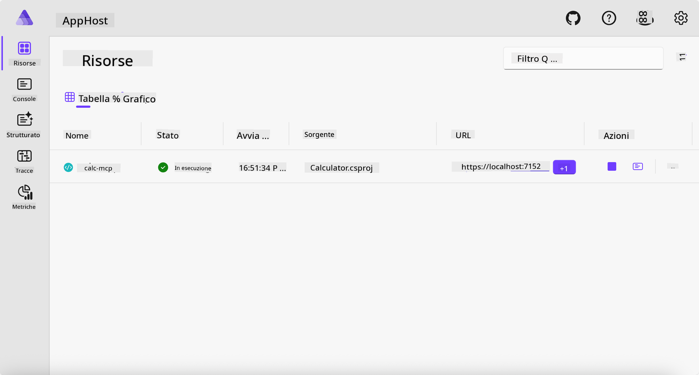
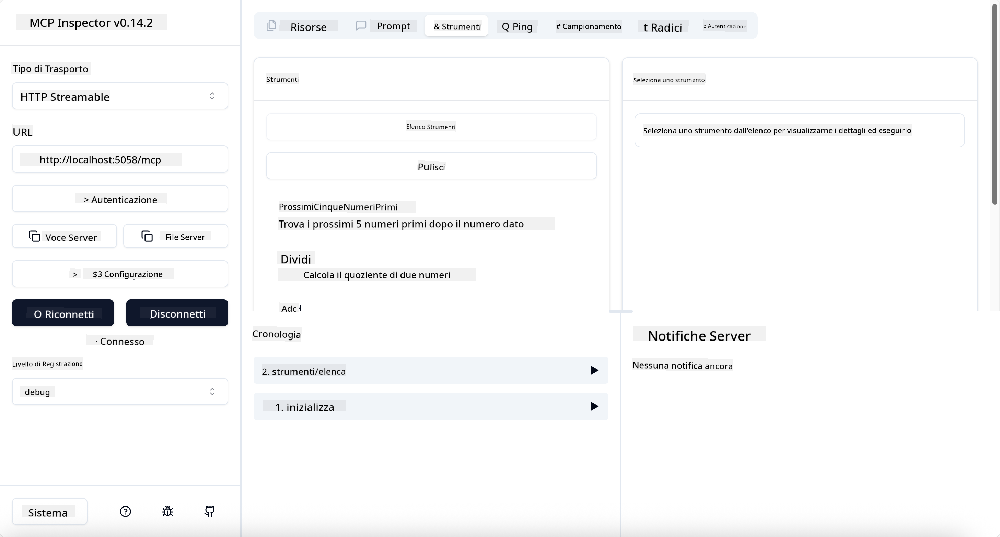
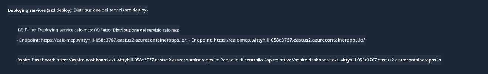

<!--
CO_OP_TRANSLATOR_METADATA:
{
  "original_hash": "0bc7bd48f55f1565f1d95ccb2c16f728",
  "translation_date": "2025-07-13T23:06:28+00:00",
  "source_file": "04-PracticalImplementation/samples/csharp/README.md",
  "language_code": "it"
}
-->
# Esempio

L'esempio precedente mostra come utilizzare un progetto .NET locale con il tipo `stdio` e come eseguire il server localmente in un container. Questa è una buona soluzione in molte situazioni. Tuttavia, può essere utile avere il server in esecuzione da remoto, ad esempio in un ambiente cloud. Qui entra in gioco il tipo `http`.

Guardando la soluzione nella cartella `04-PracticalImplementation`, potrebbe sembrare molto più complessa rispetto alla precedente. Ma in realtà non lo è. Se si osserva attentamente il progetto `src/Calculator`, si noterà che il codice è per lo più lo stesso dell'esempio precedente. L'unica differenza è che stiamo usando una libreria diversa, `ModelContextProtocol.AspNetCore`, per gestire le richieste HTTP. Inoltre, abbiamo modificato il metodo `IsPrime` rendendolo privato, solo per mostrare che è possibile avere metodi privati nel proprio codice. Il resto del codice è identico a prima.

Gli altri progetti provengono da [.NET Aspire](https://learn.microsoft.com/dotnet/aspire/get-started/aspire-overview). Avere .NET Aspire nella soluzione migliora l’esperienza dello sviluppatore durante lo sviluppo e il testing e aiuta con l’osservabilità. Non è necessario per eseguire il server, ma è una buona pratica includerlo nella soluzione.

## Avviare il server localmente

1. Da VS Code (con l’estensione C# DevKit), naviga nella directory `04-PracticalImplementation/samples/csharp`.
1. Esegui il comando seguente per avviare il server:

   ```bash
    dotnet watch run --project ./src/AppHost
   ```

1. Quando un browser apre la dashboard di .NET Aspire, prendi nota dell’URL `http`. Dovrebbe essere qualcosa come `http://localhost:5058/`.

   

## Testare Streamable HTTP con MCP Inspector

Se hai Node.js 22.7.5 o superiore, puoi usare MCP Inspector per testare il tuo server.

Avvia il server e esegui il comando seguente in un terminale:

```bash
npx @modelcontextprotocol/inspector http://localhost:5058
```



- Seleziona `Streamable HTTP` come tipo di Trasporto.
- Nel campo Url, inserisci l’URL del server annotato prima, aggiungendo `/mcp`. Deve essere `http` (non `https`), qualcosa come `http://localhost:5058/mcp`.
- Premi il pulsante Connect.

Una cosa interessante dell’Inspector è che offre una buona visibilità su ciò che sta accadendo.

- Prova a elencare gli strumenti disponibili
- Prova alcuni di essi, dovrebbero funzionare come prima.

## Testare MCP Server con GitHub Copilot Chat in VS Code

Per usare il trasporto Streamable HTTP con GitHub Copilot Chat, modifica la configurazione del server `calc-mcp` creato in precedenza in questo modo:

```jsonc
// .vscode/mcp.json
{
  "servers": {
    "calc-mcp": {
      "type": "http",
      "url": "http://localhost:5058/mcp"
    }
  }
}
```

Fai qualche prova:

- Chiedi "3 numeri primi dopo 6780". Nota come Copilot utilizzerà i nuovi strumenti `NextFivePrimeNumbers` e restituirà solo i primi 3 numeri primi.
- Chiedi "7 numeri primi dopo 111", per vedere cosa succede.
- Chiedi "John ha 24 lecca-lecca e vuole distribuirli tutti ai suoi 3 figli. Quanti lecca-lecca riceve ciascun figlio?", per vedere cosa succede.

## Distribuire il server su Azure

Distribuiamo il server su Azure così più persone potranno usarlo.

Da un terminale, naviga nella cartella `04-PracticalImplementation/samples/csharp` ed esegui il comando seguente:

```bash
azd up
```

Al termine della distribuzione, dovresti vedere un messaggio simile a questo:



Prendi l’URL e usalo in MCP Inspector e in GitHub Copilot Chat.

```jsonc
// .vscode/mcp.json
{
  "servers": {
    "calc-mcp": {
      "type": "http",
      "url": "https://calc-mcp.gentleriver-3977fbcf.australiaeast.azurecontainerapps.io/mcp"
    }
  }
}
```

## Cosa c’è dopo?

Abbiamo provato diversi tipi di trasporto e strumenti di test. Abbiamo anche distribuito il server MCP su Azure. Ma cosa succede se il nostro server deve accedere a risorse private? Per esempio, un database o un’API privata? Nel prossimo capitolo vedremo come migliorare la sicurezza del nostro server.

**Disclaimer**:  
Questo documento è stato tradotto utilizzando il servizio di traduzione automatica [Co-op Translator](https://github.com/Azure/co-op-translator). Pur impegnandoci per garantire l’accuratezza, si prega di notare che le traduzioni automatiche possono contenere errori o imprecisioni. Il documento originale nella sua lingua nativa deve essere considerato la fonte autorevole. Per informazioni critiche, si raccomanda una traduzione professionale effettuata da un umano. Non ci assumiamo alcuna responsabilità per eventuali malintesi o interpretazioni errate derivanti dall’uso di questa traduzione.