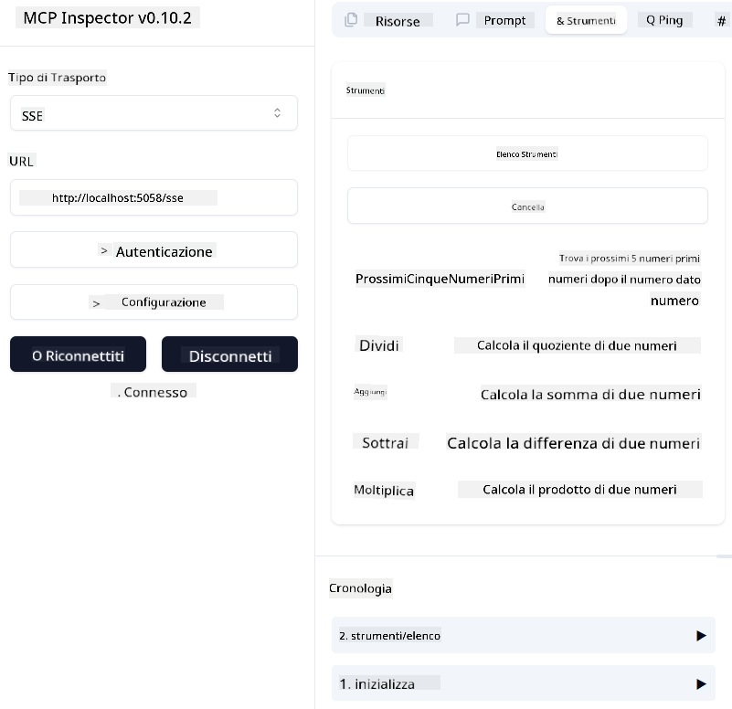
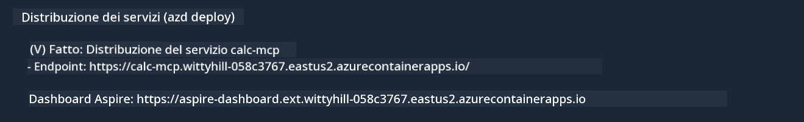

<!--
CO_OP_TRANSLATOR_METADATA:
{
  "original_hash": "5020a3e1a1c7f30c00f9e37f1fa208e3",
  "translation_date": "2025-05-17T14:08:14+00:00",
  "source_file": "04-PracticalImplementation/samples/csharp/README.md",
  "language_code": "it"
}
-->
# Esempio

L'esempio precedente mostra come utilizzare un progetto .NET locale con il tipo `sdio`. E come eseguire il server localmente in un container. Questa è una buona soluzione in molte situazioni. Tuttavia, può essere utile avere il server in esecuzione in remoto, come in un ambiente cloud. È qui che entra in gioco il tipo `http`.

Osservando la soluzione nella cartella `04-PracticalImplementation`, potrebbe sembrare molto più complessa della precedente. Ma in realtà, non lo è. Se guardi attentamente al progetto `src/mcpserver/mcpserver.csproj`, vedrai che è principalmente lo stesso codice dell'esempio precedente. L'unica differenza è che stiamo usando una libreria diversa `ModelContextProtocol.AspNetCore` per gestire le richieste HTTP. E cambiamo il metodo `IsPrime` per renderlo privato, solo per dimostrare che puoi avere metodi privati nel tuo codice. Il resto del codice è lo stesso di prima.

Gli altri progetti provengono da [.NET Aspire](https://learn.microsoft.com/dotnet/aspire/get-started/aspire-overview). Avere .NET Aspire nella soluzione migliorerà l'esperienza dello sviluppatore durante lo sviluppo e il testing e aiuterà con l'osservabilità. Non è necessario per eseguire il server, ma è una buona pratica includerlo nella tua soluzione.

## Avviare il server localmente

1. Da VS Code (con l'estensione C# DevKit), apri la soluzione `04-PracticalImplementation\samples\csharp\src\Calculator-chap4.sln`.
2. Premi `F5` per avviare il server. Dovrebbe aprirsi un browser web con il dashboard di .NET Aspire.

oppure

1. Da un terminale, naviga nella cartella `04-PracticalImplementation\samples\csharp\src`
2. Esegui il seguente comando per avviare il server:
   ```bash
    dotnet run --project .\AppHost
   ```

3. Dal Dashboard, annota l'URL `http`. Dovrebbe essere qualcosa come `http://localhost:5058/`.

## Test `SSE` con il ModelContext Protocol Inspector.

Se hai Node.js 22.7.5 o superiore, puoi usare il ModelContext Protocol Inspector per testare il tuo server.

Avvia il server ed esegui il seguente comando in un terminale:

```bash
npx @modelcontextprotocol/inspector@latest
```



- Seleziona `SSE` as the Transport type. SSE stand for Server-Sent Events. 
- In the Url field, enter the URL of the server noted earlier,and append `/sse`. Dovrebbe essere `http` (non `https`) something like `http://localhost:5058/sse`.
- select the Connect button.

A nice thing about the Inspector is that it provide a nice visibility on what is happening.

- Try listing the availables tools
- Try some of them, it should works just like before.


## Test `SSE` with Github Copilot Chat in VS Code

To use the `SSE` transport with Github Copilot Chat, change the configuration of the `mcp-calc` server creato precedentemente per sembrare così:

```json
"mcp-calc": {
    "type": "sse",
    "url": "http://localhost:5058/sse"
}
```

Fai alcuni test:
- Chiedi i 3 numeri primi successivi a 6780. Nota come Copilot userà i nuovi strumenti `NextFivePrimeNumbers` e restituirà solo i primi 3 numeri primi.
- Chiedi i 7 numeri primi successivi a 111, per vedere cosa succede.

# Distribuire il server su Azure

Distribuiamo il server su Azure in modo che più persone possano usarlo.

Da un terminale, naviga nella cartella `04-PracticalImplementation\samples\csharp\src` ed esegui il seguente comando:

```bash
azd init
```

Questo creerà alcuni file localmente per salvare la configurazione delle risorse di Azure e la tua Infrastruttura come codice (IaC).

Poi, esegui il seguente comando per distribuire il server su Azure:

```bash
azd up
```

Una volta completata la distribuzione, dovresti vedere un messaggio simile a questo:



Naviga nel dashboard di Aspire e annota l'URL `HTTP` per usarlo nel MCP Inspector e nella chat di Github Copilot.

## Cosa succede dopo?

Proviamo diversi tipi di trasporto, strumenti di test e distribuiamo anche il nostro server MCP su Azure. Ma cosa succede se il nostro server deve accedere a risorse private? Ad esempio, un database o un'API privata? Nel prossimo capitolo, vedremo come possiamo migliorare la sicurezza del nostro server.

**Disclaimer**:
Questo documento è stato tradotto utilizzando il servizio di traduzione AI [Co-op Translator](https://github.com/Azure/co-op-translator). Anche se ci impegniamo per l'accuratezza, si prega di essere consapevoli che le traduzioni automatiche possono contenere errori o imprecisioni. Il documento originale nella sua lingua madre dovrebbe essere considerato la fonte autorevole. Per informazioni critiche, si raccomanda una traduzione professionale umana. Non siamo responsabili per eventuali incomprensioni o interpretazioni errate derivanti dall'uso di questa traduzione.