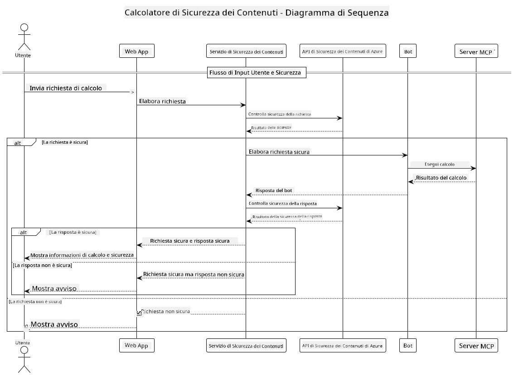

<!--
CO_OP_TRANSLATOR_METADATA:
{
  "original_hash": "e5ea5e7582f70008ea9bec3b3820f20a",
  "translation_date": "2025-07-13T23:15:40+00:00",
  "source_file": "04-PracticalImplementation/samples/java/containerapp/README.md",
  "language_code": "it"
}
-->
## Architettura del Sistema

Questo progetto dimostra un'applicazione web che utilizza il controllo della sicurezza dei contenuti prima di inviare i prompt degli utenti a un servizio calcolatore tramite Model Context Protocol (MCP).



### Come Funziona

1. **Input Utente**: L'utente inserisce un prompt di calcolo nell'interfaccia web  
2. **Controllo Sicurezza Contenuti (Input)**: Il prompt viene analizzato dall'API Azure Content Safety  
3. **Decisione di Sicurezza (Input)**:  
   - Se il contenuto è sicuro (gravità < 2 in tutte le categorie), procede al calcolatore  
   - Se il contenuto è segnalato come potenzialmente dannoso, il processo si interrompe e viene restituito un avviso  
4. **Integrazione Calcolatore**: Il contenuto sicuro viene elaborato da LangChain4j, che comunica con il server calcolatore MCP  
5. **Controllo Sicurezza Contenuti (Output)**: La risposta del bot viene analizzata dall'API Azure Content Safety  
6. **Decisione di Sicurezza (Output)**:  
   - Se la risposta del bot è sicura, viene mostrata all'utente  
   - Se la risposta del bot è segnalata come potenzialmente dannosa, viene sostituita con un avviso  
7. **Risposta**: I risultati (se sicuri) vengono mostrati all'utente insieme ad entrambe le analisi di sicurezza

## Utilizzo di Model Context Protocol (MCP) con i Servizi Calcolatore

Questo progetto dimostra come utilizzare Model Context Protocol (MCP) per chiamare i servizi calcolatore MCP da LangChain4j. L’implementazione utilizza un server MCP locale in esecuzione sulla porta 8080 per fornire operazioni di calcolo.

### Configurazione del Servizio Azure Content Safety

Prima di utilizzare le funzionalità di sicurezza dei contenuti, è necessario creare una risorsa del servizio Azure Content Safety:

1. Accedi al [Portale Azure](https://portal.azure.com)  
2. Clicca su "Crea una risorsa" e cerca "Content Safety"  
3. Seleziona "Content Safety" e clicca su "Crea"  
4. Inserisci un nome univoco per la tua risorsa  
5. Seleziona la tua sottoscrizione e il gruppo di risorse (o creane uno nuovo)  
6. Scegli una regione supportata (controlla la [Disponibilità delle regioni](https://azure.microsoft.com/en-us/global-infrastructure/services/?products=cognitive-services) per i dettagli)  
7. Seleziona un piano tariffario appropriato  
8. Clicca su "Crea" per distribuire la risorsa  
9. Al termine della distribuzione, clicca su "Vai alla risorsa"  
10. Nel pannello a sinistra, sotto "Gestione risorse", seleziona "Chiavi e Endpoint"  
11. Copia una delle chiavi e l’URL dell’endpoint per l’uso nel passaggio successivo

### Configurazione delle Variabili d’Ambiente

Imposta la variabile d’ambiente `GITHUB_TOKEN` per l’autenticazione dei modelli GitHub:  
```sh
export GITHUB_TOKEN=<your_github_token>
```

Per le funzionalità di sicurezza dei contenuti, imposta:  
```sh
export CONTENT_SAFETY_ENDPOINT=<your_content_safety_endpoint>
export CONTENT_SAFETY_KEY=<your_content_safety_key>
```

Queste variabili d’ambiente sono utilizzate dall’applicazione per autenticarsi con il servizio Azure Content Safety. Se queste variabili non sono impostate, l’applicazione utilizzerà valori segnaposto a scopo dimostrativo, ma le funzionalità di sicurezza dei contenuti non funzioneranno correttamente.

### Avvio del Server MCP Calcolatore

Prima di eseguire il client, è necessario avviare il server MCP calcolatore in modalità SSE su localhost:8080.

## Descrizione del Progetto

Questo progetto dimostra l’integrazione di Model Context Protocol (MCP) con LangChain4j per chiamare servizi calcolatore. Le caratteristiche principali includono:

- Utilizzo di MCP per connettersi a un servizio calcolatore per operazioni matematiche di base  
- Controllo della sicurezza dei contenuti a doppio livello sia sui prompt utente che sulle risposte del bot  
- Integrazione con il modello gpt-4.1-nano di GitHub tramite LangChain4j  
- Utilizzo di Server-Sent Events (SSE) per il trasporto MCP

## Integrazione della Sicurezza dei Contenuti

Il progetto include funzionalità complete di sicurezza dei contenuti per garantire che sia gli input degli utenti sia le risposte del sistema siano privi di contenuti dannosi:

1. **Controllo Input**: Tutti i prompt degli utenti vengono analizzati per categorie di contenuti dannosi come discorsi d’odio, violenza, autolesionismo e contenuti sessuali prima dell’elaborazione.

2. **Controllo Output**: Anche quando si utilizzano modelli potenzialmente non censurati, il sistema verifica tutte le risposte generate attraverso gli stessi filtri di sicurezza dei contenuti prima di mostrarle all’utente.

Questo approccio a doppio livello garantisce che il sistema rimanga sicuro indipendentemente dal modello AI utilizzato, proteggendo gli utenti sia da input dannosi sia da output potenzialmente problematici generati dall’AI.

## Client Web

L’applicazione include un’interfaccia web intuitiva che permette agli utenti di interagire con il sistema Content Safety Calculator:

### Caratteristiche dell’Interfaccia Web

- Modulo semplice e intuitivo per inserire prompt di calcolo  
- Validazione della sicurezza dei contenuti a doppio livello (input e output)  
- Feedback in tempo reale sulla sicurezza di prompt e risposte  
- Indicatori di sicurezza codificati a colori per una facile interpretazione  
- Design pulito e responsive che funziona su vari dispositivi  
- Esempi di prompt sicuri per guidare gli utenti

### Utilizzo del Client Web

1. Avvia l’applicazione:  
   ```sh
   mvn spring-boot:run
   ```

2. Apri il browser e vai a `http://localhost:8087`

3. Inserisci un prompt di calcolo nell’area di testo fornita (es. "Calcola la somma di 24.5 e 17.3")

4. Clicca su "Invia" per elaborare la richiesta

5. Visualizza i risultati, che includeranno:  
   - Analisi della sicurezza dei contenuti del tuo prompt  
   - Il risultato calcolato (se il prompt era sicuro)  
   - Analisi della sicurezza dei contenuti della risposta del bot  
   - Eventuali avvisi di sicurezza se l’input o l’output sono stati segnalati

Il client web gestisce automaticamente entrambi i processi di verifica della sicurezza dei contenuti, garantendo che tutte le interazioni siano sicure e appropriate indipendentemente dal modello AI utilizzato.

**Disclaimer**:  
Questo documento è stato tradotto utilizzando il servizio di traduzione automatica [Co-op Translator](https://github.com/Azure/co-op-translator). Pur impegnandoci per garantire accuratezza, si prega di notare che le traduzioni automatiche possono contenere errori o imprecisioni. Il documento originale nella sua lingua nativa deve essere considerato la fonte autorevole. Per informazioni critiche, si raccomanda una traduzione professionale effettuata da un umano. Non ci assumiamo alcuna responsabilità per eventuali malintesi o interpretazioni errate derivanti dall’uso di questa traduzione.