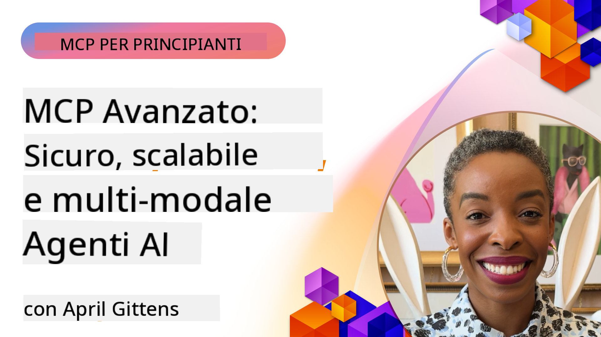

<!--
CO_OP_TRANSLATOR_METADATA:
{
  "original_hash": "d204bc94ea6027d06a703b21b711ca57",
  "translation_date": "2025-08-18T17:26:54+00:00",
  "source_file": "05-AdvancedTopics/README.md",
  "language_code": "it"
}
-->
# Argomenti Avanzati in MCP

_(Clicca sull'immagine sopra per visualizzare il video di questa lezione)_

Questo capitolo tratta una serie di argomenti avanzati sull'implementazione del Model Context Protocol (MCP), tra cui integrazione multi-modale, scalabilità, migliori pratiche di sicurezza e integrazione aziendale. Questi argomenti sono fondamentali per costruire applicazioni MCP robuste e pronte per la produzione, in grado di soddisfare le esigenze dei moderni sistemi di intelligenza artificiale.

## Panoramica

Questa lezione esplora concetti avanzati nell'implementazione del Model Context Protocol, concentrandosi su integrazione multi-modale, scalabilità, migliori pratiche di sicurezza e integrazione aziendale. Questi argomenti sono essenziali per costruire applicazioni MCP di livello produttivo in grado di gestire requisiti complessi in ambienti aziendali.

## Obiettivi di Apprendimento

Alla fine di questa lezione, sarai in grado di:

- Implementare capacità multi-modali all'interno dei framework MCP
- Progettare architetture MCP scalabili per scenari ad alta domanda
- Applicare le migliori pratiche di sicurezza in linea con i principi di sicurezza di MCP
- Integrare MCP con sistemi e framework di intelligenza artificiale aziendali
- Ottimizzare le prestazioni e l'affidabilità in ambienti di produzione

## Lezioni e Progetti di esempio

| Link | Titolo | Descrizione |
|------|-------|-------------|
| [5.1 Integrazione con Azure](./mcp-integration/README.md) | Integrare con Azure | Scopri come integrare il tuo MCP Server su Azure |
| [5.2 Esempio Multi-modale](./mcp-multi-modality/README.md) | Esempi Multi-modali MCP | Esempi per audio, immagini e risposte multi-modali |
| [5.3 Esempio OAuth2 MCP](../../../05-AdvancedTopics/mcp-oauth2-demo) | Demo OAuth2 MCP | Applicazione minima Spring Boot che mostra OAuth2 con MCP, sia come Authorization Server che Resource Server. Dimostra emissione sicura di token, endpoint protetti, distribuzione su Azure Container Apps e integrazione con API Management. |
| [5.4 Contesti Radice](./mcp-root-contexts/README.md) | Contesti Radice | Scopri di più sui contesti radice e come implementarli |
| [5.5 Routing](./mcp-routing/README.md) | Routing | Scopri i diversi tipi di routing |
| [5.6 Campionamento](./mcp-sampling/README.md) | Campionamento | Scopri come lavorare con il campionamento |
| [5.7 Scalabilità](./mcp-scaling/README.md) | Scalabilità | Scopri di più sulla scalabilità |
| [5.8 Sicurezza](./mcp-security/README.md) | Sicurezza | Proteggi il tuo MCP Server |
| [5.9 Esempio di Ricerca Web](./web-search-mcp/README.md) | Ricerca Web MCP | Server e client MCP in Python che si integrano con SerpAPI per ricerca web, notizie, prodotti in tempo reale e Q&A. Dimostra orchestrazione multi-tool, integrazione con API esterne e gestione robusta degli errori. |
| [5.10 Streaming in Tempo Reale](./mcp-realtimestreaming/README.md) | Streaming | Lo streaming di dati in tempo reale è diventato essenziale nel mondo odierno basato sui dati, dove aziende e applicazioni richiedono accesso immediato alle informazioni per prendere decisioni tempestive. |
| [5.11 Ricerca Web in Tempo Reale](./mcp-realtimesearch/README.md) | Ricerca Web | La ricerca web in tempo reale mostra come MCP trasforma la ricerca web in tempo reale fornendo un approccio standardizzato alla gestione del contesto tra modelli AI, motori di ricerca e applicazioni. |
| [5.12 Autenticazione Entra ID per Server MCP](./mcp-security-entra/README.md) | Autenticazione Entra ID | Microsoft Entra ID offre una soluzione robusta basata su cloud per la gestione delle identità e degli accessi, garantendo che solo utenti e applicazioni autorizzati possano interagire con il tuo server MCP. |
| [5.13 Integrazione con Azure AI Foundry Agent](./mcp-foundry-agent-integration/README.md) | Integrazione con Azure AI Foundry | Scopri come integrare i server MCP con gli agenti di Azure AI Foundry, abilitando potenti orchestrazioni di strumenti e capacità AI aziendali con connessioni standardizzate a fonti di dati esterne. |
| [5.14 Ingegneria del Contesto](./mcp-contextengineering/README.md) | Ingegneria del Contesto | Le opportunità future delle tecniche di ingegneria del contesto per i server MCP, inclusa l'ottimizzazione del contesto, la gestione dinamica del contesto e strategie per un efficace prompt engineering all'interno dei framework MCP. |

## Riferimenti Aggiuntivi

Per informazioni aggiornate sugli argomenti avanzati di MCP, consulta:
- [Documentazione MCP](https://modelcontextprotocol.io/)
- [Specifiche MCP](https://spec.modelcontextprotocol.io/)
- [Repository GitHub](https://github.com/modelcontextprotocol)

## Punti Chiave

- Le implementazioni multi-modali di MCP estendono le capacità AI oltre l'elaborazione del testo
- La scalabilità è essenziale per le distribuzioni aziendali e può essere affrontata attraverso scalabilità orizzontale e verticale
- Misure di sicurezza complete proteggono i dati e garantiscono un controllo adeguato degli accessi
- L'integrazione aziendale con piattaforme come Azure OpenAI e Microsoft AI Foundry migliora le capacità di MCP
- Le implementazioni avanzate di MCP beneficiano di architetture ottimizzate e una gestione attenta delle risorse

## Esercizio

Progetta un'implementazione MCP di livello aziendale per un caso d'uso specifico:

1. Identifica i requisiti multi-modali per il tuo caso d'uso
2. Delinea i controlli di sicurezza necessari per proteggere i dati sensibili
3. Progetta un'architettura scalabile in grado di gestire carichi variabili
4. Pianifica i punti di integrazione con i sistemi AI aziendali
5. Documenta i potenziali colli di bottiglia delle prestazioni e le strategie di mitigazione

## Risorse Aggiuntive

- [Documentazione Azure OpenAI](https://learn.microsoft.com/en-us/azure/ai-services/openai/)
- [Documentazione Microsoft AI Foundry](https://learn.microsoft.com/en-us/ai-services/)

---

## Cosa c'è dopo

- [5.1 Integrazione MCP](./mcp-integration/README.md)

**Disclaimer**:  
Questo documento è stato tradotto utilizzando il servizio di traduzione automatica [Co-op Translator](https://github.com/Azure/co-op-translator). Sebbene ci impegniamo per garantire l'accuratezza, si prega di notare che le traduzioni automatiche possono contenere errori o imprecisioni. Il documento originale nella sua lingua nativa dovrebbe essere considerato la fonte autorevole. Per informazioni critiche, si consiglia una traduzione professionale eseguita da un traduttore umano. Non siamo responsabili per eventuali fraintendimenti o interpretazioni errate derivanti dall'uso di questa traduzione.