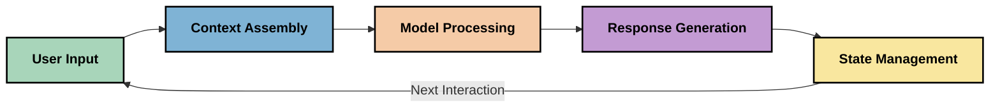
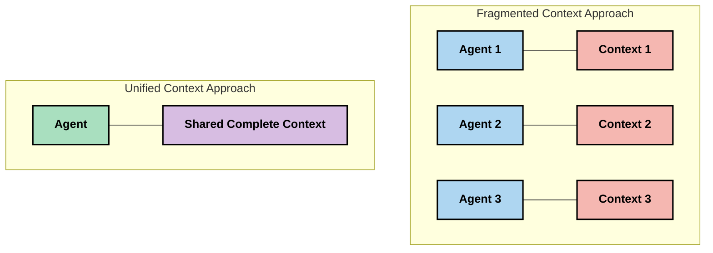
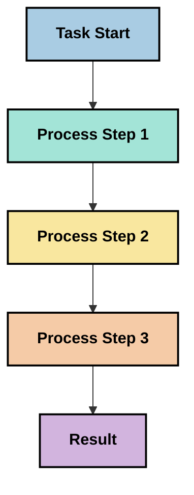
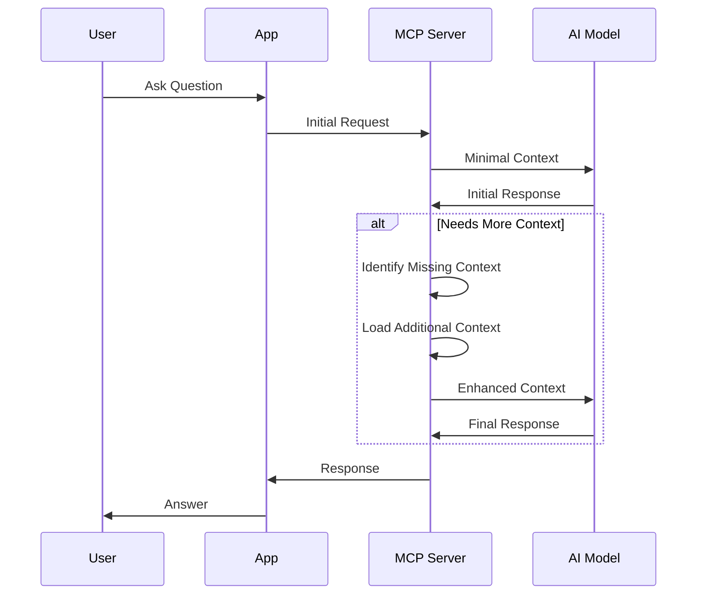
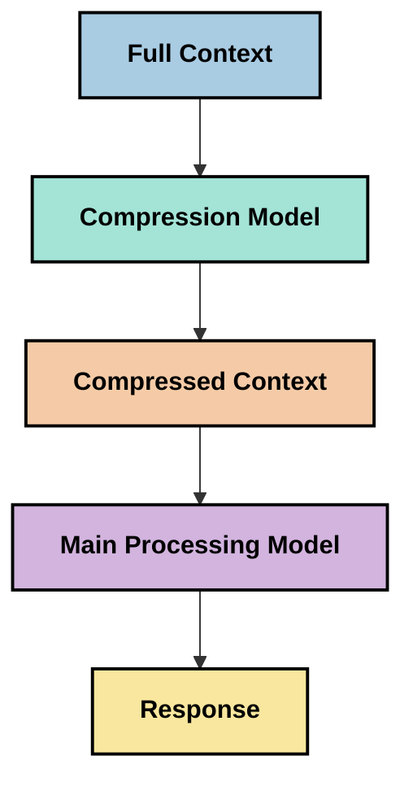

<!--
CO_OP_TRANSLATOR_METADATA:
{
  "original_hash": "fd169ca3071b81b5ee282e194bc823df",
  "translation_date": "2025-09-15T20:20:32+00:00",
  "source_file": "05-AdvancedTopics/mcp-contextengineering/README.md",
  "language_code": "it"
}
-->
# Ingegneria del Contesto: Un Concetto Emergente nell'Ecosistema MCP

## Panoramica

L'ingegneria del contesto è un concetto emergente nel campo dell'IA che esplora come le informazioni vengono strutturate, consegnate e mantenute durante le interazioni tra clienti e servizi di intelligenza artificiale. Con l'evoluzione dell'ecosistema del Model Context Protocol (MCP), diventa sempre più importante comprendere come gestire efficacemente il contesto. Questo modulo introduce il concetto di ingegneria del contesto e ne esplora le potenziali applicazioni nelle implementazioni MCP.

## Obiettivi di Apprendimento

Alla fine di questo modulo, sarai in grado di:

- Comprendere il concetto emergente di ingegneria del contesto e il suo potenziale ruolo nelle applicazioni MCP
- Identificare le principali sfide nella gestione del contesto che il design del protocollo MCP affronta
- Esplorare tecniche per migliorare le prestazioni dei modelli attraverso una gestione più efficace del contesto
- Considerare approcci per misurare e valutare l'efficacia del contesto
- Applicare questi concetti emergenti per migliorare le esperienze con l'IA attraverso il framework MCP

## Introduzione all'Ingegneria del Contesto

L'ingegneria del contesto è un concetto emergente che si concentra sulla progettazione e gestione deliberata del flusso di informazioni tra utenti, applicazioni e modelli di intelligenza artificiale. A differenza di campi consolidati come l'ingegneria dei prompt, l'ingegneria del contesto è ancora in fase di definizione da parte dei professionisti che lavorano per risolvere le sfide uniche di fornire ai modelli di IA le informazioni giuste al momento giusto.

Con l'evoluzione dei grandi modelli linguistici (LLM), l'importanza del contesto è diventata sempre più evidente. La qualità, la rilevanza e la struttura del contesto fornito influenzano direttamente i risultati dei modelli. L'ingegneria del contesto esplora questa relazione e cerca di sviluppare principi per una gestione efficace del contesto.

> "Nel 2025, i modelli disponibili saranno estremamente intelligenti. Ma anche la persona più intelligente non sarà in grado di svolgere il proprio lavoro efficacemente senza il contesto di ciò che le viene chiesto di fare... 'L'ingegneria del contesto' è il livello successivo dell'ingegneria dei prompt. Si tratta di farlo automaticamente in un sistema dinamico." — Walden Yan, Cognition AI

L'ingegneria del contesto potrebbe includere:

1. **Selezione del Contesto**: Determinare quali informazioni sono rilevanti per un determinato compito
2. **Strutturazione del Contesto**: Organizzare le informazioni per massimizzare la comprensione del modello
3. **Consegna del Contesto**: Ottimizzare come e quando le informazioni vengono inviate ai modelli
4. **Manutenzione del Contesto**: Gestire lo stato e l'evoluzione del contesto nel tempo
5. **Valutazione del Contesto**: Misurare e migliorare l'efficacia del contesto

Questi ambiti di interesse sono particolarmente rilevanti per l'ecosistema MCP, che fornisce un modo standardizzato per le applicazioni di fornire contesto ai LLM.

## La Prospettiva del Viaggio del Contesto

Un modo per visualizzare l'ingegneria del contesto è tracciare il percorso che le informazioni seguono attraverso un sistema MCP:



### Fasi Chiave nel Viaggio del Contesto:

1. **Input dell'Utente**: Informazioni grezze dall'utente (testo, immagini, documenti)
2. **Assemblaggio del Contesto**: Combinare l'input dell'utente con il contesto del sistema, la cronologia della conversazione e altre informazioni recuperate
3. **Elaborazione del Modello**: Il modello di IA elabora il contesto assemblato
4. **Generazione della Risposta**: Il modello produce output basati sul contesto fornito
5. **Gestione dello Stato**: Il sistema aggiorna il proprio stato interno in base all'interazione

Questa prospettiva evidenzia la natura dinamica del contesto nei sistemi di IA e solleva importanti domande su come gestire al meglio le informazioni in ogni fase.

## Principi Emergenti nell'Ingegneria del Contesto

Man mano che il campo dell'ingegneria del contesto prende forma, alcuni principi iniziali stanno emergendo dai professionisti. Questi principi possono aiutare a informare le scelte di implementazione MCP:

### Principio 1: Condividere il Contesto Completamente

Il contesto dovrebbe essere condiviso completamente tra tutti i componenti di un sistema piuttosto che frammentato tra più agenti o processi. Quando il contesto è distribuito, le decisioni prese in una parte del sistema possono entrare in conflitto con quelle prese altrove.



Nelle applicazioni MCP, questo suggerisce di progettare sistemi in cui il contesto fluisca senza soluzione di continuità attraverso l'intera pipeline piuttosto che essere compartimentato.

### Principio 2: Riconoscere che le Azioni Comportano Decisioni Implicite

Ogni azione che un modello compie incorpora decisioni implicite su come interpretare il contesto. Quando più componenti agiscono su contesti diversi, queste decisioni implicite possono entrare in conflitto, portando a risultati incoerenti.

Questo principio ha importanti implicazioni per le applicazioni MCP:
- Preferire l'elaborazione lineare di compiti complessi rispetto all'esecuzione parallela con contesto frammentato
- Garantire che tutti i punti decisionali abbiano accesso alle stesse informazioni contestuali
- Progettare sistemi in cui i passaggi successivi possano vedere il contesto completo delle decisioni precedenti

### Principio 3: Bilanciare la Profondità del Contesto con le Limitazioni della Finestra

Man mano che le conversazioni e i processi diventano più lunghi, le finestre di contesto alla fine traboccano. L'ingegneria del contesto esplora approcci per gestire questa tensione tra contesto completo e limitazioni tecniche.

Approcci potenziali in fase di esplorazione includono:
- Compressione del contesto che mantiene le informazioni essenziali riducendo l'uso dei token
- Caricamento progressivo del contesto basato sulla rilevanza per le esigenze attuali
- Sintesi delle interazioni precedenti preservando decisioni e fatti chiave

## Sfide del Contesto e Design del Protocollo MCP

Il Model Context Protocol (MCP) è stato progettato con la consapevolezza delle sfide uniche della gestione del contesto. Comprendere queste sfide aiuta a spiegare gli aspetti chiave del design del protocollo MCP:

### Sfida 1: Limitazioni della Finestra di Contesto
La maggior parte dei modelli di IA ha dimensioni fisse della finestra di contesto, limitando la quantità di informazioni che possono elaborare contemporaneamente.

**Risposta del Design MCP:** 
- Il protocollo supporta contesti strutturati basati su risorse che possono essere referenziati in modo efficiente
- Le risorse possono essere paginati e caricati progressivamente

### Sfida 2: Determinazione della Rilevanza
Determinare quali informazioni sono più rilevanti da includere nel contesto è difficile.

**Risposta del Design MCP:**
- Strumenti flessibili consentono il recupero dinamico delle informazioni in base alle necessità
- Prompt strutturati abilitano un'organizzazione coerente del contesto

### Sfida 3: Persistenza del Contesto
Gestire lo stato attraverso le interazioni richiede un attento monitoraggio del contesto.

**Risposta del Design MCP:**
- Gestione delle sessioni standardizzata
- Modelli di interazione chiaramente definiti per l'evoluzione del contesto

### Sfida 4: Contesto Multi-Modale
Tipi diversi di dati (testo, immagini, dati strutturati) richiedono gestioni diverse.

**Risposta del Design MCP:**
- Il design del protocollo accomoda vari tipi di contenuto
- Rappresentazione standardizzata delle informazioni multi-modali

### Sfida 5: Sicurezza e Privacy
Il contesto spesso contiene informazioni sensibili che devono essere protette.

**Risposta del Design MCP:**
- Confini chiari tra responsabilità del cliente e del server
- Opzioni di elaborazione locale per minimizzare l'esposizione dei dati

Comprendere queste sfide e come MCP le affronta fornisce una base per esplorare tecniche di ingegneria del contesto più avanzate.

## Approcci Emergenti nell'Ingegneria del Contesto

Man mano che il campo dell'ingegneria del contesto si sviluppa, stanno emergendo diversi approcci promettenti. Questi rappresentano il pensiero attuale piuttosto che pratiche consolidate e probabilmente evolveranno con l'esperienza nelle implementazioni MCP.

### 1. Elaborazione Lineare a Singolo Thread

In contrasto con le architetture multi-agente che distribuiscono il contesto, alcuni professionisti stanno scoprendo che l'elaborazione lineare a singolo thread produce risultati più coerenti. Questo è in linea con il principio di mantenere un contesto unificato.



Sebbene questo approccio possa sembrare meno efficiente rispetto all'elaborazione parallela, spesso produce risultati più coerenti e affidabili perché ogni passaggio si basa su una comprensione completa delle decisioni precedenti.

### 2. Suddivisione e Prioritizzazione del Contesto

Suddividere contesti ampi in pezzi gestibili e dare priorità a ciò che è più importante.

```python
# Conceptual Example: Context Chunking and Prioritization
def process_with_chunked_context(documents, query):
    # 1. Break documents into smaller chunks
    chunks = chunk_documents(documents)
    
    # 2. Calculate relevance scores for each chunk
    scored_chunks = [(chunk, calculate_relevance(chunk, query)) for chunk in chunks]
    
    # 3. Sort chunks by relevance score
    sorted_chunks = sorted(scored_chunks, key=lambda x: x[1], reverse=True)
    
    # 4. Use the most relevant chunks as context
    context = create_context_from_chunks([chunk for chunk, score in sorted_chunks[:5]])
    
    # 5. Process with the prioritized context
    return generate_response(context, query)
```

Il concetto sopra illustra come potremmo suddividere documenti ampi in pezzi gestibili e selezionare solo le parti più rilevanti per il contesto. Questo approccio può aiutare a lavorare entro i limiti della finestra di contesto sfruttando comunque ampie basi di conoscenza.

### 3. Caricamento Progressivo del Contesto

Caricare il contesto progressivamente secondo necessità piuttosto che tutto in una volta.



Il caricamento progressivo del contesto inizia con un contesto minimo e si espande solo quando necessario. Questo può ridurre significativamente l'uso dei token per query semplici mantenendo la capacità di gestire domande complesse.

### 4. Compressione e Sintesi del Contesto

Ridurre la dimensione del contesto preservando le informazioni essenziali.



La compressione del contesto si concentra su:
- Rimuovere informazioni ridondanti
- Sintetizzare contenuti lunghi
- Estrarre fatti e dettagli chiave
- Preservare gli elementi critici del contesto
- Ottimizzare per l'efficienza dei token

Questo approccio può essere particolarmente utile per mantenere conversazioni lunghe entro le finestre di contesto o per elaborare documenti ampi in modo efficiente. Alcuni professionisti stanno utilizzando modelli specializzati specificamente per la compressione e la sintesi del contesto della cronologia delle conversazioni.

## Considerazioni Esplorative sull'Ingegneria del Contesto

Mentre esploriamo il campo emergente dell'ingegneria del contesto, diverse considerazioni meritano attenzione quando si lavora con implementazioni MCP. Queste non sono pratiche migliori prescrittive, ma piuttosto aree di esplorazione che potrebbero portare a miglioramenti nel tuo caso d'uso specifico.

### Considera i Tuoi Obiettivi di Contesto

Prima di implementare soluzioni complesse di gestione del contesto, articola chiaramente ciò che stai cercando di ottenere:
- Quali informazioni specifiche il modello necessita per avere successo?
- Quali informazioni sono essenziali rispetto a quelle supplementari?
- Quali sono i tuoi vincoli di prestazione (latenza, limiti di token, costi)?

### Esplora Approcci a Strati per il Contesto

Alcuni professionisti stanno trovando successo con contesti organizzati in strati concettuali:
- **Strato Centrale**: Informazioni essenziali di cui il modello ha sempre bisogno
- **Strato Situazionale**: Contesto specifico per l'interazione corrente
- **Strato di Supporto**: Informazioni aggiuntive che potrebbero essere utili
- **Strato di Riserva**: Informazioni accessibili solo quando necessario

### Indaga sulle Strategie di Recupero

L'efficacia del tuo contesto spesso dipende da come recuperi le informazioni:
- Ricerca semantica e embedding per trovare informazioni concettualmente rilevanti
- Ricerca basata su parole chiave per dettagli fattuali specifici
- Approcci ibridi che combinano più metodi di recupero
- Filtraggio dei metadati per restringere l'ambito in base a categorie, date o fonti

### Sperimenta con la Coerenza del Contesto

La struttura e il flusso del tuo contesto possono influenzare la comprensione del modello:
- Raggruppare informazioni correlate
- Utilizzare formattazione e organizzazione coerenti
- Mantenere un ordine logico o cronologico dove appropriato
- Evitare informazioni contraddittorie

### Valuta i Compromessi delle Architetture Multi-Agente

Sebbene le architetture multi-agente siano popolari in molti framework di IA, presentano sfide significative per la gestione del contesto:
- La frammentazione del contesto può portare a decisioni incoerenti tra gli agenti
- L'elaborazione parallela può introdurre conflitti difficili da risolvere
- L'overhead di comunicazione tra gli agenti può compensare i guadagni di prestazione
- È richiesta una gestione dello stato complessa per mantenere la coerenza

In molti casi, un approccio a singolo agente con gestione completa del contesto può produrre risultati più affidabili rispetto a più agenti specializzati con contesto frammentato.

### Sviluppa Metodi di Valutazione

Per migliorare l'ingegneria del contesto nel tempo, considera come misurare il successo:
- Test A/B di diverse strutture di contesto
- Monitoraggio dell'uso dei token e dei tempi di risposta
- Tracciamento della soddisfazione degli utenti e dei tassi di completamento dei compiti
- Analisi di quando e perché le strategie di contesto falliscono

Queste considerazioni rappresentano aree attive di esplorazione nello spazio dell'ingegneria del contesto. Man mano che il campo matura, probabilmente emergeranno modelli e pratiche più definitivi.

## Misurare l'Efficacia del Contesto: Un Framework in Evoluzione

Man mano che l'ingegneria del contesto emerge come concetto, i professionisti stanno iniziando a esplorare come potremmo misurarne l'efficacia. Non esiste ancora un framework consolidato, ma si stanno considerando vari metriche che potrebbero aiutare a guidare il lavoro futuro.

### Dimensioni Potenziali di Misurazione

#### 1. Considerazioni sull'Efficienza dell'Input

- **Rapporto Contesto-Risposta**: Quanto contesto è necessario rispetto alla dimensione della risposta?
- **Utilizzo dei Token**: Quale percentuale dei token forniti sembra influenzare la risposta?
- **Riduzione del Contesto**: Quanto efficacemente possiamo comprimere le informazioni grezze?

#### 2. Considerazioni sulle Prestazioni

- **Impatto sulla Latenza**: Come influisce la gestione del contesto sui tempi di risposta?
- **Economia dei Token**: Stiamo ottimizzando efficacemente l'uso dei token?
- **Precisione del Recupero**: Quanto sono rilevanti le informazioni recuperate?
- **Utilizzo delle Risorse**: Quali risorse computazionali sono necessarie?

#### 3. Considerazioni sulla Qualità

- **Rilevanza della Risposta**: Quanto bene la risposta affronta la query?
- **Accuratezza Fattuale**: La gestione del contesto migliora la correttezza fattuale?
- **Coerenza**: Le risposte sono coerenti tra query simili?
- **Tasso di Allucinazione**: Un contesto migliore riduce le allucinazioni del modello?

#### 4. Considerazioni sull'Esperienza Utente

- **Tasso di Follow-up**: Quanto spesso gli utenti necessitano di chiarimenti?
- **Completamento del Compito**: Gli utenti riescono a raggiungere i loro obiettivi?
- **Indicatori di Soddisfazione**: Come valutano gli utenti la loro esperienza?

### Approcci Esplorativi alla Misurazione

Quando si sperimenta con l'ingegneria del contesto nelle implementazioni MCP, considera questi approcci esplorativi:

1. **Confronti di Base**: Stabilire una base con approcci semplici al contesto prima di testare metodi più sofisticati

2. **Cambiamenti Incrementali**: Modificare un aspetto della gestione del contesto alla volta per isolarne gli effetti

3. **Valutazione Centrata sull'Utente**: Combinare metriche quantitative con feedback qualitativo degli utenti

4. **Analisi dei Fallimenti**: Esaminare i casi in cui le strategie di contesto falliscono per comprendere potenziali miglioramenti

5. **Valutazione Multi-Dimensionale**: Considerare i compromessi tra efficienza, qualità ed esperienza utente

Questo approccio sperimentale e multi-sfaccettato alla misurazione si allinea con la natura emergente dell'ingegneria del contesto.

## Considerazioni Finali

L'ingegneria del contesto è un'area emergente di esplorazione che potrebbe rivelarsi centrale per le applicazioni MCP efficaci. Considerando attentamente come le informazioni fluiscono attraverso il tuo sistema, puoi potenzialmente creare esperienze di IA più efficienti, accurate e preziose per gli utenti.

Le tecniche e gli approcci delineati in questo modulo rappresentano un pensiero iniziale in questo spazio, non pratiche consolidate. L'ingegneria del contesto potrebbe svilupparsi in una disciplina più definita man mano che le
- [Sito web del Model Context Protocol](https://modelcontextprotocol.io/)
- [Specifiche del Model Context Protocol](https://github.com/modelcontextprotocol/modelcontextprotocol)
- [Documentazione MCP](https://modelcontextprotocol.io/docs)
- [SDK MCP C#](https://github.com/modelcontextprotocol/csharp-sdk)
- [SDK MCP Python](https://github.com/modelcontextprotocol/python-sdk)
- [SDK MCP TypeScript](https://github.com/modelcontextprotocol/typescript-sdk)
- [MCP Inspector](https://github.com/modelcontextprotocol/inspector) - Strumento di test visivo per server MCP

### Articoli sull'ingegneria del contesto
- [Non costruire multi-agenti: Principi dell'ingegneria del contesto](https://cognition.ai/blog/dont-build-multi-agents) - Approfondimenti di Walden Yan sui principi dell'ingegneria del contesto
- [Guida pratica alla costruzione di agenti](https://cdn.openai.com/business-guides-and-resources/a-practical-guide-to-building-agents.pdf) - Guida di OpenAI sulla progettazione efficace degli agenti
- [Costruire agenti efficaci](https://www.anthropic.com/engineering/building-effective-agents) - Approccio di Anthropic allo sviluppo di agenti

### Ricerca correlata
- [Dynamic Retrieval Augmentation for Large Language Models](https://arxiv.org/abs/2310.01487) - Ricerca su approcci di recupero dinamico
- [Lost in the Middle: How Language Models Use Long Contexts](https://arxiv.org/abs/2307.03172) - Ricerca importante sui modelli di elaborazione del contesto
- [Hierarchical Text-Conditioned Image Generation with CLIP Latents](https://arxiv.org/abs/2204.06125) - Articolo su DALL-E 2 con approfondimenti sulla strutturazione del contesto
- [Exploring the Role of Context in Large Language Model Architectures](https://aclanthology.org/2023.findings-emnlp.124/) - Ricerca recente sulla gestione del contesto
- [Multi-Agent Collaboration: A Survey](https://arxiv.org/abs/2304.03442) - Ricerca sui sistemi multi-agente e le loro sfide

### Risorse aggiuntive
- [Tecniche di ottimizzazione della finestra di contesto](https://learn.microsoft.com/en-us/azure/ai-services/openai/concepts/context-window)
- [Tecniche avanzate RAG](https://www.microsoft.com/en-us/research/blog/retrieval-augmented-generation-rag-and-frontier-models/)
- [Documentazione Semantic Kernel](https://github.com/microsoft/semantic-kernel)
- [Toolkit AI per la gestione del contesto](https://github.com/microsoft/aitoolkit)

## Cosa c'è dopo

- [5.15 MCP Custom Transport](../mcp-transport/README.md)

---

**Disclaimer**:  
Questo documento è stato tradotto utilizzando il servizio di traduzione automatica [Co-op Translator](https://github.com/Azure/co-op-translator). Sebbene ci impegniamo per garantire l'accuratezza, si prega di notare che le traduzioni automatiche possono contenere errori o imprecisioni. Il documento originale nella sua lingua nativa dovrebbe essere considerato la fonte autorevole. Per informazioni critiche, si raccomanda una traduzione professionale effettuata da un traduttore umano. Non siamo responsabili per eventuali fraintendimenti o interpretazioni errate derivanti dall'uso di questa traduzione.