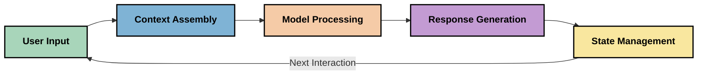
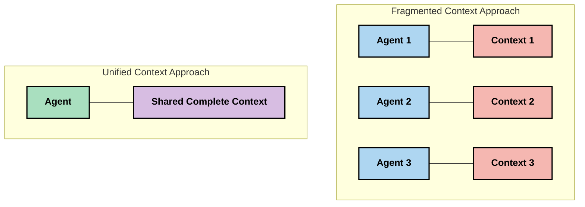
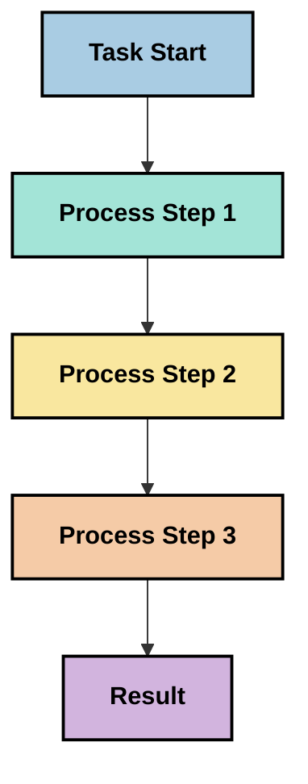
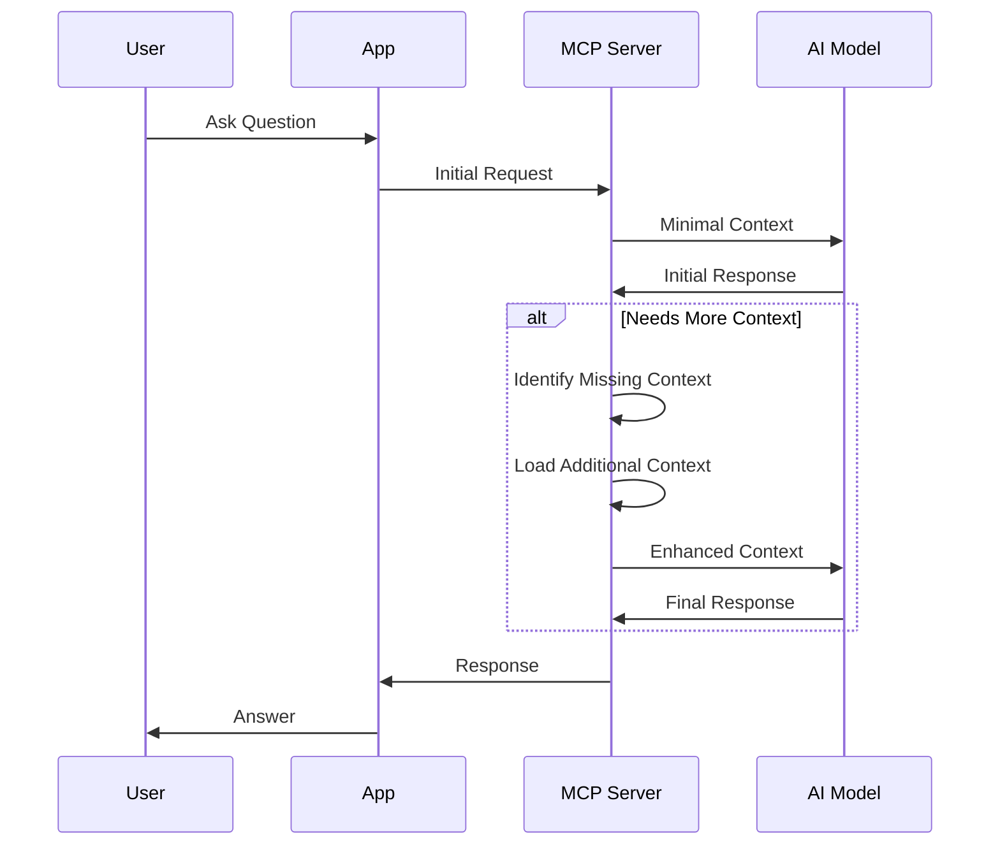
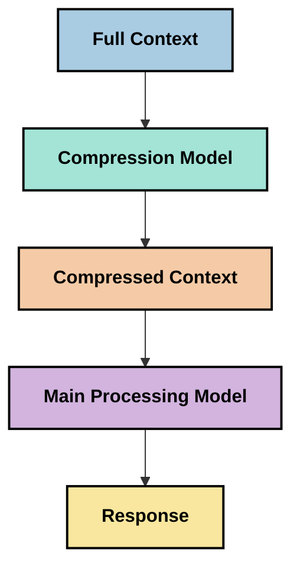

<!--
CO_OP_TRANSLATOR_METADATA:
{
  "original_hash": "5762e8e74dd99d8b7dbb31e69a82561e",
  "translation_date": "2025-07-17T01:46:24+00:00",
  "source_file": "05-AdvancedTopics/mcp-contextengineering/README.md",
  "language_code": "it"
}
-->
# Context Engineering: Un Concetto Emergente nell’Ecosistema MCP

## Panoramica

Il context engineering è un concetto emergente nel campo dell’IA che esplora come le informazioni vengono strutturate, trasmesse e mantenute durante le interazioni tra clienti e servizi di intelligenza artificiale. Con l’evoluzione dell’ecosistema Model Context Protocol (MCP), comprendere come gestire efficacemente il contesto diventa sempre più importante. Questo modulo introduce il concetto di context engineering e ne esplora le potenziali applicazioni nelle implementazioni MCP.

## Obiettivi di Apprendimento

Al termine di questo modulo, sarai in grado di:

- Comprendere il concetto emergente di context engineering e il suo possibile ruolo nelle applicazioni MCP
- Identificare le principali sfide nella gestione del contesto che il design del protocollo MCP affronta
- Esplorare tecniche per migliorare le prestazioni del modello attraverso una migliore gestione del contesto
- Considerare approcci per misurare e valutare l’efficacia del contesto
- Applicare questi concetti emergenti per migliorare le esperienze AI tramite il framework MCP

## Introduzione al Context Engineering

Il context engineering è un concetto emergente focalizzato sulla progettazione e gestione consapevole del flusso di informazioni tra utenti, applicazioni e modelli AI. A differenza di campi consolidati come il prompt engineering, il context engineering è ancora in fase di definizione da parte dei professionisti che cercano di risolvere le sfide uniche legate al fornire ai modelli AI le informazioni giuste al momento giusto.

Con l’evoluzione dei grandi modelli linguistici (LLM), l’importanza del contesto è diventata sempre più evidente. La qualità, la rilevanza e la struttura del contesto fornito influenzano direttamente i risultati del modello. Il context engineering esplora questa relazione e cerca di sviluppare principi per una gestione efficace del contesto.

> "Nel 2025, i modelli esistenti sono estremamente intelligenti. Ma anche l’essere umano più intelligente non sarà in grado di svolgere efficacemente il proprio lavoro senza il contesto di ciò che gli viene chiesto... Il 'context engineering' è il livello successivo del prompt engineering. Si tratta di farlo automaticamente in un sistema dinamico." — Walden Yan, Cognition AI

Il context engineering può comprendere:

1. **Selezione del Contesto**: Determinare quali informazioni sono rilevanti per un dato compito
2. **Strutturazione del Contesto**: Organizzare le informazioni per massimizzare la comprensione del modello
3. **Consegna del Contesto**: Ottimizzare come e quando le informazioni vengono inviate ai modelli
4. **Manutenzione del Contesto**: Gestire lo stato e l’evoluzione del contesto nel tempo
5. **Valutazione del Contesto**: Misurare e migliorare l’efficacia del contesto

Questi ambiti sono particolarmente rilevanti per l’ecosistema MCP, che fornisce un modo standardizzato per le applicazioni di fornire contesto agli LLM.

## La Prospettiva del Viaggio del Contesto

Un modo per visualizzare il context engineering è tracciare il percorso che le informazioni compiono attraverso un sistema MCP:



### Fasi Chiave nel Viaggio del Contesto:

1. **Input Utente**: Informazioni grezze dall’utente (testo, immagini, documenti)
2. **Assemblaggio del Contesto**: Combinazione dell’input utente con il contesto di sistema, la cronologia della conversazione e altre informazioni recuperate
3. **Elaborazione del Modello**: Il modello AI elabora il contesto assemblato
4. **Generazione della Risposta**: Il modello produce output basati sul contesto fornito
5. **Gestione dello Stato**: Il sistema aggiorna il proprio stato interno in base all’interazione

Questa prospettiva evidenzia la natura dinamica del contesto nei sistemi AI e solleva importanti domande su come gestire al meglio le informazioni in ogni fase.

## Principi Emergenti nel Context Engineering

Man mano che il campo del context engineering prende forma, alcuni principi iniziali stanno emergendo dai professionisti. Questi principi possono aiutare a orientare le scelte di implementazione MCP:

### Principio 1: Condividere il Contesto in Modo Completo

Il contesto dovrebbe essere condiviso completamente tra tutti i componenti di un sistema, piuttosto che frammentato tra più agenti o processi. Quando il contesto è distribuito, le decisioni prese in una parte del sistema possono entrare in conflitto con quelle prese altrove.



Nelle applicazioni MCP, questo suggerisce di progettare sistemi in cui il contesto fluisce senza interruzioni lungo tutta la pipeline, invece di essere compartimentato.

### Principio 2: Riconoscere che le Azioni Contengono Decisioni Implicite

Ogni azione compiuta da un modello incorpora decisioni implicite su come interpretare il contesto. Quando più componenti agiscono su contesti diversi, queste decisioni implicite possono entrare in conflitto, portando a risultati incoerenti.

Questo principio ha importanti implicazioni per le applicazioni MCP:
- Preferire l’elaborazione lineare di compiti complessi rispetto all’esecuzione parallela con contesto frammentato
- Assicurarsi che tutti i punti decisionali abbiano accesso alle stesse informazioni contestuali
- Progettare sistemi in cui le fasi successive possano vedere il contesto completo delle decisioni precedenti

### Principio 3: Bilanciare la Profondità del Contesto con i Limiti della Finestra

Man mano che le conversazioni e i processi si allungano, le finestre di contesto finiscono per saturarsi. Un efficace context engineering esplora approcci per gestire questa tensione tra contesto completo e limitazioni tecniche.

Gli approcci potenziali in fase di esplorazione includono:
- Compressione del contesto che mantiene le informazioni essenziali riducendo l’uso di token
- Caricamento progressivo del contesto basato sulla rilevanza per le esigenze correnti
- Sintesi delle interazioni precedenti preservando decisioni e fatti chiave

## Sfide del Contesto e Design del Protocollo MCP

Il Model Context Protocol (MCP) è stato progettato tenendo conto delle sfide uniche della gestione del contesto. Comprendere queste sfide aiuta a spiegare aspetti chiave del design del protocollo MCP:

### Sfida 1: Limiti della Finestra di Contesto  
La maggior parte dei modelli AI ha dimensioni fisse della finestra di contesto, limitando quante informazioni possono elaborare contemporaneamente.

**Risposta del Design MCP:**  
- Il protocollo supporta contesto strutturato basato su risorse che può essere referenziato in modo efficiente  
- Le risorse possono essere paginate e caricate progressivamente

### Sfida 2: Determinazione della Rilevanza  
Stabilire quali informazioni siano più rilevanti da includere nel contesto è complesso.

**Risposta del Design MCP:**  
- Strumenti flessibili permettono il recupero dinamico delle informazioni in base alle necessità  
- Prompt strutturati consentono un’organizzazione coerente del contesto

### Sfida 3: Persistenza del Contesto  
Gestire lo stato attraverso le interazioni richiede un attento tracciamento del contesto.

**Risposta del Design MCP:**  
- Gestione standardizzata delle sessioni  
- Pattern di interazione chiaramente definiti per l’evoluzione del contesto

### Sfida 4: Contesto Multi-Modale  
Tipi diversi di dati (testo, immagini, dati strutturati) richiedono trattamenti differenti.

**Risposta del Design MCP:**  
- Il design del protocollo supporta vari tipi di contenuto  
- Rappresentazione standardizzata delle informazioni multi-modali

### Sfida 5: Sicurezza e Privacy  
Il contesto spesso contiene informazioni sensibili che devono essere protette.

**Risposta del Design MCP:**  
- Confini chiari tra responsabilità client e server  
- Opzioni di elaborazione locale per minimizzare l’esposizione dei dati

Comprendere queste sfide e come MCP le affronta fornisce una base per esplorare tecniche più avanzate di context engineering.

## Approcci Emergenti nel Context Engineering

Con lo sviluppo del campo del context engineering, stanno emergendo diversi approcci promettenti. Questi rappresentano il pensiero attuale più che pratiche consolidate e probabilmente evolveranno con l’esperienza nelle implementazioni MCP.

### 1. Elaborazione Lineare a Singolo Thread

A differenza delle architetture multi-agente che distribuiscono il contesto, alcuni professionisti riscontrano che l’elaborazione lineare a singolo thread produce risultati più coerenti. Questo si allinea al principio di mantenere un contesto unificato.



Sebbene questo approccio possa sembrare meno efficiente rispetto all’elaborazione parallela, spesso produce risultati più coerenti e affidabili perché ogni fase si basa su una comprensione completa delle decisioni precedenti.

### 2. Suddivisione e Prioritizzazione del Contesto

Spezzare contesti grandi in parti gestibili e dare priorità a ciò che è più importante.

```python
# Conceptual Example: Context Chunking and Prioritization
def process_with_chunked_context(documents, query):
    # 1. Break documents into smaller chunks
    chunks = chunk_documents(documents)
    
    # 2. Calculate relevance scores for each chunk
    scored_chunks = [(chunk, calculate_relevance(chunk, query)) for chunk in chunks]
    
    # 3. Sort chunks by relevance score
    sorted_chunks = sorted(scored_chunks, key=lambda x: x[1], reverse=True)
    
    # 4. Use the most relevant chunks as context
    context = create_context_from_chunks([chunk for chunk, score in sorted_chunks[:5]])
    
    # 5. Process with the prioritized context
    return generate_response(context, query)
```

Il concetto sopra illustra come potremmo suddividere grandi documenti in parti gestibili e selezionare solo le sezioni più rilevanti per il contesto. Questo approccio aiuta a lavorare entro i limiti della finestra di contesto sfruttando comunque grandi basi di conoscenza.

### 3. Caricamento Progressivo del Contesto

Caricare il contesto progressivamente secondo necessità invece che tutto in una volta.



Il caricamento progressivo del contesto parte da un contesto minimo e si espande solo quando necessario. Questo può ridurre significativamente l’uso di token per query semplici mantenendo la capacità di gestire domande complesse.

### 4. Compressione e Sintesi del Contesto

Ridurre la dimensione del contesto preservando le informazioni essenziali.



La compressione del contesto si concentra su:  
- Rimuovere informazioni ridondanti  
- Sintetizzare contenuti lunghi  
- Estrarre fatti e dettagli chiave  
- Preservare elementi critici del contesto  
- Ottimizzare l’efficienza dei token

Questo approccio può essere particolarmente utile per mantenere conversazioni lunghe all’interno delle finestre di contesto o per elaborare grandi documenti in modo efficiente. Alcuni professionisti utilizzano modelli specializzati specificamente per la compressione e la sintesi della cronologia delle conversazioni.

## Considerazioni Esplorative sul Context Engineering

Mentre esploriamo il campo emergente del context engineering, ci sono alcune considerazioni da tenere a mente quando si lavora con implementazioni MCP. Non si tratta di best practice prescrittive, ma di aree di esplorazione che potrebbero portare a miglioramenti nel tuo caso d’uso specifico.

### Considera i Tuoi Obiettivi di Contesto

Prima di implementare soluzioni complesse di gestione del contesto, definisci chiaramente cosa vuoi ottenere:  
- Quali informazioni specifiche il modello deve avere per avere successo?  
- Quali informazioni sono essenziali e quali supplementari?  
- Quali sono i tuoi vincoli di prestazioni (latenza, limiti di token, costi)?

### Esplora Approcci a Strati

Alcuni professionisti trovano successo con il contesto organizzato in strati concettuali:  
- **Strato Core**: Informazioni essenziali di cui il modello ha sempre bisogno  
- **Strato Situazionale**: Contesto specifico per l’interazione corrente  
- **Strato di Supporto**: Informazioni aggiuntive che possono essere utili  
- **Strato di Riserva**: Informazioni accessibili solo quando necessario

### Indaga Strategie di Recupero

L’efficacia del contesto spesso dipende da come recuperi le informazioni:  
- Ricerca semantica e embeddings per trovare informazioni concettualmente rilevanti  
- Ricerca basata su parole chiave per dettagli fattuali specifici  
- Approcci ibridi che combinano più metodi di recupero  
- Filtri sui metadati per restringere l’ambito in base a categorie, date o fonti

### Sperimenta con la Coerenza del Contesto

La struttura e il flusso del contesto possono influenzare la comprensione del modello:  
- Raggruppare informazioni correlate  
- Usare formattazione e organizzazione coerenti  
- Mantenere un ordine logico o cronologico quando appropriato  
- Evitare informazioni contraddittorie

### Valuta i Compromessi delle Architetture Multi-Agente

Sebbene le architetture multi-agente siano popolari in molti framework AI, presentano sfide significative per la gestione del contesto:  
- La frammentazione del contesto può portare a decisioni incoerenti tra agenti  
- L’elaborazione parallela può introdurre conflitti difficili da risolvere  
- L’overhead di comunicazione tra agenti può annullare i guadagni di prestazioni  
- È necessaria una gestione complessa dello stato per mantenere la coerenza

In molti casi, un approccio a singolo agente con gestione completa del contesto può produrre risultati più affidabili rispetto a più agenti specializzati con contesto frammentato.

### Sviluppa Metodi di Valutazione

Per migliorare il context engineering nel tempo, considera come misurerai il successo:  
- Test A/B con diverse strutture di contesto  
- Monitoraggio dell’uso dei token e dei tempi di risposta  
- Tracciamento della soddisfazione degli utenti e dei tassi di completamento dei compiti  
- Analisi dei casi in cui le strategie di contesto falliscono

Queste considerazioni rappresentano aree attive di esplorazione nel campo del context engineering. Con la maturazione del settore, emergeranno probabilmente schemi e pratiche più definiti.

## Misurare l’Efficacia del Contesto: Un Framework in Evoluzione

Con l’emergere del context engineering come concetto, i professionisti stanno iniziando a esplorare come potremmo misurarne l’efficacia. Non esiste ancora un framework consolidato, ma si stanno considerando varie metriche che potrebbero guidare i lavori futuri.

### Dimensioni Potenziali di Misurazione

#### 1. Considerazioni sull’Efficienza dell’Input

- **Rapporto Contesto-Risposta**: Quanta parte del contesto è necessaria rispetto alla dimensione della risposta?  
- **Utilizzo dei Token**: Quale percentuale dei token forniti nel contesto influenza effettivamente la risposta?  
- **Riduzione del Contesto**: Quanto efficacemente possiamo comprimere le informazioni grezze?

#### 2. Considerazioni sulle Prestazioni

- **Impatto sulla Latenza**: Come la gestione del contesto influisce sui tempi di risposta?  
- **Economia dei Token**: Stiamo ottimizzando efficacemente l’uso dei token?  
- **Precisione del Recupero**: Quanto è rilevante l’informazione recuperata?  
- **Utilizzo delle Risorse**: Quali risorse computazionali sono richieste?

#### 3. Considerazioni sulla Qualità

- **Rilevanza della Risposta**: Quanto bene la risposta soddisfa la domanda?  
- **Accuratezza Fattuale**: La gestione del contesto migliora la correttezza dei fatti?  
- **Coerenza**: Le risposte sono coerenti tra query simili?  
- **Tasso di Allucinazioni**: Un contesto migliore riduce le allucinazioni del modello?

#### 4. Considerazioni sull’Esperienza Utente

- **Tasso di Follow-up**: Quanto spesso gli utenti richiedono chiarimenti?  
- **Completamento del Compito**: Gli utenti raggiungono con successo i loro obiettivi?  
- **Indicatori di Soddisfazione**: Come valutano gli utenti la loro esperienza?

### Approcci Esplorativi alla Misurazione

Quando sperimenti con il context engineering nelle implementazioni MCP, considera questi approcci esplorativi:

1. **Confronti di Base**: Stabilisci una baseline con approcci semplici prima di testare metodi più sofisticati  
2. **Cambiamenti Incrementali**: Modifica un aspetto della gestione del contesto alla volta per isolare gli effetti  
3. **Valutazione Centrata sull’Utente**: Combina metriche quantitative con feedback qualitativo degli utenti  
4. **Analisi dei Fallimenti**: Esamina i casi in cui le strategie di contesto falliscono per capire possibili miglioramenti  
5. **Valutazione Multi-Dimensionale**: Considera i compromessi tra efficienza, qualità ed esperienza utente

Questo approccio sperimentale e multifaccettato alla misurazione è in linea con la natura emergente del context engineering.

## Considerazioni Finali

Il context engineering è un’area emergente di esplorazione che potrebbe rivelarsi centrale per applicazioni MCP efficaci. Considerando attentamente come le informazioni fluiscono nel tuo sistema, puoi potenzialmente creare esperienze AI più efficienti, accurate e preziose per gli utenti.

Le tecniche e gli approcci descritti in questo modulo rappresentano un pensiero iniziale in questo ambito, non pratiche consolidate. Il context engineering potrebbe evolversi in una disciplina più definita man mano che le capacità AI si sviluppano e la nostra comprensione si approfondisce. Per ora, la sperimentazione combinata con una misurazione attenta sembra essere l’approccio più produttivo.

## Potenziali Direzioni Future

Il campo del context engineering è ancora nelle fasi iniziali, ma stanno emergendo diverse direzioni promettenti:

- I principi del context engineering potrebbero influenzare significativamente prestazioni del modello, efficienza, esperienza utente e affidabilità  
- Approcci a singolo thread con gestione completa del contesto potrebbero superare le architetture multi-agente in molti casi d’uso  
- Modelli specializzati per la compressione del contesto potrebbero diventare componenti standard nelle pipeline AI  
- La tensione tra completezza del contesto e limiti di token probabilmente guiderà l’innovazione nella gestione del contesto  
- Con modelli sempre più capaci di comunicazione efficiente e simile a
- [Model Context Protocol Website](https://modelcontextprotocol.io/)
- [Model Context Protocol Specification](https://github.com/modelcontextprotocol/modelcontextprotocol)
- [MCP Documentation](https://modelcontextprotocol.io/docs)
- [MCP C# SDK](https://github.com/modelcontextprotocol/csharp-sdk)
- [MCP Python SDK](https://github.com/modelcontextprotocol/python-sdk)
- [MCP TypeScript SDK](https://github.com/modelcontextprotocol/typescript-sdk)
- [MCP Inspector](https://github.com/modelcontextprotocol/inspector) - Strumento di testing visivo per server MCP

### Articoli su Context Engineering
- [Don't Build Multi-Agents: Principles of Context Engineering](https://cognition.ai/blog/dont-build-multi-agents) - Approfondimenti di Walden Yan sui principi di context engineering
- [A Practical Guide to Building Agents](https://cdn.openai.com/business-guides-and-resources/a-practical-guide-to-building-agents.pdf) - Guida di OpenAI alla progettazione efficace di agenti
- [Building Effective Agents](https://www.anthropic.com/engineering/building-effective-agents) - Approccio di Anthropic allo sviluppo di agenti

### Ricerche Correlate
- [Dynamic Retrieval Augmentation for Large Language Models](https://arxiv.org/abs/2310.01487) - Ricerca sulle tecniche di recupero dinamico
- [Lost in the Middle: How Language Models Use Long Contexts](https://arxiv.org/abs/2307.03172) - Studio importante sui modelli di elaborazione del contesto
- [Hierarchical Text-Conditioned Image Generation with CLIP Latents](https://arxiv.org/abs/2204.06125) - Articolo su DALL-E 2 con approfondimenti sulla strutturazione del contesto
- [Exploring the Role of Context in Large Language Model Architectures](https://aclanthology.org/2023.findings-emnlp.124/) - Ricerca recente sulla gestione del contesto
- [Multi-Agent Collaboration: A Survey](https://arxiv.org/abs/2304.03442) - Studio sui sistemi multi-agente e le loro sfide

### Risorse Aggiuntive
- [Context Window Optimization Techniques](https://learn.microsoft.com/en-us/azure/ai-services/openai/concepts/context-window)
- [Advanced RAG Techniques](https://www.microsoft.com/en-us/research/blog/retrieval-augmented-generation-rag-and-frontier-models/)
- [Semantic Kernel Documentation](https://github.com/microsoft/semantic-kernel)
- [AI Toolkit for Context Management](https://github.com/microsoft/aitoolkit)

## Cosa c’è dopo
- [6. Community Contributions](../../06-CommunityContributions/README.md)

**Disclaimer**:  
Questo documento è stato tradotto utilizzando il servizio di traduzione automatica [Co-op Translator](https://github.com/Azure/co-op-translator). Pur impegnandoci per garantire accuratezza, si prega di notare che le traduzioni automatiche possono contenere errori o imprecisioni. Il documento originale nella sua lingua nativa deve essere considerato la fonte autorevole. Per informazioni critiche, si raccomanda una traduzione professionale effettuata da un umano. Non siamo responsabili per eventuali malintesi o interpretazioni errate derivanti dall’uso di questa traduzione.