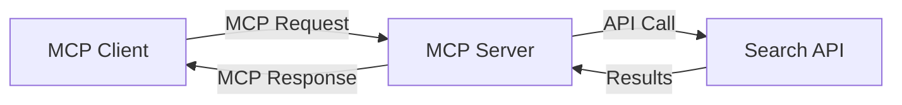
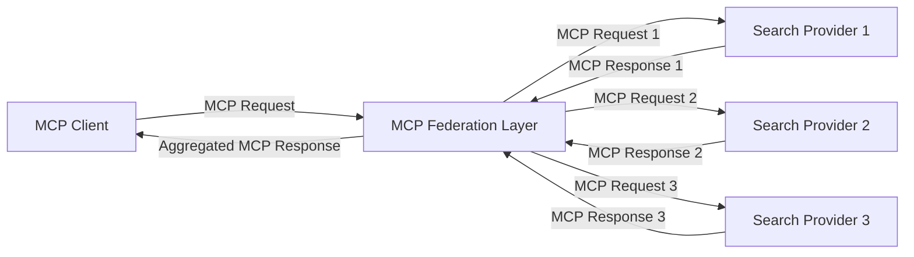
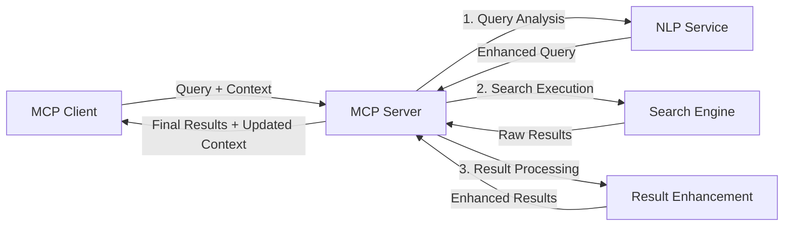

<!--
CO_OP_TRANSLATOR_METADATA:
{
  "original_hash": "eb12652eb7bd17f2193b835a344425c6",
  "translation_date": "2025-06-26T13:57:48+00:00",
  "source_file": "05-AdvancedTopics/mcp-realtimesearch/README.md",
  "language_code": "it"
}
-->
## Disclaimer sugli Esempi di Codice

> **Nota Importante**: Gli esempi di codice riportati di seguito mostrano l'integrazione del Model Context Protocol (MCP) con la funzionalità di ricerca web. Sebbene seguano i pattern e le strutture degli SDK ufficiali MCP, sono stati semplificati a scopo didattico.
> 
> Questi esempi illustrano:
> 
> 1. **Implementazione Python**: Un server FastMCP che fornisce uno strumento di ricerca web e si connette a un'API di ricerca esterna. Questo esempio dimostra una corretta gestione del ciclo di vita, la gestione del contesto e l'implementazione dello strumento seguendo i pattern dell'[SDK Python MCP ufficiale](https://github.com/modelcontextprotocol/python-sdk). Il server utilizza il trasporto HTTP Streamable raccomandato, che ha sostituito il vecchio trasporto SSE per le distribuzioni in produzione.
> 
> 2. **Implementazione JavaScript**: Un’implementazione TypeScript/JavaScript che utilizza il pattern FastMCP dell'[SDK TypeScript MCP ufficiale](https://github.com/modelcontextprotocol/typescript-sdk) per creare un server di ricerca con definizioni di strumenti e connessioni client appropriate. Segue i pattern più aggiornati per la gestione delle sessioni e la conservazione del contesto.
> 
> Questi esempi richiederebbero ulteriore gestione degli errori, autenticazione e codice specifico di integrazione API per l’uso in produzione. Gli endpoint API di ricerca mostrati (`https://api.search-service.example/search`) sono segnaposto e dovrebbero essere sostituiti con endpoint reali di servizi di ricerca.
> 
> Per dettagli completi sull’implementazione e gli approcci più aggiornati, si rimanda alla [specifica ufficiale MCP](https://spec.modelcontextprotocol.io/) e alla documentazione degli SDK.

## Concetti Fondamentali

### Il Framework Model Context Protocol (MCP)

Alla base, il Model Context Protocol fornisce un modo standardizzato affinché modelli AI, applicazioni e servizi scambino contesto. Nella ricerca web in tempo reale, questo framework è essenziale per creare esperienze di ricerca coerenti e multi-turno. I componenti chiave includono:

1. **Architettura Client-Server**: MCP stabilisce una chiara separazione tra client di ricerca (richiedenti) e server di ricerca (fornitori), permettendo modelli di distribuzione flessibili.

2. **Comunicazione JSON-RPC**: Il protocollo utilizza JSON-RPC per lo scambio di messaggi, rendendolo compatibile con le tecnologie web e facile da implementare su diverse piattaforme.

3. **Gestione del Contesto**: MCP definisce metodi strutturati per mantenere, aggiornare e sfruttare il contesto di ricerca attraverso molteplici interazioni.

4. **Definizione degli Strumenti**: Le capacità di ricerca sono esposte come strumenti standardizzati con parametri e valori di ritorno ben definiti.

5. **Supporto allo Streaming**: Il protocollo supporta lo streaming dei risultati, essenziale per la ricerca in tempo reale dove i risultati possono arrivare progressivamente.

### Pattern di Integrazione della Ricerca Web

Quando si integra MCP con la ricerca web, emergono diversi pattern:

#### 1. Integrazione Diretta con Provider di Ricerca

In questo pattern, il server MCP si interfaccia direttamente con una o più API di ricerca, traducendo le richieste MCP in chiamate specifiche API e formattando i risultati come risposte MCP.

#### 2. Ricerca Federata con Conservazione del Contesto

Questo pattern distribuisce le query di ricerca su più provider di ricerca compatibili MCP, ognuno specializzato in diversi tipi di contenuto o capacità di ricerca, mantenendo un contesto unificato.

#### 3. Catena di Ricerca Arricchita dal Contesto

In questo pattern, il processo di ricerca è diviso in più fasi, con il contesto che viene arricchito a ogni passaggio, producendo risultati progressivamente più pertinenti.

### Componenti del Contesto di Ricerca

Nella ricerca web basata su MCP, il contesto tipicamente include:

- **Cronologia delle Query**: Le query di ricerca precedenti nella sessione
- **Preferenze Utente**: Lingua, regione, impostazioni di ricerca sicura
- **Cronologia delle Interazioni**: Risultati cliccati, tempo trascorso sui risultati
- **Parametri di Ricerca**: Filtri, ordinamenti e altri modificatori di ricerca
- **Conoscenza del Dominio**: Contesto specifico relativo al soggetto della ricerca
- **Contesto Temporale**: Fattori di rilevanza basati sul tempo
- **Preferenze di Fonte**: Fonti di informazione affidabili o preferite

## Casi d’Uso e Applicazioni

### Ricerca e Raccolta di Informazioni

MCP migliora i flussi di lavoro di ricerca:

- Conservando il contesto di ricerca attraverso le sessioni
- Abilitando query più sofisticate e contestualmente rilevanti
- Supportando la federazione di ricerca multi-sorgente
- Facilitando l’estrazione di conoscenza dai risultati di ricerca

### Monitoraggio in Tempo Reale di Notizie e Trend

La ricerca potenziata da MCP offre vantaggi per il monitoraggio delle notizie:

- Scoperta quasi in tempo reale di notizie emergenti
- Filtraggio contestuale delle informazioni rilevanti
- Tracciamento di argomenti ed entità su più fonti
- Alert personalizzati basati sul contesto utente

### Navigazione e Ricerca Potenziata da AI

MCP crea nuove possibilità per la navigazione potenziata da AI:

- Suggerimenti di ricerca contestuali basati sull’attività corrente del browser
- Integrazione fluida della ricerca web con assistenti basati su LLM
- Raffinamento multi-turno della ricerca mantenendo il contesto
- Miglioramento del fact-checking e della verifica delle informazioni

## Tendenze Future e Innovazioni

### Evoluzione di MCP nella Ricerca Web

Guardando al futuro, ci aspettiamo che MCP evolva per affrontare:

- **Ricerca Multimodale**: Integrazione di ricerca testuale, immagini, audio e video con contesto preservato
- **Ricerca Decentralizzata**: Supporto a ecosistemi di ricerca distribuiti e federati
- **Privacy nella Ricerca**: Meccanismi di ricerca che rispettano la privacy basati sul contesto
- **Comprensione della Query**: Parsing semantico profondo delle query di ricerca in linguaggio naturale

### Possibili Progressi Tecnologici

Tecnologie emergenti che modelleranno il futuro della ricerca MCP:

1. **Architetture di Ricerca Neurale**: Sistemi di ricerca basati su embedding ottimizzati per MCP
2. **Contesto di Ricerca Personalizzato**: Apprendimento dei modelli di ricerca individuali nel tempo
3. **Integrazione di Knowledge Graph**: Ricerca contestuale potenziata da grafi di conoscenza specifici di dominio
4. **Contesto Cross-Modale**: Mantenimento del contesto attraverso diverse modalità di ricerca

## Esercizi Pratici

### Esercizio 1: Configurare una Pipeline di Ricerca MCP di Base

In questo esercizio imparerai a:
- Configurare un ambiente di ricerca MCP di base
- Implementare gestori di contesto per la ricerca web
- Testare e validare la conservazione del contesto attraverso iterazioni di ricerca

### Esercizio 2: Costruire un Assistente di Ricerca con MCP

Crea un’applicazione completa che:
- Elabora domande di ricerca in linguaggio naturale
- Esegue ricerche web contestuali
- Sintetizza informazioni da più fonti
- Presenta risultati di ricerca organizzati

### Esercizio 3: Implementare la Federazione di Ricerca Multi-Sorgente con MCP

Esercizio avanzato che copre:
- Invio contestuale di query a più motori di ricerca
- Classifica e aggrega i risultati
- Deduplicazione contestuale dei risultati di ricerca
- Gestione di metadata specifici delle fonti

## Risorse Aggiuntive

- [Model Context Protocol Specification](https://spec.modelcontextprotocol.io/) - Specifica ufficiale MCP e documentazione dettagliata del protocollo
- [Model Context Protocol Documentation](https://modelcontextprotocol.io/) - Tutorial dettagliati e guide all’implementazione
- [MCP Python SDK](https://github.com/modelcontextprotocol/python-sdk) - Implementazione Python ufficiale del protocollo MCP
- [MCP TypeScript SDK](https://github.com/modelcontextprotocol/typescript-sdk) - Implementazione TypeScript ufficiale del protocollo MCP
- [MCP Reference Servers](https://github.com/modelcontextprotocol/servers) - Implementazioni di riferimento di server MCP
- [Bing Web Search API Documentation](https://learn.microsoft.com/en-us/bing/search-apis/bing-web-search/overview) - API di ricerca web di Microsoft
- [Google Custom Search JSON API](https://developers.google.com/custom-search/v1/overview) - Motore di ricerca programmabile di Google
- [SerpAPI Documentation](https://serpapi.com/search-api) - API per pagine di risultati dei motori di ricerca
- [Meilisearch Documentation](https://www.meilisearch.com/docs) - Motore di ricerca open-source
- [Elasticsearch Documentation](https://www.elastic.co/guide/index.html) - Motore di ricerca e analisi distribuito
- [LangChain Documentation](https://python.langchain.com/docs/get_started/introduction) - Costruzione di applicazioni con LLM

## Risultati di Apprendimento

Completando questo modulo, sarai in grado di:

- Comprendere i fondamenti della ricerca web in tempo reale e le sue sfide
- Spiegare come il Model Context Protocol (MCP) potenzia le capacità di ricerca in tempo reale
- Implementare soluzioni di ricerca basate su MCP usando framework e API popolari
- Progettare e distribuire architetture di ricerca scalabili e ad alte prestazioni con MCP
- Applicare i concetti MCP a vari casi d’uso, inclusa la ricerca semantica, assistenza alla ricerca e navigazione potenziata da AI
- Valutare le tendenze emergenti e le innovazioni future nelle tecnologie di ricerca basate su MCP

### Considerazioni su Fiducia e Sicurezza

Quando implementi soluzioni di ricerca web basate su MCP, ricorda questi principi importanti dalla specifica MCP:

1. **Consenso e Controllo dell’Utente**: Gli utenti devono dare un consenso esplicito e comprendere tutte le operazioni e gli accessi ai dati. Questo è particolarmente importante per implementazioni di ricerca web che possono accedere a fonti di dati esterne.

2. **Privacy dei Dati**: Garantire una gestione appropriata delle query di ricerca e dei risultati, specialmente se contengono informazioni sensibili. Implementare controlli di accesso adeguati per proteggere i dati degli utenti.

3. **Sicurezza degli Strumenti**: Implementare autorizzazioni e validazioni corrette per gli strumenti di ricerca, poiché rappresentano potenziali rischi di sicurezza attraverso l’esecuzione di codice arbitrario. Le descrizioni del comportamento degli strumenti devono essere considerate non attendibili a meno che non provengano da un server fidato.

4. **Documentazione Chiara**: Fornire una documentazione chiara sulle capacità, limitazioni e considerazioni di sicurezza della tua implementazione di ricerca basata su MCP, seguendo le linee guida della specifica MCP.

5. **Flussi di Consenso Robusti**: Costruire flussi di consenso e autorizzazione robusti che spieghino chiaramente cosa fa ogni strumento prima di autorizzarne l’uso, specialmente per strumenti che interagiscono con risorse web esterne.

Per dettagli completi su sicurezza, fiducia e considerazioni di sicurezza MCP, consulta la [documentazione ufficiale](https://modelcontextprotocol.io/specification/2025-03-26#security-and-trust-%26-safety).

## Cosa Fare Dopo

- [5.11 Autenticazione Entra ID per Server Model Context Protocol](../mcp-security-entra/README.md)

**Disclaimer**:  
Questo documento è stato tradotto utilizzando il servizio di traduzione automatica [Co-op Translator](https://github.com/Azure/co-op-translator). Pur impegnandoci per l’accuratezza, si prega di notare che le traduzioni automatiche possono contenere errori o inesattezze. Il documento originale nella sua lingua nativa deve essere considerato la fonte autorevole. Per informazioni critiche si raccomanda la traduzione professionale effettuata da un traduttore umano. Non siamo responsabili per eventuali fraintendimenti o interpretazioni errate derivanti dall’uso di questa traduzione.