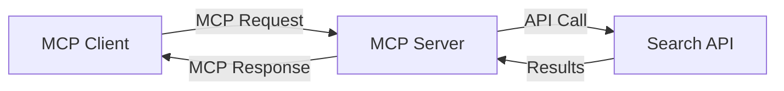
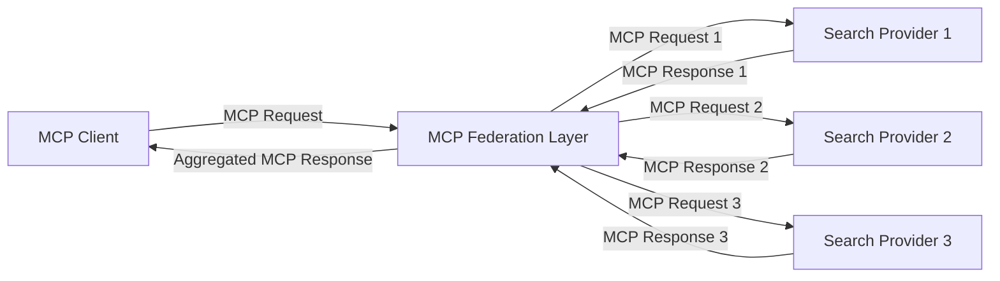
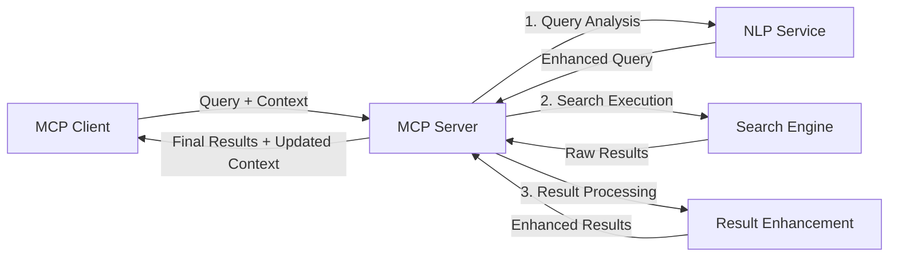

<!--
CO_OP_TRANSLATOR_METADATA:
{
  "original_hash": "16bef2c93c6a86d4ca6a8ce9e120e384",
  "translation_date": "2025-06-13T02:44:42+00:00",
  "source_file": "05-AdvancedTopics/mcp-realtimesearch/README.md",
  "language_code": "it"
}
-->
## הודעת ויתור על דוגמאות קוד

> **הערה חשובה**: דוגמאות הקוד למטה ממחישות את האינטגרציה של Model Context Protocol (MCP) עם פונקציונליות חיפוש ברשת. אף שהן עוקבות אחרי דפוסים ומבנים של ערכות הכלים הרשמיות של MCP, הן הוכנו בצורה מפושטת למטרות לימוד.
> 
> דוגמאות אלו מציגות:
> 
> 1. **מימוש בפייתון**: יישום שרת FastMCP שמספק כלי חיפוש ברשת ומתחבר ל-API חיפוש חיצוני. הדוגמה מראה ניהול מחזור חיים נכון, טיפול בהקשר, ויישום כלי בהתאם לדפוסים של [ערכת הכלים הרשמית של MCP בפייתון](https://github.com/modelcontextprotocol/python-sdk). השרת משתמש בתחבורה HTTP מסוג Streamable המומלצת, שהחליפה את תחבורת SSE הישנה לפרודקשן.
> 
> 2. **מימוש בג'אווהסקריפט**: מימוש TypeScript/JavaScript באמצעות דפוס FastMCP מתוך [ערכת הכלים הרשמית של MCP ב-TypeScript](https://github.com/modelcontextprotocol/typescript-sdk) ליצירת שרת חיפוש עם הגדרות כלי נכונות וחיבורי לקוח. המימוש עוקב אחרי דפוסים מומלצים לניהול מושבים ושימור הקשר.
> 
> דוגמאות אלו דורשות טיפול שגיאות נוסף, אימות, וקוד אינטגרציה ספציפי ל-API לשימוש בפרודקשן. נקודות הקצה של API החיפוש (`https://api.search-service.example/search`) הן דוגמאות בלבד וצריך להחליפן בכתובות שירותי חיפוש אמיתיים.
> 
> לפרטים מלאים והנחיות מעודכנות, יש לעיין ב-[מפרט MCP הרשמי](https://spec.modelcontextprotocol.io/) ובתיעוד ערכות הכלים.

## מושגי יסוד

### מסגרת Model Context Protocol (MCP)

בסיסית, Model Context Protocol מספק דרך סטנדרטית למודלים של AI, יישומים ושירותים להחלפת הקשר. בחיפוש רשת בזמן אמת, המסגרת חיונית ליצירת חוויות חיפוש רציפות עם מספר סבבים. רכיבים מרכזיים כוללים:

1. **ארכיטקטורת לקוח-שרת**: MCP מגדיר הפרדה ברורה בין לקוחות חיפוש (מבקשים) לשרתי חיפוש (מספקים), מה שמאפשר מודלים גמישים לפריסה.

2. **תקשורת JSON-RPC**: הפרוטוקול משתמש ב-JSON-RPC להחלפת הודעות, דבר שהופך אותו לתואם לטכנולוגיות רשת וליישום במגוון פלטפורמות.

3. **ניהול הקשר**: MCP מגדיר שיטות מובנות לשמירה, עדכון וניצול הקשר חיפוש במספר אינטראקציות.

4. **הגדרות כלים**: יכולות החיפוש מוצגות ככלים סטנדרטיים עם פרמטרים וערכי החזרה מוגדרים היטב.

5. **תמיכה בזרימה**: הפרוטוקול תומך בזרימת תוצאות, דבר חיוני לחיפוש בזמן אמת שבו תוצאות עשויות להגיע בהדרגה.

### דפוסי אינטגרציה לחיפוש רשת

בעת אינטגרציה של MCP עם חיפוש ברשת, מתגלים כמה דפוסים:

#### 1. אינטגרציה ישירה עם ספק חיפוש

בדפוס זה, שרת MCP מתקשר ישירות עם אחד או יותר APIs של חיפוש, מתרגם בקשות MCP לקריאות API ספציפיות ומעצב את התוצאות כתשובות MCP.

#### 2. חיפוש מאוגד עם שימור הקשר

בדפוס זה, שאילתות חיפוש מופצות בין מספר ספקי חיפוש התואמים MCP, שכל אחד עשוי להתמחות בסוגי תוכן או יכולות חיפוש שונות, תוך שמירה על הקשר אחיד.

#### 3. שרשרת חיפוש משופרת בהקשר

בדפוס זה, תהליך החיפוש מחולק למספר שלבים, כאשר ההקשר מועשר בכל שלב, מה שמוביל לתוצאות רלוונטיות יותר בהדרגה.

### רכיבי הקשר בחיפוש

בהקשר חיפוש מבוסס MCP, ההקשר כולל בדרך כלל:

- **היסטוריית שאילתות**: שאילתות חיפוש קודמות במושב
- **העדפות משתמש**: שפה, אזור, הגדרות חיפוש בטוח
- **היסטוריית אינטראקציות**: אילו תוצאות נבחרו, זמן שהייה על תוצאות
- **פרמטרי חיפוש**: סינונים, סדרי מיון ומודיפיקציות נוספות
- **ידע תחומי**: הקשר נושא ספציפי הרלוונטי לחיפוש
- **הקשר זמני**: גורמי רלוונטיות מבוססי זמן
- **העדפות מקורות**: מקורות מידע מהימנים או מועדפים

## מקרים שימוש ויישומים

### מחקר ואיסוף מידע

MCP משפר תהליכי מחקר על ידי:

- שמירת הקשר מחקרי לאורך מושבי חיפוש
- מתן אפשרות לשאילתות מתוחכמות ורלוונטיות יותר להקשר
- תמיכה באיחוד חיפוש ממקורות מרובים
- הקלה על הפקת ידע מתוצאות החיפוש

### ניטור חדשות ומגמות בזמן אמת

חיפוש מבוסס MCP מציע יתרונות לניטור חדשות:

- גילוי כמעט בזמן אמת של סיפורי חדשות מתפתחים
- סינון הקשרי של מידע רלוונטי
- מעקב אחר נושאים ויישויות במקורות מרובים
- התראות חדשות מותאמות אישית על בסיס הקשר משתמש

### גלישה ומחקר בהגברת AI

MCP יוצר אפשרויות חדשות לגלישה מוגברת בידי AI:

- הצעות חיפוש הקשריות בהתבסס על פעילות דפדפן נוכחית
- אינטגרציה חלקה של חיפוש רשת עם עוזרים מבוססי LLM
- שיפור חיפוש רב-סבבי עם הקשר מתמשך
- שיפור בדיקת עובדות ואימות מידע

## מגמות וחדשנות עתידית

### התפתחות MCP בחיפוש רשת

בעתיד, אנו מצפים ש-MCP יתפתח ויתמודד עם:

- **חיפוש מולטימודלי**: שילוב חיפוש טקסט, תמונה, אודיו ווידאו עם הקשר מתמשך
- **חיפוש מבוזר**: תמיכה באקוסיסטמים מבוזרים ומאוגדים
- **פרטיות בחיפוש**: מנגנוני חיפוש המגנים על פרטיות תוך התחשבות בהקשר
- **הבנת שאילתות**: ניתוח סמנטי עמוק של שאילתות בשפה טבעית

### טכנולוגיות מתקדמות עתידיות

טכנולוגיות מתפתחות שישפיעו על עתיד החיפוש ב-MCP:

1. **ארכיטקטורות חיפוש עצביות**: מערכות חיפוש מבוססות אמבדינג מותאמות ל-MCP
2. **הקשר חיפוש מותאם אישית**: למידת דפוסי חיפוש אישיים לאורך זמן
3. **אינטגרציה של גרפים ידע**: חיפוש הקשרי משופר באמצעות גרפים תחומיים
4. **הקשר חוצה-מודאלי**: שמירת הקשר בין מודאליות חיפוש שונות

## תרגילים מעשיים

### תרגיל 1: הקמת צינור חיפוש MCP בסיסי

בתרגיל זה תלמדו כיצד:
- להגדיר סביבה בסיסית לחיפוש MCP
- ליישם מטפלי הקשר לחיפוש ברשת
- לבדוק ולאמת שימור הקשר בין שאילתות חיפוש

### תרגיל 2: בניית עוזר מחקר עם חיפוש MCP

צרו יישום שלם ש:
- מעבד שאלות מחקר בשפה טבעית
- מבצע חיפושים ברשת בהקשר מודע
- מסנתז מידע ממספר מקורות
- מציג ממצאים מאורגנים למחקר

### תרגיל 3: יישום איחוד חיפוש ממקורות מרובים עם MCP

תרגיל מתקדם הכולל:
- ניתוב שאילתות מודע הקשר למנועי חיפוש מרובים
- דירוג ואיחוד תוצאות
- זיהוי כפילויות הקשריות בתוצאות החיפוש
- טיפול במטא-נתונים ספציפיים למקור

## משאבים נוספים

- [מפרט Model Context Protocol](https://spec.modelcontextprotocol.io/) - מפרט רשמי ותיעוד פרוטוקול מפורט
- [תיעוד Model Context Protocol](https://modelcontextprotocol.io/) - מדריכים מפורטים ומדריכי יישום
- [MCP Python SDK](https://github.com/modelcontextprotocol/python-sdk) - מימוש רשמי בפייתון של פרוטוקול MCP
- [MCP TypeScript SDK](https://github.com/modelcontextprotocol/typescript-sdk) - מימוש רשמי ב-TypeScript של פרוטוקול MCP
- [שרתים לדוגמה של MCP](https://github.com/modelcontextprotocol/servers) - מימושי שרתים לדוגמה של MCP
- [Bing Web Search API Documentation](https://learn.microsoft.com/en-us/bing/search-apis/bing-web-search/overview) - API חיפוש רשת של מיקרוסופט
- [Google Custom Search JSON API](https://developers.google.com/custom-search/v1/overview) - מנוע חיפוש מותאם של גוגל
- [SerpAPI Documentation](https://serpapi.com/search-api) - API לדפי תוצאות מנועי חיפוש
- [Meilisearch Documentation](https://www.meilisearch.com/docs) - מנוע חיפוש קוד פתוח
- [Elasticsearch Documentation](https://www.elastic.co/guide/index.html) - מנוע חיפוש וניתוח מבוזר
- [LangChain Documentation](https://python.langchain.com/docs/get_started/introduction) - בניית יישומים עם LLM

## תוצאות למידה

בסיום המודול תוכלו:

- להבין את יסודות החיפוש ברשת בזמן אמת ואת האתגרים שבו
- להסביר כיצד Model Context Protocol (MCP) משפר יכולות חיפוש בזמן אמת
- ליישם פתרונות חיפוש מבוססי MCP באמצעות מסגרות ו-APIs פופולריים
- לתכנן ולפרוס ארכיטקטורות חיפוש בקנה מידה גבוה וביצועים עם MCP
- ליישם מושגי MCP במקרים שימוש שונים כולל חיפוש סמנטי, סיוע מחקר וגלישה בהגברת AI
- להעריך מגמות עתידיות וחדשנות בטכנולוגיות חיפוש מבוססות MCP

### שיקולי אמון ובטיחות

בעת יישום פתרונות חיפוש מבוססי MCP, זכרו את העקרונות החשובים הבאים מתוך מפרט MCP:

1. **הסכמה ושליטה של המשתמש**: יש לקבל הסכמה מפורשת מהמשתמש ולהבטיח הבנת כל הגישה והפעולות על הנתונים. זה חשוב במיוחד במימושי חיפוש רשת שעשויים לגשת למקורות חיצוניים.

2. **פרטיות נתונים**: יש לטפל כראוי בשאילתות ותוצאות החיפוש, במיוחד כאשר הן עשויות להכיל מידע רגיש. יש ליישם בקרות גישה מתאימות להגנת פרטיות המשתמש.

3. **בטיחות הכלים**: יש ליישם הרשאות ואימות נאותים לכלי החיפוש, כיוון שהם מהווים סיכוני אבטחה פוטנציאליים עקב ביצוע קוד שרירותי. תיאורי התנהגות הכלים צריכים להיחשב כלא מהימנים אלא אם כן התקבלו משרת מהימן.

4. **תיעוד ברור**: ספקו תיעוד ברור על היכולות, המגבלות ושיקולי האבטחה של מימוש החיפוש מבוסס MCP, בהתאם להנחיות המימוש שבמפרט MCP.

5. **זרימות הסכמה חזקות**: בנו זרימות הסכמה והרשאה איתנות שמסבירות בבירור מה כל כלי עושה לפני שמאשרים את השימוש בו, במיוחד עבור כלים שמתקשרים עם משאבי רשת חיצוניים.

לפרטים מלאים על אבטחה ושיקולי אמון במפרט MCP, עיינו ב-[התיעוד הרשמי](https://modelcontextprotocol.io/specification/2025-03-26#security-and-trust-%26-safety).

## מה הלאה

- [6. תרומות מהקהילה](../../06-CommunityContributions/README.md)

**Disclaimer**:  
Questo documento è stato tradotto utilizzando il servizio di traduzione automatica AI [Co-op Translator](https://github.com/Azure/co-op-translator). Pur impegnandoci per garantire accuratezza, si prega di notare che le traduzioni automatiche possono contenere errori o imprecisioni. Il documento originale nella sua lingua nativa deve essere considerato la fonte autorevole. Per informazioni critiche, si raccomanda la traduzione professionale umana. Non ci assumiamo alcuna responsabilità per eventuali malintesi o interpretazioni errate derivanti dall’uso di questa traduzione.