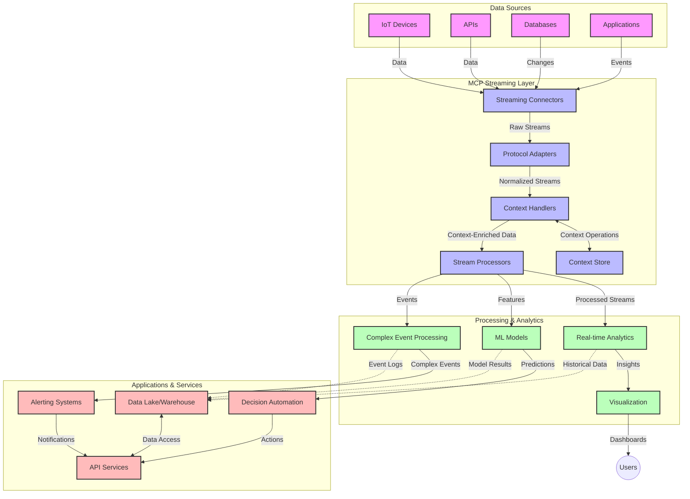

<!--
CO_OP_TRANSLATOR_METADATA:
{
  "original_hash": "195f7287638b77a549acadd96c8f981c",
  "translation_date": "2025-07-14T01:38:32+00:00",
  "source_file": "05-AdvancedTopics/mcp-realtimestreaming/README.md",
  "language_code": "it"
}
-->
# Model Context Protocol per lo Streaming di Dati in Tempo Reale

## Panoramica

Lo streaming di dati in tempo reale è diventato essenziale nel mondo odierno guidato dai dati, dove aziende e applicazioni richiedono accesso immediato alle informazioni per prendere decisioni tempestive. Il Model Context Protocol (MCP) rappresenta un importante progresso nell’ottimizzazione di questi processi di streaming in tempo reale, migliorando l’efficienza nell’elaborazione dei dati, mantenendo l’integrità contestuale e potenziando le prestazioni complessive del sistema.

Questo modulo esplora come MCP trasforma lo streaming di dati in tempo reale offrendo un approccio standardizzato alla gestione del contesto tra modelli AI, piattaforme di streaming e applicazioni.

## Introduzione allo Streaming di Dati in Tempo Reale

Lo streaming di dati in tempo reale è un paradigma tecnologico che consente il trasferimento, l’elaborazione e l’analisi continua dei dati man mano che vengono generati, permettendo ai sistemi di reagire immediatamente alle nuove informazioni. A differenza del tradizionale batch processing che opera su dataset statici, lo streaming elabora dati in movimento, fornendo insight e azioni con latenza minima.

### Concetti Chiave dello Streaming di Dati in Tempo Reale:

- **Flusso Continuo di Dati**: I dati vengono elaborati come un flusso continuo e infinito di eventi o record.
- **Elaborazione a Bassa Latenza**: I sistemi sono progettati per minimizzare il tempo tra la generazione e l’elaborazione dei dati.
- **Scalabilità**: Le architetture di streaming devono gestire volumi e velocità di dati variabili.
- **Tolleranza ai Guasti**: I sistemi devono essere resilienti ai guasti per garantire un flusso dati ininterrotto.
- **Elaborazione Stateful**: Mantenere il contesto tra gli eventi è fondamentale per un’analisi significativa.

### Il Model Context Protocol e lo Streaming in Tempo Reale

Il Model Context Protocol (MCP) affronta diverse sfide critiche negli ambienti di streaming in tempo reale:

1. **Continuità Contestuale**: MCP standardizza il modo in cui il contesto viene mantenuto tra componenti di streaming distribuiti, garantendo che modelli AI e nodi di elaborazione abbiano accesso al contesto storico e ambientale rilevante.

2. **Gestione Efficiente dello Stato**: Fornendo meccanismi strutturati per la trasmissione del contesto, MCP riduce l’overhead nella gestione dello stato nelle pipeline di streaming.

3. **Interoperabilità**: MCP crea un linguaggio comune per la condivisione del contesto tra tecnologie di streaming diverse e modelli AI, abilitando architetture più flessibili ed estensibili.

4. **Contesto Ottimizzato per lo Streaming**: Le implementazioni MCP possono dare priorità agli elementi di contesto più rilevanti per le decisioni in tempo reale, ottimizzando sia le prestazioni che l’accuratezza.

5. **Elaborazione Adattiva**: Con una corretta gestione del contesto tramite MCP, i sistemi di streaming possono adattare dinamicamente l’elaborazione in base a condizioni e pattern evolutivi nei dati.

Nelle applicazioni moderne, che spaziano dalle reti di sensori IoT alle piattaforme di trading finanziario, l’integrazione di MCP con le tecnologie di streaming consente un’elaborazione più intelligente e consapevole del contesto, capace di rispondere adeguatamente a situazioni complesse e in evoluzione in tempo reale.

## Obiettivi di Apprendimento

Al termine di questa lezione, sarai in grado di:

- Comprendere i fondamenti dello streaming di dati in tempo reale e le sue sfide
- Spiegare come il Model Context Protocol (MCP) migliora lo streaming di dati in tempo reale
- Implementare soluzioni di streaming basate su MCP utilizzando framework popolari come Kafka e Pulsar
- Progettare e distribuire architetture di streaming tolleranti ai guasti e ad alte prestazioni con MCP
- Applicare i concetti MCP a casi d’uso in IoT, trading finanziario e analisi guidate da AI
- Valutare le tendenze emergenti e le innovazioni future nelle tecnologie di streaming basate su MCP

### Definizione e Importanza

Lo streaming di dati in tempo reale coinvolge la generazione, l’elaborazione e la consegna continua dei dati con latenza minima. A differenza del batch processing, dove i dati vengono raccolti e processati in gruppi, lo streaming elabora i dati in modo incrementale man mano che arrivano, permettendo insight e azioni immediate.

Caratteristiche chiave dello streaming di dati in tempo reale includono:

- **Bassa Latenza**: Elaborazione e analisi dei dati in millisecondi o secondi
- **Flusso Continuo**: Flussi ininterrotti di dati da varie fonti
- **Elaborazione Immediata**: Analisi dei dati al momento dell’arrivo anziché a blocchi
- **Architettura Event-Driven**: Risposta agli eventi man mano che si verificano

### Sfide nello Streaming Tradizionale di Dati

Gli approcci tradizionali allo streaming di dati presentano diverse limitazioni:

1. **Perdita di Contesto**: Difficoltà nel mantenere il contesto tra sistemi distribuiti
2. **Problemi di Scalabilità**: Difficoltà a scalare per gestire dati ad alto volume e velocità
3. **Complessità di Integrazione**: Problemi di interoperabilità tra sistemi diversi
4. **Gestione della Latenza**: Bilanciare throughput e tempi di elaborazione
5. **Coerenza dei Dati**: Garantire accuratezza e completezza dei dati lungo il flusso

## Comprendere il Model Context Protocol (MCP)

### Cos’è MCP?

Il Model Context Protocol (MCP) è un protocollo di comunicazione standardizzato progettato per facilitare l’interazione efficiente tra modelli AI e applicazioni. Nel contesto dello streaming di dati in tempo reale, MCP fornisce un framework per:

- Preservare il contesto lungo tutta la pipeline dati
- Standardizzare i formati di scambio dati
- Ottimizzare la trasmissione di grandi dataset
- Migliorare la comunicazione modello-modello e modello-applicazione

### Componenti Chiave e Architettura

L’architettura MCP per lo streaming in tempo reale comprende diversi componenti fondamentali:

1. **Context Handlers**: Gestiscono e mantengono le informazioni contestuali lungo la pipeline di streaming
2. **Stream Processors**: Elaborano i flussi di dati in ingresso utilizzando tecniche consapevoli del contesto
3. **Protocol Adapters**: Convertono tra diversi protocolli di streaming preservando il contesto
4. **Context Store**: Memorizzano e recuperano in modo efficiente le informazioni contestuali
5. **Streaming Connectors**: Collegano a varie piattaforme di streaming (Kafka, Pulsar, Kinesis, ecc.)



### Come MCP Migliora la Gestione dei Dati in Tempo Reale

MCP affronta le sfide tradizionali dello streaming attraverso:

- **Integrità Contestuale**: Mantenere le relazioni tra i dati lungo tutta la pipeline
- **Trasmissione Ottimizzata**: Ridurre la ridondanza nello scambio dati tramite una gestione intelligente del contesto
- **Interfacce Standardizzate**: Fornire API coerenti per i componenti di streaming
- **Riduzione della Latenza**: Minimizzare l’overhead di elaborazione tramite una gestione efficiente del contesto
- **Scalabilità Migliorata**: Supportare la scalabilità orizzontale preservando il contesto

## Integrazione e Implementazione

I sistemi di streaming di dati in tempo reale richiedono un’attenta progettazione architetturale e implementazione per mantenere sia le prestazioni che l’integrità contestuale. Il Model Context Protocol offre un approccio standardizzato per integrare modelli AI e tecnologie di streaming, permettendo pipeline di elaborazione più sofisticate e consapevoli del contesto.

### Panoramica dell’Integrazione MCP nelle Architetture di Streaming

Implementare MCP in ambienti di streaming in tempo reale comporta diverse considerazioni chiave:

1. **Serializzazione e Trasporto del Contesto**: MCP fornisce meccanismi efficienti per codificare le informazioni contestuali all’interno dei pacchetti di dati in streaming, assicurando che il contesto essenziale accompagni i dati lungo tutta la pipeline di elaborazione. Ciò include formati di serializzazione standardizzati ottimizzati per il trasporto in streaming.

2. **Elaborazione Stateful dei Flussi**: MCP abilita un’elaborazione stateful più intelligente mantenendo una rappresentazione coerente del contesto tra i nodi di elaborazione. Questo è particolarmente prezioso nelle architetture di streaming distribuite, dove la gestione dello stato è tradizionalmente complessa.

3. **Event-Time vs. Processing-Time**: Le implementazioni MCP nei sistemi di streaming devono affrontare la sfida comune di distinguere tra il momento in cui gli eventi si sono verificati e quello in cui vengono elaborati. Il protocollo può incorporare un contesto temporale che preserva la semantica del tempo evento.

4. **Gestione del Backpressure**: Standardizzando la gestione del contesto, MCP aiuta a gestire il backpressure nei sistemi di streaming, permettendo ai componenti di comunicare le proprie capacità di elaborazione e regolare il flusso di conseguenza.

5. **Windowing e Aggregazione del Contesto**: MCP facilita operazioni di windowing più sofisticate fornendo rappresentazioni strutturate di contesti temporali e relazionali, abilitando aggregazioni più significative lungo i flussi di eventi.

6. **Elaborazione Exactly-Once**: Nei sistemi di streaming che richiedono semantiche exactly-once, MCP può incorporare metadati di elaborazione per aiutare a tracciare e verificare lo stato di elaborazione tra componenti distribuiti.

L’implementazione di MCP attraverso varie tecnologie di streaming crea un approccio unificato alla gestione del contesto, riducendo la necessità di codice di integrazione personalizzato e migliorando la capacità del sistema di mantenere un contesto significativo durante il flusso dati.

### MCP in Vari Framework di Streaming Dati

Questi esempi seguono la specifica MCP attuale, che si basa su un protocollo JSON-RPC con meccanismi di trasporto distinti. Il codice dimostra come implementare trasporti personalizzati che integrano piattaforme di streaming come Kafka e Pulsar mantenendo piena compatibilità con il protocollo MCP.

Gli esempi sono progettati per mostrare come le piattaforme di streaming possano essere integrate con MCP per fornire elaborazione dati in tempo reale preservando la consapevolezza contestuale, elemento centrale di MCP. Questo approccio garantisce che i campioni di codice riflettano accuratamente lo stato attuale della specifica MCP a giugno 2025.

MCP può essere integrato con framework di streaming popolari tra cui:

#### Integrazione Apache Kafka

```python
import asyncio
import json
from typing import Dict, Any, Optional
from confluent_kafka import Consumer, Producer, KafkaError
from mcp.client import Client, ClientCapabilities
from mcp.core.message import JsonRpcMessage
from mcp.core.transports import Transport

# Custom transport class to bridge MCP with Kafka
class KafkaMCPTransport(Transport):
    def __init__(self, bootstrap_servers: str, input_topic: str, output_topic: str):
        self.bootstrap_servers = bootstrap_servers
        self.input_topic = input_topic
        self.output_topic = output_topic
        self.producer = Producer({'bootstrap.servers': bootstrap_servers})
        self.consumer = Consumer({
            'bootstrap.servers': bootstrap_servers,
            'group.id': 'mcp-client-group',
            'auto.offset.reset': 'earliest'
        })
        self.message_queue = asyncio.Queue()
        self.running = False
        self.consumer_task = None
        
    async def connect(self):
        """Connect to Kafka and start consuming messages"""
        self.consumer.subscribe([self.input_topic])
        self.running = True
        self.consumer_task = asyncio.create_task(self._consume_messages())
        return self
        
    async def _consume_messages(self):
        """Background task to consume messages from Kafka and queue them for processing"""
        while self.running:
            try:
                msg = self.consumer.poll(1.0)
                if msg is None:
                    await asyncio.sleep(0.1)
                    continue
                
                if msg.error():
                    if msg.error().code() == KafkaError._PARTITION_EOF:
                        continue
                    print(f"Consumer error: {msg.error()}")
                    continue
                
                # Parse the message value as JSON-RPC
                try:
                    message_str = msg.value().decode('utf-8')
                    message_data = json.loads(message_str)
                    mcp_message = JsonRpcMessage.from_dict(message_data)
                    await self.message_queue.put(mcp_message)
                except Exception as e:
                    print(f"Error parsing message: {e}")
            except Exception as e:
                print(f"Error in consumer loop: {e}")
                await asyncio.sleep(1)
    
    async def read(self) -> Optional[JsonRpcMessage]:
        """Read the next message from the queue"""
        try:
            message = await self.message_queue.get()
            return message
        except Exception as e:
            print(f"Error reading message: {e}")
            return None
    
    async def write(self, message: JsonRpcMessage) -> None:
        """Write a message to the Kafka output topic"""
        try:
            message_json = json.dumps(message.to_dict())
            self.producer.produce(
                self.output_topic,
                message_json.encode('utf-8'),
                callback=self._delivery_report
            )
            self.producer.poll(0)  # Trigger callbacks
        except Exception as e:
            print(f"Error writing message: {e}")
    
    def _delivery_report(self, err, msg):
        """Kafka producer delivery callback"""
        if err is not None:
            print(f'Message delivery failed: {err}')
        else:
            print(f'Message delivered to {msg.topic()} [{msg.partition()}]')
    
    async def close(self) -> None:
        """Close the transport"""
        self.running = False
        if self.consumer_task:
            self.consumer_task.cancel()
            try:
                await self.consumer_task
            except asyncio.CancelledError:
                pass
        self.consumer.close()
        self.producer.flush()

# Example usage of the Kafka MCP transport
async def kafka_mcp_example():
    # Create MCP client with Kafka transport
    client = Client(
        {"name": "kafka-mcp-client", "version": "1.0.0"},
        ClientCapabilities({})
    )
    
    # Create and connect the Kafka transport
    transport = KafkaMCPTransport(
        bootstrap_servers="localhost:9092",
        input_topic="mcp-responses",
        output_topic="mcp-requests"
    )
    
    await client.connect(transport)
    
    try:
        # Initialize the MCP session
        await client.initialize()
        
        # Example of executing a tool via MCP
        response = await client.execute_tool(
            "process_data",
            {
                "data": "sample data",
                "metadata": {
                    "source": "sensor-1",
                    "timestamp": "2025-06-12T10:30:00Z"
                }
            }
        )
        
        print(f"Tool execution response: {response}")
        
        # Clean shutdown
        await client.shutdown()
    finally:
        await transport.close()

# Run the example
if __name__ == "__main__":
    asyncio.run(kafka_mcp_example())
```

#### Implementazione Apache Pulsar

```python
import asyncio
import json
import pulsar
from typing import Dict, Any, Optional
from mcp.core.message import JsonRpcMessage
from mcp.core.transports import Transport
from mcp.server import Server, ServerOptions
from mcp.server.tools import Tool, ToolExecutionContext, ToolMetadata

# Create a custom MCP transport that uses Pulsar
class PulsarMCPTransport(Transport):
    def __init__(self, service_url: str, request_topic: str, response_topic: str):
        self.service_url = service_url
        self.request_topic = request_topic
        self.response_topic = response_topic
        self.client = pulsar.Client(service_url)
        self.producer = self.client.create_producer(response_topic)
        self.consumer = self.client.subscribe(
            request_topic,
            "mcp-server-subscription",
            consumer_type=pulsar.ConsumerType.Shared
        )
        self.message_queue = asyncio.Queue()
        self.running = False
        self.consumer_task = None
    
    async def connect(self):
        """Connect to Pulsar and start consuming messages"""
        self.running = True
        self.consumer_task = asyncio.create_task(self._consume_messages())
        return self
    
    async def _consume_messages(self):
        """Background task to consume messages from Pulsar and queue them for processing"""
        while self.running:
            try:
                # Non-blocking receive with timeout
                msg = self.consumer.receive(timeout_millis=500)
                
                # Process the message
                try:
                    message_str = msg.data().decode('utf-8')
                    message_data = json.loads(message_str)
                    mcp_message = JsonRpcMessage.from_dict(message_data)
                    await self.message_queue.put(mcp_message)
                    
                    # Acknowledge the message
                    self.consumer.acknowledge(msg)
                except Exception as e:
                    print(f"Error processing message: {e}")
                    # Negative acknowledge if there was an error
                    self.consumer.negative_acknowledge(msg)
            except Exception as e:
                # Handle timeout or other exceptions
                await asyncio.sleep(0.1)
    
    async def read(self) -> Optional[JsonRpcMessage]:
        """Read the next message from the queue"""
        try:
            message = await self.message_queue.get()
            return message
        except Exception as e:
            print(f"Error reading message: {e}")
            return None
    
    async def write(self, message: JsonRpcMessage) -> None:
        """Write a message to the Pulsar output topic"""
        try:
            message_json = json.dumps(message.to_dict())
            self.producer.send(message_json.encode('utf-8'))
        except Exception as e:
            print(f"Error writing message: {e}")
    
    async def close(self) -> None:
        """Close the transport"""
        self.running = False
        if self.consumer_task:
            self.consumer_task.cancel()
            try:
                await self.consumer_task
            except asyncio.CancelledError:
                pass
        self.consumer.close()
        self.producer.close()
        self.client.close()

# Define a sample MCP tool that processes streaming data
@Tool(
    name="process_streaming_data",
    description="Process streaming data with context preservation",
    metadata=ToolMetadata(
        required_capabilities=["streaming"]
    )
)
async def process_streaming_data(
    ctx: ToolExecutionContext,
    data: str,
    source: str,
    priority: str = "medium"
) -> Dict[str, Any]:
    """
    Process streaming data while preserving context
    
    Args:
        ctx: Tool execution context
        data: The data to process
        source: The source of the data
        priority: Priority level (low, medium, high)
        
    Returns:
        Dict containing processed results and context information
    """
    # Example processing that leverages MCP context
    print(f"Processing data from {source} with priority {priority}")
    
    # Access conversation context from MCP
    conversation_id = ctx.conversation_id if hasattr(ctx, 'conversation_id') else "unknown"
    
    # Return results with enhanced context
    return {
        "processed_data": f"Processed: {data}",
        "context": {
            "conversation_id": conversation_id,
            "source": source,
            "priority": priority,
            "processing_timestamp": ctx.get_current_time_iso()
        }
    }

# Example MCP server implementation using Pulsar transport
async def run_mcp_server_with_pulsar():
    # Create MCP server
    server = Server(
        {"name": "pulsar-mcp-server", "version": "1.0.0"},
        ServerOptions(
            capabilities={"streaming": True}
        )
    )
    
    # Register our tool
    server.register_tool(process_streaming_data)
    
    # Create and connect Pulsar transport
    transport = PulsarMCPTransport(
        service_url="pulsar://localhost:6650",
        request_topic="mcp-requests",
        response_topic="mcp-responses"
    )
    
    try:
        # Start the server with the Pulsar transport
        await server.run(transport)
    finally:
        await transport.close()

# Run the server
if __name__ == "__main__":
    asyncio.run(run_mcp_server_with_pulsar())
```

### Best Practice per il Deployment

Quando si implementa MCP per lo streaming in tempo reale:

1. **Progettare per la Tolleranza ai Guasti**:
   - Implementare una corretta gestione degli errori
   - Usare dead-letter queue per i messaggi falliti
   - Progettare processori idempotenti

2. **Ottimizzare le Prestazioni**:
   - Configurare dimensioni buffer appropriate
   - Usare batching quando opportuno
   - Implementare meccanismi di backpressure

3. **Monitorare e Osservare**:
   - Tracciare metriche di elaborazione dello stream
   - Monitorare la propagazione del contesto
   - Impostare allarmi per anomalie

4. **Mettere in Sicurezza i Flussi**:
   - Implementare crittografia per dati sensibili
   - Usare autenticazione e autorizzazione
   - Applicare controlli di accesso adeguati

### MCP in IoT e Edge Computing

MCP migliora lo streaming IoT:

- Preservando il contesto dei dispositivi lungo la pipeline di elaborazione
- Abilitando uno streaming efficiente da edge a cloud
- Supportando analisi in tempo reale sui flussi di dati IoT
- Facilitando la comunicazione device-to-device con contesto

Esempio: Reti di Sensori per Smart City  
```
Sensors → Edge Gateways → MCP Stream Processors → Real-time Analytics → Automated Responses
```

### Ruolo nelle Transazioni Finanziarie e nel Trading ad Alta Frequenza

MCP offre vantaggi significativi per lo streaming di dati finanziari:

- Elaborazione a latenza ultra-bassa per decisioni di trading
- Mantenimento del contesto delle transazioni durante l’elaborazione
- Supporto a elaborazioni complesse di eventi con consapevolezza contestuale
- Garanzia di coerenza dei dati nei sistemi di trading distribuiti

### Potenziamento dell’Analisi Dati Guidata da AI

MCP apre nuove possibilità per l’analisi in streaming:

- Addestramento e inferenza di modelli in tempo reale
- Apprendimento continuo dai dati in streaming
- Estrazione di feature consapevole del contesto
- Pipeline di inferenza multi-modello con contesto preservato

## Tendenze Future e Innovazioni

### Evoluzione di MCP negli Ambienti in Tempo Reale

Guardando al futuro, prevediamo che MCP evolverà per affrontare:

- **Integrazione con Quantum Computing**: Prepararsi a sistemi di streaming basati su quantum
- **Elaborazione Edge-Nativa**: Spostare più elaborazione consapevole del contesto verso i dispositivi edge
- **Gestione Autonoma dello Streaming**: Pipeline di streaming auto-ottimizzanti
- **Streaming Federato**: Elaborazione distribuita preservando la privacy

### Potenziali Progressi Tecnologici

Tecnologie emergenti che plasmeranno il futuro dello streaming MCP:

1. **Protocolli di Streaming Ottimizzati per AI**: Protocolli personalizzati specifici per carichi di lavoro AI
2. **Integrazione con Neuromorphic Computing**: Calcolo ispirato al cervello per l’elaborazione di flussi
3. **Streaming Serverless**: Streaming scalabile e event-driven senza gestione infrastrutturale
4. **Context Store Distribuiti**: Gestione del contesto distribuita globalmente ma altamente coerente

## Esercizi Pratici

### Esercizio 1: Configurare una Pipeline di Streaming MCP di Base

In questo esercizio imparerai a:  
- Configurare un ambiente di streaming MCP di base  
- Implementare context handler per l’elaborazione dello stream  
- Testare e validare la preservazione del contesto

### Esercizio 2: Costruire una Dashboard di Analisi in Tempo Reale

Crea un’applicazione completa che:  
- Ingesta dati in streaming usando MCP  
- Elabora il flusso mantenendo il contesto  
- Visualizza i risultati in tempo reale

### Esercizio 3: Implementare Elaborazione Complessa di Eventi con MCP

Esercizio avanzato che copre:  
- Rilevamento di pattern nei flussi  
- Correlazione contestuale tra più flussi  
- Generazione di eventi complessi con contesto preservato

## Risorse Aggiuntive

- [Model Context Protocol Specification](https://github.com/modelcontextprotocol) - Specifica ufficiale MCP e documentazione  
- [Apache Kafka Documentation](https://kafka.apache.org/documentation/) - Informazioni su Kafka per l’elaborazione di stream  
- [Apache Pulsar](https://pulsar.apache.org/) - Piattaforma unificata di messaggistica e streaming  
- [Streaming Systems: The What, Where, When, and How of Large-Scale Data Processing](https://www.oreilly.com/library/view/streaming-systems/9781491983867/) - Libro completo sulle architetture di streaming  
- [Microsoft Azure Event Hubs](https://learn.microsoft.com/azure/event-hubs/event-hubs-about) - Servizio gestito di streaming eventi  
- [MLflow Documentation](https://mlflow.org/docs/latest/index.html) - Per il tracciamento e il deployment di modelli ML  
- [Real-Time Analytics with Apache Storm](https://storm.apache.org/releases/current/index.html) - Framework per il calcolo in tempo reale  
- [Flink ML](https://nightlies.apache.org/flink/flink-ml-docs-master/) - Libreria di machine learning per Apache Flink  
- [LangChain Documentation](https://python.langchain.com/docs/get_started/introduction) - Costruire applicazioni con LLM

## Risultati di Apprendimento

Completando questo modulo, sarai in grado di:

- Comprendere i fondamenti dello streaming di dati in tempo reale e le sue sfide  
- Spiegare come il Model Context Protocol (MCP) migliora lo streaming di dati in tempo reale  
- Implementare soluzioni di streaming basate su MCP utilizzando framework popolari come Kafka e Pulsar  
- Progettare e distribuire architetture di streaming tolleranti ai guasti e ad alte prestazioni con MCP  
- Applicare i concetti MCP a casi d’uso in IoT, trading finanziario e analisi guidate da AI  
- Valutare le tendenze emergenti e le innovazioni future nelle tecnologie di streaming basate su MCP

## Cosa c’è dopo

- [5.11 Realtime Search](../mcp-realtimesearch/README.md)

**Disclaimer**:  
Questo documento è stato tradotto utilizzando il servizio di traduzione automatica [Co-op Translator](https://github.com/Azure/co-op-translator). Pur impegnandoci per garantire accuratezza, si prega di notare che le traduzioni automatiche possono contenere errori o imprecisioni. Il documento originale nella sua lingua nativa deve essere considerato la fonte autorevole. Per informazioni critiche, si raccomanda una traduzione professionale effettuata da un umano. Non ci assumiamo alcuna responsabilità per eventuali malintesi o interpretazioni errate derivanti dall’uso di questa traduzione.