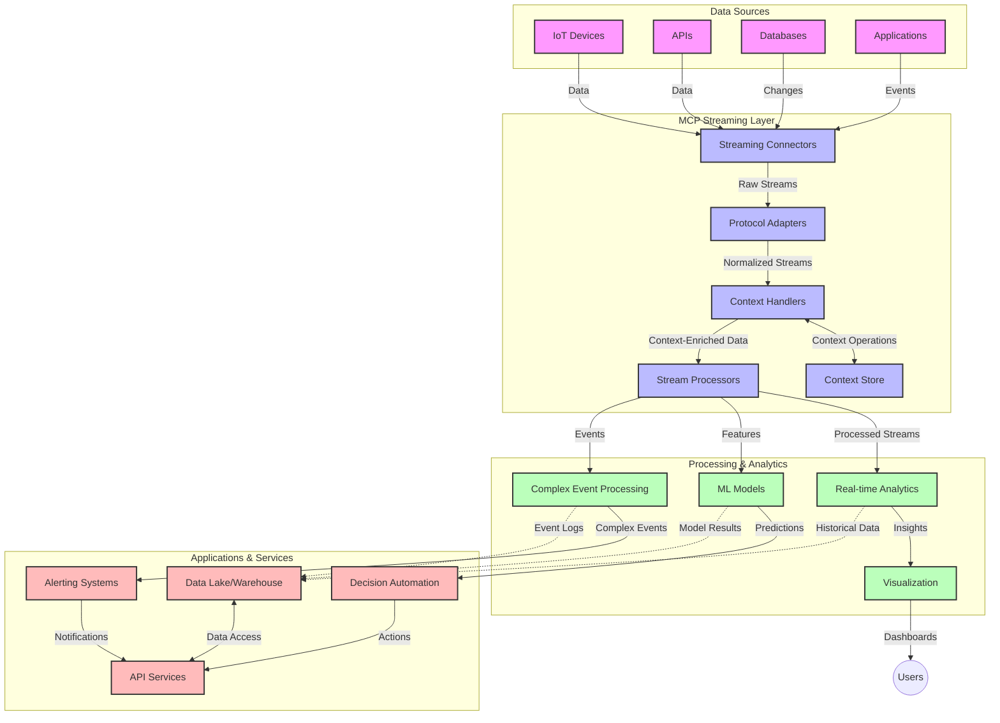

<!--
CO_OP_TRANSLATOR_METADATA:
{
  "original_hash": "68c518dbff8a3b127ed2aa934054c56c",
  "translation_date": "2025-06-11T17:12:02+00:00",
  "source_file": "05-AdvancedTopics/mcp-realtimestreaming/README.md",
  "language_code": "it"
}
-->
# Protocollo del Contesto Modello per lo Streaming Dati in Tempo Reale

## Panoramica

Lo streaming dati in tempo reale è diventato fondamentale nel mondo orientato ai dati di oggi, dove aziende e applicazioni richiedono accesso immediato alle informazioni per prendere decisioni tempestive. Il Model Context Protocol (MCP) rappresenta un importante passo avanti nell’ottimizzazione di questi processi di streaming in tempo reale, migliorando l’efficienza nell’elaborazione dei dati, mantenendo l’integrità contestuale e potenziando le prestazioni complessive del sistema.

Questo modulo esplora come MCP trasforma lo streaming dati in tempo reale offrendo un approccio standardizzato alla gestione del contesto tra modelli AI, piattaforme di streaming e applicazioni.

## Introduzione allo Streaming Dati in Tempo Reale

Lo streaming dati in tempo reale è un paradigma tecnologico che consente il trasferimento, l’elaborazione e l’analisi continua dei dati man mano che vengono generati, permettendo ai sistemi di reagire immediatamente alle nuove informazioni. A differenza del tradizionale batch processing che opera su dataset statici, lo streaming elabora i dati in movimento, fornendo insight e azioni con latenza minima.

### Concetti Fondamentali dello Streaming Dati in Tempo Reale:

- **Flusso Dati Continuo**: I dati vengono elaborati come un flusso continuo e infinito di eventi o record.
- **Elaborazione a Bassa Latenza**: I sistemi sono progettati per ridurre al minimo il tempo tra la generazione e l’elaborazione dei dati.
- **Scalabilità**: Le architetture di streaming devono gestire volumi e velocità di dati variabili.
- **Tolleranza ai Guasti**: I sistemi devono essere resilienti per garantire un flusso dati ininterrotto.
- **Elaborazione Stateful**: Mantenere il contesto tra eventi è cruciale per un’analisi significativa.

### Il Model Context Protocol e lo Streaming in Tempo Reale

Il Model Context Protocol (MCP) affronta diverse sfide critiche negli ambienti di streaming in tempo reale:

1. **Continuità Contestuale**: MCP standardizza come il contesto viene mantenuto tra componenti di streaming distribuiti, assicurando che modelli AI e nodi di elaborazione abbiano accesso al contesto storico e ambientale rilevante.

2. **Gestione Efficiente dello Stato**: Fornendo meccanismi strutturati per la trasmissione del contesto, MCP riduce il carico nella gestione dello stato nelle pipeline di streaming.

3. **Interoperabilità**: MCP crea un linguaggio comune per la condivisione del contesto tra tecnologie di streaming e modelli AI diversi, abilitando architetture più flessibili ed estensibili.

4. **Contesto Ottimizzato per lo Streaming**: Le implementazioni MCP possono dare priorità agli elementi di contesto più rilevanti per decisioni in tempo reale, ottimizzando sia le prestazioni che la precisione.

5. **Elaborazione Adattiva**: Grazie a una corretta gestione del contesto tramite MCP, i sistemi di streaming possono adattare dinamicamente l’elaborazione in base a condizioni e pattern dati in evoluzione.

In applicazioni moderne che vanno dalle reti di sensori IoT alle piattaforme di trading finanziario, l’integrazione di MCP con tecnologie di streaming permette un’elaborazione più intelligente e consapevole del contesto, capace di rispondere adeguatamente a situazioni complesse e in evoluzione in tempo reale.

## Obiettivi di Apprendimento

Al termine di questa lezione, sarai in grado di:

- Comprendere i fondamenti dello streaming dati in tempo reale e le sue sfide
- Spiegare come il Model Context Protocol (MCP) migliori lo streaming dati in tempo reale
- Implementare soluzioni di streaming basate su MCP usando framework popolari come Kafka e Pulsar
- Progettare e distribuire architetture di streaming tolleranti ai guasti e ad alte prestazioni con MCP
- Applicare i concetti MCP a casi d’uso IoT, trading finanziario e analisi guidata da AI
- Valutare le tendenze emergenti e le innovazioni future nelle tecnologie di streaming basate su MCP

### Definizione e Importanza

Lo streaming dati in tempo reale comporta la generazione, elaborazione e consegna continua di dati con latenza minima. A differenza del batch processing, dove i dati sono raccolti e processati in gruppi, i dati in streaming vengono elaborati progressivamente man mano che arrivano, consentendo insight e azioni immediate.

Caratteristiche chiave dello streaming dati in tempo reale includono:

- **Bassa Latenza**: Elaborazione e analisi dei dati in millisecondi o secondi
- **Flusso Continuo**: Stream ininterrotti di dati provenienti da varie fonti
- **Elaborazione Immediata**: Analisi dei dati all’arrivo invece che in batch
- **Architettura Event-Driven**: Risposta agli eventi non appena si verificano

### Sfide nello Streaming Dati Tradizionale

Gli approcci tradizionali allo streaming dati presentano diverse limitazioni:

1. **Perdita di Contesto**: Difficoltà nel mantenere il contesto tra sistemi distribuiti
2. **Problemi di Scalabilità**: Difficoltà a scalare per gestire dati ad alto volume e velocità
3. **Complessità di Integrazione**: Problemi di interoperabilità tra sistemi diversi
4. **Gestione della Latenza**: Bilanciare throughput e tempi di elaborazione
5. **Coerenza dei Dati**: Garantire accuratezza e completezza dei dati lungo lo stream

## Comprendere il Model Context Protocol (MCP)

### Cos’è MCP?

Il Model Context Protocol (MCP) è un protocollo di comunicazione standardizzato progettato per facilitare l’interazione efficiente tra modelli AI e applicazioni. Nel contesto dello streaming dati in tempo reale, MCP fornisce un framework per:

- Preservare il contesto lungo tutta la pipeline dati
- Standardizzare i formati di scambio dati
- Ottimizzare la trasmissione di dataset di grandi dimensioni
- Migliorare la comunicazione modello-modello e modello-applicazione

### Componenti Principali e Architettura

L’architettura MCP per lo streaming in tempo reale comprende diversi componenti chiave:

1. **Context Handlers**: Gestiscono e mantengono le informazioni contestuali lungo la pipeline di streaming
2. **Stream Processors**: Elaborano i flussi di dati in arrivo utilizzando tecniche consapevoli del contesto
3. **Protocol Adapters**: Convertono tra diversi protocolli di streaming preservando il contesto
4. **Context Store**: Memorizza e recupera in modo efficiente le informazioni contestuali
5. **Streaming Connectors**: Collegano varie piattaforme di streaming (Kafka, Pulsar, Kinesis, ecc.)



### Come MCP Migliora la Gestione dei Dati in Tempo Reale

MCP affronta le sfide tradizionali dello streaming attraverso:

- **Integrità Contestuale**: Mantenimento delle relazioni tra i dati lungo tutta la pipeline
- **Trasmissione Ottimizzata**: Riduzione della ridondanza nello scambio dati tramite una gestione intelligente del contesto
- **Interfacce Standardizzate**: Fornitura di API coerenti per i componenti di streaming
- **Riduzione della Latenza**: Minimizzazione del sovraccarico di elaborazione tramite una gestione efficiente del contesto
- **Scalabilità Migliorata**: Supporto alla scalabilità orizzontale preservando il contesto

## Integrazione e Implementazione

I sistemi di streaming dati in tempo reale richiedono una progettazione e implementazione architetturale attenta per mantenere sia le prestazioni che l’integrità contestuale. Il Model Context Protocol offre un approccio standardizzato per integrare modelli AI e tecnologie di streaming, permettendo pipeline di elaborazione più sofisticate e consapevoli del contesto.

### Panoramica sull’Integrazione MCP nelle Architetture di Streaming

L’implementazione di MCP negli ambienti di streaming in tempo reale richiede alcune considerazioni chiave:

1. **Serializzazione e Trasporto del Contesto**: MCP fornisce meccanismi efficienti per codificare le informazioni contestuali all’interno dei pacchetti dati di streaming, garantendo che il contesto essenziale accompagni i dati lungo tutta la pipeline di elaborazione. Questo include formati di serializzazione standardizzati e ottimizzati per il trasporto in streaming.

2. **Elaborazione Stateful dello Stream**: MCP consente un’elaborazione stateful più intelligente mantenendo una rappresentazione coerente del contesto tra i nodi di elaborazione. Questo è particolarmente utile nelle architetture di streaming distribuito dove la gestione dello stato è tradizionalmente complessa.

3. **Event-Time vs. Processing-Time**: Le implementazioni MCP nei sistemi di streaming devono affrontare la sfida comune di distinguere tra il momento in cui gli eventi si sono verificati e quello in cui vengono elaborati. Il protocollo può includere contesto temporale che preserva la semantica del tempo evento.

4. **Gestione del Backpressure**: Standardizzando la gestione del contesto, MCP aiuta a gestire il backpressure nei sistemi di streaming, permettendo ai componenti di comunicare le proprie capacità di elaborazione e regolare il flusso di conseguenza.

5. **Windowing e Aggregazione del Contesto**: MCP facilita operazioni di windowing più sofisticate fornendo rappresentazioni strutturate di contesti temporali e relazionali, abilitando aggregazioni più significative lungo i flussi di eventi.

6. **Elaborazione Exactly-Once**: Nei sistemi di streaming che richiedono semantiche exactly-once, MCP può integrare metadati di elaborazione per tracciare e verificare lo stato di elaborazione tra componenti distribuiti.

L’implementazione di MCP attraverso diverse tecnologie di streaming crea un approccio unificato alla gestione del contesto, riducendo la necessità di codice di integrazione personalizzato e migliorando la capacità del sistema di mantenere un contesto significativo mentre i dati scorrono nella pipeline.

### MCP nei Vari Framework di Streaming Dati

MCP può essere integrato con framework di streaming popolari tra cui:

#### Integrazione con Apache Kafka

```python
from mcp_streaming import MCPKafkaConnector

# Initialize MCP Kafka connector
connector = MCPKafkaConnector(
    bootstrap_servers='localhost:9092',
    context_preservation=True
)

# Create a context-aware consumer
consumer = connector.create_consumer('input-topic')

# Process streaming data with context
for message in consumer:
    context = message.get_context()
    data = message.get_value()
    
    # Process with context awareness
    result = process_with_context(data, context)
    
    # Produce output with preserved context
    connector.produce('output-topic', result, context=context)
```

#### Implementazione con Apache Pulsar

```python
from mcp_streaming import MCPPulsarClient

# Initialize MCP Pulsar client
client = MCPPulsarClient('pulsar://localhost:6650')

# Subscribe with context awareness
consumer = client.subscribe('input-topic', 'subscription-name', 
                           context_enabled=True)

# Process messages with context preservation
while True:
    message = consumer.receive()
    context = message.get_context()
    
    # Process with context
    result = process_with_context(message.data(), context)
    
    # Acknowledge the message
    consumer.acknowledge(message)
    
    # Send result with preserved context
    producer = client.create_producer('output-topic')
    producer.send(result, context=context)
```

### Best Practice per il Deployment

Quando si implementa MCP per lo streaming in tempo reale:

1. **Progettare per la Tolleranza ai Guasti**:
   - Implementare una corretta gestione degli errori
   - Utilizzare dead-letter queue per messaggi falliti
   - Progettare processori idempotenti

2. **Ottimizzare le Prestazioni**:
   - Configurare dimensioni buffer adeguate
   - Usare batching quando opportuno
   - Implementare meccanismi di backpressure

3. **Monitorare e Osservare**:
   - Tenere traccia delle metriche di elaborazione dello stream
   - Monitorare la propagazione del contesto
   - Configurare allarmi per anomalie

4. **Mettere in Sicurezza i Flussi**:
   - Implementare crittografia per dati sensibili
   - Usare autenticazione e autorizzazione
   - Applicare controlli di accesso appropriati

### MCP in IoT e Edge Computing

MCP potenzia lo streaming IoT:

- Preservando il contesto dei dispositivi lungo la pipeline di elaborazione
- Abilitando streaming dati efficienti da edge a cloud
- Supportando analisi in tempo reale sui flussi dati IoT
- Facilitando la comunicazione device-to-device con contesto

Esempio: Reti di Sensori per Smart City  
```
Sensors → Edge Gateways → MCP Stream Processors → Real-time Analytics → Automated Responses
```

### Ruolo nelle Transazioni Finanziarie e nel Trading ad Alta Frequenza

MCP offre vantaggi significativi per lo streaming di dati finanziari:

- Elaborazione a latenza ultra-bassa per decisioni di trading
- Mantenimento del contesto delle transazioni durante l’elaborazione
- Supporto a elaborazioni complesse di eventi con consapevolezza contestuale
- Garanzia di coerenza dei dati in sistemi di trading distribuiti

### Potenziamento dell’Analisi Dati Guidata da AI

MCP apre nuove possibilità per l’analisi in streaming:

- Addestramento e inferenza di modelli in tempo reale
- Apprendimento continuo dai dati in streaming
- Estrazione di feature contestuali
- Pipeline di inferenza multi-modello con contesto preservato

## Tendenze Future e Innovazioni

### Evoluzione di MCP negli Ambienti in Tempo Reale

Guardando al futuro, ci aspettiamo che MCP evolva per affrontare:

- **Integrazione con Quantum Computing**: Prepararsi a sistemi di streaming basati su quantum
- **Elaborazione Edge-Nativa**: Spostare più elaborazione consapevole del contesto verso dispositivi edge
- **Gestione Autonoma dello Streaming**: Pipeline di streaming auto-ottimizzanti
- **Streaming Federato**: Elaborazione distribuita preservando la privacy

### Potenziali Progressi Tecnologici

Tecnologie emergenti che influenzeranno il futuro dello streaming MCP:

1. **Protocolli di Streaming Ottimizzati per AI**: Protocolli personalizzati specifici per carichi di lavoro AI
2. **Integrazione con Neuromorphic Computing**: Calcolo ispirato al cervello per l’elaborazione di stream
3. **Streaming Serverless**: Streaming scalabile e basato su eventi senza gestione infrastrutturale
4. **Context Store Distribuiti**: Gestione del contesto globale, distribuita ma altamente coerente

## Esercizi Pratici

### Esercizio 1: Configurazione di una Pipeline di Streaming MCP di Base

In questo esercizio imparerai a:  
- Configurare un ambiente di streaming MCP di base  
- Implementare context handler per l’elaborazione dello stream  
- Testare e validare la preservazione del contesto

### Esercizio 2: Costruire una Dashboard di Analisi in Tempo Reale

Crea un’applicazione completa che:  
- Ingerisce dati in streaming usando MCP  
- Elabora lo stream mantenendo il contesto  
- Visualizza i risultati in tempo reale

### Esercizio 3: Implementare Elaborazione Complessa di Eventi con MCP

Esercizio avanzato che copre:  
- Rilevamento di pattern negli stream  
- Correlazione contestuale tra più stream  
- Generazione di eventi complessi con contesto preservato

## Risorse Aggiuntive

- [Model Context Protocol Specification](https://github.com/microsoft/model-context-protocol) - Specifica ufficiale e documentazione MCP  
- [Apache Kafka Documentation](https://kafka.apache.org/documentation/) - Informazioni su Kafka per l’elaborazione in streaming  
- [Apache Pulsar](https://pulsar.apache.org/) - Piattaforma unificata di messaggistica e streaming  
- [Streaming Systems: The What, Where, When, and How of Large-Scale Data Processing](https://www.oreilly.com/library/view/streaming-systems/9781491983867/) - Libro completo sulle architetture di streaming  
- [Microsoft Azure Event Hubs](https://learn.microsoft.com/en-us/azure/event-hubs/event-hubs-about) - Servizio gestito di streaming eventi  
- [MLflow Documentation](https://mlflow.org/docs/latest/index.html) - Per il tracciamento e il deployment di modelli ML  
- [Real-Time Analytics with Apache Storm](https://storm.apache.org/releases/current/index.html) - Framework di elaborazione per calcolo in tempo reale  
- [Flink ML](https://nightlies.apache.org/flink/flink-ml-docs-master/) - Libreria di machine learning per Apache Flink  
- [LangChain Documentation](https://python.langchain.com/docs/get_started/introduction) - Costruire applicazioni con LLM

## Risultati di Apprendimento

Completando questo modulo, sarai in grado di:

- Comprendere i fondamenti dello streaming dati in tempo reale e le sue sfide  
- Spiegare come il Model Context Protocol (MCP) migliori lo streaming dati in tempo reale  
- Implementare soluzioni di streaming basate su MCP usando framework popolari come Kafka e Pulsar  
- Progettare e distribuire architetture di streaming tolleranti ai guasti e ad alte prestazioni con MCP  
- Applicare i concetti MCP a casi d’uso IoT, trading finanziario e analisi guidata da AI  
- Valutare le tendenze emergenti e le innovazioni future nelle tecnologie di streaming basate su MCP

## Cosa Fare Dopo

- [6. Community Contributions](../../06-CommunityContributions/README.md)

**Disclaimer**:  
Questo documento è stato tradotto utilizzando il servizio di traduzione automatica AI [Co-op Translator](https://github.com/Azure/co-op-translator). Pur impegnandoci per garantire l’accuratezza, si prega di considerare che le traduzioni automatiche possono contenere errori o inesattezze. Il documento originale nella sua lingua nativa deve essere considerato la fonte autorevole. Per informazioni critiche, si raccomanda la traduzione professionale umana. Non siamo responsabili per eventuali incomprensioni o interpretazioni errate derivanti dall’uso di questa traduzione.