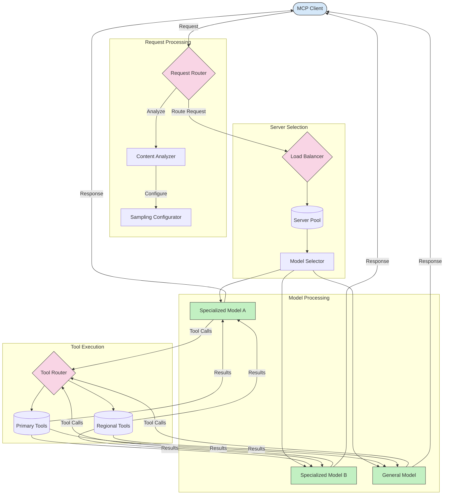

<!--
CO_OP_TRANSLATOR_METADATA:
{
  "original_hash": "a621fc52c7daec552eb8b3b48c0361dd",
  "translation_date": "2025-06-02T19:45:14+00:00",
  "source_file": "05-AdvancedTopics/mcp-routing/README.md",
  "language_code": "it"
}
-->
## Architettura di Campionamento e Routing in MCP

Il campionamento è una componente fondamentale del Model Context Protocol (MCP) che consente un'elaborazione efficiente delle richieste e il loro instradamento. Consiste nell'analizzare le richieste in arrivo per determinare il modello o servizio più appropriato per gestirle, basandosi su vari criteri come il tipo di contenuto, il contesto utente e il carico del sistema.

Campionamento e routing possono essere combinati per creare un'architettura robusta che ottimizza l'utilizzo delle risorse e garantisce alta disponibilità. Il processo di campionamento può essere usato per classificare le richieste, mentre il routing le indirizza ai modelli o servizi adeguati.

Il diagramma seguente illustra come campionamento e routing lavorino insieme in un'architettura MCP completa:

## Cosa c'è dopo

- [Campionamento](../mcp-sampling/README.md)

**Disclaimer**:  
Questo documento è stato tradotto utilizzando il servizio di traduzione automatica AI [Co-op Translator](https://github.com/Azure/co-op-translator). Pur impegnandoci per garantire accuratezza, si prega di notare che le traduzioni automatiche possono contenere errori o inesattezze. Il documento originale nella sua lingua nativa deve essere considerato la fonte autorevole. Per informazioni critiche, si raccomanda la traduzione professionale effettuata da un essere umano. Non ci assumiamo responsabilità per eventuali malintesi o interpretazioni errate derivanti dall’uso di questa traduzione.