<!--
CO_OP_TRANSLATOR_METADATA:
{
  "original_hash": "6e562d7e5a77c8982da4aa8f762ad1d8",
  "translation_date": "2025-07-02T09:22:25+00:00",
  "source_file": "05-AdvancedTopics/mcp-security-entra/README.md",
  "language_code": "it"
}
-->
# Proteggere i Workflow AI: Autenticazione Entra ID per i Server Model Context Protocol

## Introduzione
Proteggere il tuo server Model Context Protocol (MCP) è importante quanto chiudere a chiave la porta di casa. Lasciare il server MCP aperto espone i tuoi strumenti e dati ad accessi non autorizzati, con il rischio di violazioni della sicurezza. Microsoft Entra ID offre una soluzione solida di gestione delle identità e degli accessi basata sul cloud, assicurando che solo utenti e applicazioni autorizzati possano interagire con il tuo server MCP. In questa sezione imparerai come proteggere i tuoi workflow AI utilizzando l’autenticazione Entra ID.

## Obiettivi di Apprendimento
Al termine di questa sezione sarai in grado di:

- Comprendere l’importanza di mettere in sicurezza i server MCP.
- Spiegare i concetti base di Microsoft Entra ID e dell’autenticazione OAuth 2.0.
- Distinguere tra client pubblici e client riservati.
- Implementare l’autenticazione Entra ID sia in scenari locali (client pubblico) che remoti (client riservato) per server MCP.
- Applicare le migliori pratiche di sicurezza nello sviluppo di workflow AI.

## Sicurezza e MCP

Proprio come non lasceresti la porta di casa aperta, non dovresti permettere a chiunque di accedere al tuo server MCP. Proteggere i tuoi workflow AI è fondamentale per creare applicazioni robuste, affidabili e sicure. Questo capitolo ti introdurrà all’uso di Microsoft Entra ID per mettere in sicurezza i tuoi server MCP, garantendo che solo utenti e applicazioni autorizzati possano interagire con i tuoi strumenti e dati.

## Perché la Sicurezza è Importante per i Server MCP

Immagina che il tuo server MCP abbia uno strumento in grado di inviare email o accedere a un database clienti. Un server non protetto significherebbe che chiunque potrebbe usare quello strumento, con conseguente accesso non autorizzato ai dati, spam o altre attività dannose.

Implementando l’autenticazione, ti assicuri che ogni richiesta al server venga verificata, confermando l’identità dell’utente o dell’applicazione che effettua la richiesta. Questo è il primo e più importante passo per mettere in sicurezza i tuoi workflow AI.

## Introduzione a Microsoft Entra ID

[**Microsoft Entra ID**](https://adoption.microsoft.com/microsoft-security/entra/) è un servizio cloud per la gestione delle identità e degli accessi. Pensalo come una guardia di sicurezza universale per le tue applicazioni. Gestisce il processo complesso di verifica delle identità degli utenti (autenticazione) e di definizione di cosa possono fare (autorizzazione).

Usando Entra ID puoi:

- Abilitare l’accesso sicuro per gli utenti.
- Proteggere API e servizi.
- Gestire le politiche di accesso da un’unica posizione centrale.

Per i server MCP, Entra ID offre una soluzione solida e ampiamente riconosciuta per gestire chi può accedere alle funzionalità del server.

---

## Capire il Funzionamento: Come Funziona l’Autenticazione Entra ID

Entra ID utilizza standard aperti come **OAuth 2.0** per gestire l’autenticazione. Anche se i dettagli possono essere complessi, il concetto principale è semplice e si può comprendere con un’analogia.

### Una Introduzione Semplice a OAuth 2.0: La Chiave del Valet

Pensa a OAuth 2.0 come a un servizio di parcheggio con valet. Quando arrivi al ristorante, non dai al valet la chiave principale della macchina. Invece, consegni una **chiave valet** che ha permessi limitati: può avviare la macchina e chiudere le porte, ma non può aprire il bagagliaio o il vano portaoggetti.

In questa analogia:

- **Tu** sei l’**Utente**.
- **La tua macchina** è il **Server MCP** con i suoi strumenti e dati preziosi.
- Il **Valet** è **Microsoft Entra ID**.
- L’**Addetto al parcheggio** è il **Client MCP** (l’applicazione che tenta di accedere al server).
- La **Chiave Valet** è il **Token di Accesso**.

Il token di accesso è una stringa sicura di testo che il client MCP riceve da Entra ID dopo che ti sei autenticato. Il client presenta questo token al server MCP ad ogni richiesta. Il server verifica il token per assicurarsi che la richiesta sia legittima e che il client abbia i permessi necessari, senza mai dover gestire direttamente le tue credenziali (come la password).

### Il Flusso di Autenticazione

Ecco come funziona il processo nella pratica:

```mermaid
sequenceDiagram
    actor User as 👤 User
    participant Client as 🖥️ MCP Client
    participant Entra as 🔐 Microsoft Entra ID
    participant Server as 🔧 MCP Server

    Client->>+User: Please sign in to continue.
    User->>+Entra: Enters credentials (username/password).
    Entra-->>Client: Here is your access token.
    User-->>-Client: (Returns to the application)

    Client->>+Server: I need to use a tool. Here is my access token.
    Server->>+Entra: Is this access token valid?
    Entra-->>-Server: Yes, it is.
    Server-->>-Client: Token is valid. Here is the result of the tool.
```



### Presentazione della Microsoft Authentication Library (MSAL)

Prima di entrare nel codice, è importante introdurre un componente chiave che vedrai negli esempi: la **Microsoft Authentication Library (MSAL)**.

MSAL è una libreria sviluppata da Microsoft che semplifica molto il lavoro degli sviluppatori nella gestione dell’autenticazione. Invece di dover scrivere codice complesso per gestire i token di sicurezza, gli accessi e il rinnovo delle sessioni, MSAL si occupa di tutto questo.

Usare una libreria come MSAL è altamente consigliato perché:

- **È Sicura:** implementa protocolli standard di settore e le migliori pratiche di sicurezza, riducendo il rischio di vulnerabilità nel tuo codice.
- **Semplifica lo Sviluppo:** astrae la complessità dei protocolli OAuth 2.0 e OpenID Connect, permettendoti di aggiungere un’autenticazione robusta con poche righe di codice.
- **È Mantenuta:** Microsoft aggiorna attivamente MSAL per affrontare nuove minacce di sicurezza e cambiamenti nelle piattaforme.

MSAL supporta molti linguaggi e framework applicativi, tra cui .NET, JavaScript/TypeScript, Python, Java, Go e piattaforme mobili come iOS e Android. Questo significa che puoi usare gli stessi modelli di autenticazione coerenti su tutta la tua stack tecnologica.

Per saperne di più su MSAL, puoi consultare la documentazione ufficiale [MSAL overview documentation](https://learn.microsoft.com/entra/identity-platform/msal-overview).

---

## Mettere in Sicurezza il Tuo Server MCP con Entra ID: Guida Passo Passo

Ora vediamo come mettere in sicurezza un server MCP locale (che comunica tramite `stdio`) using Entra ID. This example uses a **public client**, which is suitable for applications running on a user's machine, like a desktop app or a local development server.

### Scenario 1: Securing a Local MCP Server (with a Public Client)

In this scenario, we'll look at an MCP server that runs locally, communicates over `stdio`, and uses Entra ID to authenticate the user before allowing access to its tools. The server will have a single tool that fetches the user's profile information from the Microsoft Graph API.

#### 1. Setting Up the Application in Entra ID

Before writing any code, you need to register your application in Microsoft Entra ID. This tells Entra ID about your application and grants it permission to use the authentication service.

1. Navigate to the **[Microsoft Entra portal](https://entra.microsoft.com/)**.
2. Go to **App registrations** and click **New registration**.
3. Give your application a name (e.g., "My Local MCP Server").
4. For **Supported account types**, select **Accounts in this organizational directory only**.
5. You can leave the **Redirect URI** blank for this example.
6. Click **Register**.

Once registered, take note of the **Application (client) ID** and **Directory (tenant) ID**. You'll need these in your code.

#### 2. The Code: A Breakdown

Let's look at the key parts of the code that handle authentication. The full code for this example is available in the [Entra ID - Local - WAM](https://github.com/Azure-Samples/mcp-auth-servers/tree/main/src/entra-id-local-wam) folder of the [mcp-auth-servers GitHub repository](https://github.com/Azure-Samples/mcp-auth-servers).

**`AuthenticationService.cs`**

This class is responsible for handling the interaction with Entra ID.

- **`CreateAsync`**: This method initializes the `PublicClientApplication` from the MSAL (Microsoft Authentication Library). It's configured with your application's `clientId` and `tenantId`.
- **`WithBroker`**: This enables the use of a broker (like the Windows Web Account Manager), which provides a more secure and seamless single sign-on experience.
- **`AcquireTokenAsync`**: Questo è il metodo principale. Prima tenta di ottenere un token in modo silenzioso (quindi l’utente non deve accedere di nuovo se ha già una sessione valida). Se non riesce, richiede all’utente di effettuare il login in modo interattivo.

```csharp
// Simplified for clarity
public static async Task<AuthenticationService> CreateAsync(ILogger<AuthenticationService> logger)
{
    var msalClient = PublicClientApplicationBuilder
        .Create(_clientId) // Your Application (client) ID
        .WithAuthority(AadAuthorityAudience.AzureAdMyOrg)
        .WithTenantId(_tenantId) // Your Directory (tenant) ID
        .WithBroker(new BrokerOptions(BrokerOptions.OperatingSystems.Windows))
        .Build();

    // ... cache registration ...

    return new AuthenticationService(logger, msalClient);
}

public async Task<string> AcquireTokenAsync()
{
    try
    {
        // Try silent authentication first
        var accounts = await _msalClient.GetAccountsAsync();
        var account = accounts.FirstOrDefault();

        AuthenticationResult? result = null;

        if (account != null)
        {
            result = await _msalClient.AcquireTokenSilent(_scopes, account).ExecuteAsync();
        }
        else
        {
            // If no account, or silent fails, go interactive
            result = await _msalClient.AcquireTokenInteractive(_scopes).ExecuteAsync();
        }

        return result.AccessToken;
    }
    catch (Exception ex)
    {
        _logger.LogError(ex, "An error occurred while acquiring the token.");
        throw; // Optionally rethrow the exception for higher-level handling
    }
}
```

**`Program.cs`**

This is where the MCP server is set up and the authentication service is integrated.

- **`AddSingleton<AuthenticationService>`**: This registers the `AuthenticationService` with the dependency injection container, so it can be used by other parts of the application (like our tool).
- **`GetUserDetailsFromGraph` tool**: This tool requires an instance of `AuthenticationService`. Before it does anything, it calls `authService.AcquireTokenAsync()` per ottenere un token di accesso valido. Se l’autenticazione ha successo, usa il token per chiamare Microsoft Graph API e recuperare i dettagli dell’utente.

```csharp
// Simplified for clarity
[McpServerTool(Name = "GetUserDetailsFromGraph")]
public static async Task<string> GetUserDetailsFromGraph(
    AuthenticationService authService)
{
    try
    {
        // This will trigger the authentication flow
        var accessToken = await authService.AcquireTokenAsync();

        // Use the token to create a GraphServiceClient
        var graphClient = new GraphServiceClient(
            new BaseBearerTokenAuthenticationProvider(new TokenProvider(authService)));

        var user = await graphClient.Me.GetAsync();

        return System.Text.Json.JsonSerializer.Serialize(user);
    }
    catch (Exception ex)
    {
        return $"Error: {ex.Message}";
    }
}
```

#### 3. Come Funziona Tutto Insieme

1. Quando il client MCP chiama lo strumento `GetUserDetailsFromGraph` tool, the tool first calls `AcquireTokenAsync`.
2. `AcquireTokenAsync` triggers the MSAL library to check for a valid token.
3. If no token is found, MSAL, through the broker, will prompt the user to sign in with their Entra ID account.
4. Once the user signs in, Entra ID issues an access token.
5. The tool receives the token and uses it to make a secure call to the Microsoft Graph API.
6. The user's details are returned to the MCP client.

This process ensures that only authenticated users can use the tool, effectively securing your local MCP server.

### Scenario 2: Securing a Remote MCP Server (with a Confidential Client)

When your MCP server is running on a remote machine (like a cloud server) and communicates over a protocol like HTTP Streaming, the security requirements are different. In this case, you should use a **confidential client** and the **Authorization Code Flow**. This is a more secure method because the application's secrets are never exposed to the browser.

This example uses a TypeScript-based MCP server that uses Express.js to handle HTTP requests.

#### 1. Setting Up the Application in Entra ID

The setup in Entra ID is similar to the public client, but with one key difference: you need to create a **client secret**.

1. Navigate to the **[Microsoft Entra portal](https://entra.microsoft.com/)**.
2. In your app registration, go to the **Certificates & secrets** tab.
3. Click **New client secret**, give it a description, and click **Add**.
4. **Important:** Copy the secret value immediately. You will not be able to see it again.
5. You also need to configure a **Redirect URI**. Go to the **Authentication** tab, click **Add a platform**, select **Web**, and enter the redirect URI for your application (e.g., `http://localhost:3001/auth/callback`).

> **⚠️ Important Security Note:** For production applications, Microsoft strongly recommends using **secretless authentication** methods such as **Managed Identity** or **Workload Identity Federation** instead of client secrets. Client secrets pose security risks as they can be exposed or compromised. Managed identities provide a more secure approach by eliminating the need to store credentials in your code or configuration.
>
> For more information about managed identities and how to implement them, see the [Managed identities for Azure resources overview](https://learn.microsoft.com/entra/identity/managed-identities-azure-resources/overview).

#### 2. The Code: A Breakdown

This example uses a session-based approach. When the user authenticates, the server stores the access token and refresh token in a session and gives the user a session token. This session token is then used for subsequent requests. The full code for this example is available in the [Entra ID - Confidential client](https://github.com/Azure-Samples/mcp-auth-servers/tree/main/src/entra-id-cca-session) folder of the [mcp-auth-servers GitHub repository](https://github.com/Azure-Samples/mcp-auth-servers).

**`Server.ts`**

This file sets up the Express server and the MCP transport layer.

- **`requireBearerAuth`**: This is middleware that protects the `/sse` and `/message` endpoints. It checks for a valid bearer token in the `Authorization` header of the request.
- **`EntraIdServerAuthProvider`**: This is a custom class that implements the `McpServerAuthorizationProvider` interface. It's responsible for handling the OAuth 2.0 flow.
- **`/auth/callback`**: Questo endpoint gestisce il reindirizzamento da Entra ID dopo che l’utente si è autenticato. Scambia il codice di autorizzazione con un token di accesso e un token di refresh.

```typescript
// Simplified for clarity
const app = express();
const { server } = createServer();
const provider = new EntraIdServerAuthProvider();

// Protect the SSE endpoint
app.get("/sse", requireBearerAuth({
  provider,
  requiredScopes: ["User.Read"]
}), async (req, res) => {
  // ... connect to the transport ...
});

// Protect the message endpoint
app.post("/message", requireBearerAuth({
  provider,
  requiredScopes: ["User.Read"]
}), async (req, res) => {
  // ... handle the message ...
});

// Handle the OAuth 2.0 callback
app.get("/auth/callback", (req, res) => {
  provider.handleCallback(req.query.code, req.query.state)
    .then(result => {
      // ... handle success or failure ...
    });
});
```

**`Tools.ts`**

This file defines the tools that the MCP server provides. The `getUserDetails` lo strumento è simile a quello dell’esempio precedente, ma ottiene il token di accesso dalla sessione.

```typescript
// Simplified for clarity
server.setRequestHandler(CallToolRequestSchema, async (request) => {
  const { name } = request.params;
  const context = request.params?.context as { token?: string } | undefined;
  const sessionToken = context?.token;

  if (name === ToolName.GET_USER_DETAILS) {
    if (!sessionToken) {
      throw new AuthenticationError("Authentication token is missing or invalid. Ensure the token is provided in the request context.");
    }

    // Get the Entra ID token from the session store
    const tokenData = tokenStore.getToken(sessionToken);
    const entraIdToken = tokenData.accessToken;

    const graphClient = Client.init({
      authProvider: (done) => {
        done(null, entraIdToken);
      }
    });

    const user = await graphClient.api('/me').get();

    // ... return user details ...
  }
});
```

**`auth/EntraIdServerAuthProvider.ts`**

This class handles the logic for:

- Redirecting the user to the Entra ID sign-in page.
- Exchanging the authorization code for an access token.
- Storing the tokens in the `tokenStore`.
- Refreshing the access token when it expires.

#### 3. How It All Works Together

1. When a user first tries to connect to the MCP server, the `requireBearerAuth` middleware will see that they don't have a valid session and will redirect them to the Entra ID sign-in page.
2. The user signs in with their Entra ID account.
3. Entra ID redirects the user back to the `/auth/callback` endpoint with an authorization code.
4. The server exchanges the code for an access token and a refresh token, stores them, and creates a session token which is sent to the client.
5. The client can now use this session token in the `Authorization` header for all future requests to the MCP server.
6. When the `getUserDetails` quando viene chiamato, usa il token di sessione per recuperare il token di accesso Entra ID e poi lo utilizza per chiamare Microsoft Graph API.

Questo flusso è più complesso rispetto a quello del client pubblico, ma è necessario per endpoint accessibili da internet. Poiché i server MCP remoti sono accessibili pubblicamente, necessitano di misure di sicurezza più robuste per proteggersi da accessi non autorizzati e potenziali attacchi.

## Migliori Pratiche di Sicurezza

- **Usa sempre HTTPS**: Cripta la comunicazione tra client e server per proteggere i token da intercettazioni.
- **Implementa il Controllo degli Accessi Basato sui Ruoli (RBAC)**: Non limitarti a verificare se un utente è autenticato, ma controlla cosa è autorizzato a fare. Puoi definire ruoli in Entra ID e verificarli nel server MCP.
- **Monitora e registra**: Tieni traccia di tutti gli eventi di autenticazione per rilevare e rispondere ad attività sospette.
- **Gestisci limitazioni di velocità e throttling**: Microsoft Graph e altre API applicano limiti per prevenire abusi. Implementa meccanismi di backoff esponenziale e retry nel server MCP per gestire elegantemente risposte HTTP 429 (Too Many Requests). Considera di memorizzare in cache i dati frequentemente richiesti per ridurre le chiamate API.
- **Conservazione sicura dei token**: Memorizza in modo sicuro i token di accesso e di refresh. Per applicazioni locali, usa i meccanismi di storage sicuro del sistema. Per applicazioni server, valuta l’uso di storage criptato o servizi di gestione chiavi sicuri come Azure Key Vault.
- **Gestione della scadenza dei token**: I token di accesso hanno una durata limitata. Implementa il rinnovo automatico dei token usando i token di refresh per garantire un’esperienza utente senza interruzioni e senza richiedere ri-autenticazione.
- **Valuta l’uso di Azure API Management**: Sebbene implementare la sicurezza direttamente nel server MCP offra un controllo granulare, API Gateway come Azure API Management possono gestire automaticamente molte di queste problematiche di sicurezza, inclusi autenticazione, autorizzazione, limitazione di velocità e monitoraggio. Offrono uno strato di sicurezza centralizzato tra i client e i server MCP. Per maggiori dettagli sull’uso di API Gateway con MCP, consulta il nostro [Azure API Management Your Auth Gateway For MCP Servers](https://techcommunity.microsoft.com/blog/integrationsonazureblog/azure-api-management-your-auth-gateway-for-mcp-servers/4402690).

## Punti Chiave

- Mettere in sicurezza il server MCP è fondamentale per proteggere dati e strumenti.
- Microsoft Entra ID offre una soluzione solida e scalabile per autenticazione e autorizzazione.
- Usa un **client pubblico** per applicazioni locali e un **client riservato** per server remoti.
- Il **Authorization Code Flow** è l’opzione più sicura per applicazioni web.

## Esercizio

1. Pensa a un server MCP che potresti costruire. Sarebbe un server locale o remoto?
2. In base alla tua risposta, useresti un client pubblico o riservato?
3. Quale permesso richiederebbe il tuo server MCP per eseguire azioni su Microsoft Graph?

## Esercizi Pratici

### Esercizio 1: Registrare un’Applicazione in Entra ID
Accedi al portale Microsoft Entra.  
Registra una nuova applicazione per il tuo server MCP.  
Annota l’ID dell’applicazione (client) e l’ID della directory (tenant).

### Esercizio 2: Mettere in Sicurezza un Server MCP Locale (Client Pubblico)
- Segui l’esempio di codice per integrare MSAL (Microsoft Authentication Library) per l’autenticazione utente.
- Testa il flusso di autenticazione chiamando lo strumento MCP che recupera i dettagli utente da Microsoft Graph.

### Esercizio 3: Mettere in Sicurezza un Server MCP Remoto (Client Riservato)
- Registra un client riservato in Entra ID e crea un client secret.
- Configura il server MCP Express.js per usare l’Authorization Code Flow.
- Testa gli endpoint protetti e verifica l’accesso basato su token.

### Esercizio 4: Applicare le Migliori Pratiche di Sicurezza
- Abilita HTTPS per il tuo server locale o remoto.
- Implementa il controllo degli accessi basato sui ruoli (RBAC) nella logica del server.
- Aggiungi la gestione della scadenza dei token e la conservazione sicura dei token.

## Risorse

1. **Documentazione Panoramica MSAL**  
   Scopri come Microsoft Authentication Library (MSAL) abilita l’acquisizione sicura di token su più piattaforme:  
   [MSAL Overview on Microsoft Learn](https://learn.microsoft.com/en-gb/entra/msal/overview)

2. **Repository GitHub Azure-Samples/mcp-auth-servers**  
   Implementazioni di riferimento di server MCP che mostrano i flussi di autenticazione:  
   [Azure-Samples/mcp-auth-servers on GitHub](https://github.com/Azure-Samples/mcp-auth-servers)

3. **Panoramica sulle Managed Identities per Azure Resources**  
   Scopri come eliminare i segreti usando identità gestite assegnate al sistema o all’utente:  
   [Managed Identities Overview on Microsoft Learn](https://learn.microsoft.com/en-us/entra/identity/managed-identities-azure-resources/)

4. **Azure API Management: Il tuo Gateway di Autenticazione per i Server MCP**  
   Approfondimento sull’uso di APIM come gateway OAuth2 sicuro per i server MCP:  
   [Azure API Management Your Auth Gateway For MCP Servers](https://techcommunity.microsoft.com/blog/integrationsonazureblog/azure-api-management-your-auth-gateway-for-mcp-servers/4402690)

5. **Riferimento Permessi Microsoft Graph**  
   Elenco completo di permessi delegati e applicativi per Microsoft Graph:  
   [Microsoft Graph Permissions Reference](https://learn.microsoft.com/zh-tw/graph/permissions-reference)

## Risultati di Apprendimento
Dopo aver completato questa sezione, sarai in grado di:

- Spiegare perché l’autenticazione è fondamentale per i server MCP e i workflow AI.
- Configurare e impostare l’autenticazione Entra ID per scenari di server MCP locali e remoti.
- Scegliere il tipo di client appropriato (pubblico o riservato) in base al deployment del server.
- Applicare pratiche di codifica sicura, inclusa la gestione dei token e l’autorizzazione basata sui ruoli.
- Proteggere con sicurezza il tuo server MCP e i suoi strumenti da accessi non autorizzati.

## Cosa Fare Dopo

- [5.13 Integrazione Model Context Protocol (MCP) con Azure AI Foundry](../mcp-foundry-agent-integration/README.md)

**Disclaimer**:  
Questo documento è stato tradotto utilizzando il servizio di traduzione automatica [Co-op Translator](https://github.com/Azure/co-op-translator). Pur impegnandoci per garantire accuratezza, si prega di notare che le traduzioni automatiche possono contenere errori o imprecisioni. Il documento originale nella sua lingua nativa deve essere considerato la fonte autorevole. Per informazioni critiche, si raccomanda una traduzione professionale effettuata da un umano. Non ci assumiamo alcuna responsabilità per eventuali incomprensioni o interpretazioni errate derivanti dall’uso di questa traduzione.