<!--
CO_OP_TRANSLATOR_METADATA:
{
  "original_hash": "6e562d7e5a77c8982da4aa8f762ad1d8",
  "translation_date": "2025-07-14T03:01:16+00:00",
  "source_file": "05-AdvancedTopics/mcp-security-entra/README.md",
  "language_code": "it"
}
-->
# Proteggere i Flussi di Lavoro AI: Autenticazione Entra ID per i Server Model Context Protocol

## Introduzione
Proteggere il tuo server Model Context Protocol (MCP) è importante quanto chiudere a chiave la porta di casa. Lasciare il server MCP aperto espone i tuoi strumenti e dati ad accessi non autorizzati, con il rischio di violazioni della sicurezza. Microsoft Entra ID offre una soluzione solida di gestione delle identità e degli accessi basata sul cloud, garantendo che solo utenti e applicazioni autorizzati possano interagire con il tuo server MCP. In questa sezione imparerai come proteggere i tuoi flussi di lavoro AI utilizzando l’autenticazione Entra ID.

## Obiettivi di Apprendimento
Al termine di questa sezione sarai in grado di:

- Comprendere l’importanza di proteggere i server MCP.
- Spiegare le basi di Microsoft Entra ID e dell’autenticazione OAuth 2.0.
- Riconoscere la differenza tra client pubblici e client riservati.
- Implementare l’autenticazione Entra ID sia in scenari locali (client pubblico) che remoti (client riservato) per server MCP.
- Applicare le migliori pratiche di sicurezza nello sviluppo di flussi di lavoro AI.

## Sicurezza e MCP

Proprio come non lasceresti la porta di casa aperta, non dovresti lasciare il tuo server MCP accessibile a chiunque. Proteggere i tuoi flussi di lavoro AI è fondamentale per costruire applicazioni robuste, affidabili e sicure. Questo capitolo ti introdurrà all’uso di Microsoft Entra ID per mettere in sicurezza i tuoi server MCP, assicurando che solo utenti e applicazioni autorizzati possano interagire con i tuoi strumenti e dati.

## Perché la Sicurezza è Importante per i Server MCP

Immagina che il tuo server MCP abbia uno strumento in grado di inviare email o accedere a un database clienti. Un server non protetto significherebbe che chiunque potrebbe usare quello strumento, con conseguenti accessi non autorizzati ai dati, spam o altre attività dannose.

Implementando l’autenticazione, ti assicuri che ogni richiesta al server venga verificata, confermando l’identità dell’utente o dell’applicazione che effettua la richiesta. Questo è il primo e più importante passo per mettere in sicurezza i tuoi flussi di lavoro AI.

## Introduzione a Microsoft Entra ID

[**Microsoft Entra ID**](https://adoption.microsoft.com/microsoft-security/entra/) è un servizio cloud per la gestione delle identità e degli accessi. Pensalo come una guardia di sicurezza universale per le tue applicazioni. Gestisce il complesso processo di verifica delle identità degli utenti (autenticazione) e di definizione di cosa possono fare (autorizzazione).

Usando Entra ID puoi:

- Abilitare l’accesso sicuro per gli utenti.
- Proteggere API e servizi.
- Gestire le politiche di accesso da un’unica posizione centrale.

Per i server MCP, Entra ID offre una soluzione solida e ampiamente affidabile per gestire chi può accedere alle funzionalità del tuo server.

---

## Capire la Magia: Come Funziona l’Autenticazione Entra ID

Entra ID utilizza standard aperti come **OAuth 2.0** per gestire l’autenticazione. Anche se i dettagli possono essere complessi, il concetto base è semplice e può essere spiegato con un’analogia.

### Una Introduzione Semplice a OAuth 2.0: La Chiave Valet

Pensa a OAuth 2.0 come a un servizio valet per la tua auto. Quando arrivi al ristorante, non dai al valet la chiave principale. Invece, fornisci una **chiave valet** con permessi limitati: può avviare l’auto e chiudere le porte, ma non può aprire il bagagliaio o il vano portaoggetti.

In questa analogia:

- **Tu** sei l’**Utente**.
- **La tua auto** è il **Server MCP** con i suoi strumenti e dati preziosi.
- Il **Valet** è **Microsoft Entra ID**.
- L’**Addetto al parcheggio** è il **Client MCP** (l’applicazione che cerca di accedere al server).
- La **Chiave Valet** è il **Token di Accesso**.

Il token di accesso è una stringa sicura che il client MCP riceve da Entra ID dopo il tuo accesso. Il client presenta questo token al server MCP ad ogni richiesta. Il server verifica il token per assicurarsi che la richiesta sia legittima e che il client abbia i permessi necessari, senza mai dover gestire direttamente le tue credenziali (come la password).

### Il Flusso di Autenticazione

Ecco come funziona il processo nella pratica:

```mermaid
sequenceDiagram
    actor User as 👤 User
    participant Client as 🖥️ MCP Client
    participant Entra as 🔐 Microsoft Entra ID
    participant Server as 🔧 MCP Server

    Client->>+User: Please sign in to continue.
    User->>+Entra: Enters credentials (username/password).
    Entra-->>Client: Here is your access token.
    User-->>-Client: (Returns to the application)

    Client->>+Server: I need to use a tool. Here is my access token.
    Server->>+Entra: Is this access token valid?
    Entra-->>-Server: Yes, it is.
    Server-->>-Client: Token is valid. Here is the result of the tool.
```



### Introduzione alla Microsoft Authentication Library (MSAL)

Prima di entrare nel codice, è importante presentare un componente chiave che vedrai negli esempi: la **Microsoft Authentication Library (MSAL)**.

MSAL è una libreria sviluppata da Microsoft che semplifica molto la gestione dell’autenticazione per gli sviluppatori. Invece di dover scrivere tutto il codice complesso per gestire i token di sicurezza, le sessioni di accesso e il loro rinnovo, MSAL si occupa di tutto questo.

Usare una libreria come MSAL è altamente consigliato perché:

- **È Sicura:** implementa protocolli standard del settore e le migliori pratiche di sicurezza, riducendo il rischio di vulnerabilità nel tuo codice.
- **Semplifica lo Sviluppo:** nasconde la complessità dei protocolli OAuth 2.0 e OpenID Connect, permettendoti di aggiungere un’autenticazione robusta con poche righe di codice.
- **È Mantenuta:** Microsoft aggiorna attivamente MSAL per affrontare nuove minacce di sicurezza e cambiamenti delle piattaforme.

MSAL supporta molti linguaggi e framework applicativi, tra cui .NET, JavaScript/TypeScript, Python, Java, Go e piattaforme mobili come iOS e Android. Questo significa che puoi usare gli stessi modelli di autenticazione coerenti in tutto il tuo stack tecnologico.

Per saperne di più su MSAL, puoi consultare la documentazione ufficiale [panoramica MSAL](https://learn.microsoft.com/entra/identity-platform/msal-overview).

---

## Proteggere il Tuo Server MCP con Entra ID: Guida Passo-Passo

Ora vediamo come mettere in sicurezza un server MCP locale (che comunica tramite `stdio`) usando Entra ID. Questo esempio utilizza un **client pubblico**, adatto ad applicazioni che girano sulla macchina dell’utente, come un’app desktop o un server di sviluppo locale.

### Scenario 1: Proteggere un Server MCP Locale (con Client Pubblico)

In questo scenario analizziamo un server MCP che gira localmente, comunica tramite `stdio` e usa Entra ID per autenticare l’utente prima di permettere l’accesso agli strumenti. Il server avrà uno strumento che recupera le informazioni del profilo utente da Microsoft Graph API.

#### 1. Configurare l’Applicazione in Entra ID

Prima di scrivere codice, devi registrare la tua applicazione in Microsoft Entra ID. Questo informa Entra ID della tua app e le concede il permesso di usare il servizio di autenticazione.

1. Vai al **[portale Microsoft Entra](https://entra.microsoft.com/)**.
2. Vai su **Registrazioni app** e clicca su **Nuova registrazione**.
3. Dai un nome all’applicazione (es. "My Local MCP Server").
4. Per **Tipi di account supportati**, seleziona **Account in questa directory organizzativa solamente**.
5. Puoi lasciare vuoto il campo **URI di reindirizzamento** per questo esempio.
6. Clicca su **Registra**.

Una volta registrata, annota l’**ID applicazione (client)** e l’**ID directory (tenant)**. Ti serviranno nel codice.

#### 2. Il Codice: Una Panoramica

Vediamo le parti chiave del codice che gestiscono l’autenticazione. Il codice completo di questo esempio è disponibile nella cartella [Entra ID - Local - WAM](https://github.com/Azure-Samples/mcp-auth-servers/tree/main/src/entra-id-local-wam) del [repository GitHub mcp-auth-servers](https://github.com/Azure-Samples/mcp-auth-servers).

**`AuthenticationService.cs`**

Questa classe gestisce l’interazione con Entra ID.

- **`CreateAsync`**: inizializza il `PublicClientApplication` della libreria MSAL, configurato con il `clientId` e il `tenantId` della tua applicazione.
- **`WithBroker`**: abilita l’uso di un broker (come il Windows Web Account Manager), che offre un’esperienza di single sign-on più sicura e fluida.
- **`AcquireTokenAsync`**: metodo principale. Tenta prima di ottenere un token in modo silenzioso (l’utente non deve accedere di nuovo se ha già una sessione valida). Se non riesce, richiede all’utente di effettuare l’accesso in modo interattivo.

```csharp
// Simplified for clarity
public static async Task<AuthenticationService> CreateAsync(ILogger<AuthenticationService> logger)
{
    var msalClient = PublicClientApplicationBuilder
        .Create(_clientId) // Your Application (client) ID
        .WithAuthority(AadAuthorityAudience.AzureAdMyOrg)
        .WithTenantId(_tenantId) // Your Directory (tenant) ID
        .WithBroker(new BrokerOptions(BrokerOptions.OperatingSystems.Windows))
        .Build();

    // ... cache registration ...

    return new AuthenticationService(logger, msalClient);
}

public async Task<string> AcquireTokenAsync()
{
    try
    {
        // Try silent authentication first
        var accounts = await _msalClient.GetAccountsAsync();
        var account = accounts.FirstOrDefault();

        AuthenticationResult? result = null;

        if (account != null)
        {
            result = await _msalClient.AcquireTokenSilent(_scopes, account).ExecuteAsync();
        }
        else
        {
            // If no account, or silent fails, go interactive
            result = await _msalClient.AcquireTokenInteractive(_scopes).ExecuteAsync();
        }

        return result.AccessToken;
    }
    catch (Exception ex)
    {
        _logger.LogError(ex, "An error occurred while acquiring the token.");
        throw; // Optionally rethrow the exception for higher-level handling
    }
}
```

**`Program.cs`**

Qui viene configurato il server MCP e integrato il servizio di autenticazione.

- **`AddSingleton<AuthenticationService>`**: registra `AuthenticationService` nel contenitore di dependency injection, così può essere usato da altre parti dell’applicazione (come lo strumento).
- **Strumento `GetUserDetailsFromGraph`**: richiede un’istanza di `AuthenticationService`. Prima di fare qualsiasi cosa, chiama `authService.AcquireTokenAsync()` per ottenere un token di accesso valido. Se l’autenticazione ha successo, usa il token per chiamare Microsoft Graph API e recuperare i dettagli dell’utente.

```csharp
// Simplified for clarity
[McpServerTool(Name = "GetUserDetailsFromGraph")]
public static async Task<string> GetUserDetailsFromGraph(
    AuthenticationService authService)
{
    try
    {
        // This will trigger the authentication flow
        var accessToken = await authService.AcquireTokenAsync();

        // Use the token to create a GraphServiceClient
        var graphClient = new GraphServiceClient(
            new BaseBearerTokenAuthenticationProvider(new TokenProvider(authService)));

        var user = await graphClient.Me.GetAsync();

        return System.Text.Json.JsonSerializer.Serialize(user);
    }
    catch (Exception ex)
    {
        return $"Error: {ex.Message}";
    }
}
```

#### 3. Come Funziona il Processo

1. Quando il client MCP tenta di usare lo strumento `GetUserDetailsFromGraph`, lo strumento chiama prima `AcquireTokenAsync`.
2. `AcquireTokenAsync` fa sì che la libreria MSAL cerchi un token valido.
3. Se non trova un token, MSAL, tramite il broker, chiede all’utente di accedere con il proprio account Entra ID.
4. Una volta effettuato l’accesso, Entra ID emette un token di accesso.
5. Lo strumento riceve il token e lo usa per fare una chiamata sicura a Microsoft Graph API.
6. I dettagli dell’utente vengono restituiti al client MCP.

Questo processo garantisce che solo utenti autenticati possano usare lo strumento, proteggendo efficacemente il tuo server MCP locale.

### Scenario 2: Proteggere un Server MCP Remoto (con Client Riservato)

Quando il tuo server MCP gira su una macchina remota (ad esempio un server cloud) e comunica tramite un protocollo come HTTP Streaming, i requisiti di sicurezza cambiano. In questo caso devi usare un **client riservato** e il **flusso di autorizzazione con codice** (Authorization Code Flow). Questo metodo è più sicuro perché i segreti dell’applicazione non vengono mai esposti al browser.

Questo esempio usa un server MCP basato su TypeScript che utilizza Express.js per gestire le richieste HTTP.

#### 1. Configurare l’Applicazione in Entra ID

La configurazione in Entra ID è simile a quella del client pubblico, ma con una differenza chiave: devi creare un **segreto client**.

1. Vai al **[portale Microsoft Entra](https://entra.microsoft.com/)**.
2. Nella registrazione della tua app, vai alla scheda **Certificati e segreti**.
3. Clicca su **Nuovo segreto client**, inserisci una descrizione e clicca su **Aggiungi**.
4. **Importante:** copia subito il valore del segreto. Non potrai più vederlo.
5. Devi anche configurare un **URI di reindirizzamento**. Vai alla scheda **Autenticazione**, clicca su **Aggiungi una piattaforma**, seleziona **Web** e inserisci l’URI di reindirizzamento per la tua applicazione (es. `http://localhost:3001/auth/callback`).

> **⚠️ Nota Importante sulla Sicurezza:** Per applicazioni in produzione, Microsoft raccomanda fortemente di usare metodi di autenticazione senza segreti come **Managed Identity** o **Workload Identity Federation** invece dei segreti client. I segreti client rappresentano un rischio di sicurezza perché possono essere esposti o compromessi. Le identità gestite offrono un approccio più sicuro eliminando la necessità di memorizzare credenziali nel codice o nella configurazione.
>
> Per maggiori informazioni sulle identità gestite e su come implementarle, consulta la [panoramica sulle identità gestite per le risorse Azure](https://learn.microsoft.com/entra/identity/managed-identities-azure-resources/overview).

#### 2. Il Codice: Una Panoramica

Questo esempio usa un approccio basato su sessione. Quando l’utente si autentica, il server memorizza il token di accesso e il token di refresh nella sessione e fornisce all’utente un token di sessione. Questo token viene poi usato per le richieste successive. Il codice completo è disponibile nella cartella [Entra ID - Confidential client](https://github.com/Azure-Samples/mcp-auth-servers/tree/main/src/entra-id-cca-session) del [repository GitHub mcp-auth-servers](https://github.com/Azure-Samples/mcp-auth-servers).

**`Server.ts`**

Questo file configura il server Express e il livello di trasporto MCP.

- **`requireBearerAuth`**: middleware che protegge gli endpoint `/sse` e `/message`. Controlla la presenza di un token bearer valido nell’header `Authorization` della richiesta.
- **`EntraIdServerAuthProvider`**: classe personalizzata che implementa l’interfaccia `McpServerAuthorizationProvider`. Gestisce il flusso OAuth 2.0.
- **`/auth/callback`**: endpoint che gestisce il reindirizzamento da Entra ID dopo che l’utente si è autenticato. Scambia il codice di autorizzazione con un token di accesso e un token di refresh.

```typescript
// Simplified for clarity
const app = express();
const { server } = createServer();
const provider = new EntraIdServerAuthProvider();

// Protect the SSE endpoint
app.get("/sse", requireBearerAuth({
  provider,
  requiredScopes: ["User.Read"]
}), async (req, res) => {
  // ... connect to the transport ...
});

// Protect the message endpoint
app.post("/message", requireBearerAuth({
  provider,
  requiredScopes: ["User.Read"]
}), async (req, res) => {
  // ... handle the message ...
});

// Handle the OAuth 2.0 callback
app.get("/auth/callback", (req, res) => {
  provider.handleCallback(req.query.code, req.query.state)
    .then(result => {
      // ... handle success or failure ...
    });
});
```

**`Tools.ts`**

Definisce gli strumenti forniti dal server MCP. Lo strumento `getUserDetails` è simile a quello dell’esempio precedente, ma ottiene il token di accesso dalla sessione.

```typescript
// Simplified for clarity
server.setRequestHandler(CallToolRequestSchema, async (request) => {
  const { name } = request.params;
  const context = request.params?.context as { token?: string } | undefined;
  const sessionToken = context?.token;

  if (name === ToolName.GET_USER_DETAILS) {
    if (!sessionToken) {
      throw new AuthenticationError("Authentication token is missing or invalid. Ensure the token is provided in the request context.");
    }

    // Get the Entra ID token from the session store
    const tokenData = tokenStore.getToken(sessionToken);
    const entraIdToken = tokenData.accessToken;

    const graphClient = Client.init({
      authProvider: (done) => {
        done(null, entraIdToken);
      }
    });

    const user = await graphClient.api('/me').get();

    // ... return user details ...
  }
});
```

**`auth/EntraIdServerAuthProvider.ts`**

Questa classe gestisce la logica per:

- Reindirizzare l’utente alla pagina di accesso Entra ID.
- Scambiare il codice di autorizzazione con un token di accesso.
- Memorizzare i token nel `tokenStore`.
- Rinnovare il token di accesso quando scade.

#### 3. Come Funziona il Processo

1. Quando un utente tenta di connettersi al server MCP, il middleware `requireBearerAuth` verifica che non abbia una sessione valida e lo reindirizza alla pagina di accesso Entra ID.
2. L’utente effettua l’accesso con il proprio account Entra ID.
3. Entra ID reindirizza l’utente all’endpoint `/auth/callback` con un codice di autorizzazione.
4. Il server scambia il codice con un token di accesso e un token di refresh, li memorizza e crea un token di sessione che viene inviato al client.  
5. Il client può ora utilizzare questo token di sessione nell’intestazione `Authorization` per tutte le richieste future al server MCP.  
6. Quando viene chiamato lo strumento `getUserDetails`, utilizza il token di sessione per recuperare il token di accesso Entra ID e poi lo usa per chiamare l’API Microsoft Graph.

Questo flusso è più complesso rispetto a quello del client pubblico, ma è necessario per gli endpoint esposti su internet. Poiché i server MCP remoti sono accessibili tramite internet pubblico, richiedono misure di sicurezza più robuste per proteggersi da accessi non autorizzati e potenziali attacchi.


## Security Best Practices

- **Usa sempre HTTPS**: Cripta la comunicazione tra client e server per proteggere i token da intercettazioni.  
- **Implementa il Controllo degli Accessi Basato sui Ruoli (RBAC)**: Non limitarti a verificare *se* un utente è autenticato; controlla *cosa* è autorizzato a fare. Puoi definire i ruoli in Entra ID e verificarli nel tuo server MCP.  
- **Monitora e audita**: Registra tutti gli eventi di autenticazione per poter rilevare e rispondere ad attività sospette.  
- **Gestisci il rate limiting e il throttling**: Microsoft Graph e altre API applicano limiti di chiamata per prevenire abusi. Implementa nel tuo server MCP una logica di backoff esponenziale e retry per gestire con eleganza le risposte HTTP 429 (Too Many Requests). Considera di memorizzare nella cache i dati più richiesti per ridurre le chiamate API.  
- **Conservazione sicura dei token**: Memorizza in modo sicuro i token di accesso e di refresh. Per applicazioni locali, usa i meccanismi di archiviazione sicura del sistema. Per applicazioni server, valuta l’uso di archiviazione crittografata o servizi di gestione chiavi sicuri come Azure Key Vault.  
- **Gestione della scadenza dei token**: I token di accesso hanno una durata limitata. Implementa il rinnovo automatico dei token usando i token di refresh per garantire un’esperienza utente fluida senza richiedere una nuova autenticazione.  
- **Considera l’uso di Azure API Management**: Sebbene implementare la sicurezza direttamente nel server MCP offra un controllo dettagliato, API Gateway come Azure API Management possono gestire automaticamente molte di queste problematiche di sicurezza, inclusi autenticazione, autorizzazione, rate limiting e monitoraggio. Forniscono uno strato di sicurezza centralizzato tra i client e i server MCP. Per maggiori dettagli sull’uso degli API Gateway con MCP, consulta il nostro [Azure API Management Your Auth Gateway For MCP Servers](https://techcommunity.microsoft.com/blog/integrationsonazureblog/azure-api-management-your-auth-gateway-for-mcp-servers/4402690).


## Key Takeaways

- Proteggere il server MCP è fondamentale per salvaguardare dati e strumenti.  
- Microsoft Entra ID offre una soluzione robusta e scalabile per autenticazione e autorizzazione.  
- Usa un **public client** per applicazioni locali e un **confidential client** per server remoti.  
- Il **Authorization Code Flow** è l’opzione più sicura per applicazioni web.


## Exercise

1. Rifletti su un server MCP che potresti sviluppare. Sarebbe un server locale o remoto?  
2. In base alla tua risposta, useresti un client pubblico o confidenziale?  
3. Quali permessi richiederebbe il tuo server MCP per eseguire azioni su Microsoft Graph?


## Hands-on Exercises

### Exercise 1: Register an Application in Entra ID  
Accedi al portale Microsoft Entra.  
Registra una nuova applicazione per il tuo server MCP.  
Annota l’Application (client) ID e il Directory (tenant) ID.

### Exercise 2: Secure a Local MCP Server (Public Client)  
- Segui l’esempio di codice per integrare MSAL (Microsoft Authentication Library) per l’autenticazione utente.  
- Testa il flusso di autenticazione chiamando lo strumento MCP che recupera i dettagli utente da Microsoft Graph.

### Exercise 3: Secure a Remote MCP Server (Confidential Client)  
- Registra un client confidenziale in Entra ID e crea un client secret.  
- Configura il tuo server MCP Express.js per usare l’Authorization Code Flow.  
- Testa gli endpoint protetti e verifica l’accesso basato su token.

### Exercise 4: Apply Security Best Practices  
- Abilita HTTPS per il tuo server locale o remoto.  
- Implementa il controllo degli accessi basato sui ruoli (RBAC) nella logica del server.  
- Aggiungi la gestione della scadenza dei token e la conservazione sicura dei token.

## Resources

1. **MSAL Overview Documentation**  
   Scopri come Microsoft Authentication Library (MSAL) consente l’acquisizione sicura dei token su più piattaforme:  
   [MSAL Overview on Microsoft Learn](https://learn.microsoft.com/en-gb/entra/msal/overview)

2. **Azure-Samples/mcp-auth-servers GitHub Repository**  
   Implementazioni di riferimento di server MCP che mostrano i flussi di autenticazione:  
   [Azure-Samples/mcp-auth-servers on GitHub](https://github.com/Azure-Samples/mcp-auth-servers)

3. **Managed Identities for Azure Resources Overview**  
   Scopri come eliminare i segreti usando identità gestite assegnate al sistema o all’utente:  
   [Managed Identities Overview on Microsoft Learn](https://learn.microsoft.com/en-us/entra/identity/managed-identities-azure-resources/)

4. **Azure API Management: Your Auth Gateway for MCP Servers**  
   Approfondimento sull’uso di APIM come gateway OAuth2 sicuro per server MCP:  
   [Azure API Management Your Auth Gateway For MCP Servers](https://techcommunity.microsoft.com/blog/integrationsonazureblog/azure-api-management-your-auth-gateway-for-mcp-servers/4402690)

5. **Microsoft Graph Permissions Reference**  
   Elenco completo di permessi delegati e applicativi per Microsoft Graph:  
   [Microsoft Graph Permissions Reference](https://learn.microsoft.com/zh-tw/graph/permissions-reference)


## Learning Outcomes  
Al termine di questa sezione, sarai in grado di:

- Spiegare perché l’autenticazione è fondamentale per i server MCP e i workflow AI.  
- Configurare e impostare l’autenticazione Entra ID per scenari di server MCP locali e remoti.  
- Scegliere il tipo di client appropriato (pubblico o confidenziale) in base al deployment del server.  
- Applicare pratiche di programmazione sicura, inclusa la conservazione dei token e l’autorizzazione basata sui ruoli.  
- Proteggere con sicurezza il tuo server MCP e i suoi strumenti da accessi non autorizzati.

## What's next 

- [5.13 Model Context Protocol (MCP) Integration with Azure AI Foundry](../mcp-foundry-agent-integration/README.md)

**Disclaimer**:  
Questo documento è stato tradotto utilizzando il servizio di traduzione automatica [Co-op Translator](https://github.com/Azure/co-op-translator). Pur impegnandoci per garantire accuratezza, si prega di notare che le traduzioni automatiche possono contenere errori o imprecisioni. Il documento originale nella sua lingua nativa deve essere considerato la fonte autorevole. Per informazioni critiche, si raccomanda una traduzione professionale effettuata da un umano. Non siamo responsabili per eventuali malintesi o interpretazioni errate derivanti dall’uso di questa traduzione.