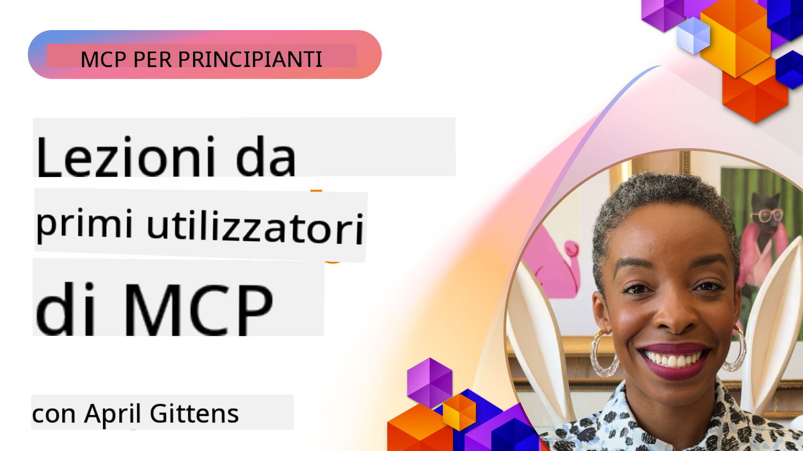

<!--
CO_OP_TRANSLATOR_METADATA:
{
  "original_hash": "41f16dac486d2086a53bc644a01cbe42",
  "translation_date": "2025-08-18T17:23:49+00:00",
  "source_file": "07-LessonsfromEarlyAdoption/README.md",
  "language_code": "it"
}
-->
# 🌟 Lezioni dai Primi Adottanti

[](https://youtu.be/jds7dSmNptE)

_(Clicca sull'immagine sopra per guardare il video di questa lezione)_

## 🎯 Cosa Copre Questo Modulo

Questo modulo esplora come organizzazioni e sviluppatori reali stanno utilizzando il Model Context Protocol (MCP) per affrontare sfide concrete e promuovere l'innovazione. Attraverso casi studio dettagliati ed esempi pratici, scoprirai come MCP consente un'integrazione AI sicura e scalabile che collega modelli linguistici, strumenti e dati aziendali.

### 📚 Vedi MCP in Azione

Vuoi vedere questi principi applicati a strumenti pronti per la produzione? Dai un'occhiata alla nostra guida [**10 Microsoft MCP Servers che Stanno Trasformando la Produttività degli Sviluppatori**](microsoft-mcp-servers.md), che presenta server MCP reali di Microsoft che puoi utilizzare oggi.

## Panoramica

Questa lezione esplora come i primi adottanti hanno sfruttato il Model Context Protocol (MCP) per risolvere sfide reali e promuovere l'innovazione in diversi settori. Attraverso casi studio dettagliati e progetti pratici, vedrai come MCP consente un'integrazione AI standardizzata, sicura e scalabile, collegando modelli linguistici di grandi dimensioni, strumenti e dati aziendali in un framework unificato. Acquisirai esperienza pratica nella progettazione e costruzione di soluzioni basate su MCP, imparerai da modelli di implementazione comprovati e scoprirai le migliori pratiche per distribuire MCP in ambienti di produzione. La lezione evidenzia anche tendenze emergenti, direzioni future e risorse open-source per aiutarti a rimanere all'avanguardia nella tecnologia MCP e nel suo ecosistema in evoluzione.

## Obiettivi di Apprendimento

- Analizzare implementazioni MCP reali in diversi settori
- Progettare e costruire applicazioni complete basate su MCP
- Esplorare tendenze emergenti e direzioni future nella tecnologia MCP
- Applicare le migliori pratiche in scenari di sviluppo reali

## Implementazioni MCP Reali

### Caso Studio 1: Automazione del Supporto Clienti Aziendale

Una multinazionale ha implementato una soluzione basata su MCP per standardizzare le interazioni AI nei loro sistemi di supporto clienti. Questo ha permesso loro di:

- Creare un'interfaccia unificata per più fornitori di LLM
- Mantenere una gestione coerente dei prompt tra i dipartimenti
- Implementare controlli di sicurezza e conformità robusti
- Passare facilmente tra diversi modelli AI in base alle esigenze specifiche

**Implementazione Tecnica:**

```python
# Python MCP server implementation for customer support
import logging
import asyncio
from modelcontextprotocol import create_server, ServerConfig
from modelcontextprotocol.server import MCPServer
from modelcontextprotocol.transports import create_http_transport
from modelcontextprotocol.resources import ResourceDefinition
from modelcontextprotocol.prompts import PromptDefinition
from modelcontextprotocol.tool import ToolDefinition

# Configure logging
logging.basicConfig(level=logging.INFO)

async def main():
    # Create server configuration
    config = ServerConfig(
        name="Enterprise Customer Support Server",
        version="1.0.0",
        description="MCP server for handling customer support inquiries"
    )
    
    # Initialize MCP server
    server = create_server(config)
    
    # Register knowledge base resources
    server.resources.register(
        ResourceDefinition(
            name="customer_kb",
            description="Customer knowledge base documentation"
        ),
        lambda params: get_customer_documentation(params)
    )
    
    # Register prompt templates
    server.prompts.register(
        PromptDefinition(
            name="support_template",
            description="Templates for customer support responses"
        ),
        lambda params: get_support_templates(params)
    )
    
    # Register support tools
    server.tools.register(
        ToolDefinition(
            name="ticketing",
            description="Create and update support tickets"
        ),
        handle_ticketing_operations
    )
    
    # Start server with HTTP transport
    transport = create_http_transport(port=8080)
    await server.run(transport)

if __name__ == "__main__":
    asyncio.run(main())
```

**Risultati:** Riduzione del 30% dei costi dei modelli, miglioramento del 45% nella coerenza delle risposte e maggiore conformità nelle operazioni globali.

### Caso Studio 2: Assistente Diagnostico Sanitario

Un fornitore sanitario ha sviluppato un'infrastruttura MCP per integrare più modelli AI medici specializzati garantendo al contempo la protezione dei dati sensibili dei pazienti:

- Passaggio fluido tra modelli medici generalisti e specialistici
- Controlli di privacy rigorosi e tracciabilità
- Integrazione con i sistemi di cartelle cliniche elettroniche (EHR) esistenti
- Ingegneria dei prompt coerente per la terminologia medica

**Implementazione Tecnica:**

```csharp
// C# MCP host application implementation in healthcare application
using Microsoft.Extensions.DependencyInjection;
using ModelContextProtocol.SDK.Client;
using ModelContextProtocol.SDK.Security;
using ModelContextProtocol.SDK.Resources;

public class DiagnosticAssistant
{
    private readonly MCPHostClient _mcpClient;
    private readonly PatientContext _patientContext;
    
    public DiagnosticAssistant(PatientContext patientContext)
    {
        _patientContext = patientContext;
        
        // Configure MCP client with healthcare-specific settings
        var clientOptions = new ClientOptions
        {
            Name = "Healthcare Diagnostic Assistant",
            Version = "1.0.0",
            Security = new SecurityOptions
            {
                Encryption = EncryptionLevel.Medical,
                AuditEnabled = true
            }
        };
        
        _mcpClient = new MCPHostClientBuilder()
            .WithOptions(clientOptions)
            .WithTransport(new HttpTransport("https://healthcare-mcp.example.org"))
            .WithAuthentication(new HIPAACompliantAuthProvider())
            .Build();
    }
    
    public async Task<DiagnosticSuggestion> GetDiagnosticAssistance(
        string symptoms, string patientHistory)
    {
        // Create request with appropriate resources and tool access
        var resourceRequest = new ResourceRequest
        {
            Name = "patient_records",
            Parameters = new Dictionary<string, object>
            {
                ["patientId"] = _patientContext.PatientId,
                ["requestingProvider"] = _patientContext.ProviderId
            }
        };
        
        // Request diagnostic assistance using appropriate prompt
        var response = await _mcpClient.SendPromptRequestAsync(
            promptName: "diagnostic_assistance",
            parameters: new Dictionary<string, object>
            {
                ["symptoms"] = symptoms,
                patientHistory = patientHistory,
                relevantGuidelines = _patientContext.GetRelevantGuidelines()
            });
            
        return DiagnosticSuggestion.FromMCPResponse(response);
    }
}
```

**Risultati:** Miglioramento dei suggerimenti diagnostici per i medici mantenendo la piena conformità HIPAA e significativa riduzione del passaggio tra sistemi.

### Caso Studio 3: Analisi del Rischio nei Servizi Finanziari

Un'istituzione finanziaria ha implementato MCP per standardizzare i processi di analisi del rischio tra i diversi dipartimenti:

- Creazione di un'interfaccia unificata per modelli di rischio di credito, rilevamento frodi e rischio di investimento
- Implementazione di controlli di accesso rigorosi e versionamento dei modelli
- Garanzia di auditabilità di tutte le raccomandazioni AI
- Mantenimento di una formattazione dati coerente tra sistemi diversi

**Implementazione Tecnica:**

```java
// Java MCP server for financial risk assessment
import org.mcp.server.*;
import org.mcp.security.*;

public class FinancialRiskMCPServer {
    public static void main(String[] args) {
        // Create MCP server with financial compliance features
        MCPServer server = new MCPServerBuilder()
            .withModelProviders(
                new ModelProvider("risk-assessment-primary", new AzureOpenAIProvider()),
                new ModelProvider("risk-assessment-audit", new LocalLlamaProvider())
            )
            .withPromptTemplateDirectory("./compliance/templates")
            .withAccessControls(new SOCCompliantAccessControl())
            .withDataEncryption(EncryptionStandard.FINANCIAL_GRADE)
            .withVersionControl(true)
            .withAuditLogging(new DatabaseAuditLogger())
            .build();
            
        server.addRequestValidator(new FinancialDataValidator());
        server.addResponseFilter(new PII_RedactionFilter());
        
        server.start(9000);
        
        System.out.println("Financial Risk MCP Server running on port 9000");
    }
}
```

**Risultati:** Miglioramento della conformità normativa, cicli di distribuzione dei modelli più rapidi del 40% e maggiore coerenza nella valutazione del rischio tra i dipartimenti.

### Caso Studio 4: Microsoft Playwright MCP Server per l'Automazione del Browser

Microsoft ha sviluppato il [Playwright MCP server](https://github.com/microsoft/playwright-mcp) per abilitare un'automazione del browser sicura e standardizzata attraverso il Model Context Protocol. Questo server pronto per la produzione consente ad agenti AI e LLM di interagire con i browser web in modo controllato, verificabile ed estensibile, abilitando casi d'uso come test web automatizzati, estrazione dati e flussi di lavoro end-to-end.

> **🎯 Strumento Pronto per la Produzione**
> 
> Questo caso studio presenta un server MCP reale che puoi utilizzare oggi! Scopri di più sul Playwright MCP Server e su altri 9 server MCP pronti per la produzione nella nostra guida [**Microsoft MCP Servers Guide**](microsoft-mcp-servers.md#8--playwright-mcp-server).

**Caratteristiche Principali:**
- Espone funzionalità di automazione del browser (navigazione, compilazione di moduli, cattura di schermate, ecc.) come strumenti MCP
- Implementa controlli di accesso rigorosi e sandboxing per prevenire azioni non autorizzate
- Fornisce log di audit dettagliati per tutte le interazioni con il browser
- Supporta l'integrazione con Azure OpenAI e altri fornitori di LLM per l'automazione guidata da agenti
- Alimenta le capacità di navigazione web dell'Agente di Codifica di GitHub Copilot

**Implementazione Tecnica:**

```typescript
// TypeScript: Registering Playwright browser automation tools in an MCP server
import { createServer, ToolDefinition } from 'modelcontextprotocol';
import { launch } from 'playwright';

const server = createServer({
  name: 'Playwright MCP Server',
  version: '1.0.0',
  description: 'MCP server for browser automation using Playwright'
});

// Register a tool for navigating to a URL and capturing a screenshot
server.tools.register(
  new ToolDefinition({
    name: 'navigate_and_screenshot',
    description: 'Navigate to a URL and capture a screenshot',
    parameters: {
      url: { type: 'string', description: 'The URL to visit' }
    }
  }),
  async ({ url }) => {
    const browser = await launch();
    const page = await browser.newPage();
    await page.goto(url);
    const screenshot = await page.screenshot();
    await browser.close();
    return { screenshot };
  }
);

// Start the MCP server
server.listen(8080);
```

**Risultati:**

- Abilitazione di un'automazione del browser sicura e programmabile per agenti AI e LLM
- Riduzione dello sforzo di test manuale e miglioramento della copertura dei test per le applicazioni web
- Fornitura di un framework riutilizzabile ed estensibile per l'integrazione di strumenti basati su browser in ambienti aziendali
- Alimentazione delle capacità di navigazione web di GitHub Copilot

**Riferimenti:**

- [Repository GitHub del Playwright MCP Server](https://github.com/microsoft/playwright-mcp)
- [Soluzioni Microsoft AI e Automazione](https://azure.microsoft.com/en-us/products/ai-services/)

### Caso Studio 5: Azure MCP – Model Context Protocol di Livello Aziendale come Servizio

Azure MCP Server ([https://aka.ms/azmcp](https://aka.ms/azmcp)) è l'implementazione gestita di Microsoft del Model Context Protocol di livello aziendale, progettata per fornire capacità di server MCP scalabili, sicure e conformi come servizio cloud. Azure MCP consente alle organizzazioni di distribuire, gestire e integrare rapidamente server MCP con i servizi AI, dati e sicurezza di Azure, riducendo il carico operativo e accelerando l'adozione dell'AI.

> **🎯 Strumento Pronto per la Produzione**
> 
> Questo è un server MCP reale che puoi utilizzare oggi! Scopri di più sull'Azure AI Foundry MCP Server nella nostra guida [**Microsoft MCP Servers Guide**](microsoft-mcp-servers.md).

- Hosting completamente gestito del server MCP con scalabilità, monitoraggio e sicurezza integrati
- Integrazione nativa con Azure OpenAI, Azure AI Search e altri servizi Azure
- Autenticazione e autorizzazione aziendale tramite Microsoft Entra ID
- Supporto per strumenti personalizzati, modelli di prompt e connettori di risorse
- Conformità ai requisiti di sicurezza e regolamentazione aziendale

**Implementazione Tecnica:**

```yaml
# Example: Azure MCP server deployment configuration (YAML)
apiVersion: mcp.microsoft.com/v1
kind: McpServer
metadata:
  name: enterprise-mcp-server
spec:
  modelProviders:
    - name: azure-openai
      type: AzureOpenAI
      endpoint: https://<your-openai-resource>.openai.azure.com/
      apiKeySecret: <your-azure-keyvault-secret>
  tools:
    - name: document_search
      type: AzureAISearch
      endpoint: https://<your-search-resource>.search.windows.net/
      apiKeySecret: <your-azure-keyvault-secret>
  authentication:
    type: EntraID
    tenantId: <your-tenant-id>
  monitoring:
    enabled: true
    logAnalyticsWorkspace: <your-log-analytics-id>
```

**Risultati:**  
- Riduzione del tempo per ottenere valore nei progetti AI aziendali grazie a una piattaforma di server MCP pronta all'uso e conforme
- Integrazione semplificata di LLM, strumenti e fonti di dati aziendali
- Miglioramento della sicurezza, osservabilità ed efficienza operativa per i carichi di lavoro MCP
- Miglioramento della qualità del codice con le migliori pratiche SDK di Azure e modelli di autenticazione attuali

**Riferimenti:**  
- [Documentazione Azure MCP](https://aka.ms/azmcp)
- [Repository GitHub Azure MCP Server](https://github.com/Azure/azure-mcp)
- [Servizi AI di Azure](https://azure.microsoft.com/en-us/products/ai-services/)
- [Microsoft MCP Center](https://mcp.azure.com)

### Caso Studio 6: NLWeb

MCP (Model Context Protocol) è un protocollo emergente per chatbot e assistenti AI per interagire con strumenti. Ogni istanza di NLWeb è anche un server MCP, che supporta un metodo principale, ask, utilizzato per porre domande a un sito web in linguaggio naturale. La risposta restituita sfrutta schema.org, un vocabolario ampiamente utilizzato per descrivere i dati web. In termini semplici, MCP è per NLWeb ciò che Http è per HTML. NLWeb combina protocolli, formati Schema.org e codice di esempio per aiutare i siti a creare rapidamente questi endpoint, beneficiando sia gli esseri umani attraverso interfacce conversazionali sia le macchine attraverso interazioni naturali tra agenti.

Ci sono due componenti distinti in NLWeb:
- Un protocollo, molto semplice per iniziare, per interfacciarsi con un sito in linguaggio naturale e un formato, che sfrutta json e schema.org per la risposta restituita. Consulta la documentazione sull'API REST per maggiori dettagli.
- Un'implementazione diretta di (1) che sfrutta il markup esistente, per siti che possono essere astratti come elenchi di elementi (prodotti, ricette, attrazioni, recensioni, ecc.). Insieme a un set di widget per l'interfaccia utente, i siti possono facilmente fornire interfacce conversazionali ai loro contenuti. Consulta la documentazione su Life of a chat query per maggiori dettagli su come funziona.

**Riferimenti:**  
- [Documentazione Azure MCP](https://aka.ms/azmcp)  
- [NLWeb](https://github.com/microsoft/NlWeb)

### Caso Studio 7: Azure AI Foundry MCP Server – Integrazione di Agenti AI Aziendali

I server MCP di Azure AI Foundry dimostrano come MCP può essere utilizzato per orchestrare e gestire agenti AI e flussi di lavoro in ambienti aziendali. Integrando MCP con Azure AI Foundry, le organizzazioni possono standardizzare le interazioni degli agenti, sfruttare la gestione dei flussi di lavoro di Foundry e garantire distribuzioni sicure e scalabili.

> **🎯 Strumento Pronto per la Produzione**
> 
> Questo è un server MCP reale che puoi utilizzare oggi! Scopri di più sull'Azure AI Foundry MCP Server nella nostra guida [**Microsoft MCP Servers Guide**](microsoft-mcp-servers.md#9--azure-ai-foundry-mcp-server).

**Caratteristiche Principali:**
- Accesso completo all'ecosistema AI di Azure, inclusi cataloghi di modelli e gestione delle distribuzioni
- Indicizzazione della conoscenza con Azure AI Search per applicazioni RAG
- Strumenti di valutazione per le prestazioni e la qualità dei modelli AI
- Integrazione con il Catalogo e i Laboratori di Azure AI Foundry per modelli di ricerca all'avanguardia
- Capacità di gestione e valutazione degli agenti per scenari di produzione

**Risultati:**
- Prototipazione rapida e monitoraggio robusto dei flussi di lavoro degli agenti AI
- Integrazione senza soluzione di continuità con i servizi AI di Azure per scenari avanzati
- Interfaccia unificata per costruire, distribuire e monitorare pipeline di agenti
- Miglioramento della sicurezza, conformità ed efficienza operativa per le imprese
- Accelerazione dell'adozione dell'AI mantenendo il controllo su processi complessi guidati da agenti

**Riferimenti:**
- [Repository GitHub Azure AI Foundry MCP Server](https://github.com/azure-ai-foundry/mcp-foundry)
- [Integrazione di Agenti AI di Azure con MCP (Blog di Microsoft Foundry)](https://devblogs.microsoft.com/foundry/integrating-azure-ai-agents-mcp/)

### Caso Studio 8: Foundry MCP Playground – Sperimentazione e Prototipazione

Il Foundry MCP Playground offre un ambiente pronto all'uso per sperimentare con server MCP e integrazioni di Azure AI Foundry. Gli sviluppatori possono rapidamente prototipare, testare e valutare modelli AI e flussi di lavoro degli agenti utilizzando risorse dal Catalogo e dai Laboratori di Azure AI Foundry. Il playground semplifica la configurazione, fornisce progetti di esempio e supporta lo sviluppo collaborativo, rendendo facile esplorare le migliori pratiche e nuovi scenari con un minimo sforzo. È particolarmente utile per i team che desiderano validare idee, condividere esperimenti e accelerare l'apprendimento senza la necessità di infrastrutture complesse. Riducendo le barriere d'ingresso, il playground favorisce l'innovazione e i contributi della comunità nell'ecosistema MCP e Azure AI Foundry.

**Riferimenti:**

- [Repository GitHub Foundry MCP Playground](https://github.com/azure-ai-foundry/foundry-mcp-playground)

### Caso Studio 9: Microsoft Learn Docs MCP Server – Accesso alla Documentazione Potenziato dall'AI

Il Microsoft Learn Docs MCP Server è un servizio cloud-hosted che fornisce agli assistenti AI accesso in tempo reale alla documentazione ufficiale di Microsoft attraverso il Model Context Protocol. Questo server pronto per la produzione si collega all'ecosistema Microsoft Learn e abilita la ricerca semantica su tutte le fonti ufficiali di Microsoft.
> **🎯 Strumento Pronto per la Produzione**  
>  
> Questo è un vero server MCP che puoi utilizzare oggi stesso! Scopri di più sul server MCP dei Microsoft Learn Docs nella nostra [**Guida ai Server MCP di Microsoft**](microsoft-mcp-servers.md#1--microsoft-learn-docs-mcp-server).
**Caratteristiche principali:**
- Accesso in tempo reale alla documentazione ufficiale Microsoft, documenti Azure e documentazione Microsoft 365
- Capacità avanzate di ricerca semantica che comprendono contesto e intento
- Informazioni sempre aggiornate man mano che i contenuti di Microsoft Learn vengono pubblicati
- Copertura completa su Microsoft Learn, documentazione Azure e fonti Microsoft 365
- Restituisce fino a 10 frammenti di contenuto di alta qualità con titoli degli articoli e URL

**Perché è fondamentale:**
- Risolve il problema della "conoscenza obsoleta dell'IA" per le tecnologie Microsoft
- Garantisce che gli assistenti IA abbiano accesso alle ultime funzionalità di .NET, C#, Azure e Microsoft 365
- Fornisce informazioni autorevoli e di prima mano per una generazione di codice accurata
- Essenziale per gli sviluppatori che lavorano con tecnologie Microsoft in rapida evoluzione

**Risultati:**
- Miglioramento significativo dell'accuratezza del codice generato dall'IA per le tecnologie Microsoft
- Riduzione del tempo speso nella ricerca di documentazione e migliori pratiche aggiornate
- Aumento della produttività degli sviluppatori grazie al recupero di documentazione contestualizzata
- Integrazione fluida nei flussi di lavoro di sviluppo senza lasciare l'IDE

**Riferimenti:**
- [Microsoft Learn Docs MCP Server GitHub Repository](https://github.com/MicrosoftDocs/mcp)
- [Microsoft Learn Documentation](https://learn.microsoft.com/)

## Progetti pratici

### Progetto 1: Creare un MCP Server Multi-Provider

**Obiettivo:** Creare un server MCP che possa indirizzare le richieste a diversi fornitori di modelli IA in base a criteri specifici.

**Requisiti:**

- Supportare almeno tre diversi fornitori di modelli (es. OpenAI, Anthropic, modelli locali)
- Implementare un meccanismo di instradamento basato sui metadati delle richieste
- Creare un sistema di configurazione per gestire le credenziali dei fornitori
- Aggiungere caching per ottimizzare le prestazioni e i costi
- Costruire una dashboard semplice per monitorare l'utilizzo

**Passaggi di implementazione:**

1. Configurare l'infrastruttura di base del server MCP
2. Implementare adattatori per ciascun servizio di modelli IA
3. Creare la logica di instradamento basata sugli attributi delle richieste
4. Aggiungere meccanismi di caching per richieste frequenti
5. Sviluppare la dashboard di monitoraggio
6. Testare con vari pattern di richieste

**Tecnologie:** Scegli tra Python (.NET/Java/Python in base alla tua preferenza), Redis per il caching e un framework web semplice per la dashboard.

### Progetto 2: Sistema di Gestione dei Prompt Aziendali

**Obiettivo:** Sviluppare un sistema basato su MCP per gestire, versionare e distribuire template di prompt in tutta l'organizzazione.

**Requisiti:**

- Creare un repository centralizzato per i template di prompt
- Implementare sistemi di versionamento e flussi di approvazione
- Costruire capacità di test dei template con input di esempio
- Sviluppare controlli di accesso basati sui ruoli
- Creare un'API per il recupero e la distribuzione dei template

**Passaggi di implementazione:**

1. Progettare lo schema del database per l'archiviazione dei template
2. Creare l'API principale per le operazioni CRUD sui template
3. Implementare il sistema di versionamento
4. Costruire il flusso di approvazione
5. Sviluppare il framework di test
6. Creare un'interfaccia web semplice per la gestione
7. Integrare con un server MCP

**Tecnologie:** La tua scelta di framework backend, database SQL o NoSQL e un framework frontend per l'interfaccia di gestione.

### Progetto 3: Piattaforma di Generazione di Contenuti Basata su MCP

**Obiettivo:** Costruire una piattaforma di generazione di contenuti che utilizzi MCP per fornire risultati coerenti su diversi tipi di contenuti.

**Requisiti:**

- Supportare diversi formati di contenuti (post di blog, social media, testi di marketing)
- Implementare generazione basata su template con opzioni di personalizzazione
- Creare un sistema di revisione e feedback dei contenuti
- Monitorare le metriche di performance dei contenuti
- Supportare versionamento e iterazione dei contenuti

**Passaggi di implementazione:**

1. Configurare l'infrastruttura client MCP
2. Creare template per diversi tipi di contenuti
3. Costruire la pipeline di generazione dei contenuti
4. Implementare il sistema di revisione
5. Sviluppare il sistema di monitoraggio delle metriche
6. Creare un'interfaccia utente per la gestione dei template e la generazione dei contenuti

**Tecnologie:** Il tuo linguaggio di programmazione preferito, framework web e sistema di database.

## Direzioni future per la tecnologia MCP

### Tendenze emergenti

1. **MCP Multi-Modale**
   - Espansione di MCP per standardizzare le interazioni con modelli di immagini, audio e video
   - Sviluppo di capacità di ragionamento cross-modale
   - Formati di prompt standardizzati per diverse modalità

2. **Infrastruttura MCP Federata**
   - Reti MCP distribuite che possono condividere risorse tra organizzazioni
   - Protocolli standardizzati per la condivisione sicura dei modelli
   - Tecniche di calcolo che preservano la privacy

3. **Marketplace MCP**
   - Ecosistemi per la condivisione e la monetizzazione di template e plugin MCP
   - Processi di garanzia della qualità e certificazione
   - Integrazione con marketplace di modelli

4. **MCP per Edge Computing**
   - Adattamento degli standard MCP per dispositivi edge con risorse limitate
   - Protocolli ottimizzati per ambienti a bassa larghezza di banda
   - Implementazioni MCP specializzate per ecosistemi IoT

5. **Quadri normativi**
   - Sviluppo di estensioni MCP per la conformità normativa
   - Tracciabilità standardizzata e interfacce di spiegabilità
   - Integrazione con quadri emergenti di governance dell'IA

### Soluzioni MCP di Microsoft

Microsoft e Azure hanno sviluppato diversi repository open-source per aiutare gli sviluppatori a implementare MCP in vari scenari:

#### Organizzazione Microsoft

1. [playwright-mcp](https://github.com/microsoft/playwright-mcp) - Un server MCP Playwright per l'automazione e il testing del browser
2. [files-mcp-server](https://github.com/microsoft/files-mcp-server) - Un'implementazione del server MCP OneDrive per test locali e contributi della comunità
3. [NLWeb](https://github.com/microsoft/NlWeb) - NLWeb è una raccolta di protocolli aperti e strumenti open source associati. Il suo obiettivo principale è stabilire uno strato fondamentale per il Web IA

#### Organizzazione Azure-Samples

1. [mcp](https://github.com/Azure-Samples/mcp) - Link a esempi, strumenti e risorse per costruire e integrare server MCP su Azure utilizzando diversi linguaggi
2. [mcp-auth-servers](https://github.com/Azure-Samples/mcp-auth-servers) - Server MCP di riferimento che dimostrano l'autenticazione con la specifica attuale del Model Context Protocol
3. [remote-mcp-functions](https://github.com/Azure-Samples/remote-mcp-functions) - Pagina di destinazione per implementazioni di server MCP remoti in Azure Functions con link a repository specifici per linguaggi
4. [remote-mcp-functions-python](https://github.com/Azure-Samples/remote-mcp-functions-python) - Template di avvio rapido per costruire e distribuire server MCP remoti personalizzati utilizzando Azure Functions con Python
5. [remote-mcp-functions-dotnet](https://github.com/Azure-Samples/remote-mcp-functions-dotnet) - Template di avvio rapido per costruire e distribuire server MCP remoti personalizzati utilizzando Azure Functions con .NET/C#
6. [remote-mcp-functions-typescript](https://github.com/Azure-Samples/remote-mcp-functions-typescript) - Template di avvio rapido per costruire e distribuire server MCP remoti personalizzati utilizzando Azure Functions con TypeScript
7. [remote-mcp-apim-functions-python](https://github.com/Azure-Samples/remote-mcp-apim-functions-python) - API Management di Azure come Gateway IA per server MCP remoti utilizzando Python
8. [AI-Gateway](https://github.com/Azure-Samples/AI-Gateway) - Esperimenti APIM ❤️ IA inclusi capacità MCP, integrazione con Azure OpenAI e AI Foundry

Questi repository forniscono varie implementazioni, template e risorse per lavorare con il Model Context Protocol in diversi linguaggi di programmazione e servizi Azure. Coprono una gamma di casi d'uso, dalle implementazioni di base dei server all'autenticazione, distribuzione cloud e scenari di integrazione aziendale.

#### Directory delle risorse MCP

La [Directory delle risorse MCP](https://github.com/microsoft/mcp/tree/main/Resources) nel repository ufficiale Microsoft MCP offre una raccolta curata di risorse di esempio, template di prompt e definizioni di strumenti per l'uso con server Model Context Protocol. Questa directory è progettata per aiutare gli sviluppatori a iniziare rapidamente con MCP offrendo blocchi riutilizzabili e esempi di migliori pratiche per:

- **Template di Prompt:** Template di prompt pronti all'uso per attività e scenari IA comuni, che possono essere adattati per le proprie implementazioni di server MCP.
- **Definizioni di Strumenti:** Schemi di strumenti di esempio e metadati per standardizzare l'integrazione e l'invocazione degli strumenti tra diversi server MCP.
- **Esempi di Risorse:** Definizioni di risorse di esempio per connettersi a fonti di dati, API e servizi esterni all'interno del framework MCP.
- **Implementazioni di Riferimento:** Esempi pratici che dimostrano come strutturare e organizzare risorse, prompt e strumenti in progetti MCP reali.

Queste risorse accelerano lo sviluppo, promuovono la standardizzazione e aiutano a garantire le migliori pratiche nella costruzione e distribuzione di soluzioni basate su MCP.

#### Directory delle risorse MCP

- [MCP Resources (Sample Prompts, Tools, and Resource Definitions)](https://github.com/microsoft/mcp/tree/main/Resources)

### Opportunità di ricerca

- Tecniche efficienti di ottimizzazione dei prompt all'interno dei framework MCP
- Modelli di sicurezza per distribuzioni MCP multi-tenant
- Benchmarking delle prestazioni tra diverse implementazioni MCP
- Metodi di verifica formale per server MCP

## Conclusione

Il Model Context Protocol (MCP) sta rapidamente plasmando il futuro dell'integrazione IA standardizzata, sicura e interoperabile in tutti i settori. Attraverso i casi studio e i progetti pratici in questa lezione, hai visto come i primi adottanti, inclusi Microsoft e Azure, stiano sfruttando MCP per risolvere sfide reali, accelerare l'adozione dell'IA e garantire conformità, sicurezza e scalabilità. L'approccio modulare di MCP consente alle organizzazioni di connettere modelli linguistici di grandi dimensioni, strumenti e dati aziendali in un framework unificato e verificabile. Man mano che MCP continua a evolversi, rimanere coinvolti nella comunità, esplorare risorse open-source e applicare le migliori pratiche sarà fondamentale per costruire soluzioni IA robuste e pronte per il futuro.

## Risorse aggiuntive

- [MCP Foundry GitHub Repository](https://github.com/azure-ai-foundry/mcp-foundry)
- [Foundry MCP Playground](https://github.com/azure-ai-foundry/foundry-mcp-playground)
- [Integrating Azure AI Agents with MCP (Microsoft Foundry Blog)](https://devblogs.microsoft.com/foundry/integrating-azure-ai-agents-mcp/)
- [MCP GitHub Repository (Microsoft)](https://github.com/microsoft/mcp)
- [MCP Resources Directory (Sample Prompts, Tools, and Resource Definitions)](https://github.com/microsoft/mcp/tree/main/Resources)
- [MCP Community & Documentation](https://modelcontextprotocol.io/introduction)
- [Azure MCP Documentation](https://aka.ms/azmcp)
- [Playwright MCP Server GitHub Repository](https://github.com/microsoft/playwright-mcp)
- [Files MCP Server (OneDrive)](https://github.com/microsoft/files-mcp-server)
- [Azure-Samples MCP](https://github.com/Azure-Samples/mcp)
- [MCP Auth Servers (Azure-Samples)](https://github.com/Azure-Samples/mcp-auth-servers)
- [Remote MCP Functions (Azure-Samples)](https://github.com/Azure-Samples/remote-mcp-functions)
- [Remote MCP Functions Python (Azure-Samples)](https://github.com/Azure-Samples/remote-mcp-functions-python)
- [Remote MCP Functions .NET (Azure-Samples)](https://github.com/Azure-Samples/remote-mcp-functions-dotnet)
- [Remote MCP Functions TypeScript (Azure-Samples)](https://github.com/Azure-Samples/remote-mcp-functions-typescript)
- [Remote MCP APIM Functions Python (Azure-Samples)](https://github.com/Azure-Samples/remote-mcp-apim-functions-python)
- [AI-Gateway (Azure-Samples)](https://github.com/Azure-Samples/AI-Gateway)
- [Microsoft AI and Automation Solutions](https://azure.microsoft.com/en-us/products/ai-services/)

## Esercizi

1. Analizza uno dei casi studio e proponi un approccio alternativo di implementazione.
2. Scegli una delle idee di progetto e crea una specifica tecnica dettagliata.
3. Ricerca un settore non trattato nei casi studio e descrivi come MCP potrebbe affrontare le sue sfide specifiche.
4. Esplora una delle direzioni future e crea un concetto per una nuova estensione MCP per supportarla.

Prossimo: [Microsoft MCP Server](../07-LessonsfromEarlyAdoption/microsoft-mcp-servers.md)

**Disclaimer**:  
Questo documento è stato tradotto utilizzando il servizio di traduzione automatica [Co-op Translator](https://github.com/Azure/co-op-translator). Sebbene ci impegniamo per garantire l'accuratezza, si prega di notare che le traduzioni automatiche possono contenere errori o imprecisioni. Il documento originale nella sua lingua nativa dovrebbe essere considerato la fonte autorevole. Per informazioni critiche, si raccomanda una traduzione professionale eseguita da un traduttore umano. Non siamo responsabili per eventuali fraintendimenti o interpretazioni errate derivanti dall'uso di questa traduzione.