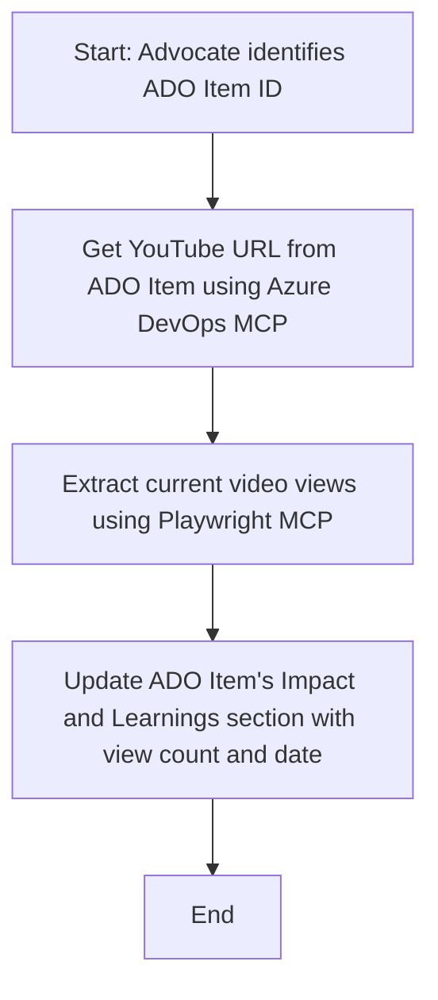

<!--
CO_OP_TRANSLATOR_METADATA:
{
  "original_hash": "14a2dfbea55ef735660a06bd6bdfe5f3",
  "translation_date": "2025-06-13T21:34:36+00:00",
  "source_file": "09-CaseStudy/UpdateADOItemsFromYT.md",
  "language_code": "it"
}
-->
# Caso di studio: aggiornamento degli elementi di Azure DevOps con dati di YouTube tramite MCP

> **Disclaimer:** Esistono strumenti e report online che possono automatizzare il processo di aggiornamento degli elementi di Azure DevOps con dati provenienti da piattaforme come YouTube. Lo scenario seguente è fornito esclusivamente come esempio per illustrare come gli strumenti MCP possano essere utilizzati per attività di automazione e integrazione.

## Panoramica

Questo caso di studio mostra un esempio di come il Model Context Protocol (MCP) e i suoi strumenti possano essere impiegati per automatizzare l’aggiornamento degli elementi di lavoro di Azure DevOps (ADO) con informazioni provenienti da piattaforme online, come YouTube. Lo scenario descritto è solo una delle possibili applicazioni di questi strumenti, che possono essere adattati a molte esigenze simili di automazione.

In questo esempio, un Advocate monitora sessioni online utilizzando elementi ADO, dove ogni elemento contiene un URL di un video YouTube. Sfruttando gli strumenti MCP, l’Advocate può mantenere aggiornati gli elementi ADO con le ultime metriche del video, come il numero di visualizzazioni, in modo ripetibile e automatizzato. Questo approccio può essere esteso ad altri casi in cui è necessario integrare informazioni da fonti online in ADO o in altri sistemi.

## Scenario

Un Advocate è responsabile di monitorare l’impatto delle sessioni online e delle interazioni nella community. Ogni sessione viene registrata come elemento di lavoro ADO nel progetto ‘DevRel’, e l’elemento contiene un campo con l’URL del video YouTube. Per riportare con precisione la portata della sessione, l’Advocate deve aggiornare l’elemento ADO con il numero attuale di visualizzazioni del video e la data in cui queste informazioni sono state recuperate.

## Strumenti utilizzati

- [Azure DevOps MCP](https://github.com/microsoft/azure-devops-mcp): consente l’accesso programmato e l’aggiornamento degli elementi di lavoro ADO tramite MCP.
- [Playwright MCP](https://github.com/microsoft/playwright-mcp): automatizza le azioni del browser per estrarre dati in tempo reale da pagine web, come le statistiche dei video YouTube.

## Flusso di lavoro passo passo

1. **Identificare l’elemento ADO**: partire dall’ID dell’elemento di lavoro ADO (es. 1234) nel progetto ‘DevRel’.
2. **Recuperare l’URL YouTube**: utilizzare lo strumento Azure DevOps MCP per ottenere l’URL YouTube dall’elemento di lavoro.
3. **Estrarre le visualizzazioni del video**: usare lo strumento Playwright MCP per navigare all’URL YouTube e ricavare il numero attuale di visualizzazioni.
4. **Aggiornare l’elemento ADO**: scrivere il numero più recente di visualizzazioni e la data di recupero nella sezione ‘Impact and Learnings’ dell’elemento di lavoro ADO tramite lo strumento Azure DevOps MCP.

## Esempio di prompt

```bash
- Work with the ADO Item ID: 1234
- The project is '2025-Awesome'
- Get the YouTube URL for the ADO item
- Use Playwright to get the current views from the YouTube video
- Update the ADO item with the current video views and the updated date of the information
```

## Diagramma di flusso Mermaid



## Implementazione tecnica

- **Orchestrazione MCP**: il flusso di lavoro è coordinato da un server MCP, che gestisce l’uso congiunto degli strumenti Azure DevOps MCP e Playwright MCP.
- **Automazione**: il processo può essere avviato manualmente o programmato per essere eseguito a intervalli regolari, mantenendo aggiornati gli elementi ADO.
- **Estendibilità**: lo stesso schema può essere esteso per aggiornare gli elementi ADO con altre metriche online (es. like, commenti) o da altre piattaforme.

## Risultati e impatto

- **Efficienza**: riduce il lavoro manuale per gli Advocate automatizzando il recupero e l’aggiornamento delle metriche video.
- **Precisione**: garantisce che gli elementi ADO riflettano i dati più aggiornati disponibili dalle fonti online.
- **Ripetibilità**: fornisce un flusso di lavoro riutilizzabile per scenari simili che coinvolgono altre fonti di dati o metriche.

## Riferimenti

- [Azure DevOps MCP](https://github.com/microsoft/azure-devops-mcp)
- [Playwright MCP](https://github.com/microsoft/playwright-mcp)
- [Model Context Protocol (MCP)](https://modelcontextprotocol.io/)

**Disclaimer**:  
Questo documento è stato tradotto utilizzando il servizio di traduzione automatica AI [Co-op Translator](https://github.com/Azure/co-op-translator). Pur impegnandoci per garantire l'accuratezza, si prega di notare che le traduzioni automatiche possono contenere errori o imprecisioni. Il documento originale nella sua lingua madre deve essere considerato la fonte autorevole. Per informazioni critiche, si raccomanda una traduzione professionale effettuata da un umano. Non ci assumiamo responsabilità per eventuali malintesi o interpretazioni errate derivanti dall'uso di questa traduzione.