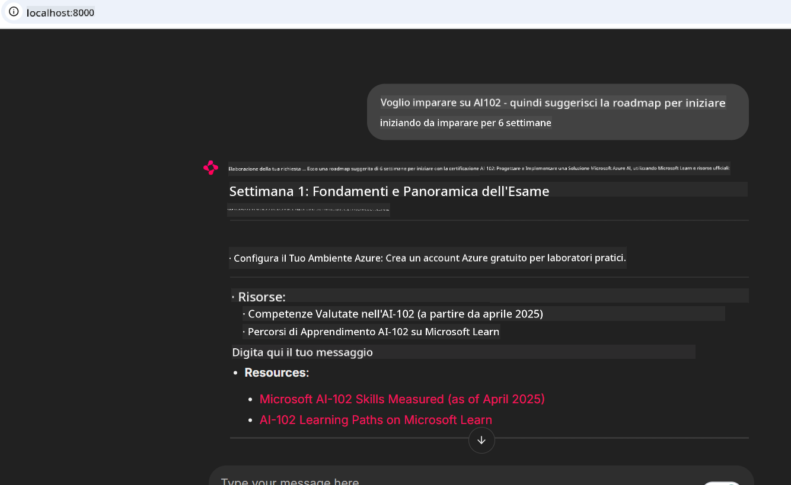
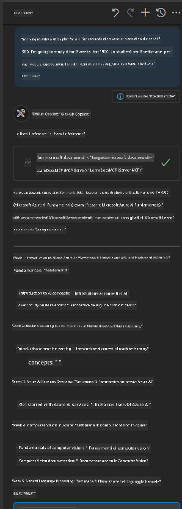

<!--
CO_OP_TRANSLATOR_METADATA:
{
  "original_hash": "4319d291c9d124ecafea52b3d04bfa0e",
  "translation_date": "2025-07-14T06:23:24+00:00",
  "source_file": "09-CaseStudy/docs-mcp/README.md",
  "language_code": "it"
}
-->
# Case Study: Connessione al Microsoft Learn Docs MCP Server da un Client

Ti è mai capitato di dover saltare continuamente tra siti di documentazione, Stack Overflow e infinite schede del motore di ricerca, mentre cerchi di risolvere un problema nel tuo codice? Forse hai un secondo monitor dedicato solo ai documenti, oppure stai continuamente passando con Alt+Tab tra il tuo IDE e il browser. Non sarebbe meglio poter integrare la documentazione direttamente nel tuo flusso di lavoro—integrata nelle tue app, nel tuo IDE o persino nei tuoi strumenti personalizzati? In questo case study, esploreremo come fare esattamente questo, collegandoci direttamente al Microsoft Learn Docs MCP server dalla tua applicazione client.

## Panoramica

Lo sviluppo moderno non è solo scrivere codice—si tratta di trovare l’informazione giusta al momento giusto. La documentazione è ovunque, ma raramente dove serve di più: all’interno dei tuoi strumenti e flussi di lavoro. Integrando il recupero della documentazione direttamente nelle tue applicazioni, puoi risparmiare tempo, ridurre i cambi di contesto e aumentare la produttività. In questa sezione, ti mostreremo come connettere un client al Microsoft Learn Docs MCP server, così potrai accedere a documentazione in tempo reale e contestuale senza mai uscire dalla tua app.

Ti guideremo nel processo di stabilire una connessione, inviare una richiesta e gestire in modo efficiente le risposte in streaming. Questo approccio non solo semplifica il tuo flusso di lavoro, ma apre anche la strada alla creazione di strumenti per sviluppatori più intelligenti e utili.

## Obiettivi di Apprendimento

Perché lo facciamo? Perché le migliori esperienze per sviluppatori sono quelle che eliminano gli ostacoli. Immagina un mondo in cui il tuo editor di codice, chatbot o app web possa rispondere alle tue domande sulla documentazione all’istante, usando i contenuti più aggiornati di Microsoft Learn. Alla fine di questo capitolo, saprai come:

- Comprendere le basi della comunicazione client-server MCP per la documentazione
- Implementare un’app console o web per connettersi al Microsoft Learn Docs MCP server
- Usare client HTTP in streaming per il recupero in tempo reale della documentazione
- Registrare e interpretare le risposte della documentazione nella tua applicazione

Vedrai come queste competenze ti aiuteranno a costruire strumenti non solo reattivi, ma davvero interattivi e consapevoli del contesto.

## Scenario 1 - Recupero in Tempo Reale della Documentazione con MCP

In questo scenario, ti mostreremo come connettere un client al Microsoft Learn Docs MCP server, così potrai accedere a documentazione in tempo reale e contestuale senza mai uscire dalla tua app.

Mettiamo in pratica. Il tuo compito è scrivere un’app che si connetta al Microsoft Learn Docs MCP server, invochi lo strumento `microsoft_docs_search` e registri la risposta in streaming sulla console.

### Perché questo approccio?
Perché è la base per costruire integrazioni più avanzate—che tu voglia alimentare un chatbot, un’estensione IDE o una dashboard web.

Troverai il codice e le istruzioni per questo scenario nella cartella [`solution`](./solution/README.md) all’interno di questo case study. I passaggi ti guideranno nella configurazione della connessione:
- Usa l’SDK MCP ufficiale e un client HTTP con supporto streaming per la connessione
- Chiama lo strumento `microsoft_docs_search` con un parametro di query per recuperare la documentazione
- Implementa un corretto logging e gestione degli errori
- Crea un’interfaccia console interattiva per permettere agli utenti di inserire più query di ricerca

Questo scenario dimostra come:
- Connettersi al Docs MCP server
- Inviare una query
- Analizzare e stampare i risultati

Ecco come potrebbe apparire l’esecuzione della soluzione:

```
Prompt> What is Azure Key Vault?
Answer> Azure Key Vault is a cloud service for securely storing and accessing secrets. ...
```

Di seguito un esempio minimo di soluzione. Il codice completo e i dettagli sono disponibili nella cartella solution.

<details>
<summary>Python</summary>

```python
import asyncio
from mcp.client.streamable_http import streamablehttp_client
from mcp import ClientSession

async def main():
    async with streamablehttp_client("https://learn.microsoft.com/api/mcp") as (read_stream, write_stream, _):
        async with ClientSession(read_stream, write_stream) as session:
            await session.initialize()
            result = await session.call_tool("microsoft_docs_search", {"query": "Azure Functions best practices"})
            print(result.content)

if __name__ == "__main__":
    asyncio.run(main())
```

- Per l’implementazione completa e il logging, vedi [`scenario1.py`](../../../../09-CaseStudy/docs-mcp/solution/python/scenario1.py).
- Per istruzioni di installazione e utilizzo, consulta il file [`README.md`](./solution/python/README.md) nella stessa cartella.
</details>

## Scenario 2 - Web App Interattiva per Generare Piani di Studio con MCP

In questo scenario, imparerai come integrare Docs MCP in un progetto di sviluppo web. L’obiettivo è permettere agli utenti di cercare la documentazione di Microsoft Learn direttamente da un’interfaccia web, rendendo la documentazione immediatamente accessibile all’interno della tua app o sito.

Vedrai come:
- Configurare una web app
- Connettersi al Docs MCP server
- Gestire l’input dell’utente e mostrare i risultati

Ecco come potrebbe apparire l’esecuzione della soluzione:

```
User> I want to learn about AI102 - so suggest the roadmap to get it started from learn for 6 weeks

Assistant> Here’s a detailed 6-week roadmap to start your preparation for the AI-102: Designing and Implementing a Microsoft Azure AI Solution certification, using official Microsoft resources and focusing on exam skills areas:

---
## Week 1: Introduction & Fundamentals
- **Understand the Exam**: Review the [AI-102 exam skills outline](https://learn.microsoft.com/en-us/credentials/certifications/exams/ai-102/).
- **Set up Azure**: Sign up for a free Azure account if you don't have one.
- **Learning Path**: [Introduction to Azure AI services](https://learn.microsoft.com/en-us/training/modules/intro-to-azure-ai/)
- **Focus**: Get familiar with Azure portal, AI capabilities, and necessary tools.

....more weeks of the roadmap...

Let me know if you want module-specific recommendations or need more customized weekly tasks!
```

Di seguito un esempio minimo di soluzione. Il codice completo e i dettagli sono disponibili nella cartella solution.



<details>
<summary>Python (Chainlit)</summary>

Chainlit è un framework per costruire app web di AI conversazionale. Rende facile creare chatbot e assistenti interattivi che possono chiamare gli strumenti MCP e mostrare i risultati in tempo reale. È ideale per prototipi rapidi e interfacce user-friendly.

```python
import chainlit as cl
import requests

MCP_URL = "https://learn.microsoft.com/api/mcp"

@cl.on_message
def handle_message(message):
    query = {"question": message}
    response = requests.post(MCP_URL, json=query)
    if response.ok:
        result = response.json()
        cl.Message(content=result.get("answer", "No answer found.")).send()
    else:
        cl.Message(content="Error: " + response.text).send()
```

- Per l’implementazione completa, vedi [`scenario2.py`](../../../../09-CaseStudy/docs-mcp/solution/python/scenario2.py).
- Per istruzioni di configurazione e avvio, consulta il [`README.md`](./solution/python/README.md).
</details>

## Scenario 3: Documentazione In-Editor con MCP Server in VS Code

Se vuoi avere Microsoft Learn Docs direttamente dentro VS Code (invece di passare da una scheda del browser all’altra), puoi usare il MCP server nel tuo editor. Questo ti permette di:
- Cercare e leggere la documentazione in VS Code senza uscire dall’ambiente di sviluppo.
- Fare riferimento alla documentazione e inserire link direttamente nei tuoi file README o corsi.
- Usare GitHub Copilot e MCP insieme per un flusso di lavoro documentale AI-powered senza interruzioni.

**Vedrai come:**
- Aggiungere un file valido `.vscode/mcp.json` nella root del workspace (vedi esempio sotto).
- Aprire il pannello MCP o usare la command palette in VS Code per cercare e inserire documentazione.
- Fare riferimento alla documentazione direttamente nei tuoi file markdown mentre lavori.
- Combinare questo flusso con GitHub Copilot per una produttività ancora maggiore.

Ecco un esempio di come configurare il MCP server in VS Code:

```json
{
  "servers": {
    "LearnDocsMCP": {
      "url": "https://learn.microsoft.com/api/mcp"
    }
  }
}
```

</details>

> Per una guida dettagliata con screenshot e istruzioni passo-passo, consulta [`README.md`](./solution/scenario3/README.md).



Questo approccio è ideale per chiunque costruisca corsi tecnici, scriva documentazione o sviluppi codice con frequenti necessità di riferimento.

## Punti Chiave

Integrare la documentazione direttamente nei tuoi strumenti non è solo una comodità—è una rivoluzione per la produttività. Collegandoti al Microsoft Learn Docs MCP server dal tuo client, puoi:

- Eliminare i cambi di contesto tra codice e documentazione
- Recuperare documentazione aggiornata e contestuale in tempo reale
- Costruire strumenti per sviluppatori più intelligenti e interattivi

Queste competenze ti aiuteranno a creare soluzioni non solo efficienti, ma anche piacevoli da usare.

## Risorse Aggiuntive

Per approfondire, esplora queste risorse ufficiali:

- [Microsoft Learn Docs MCP Server (GitHub)](https://github.com/MicrosoftDocs/mcp)
- [Inizia con Azure MCP Server (mcp-python)](https://learn.microsoft.com/en-us/azure/developer/azure-mcp-server/get-started#create-the-python-app)
- [Cos’è Azure MCP Server?](https://learn.microsoft.com/en-us/azure/developer/azure-mcp-server/)
- [Introduzione al Model Context Protocol (MCP)](https://modelcontextprotocol.io/introduction)
- [Aggiungere plugin da un MCP Server (Python)](https://learn.microsoft.com/en-us/semantic-kernel/concepts/plugins/adding-mcp-plugins)

**Disclaimer**:  
Questo documento è stato tradotto utilizzando il servizio di traduzione automatica [Co-op Translator](https://github.com/Azure/co-op-translator). Pur impegnandoci per garantire l’accuratezza, si prega di notare che le traduzioni automatiche possono contenere errori o imprecisioni. Il documento originale nella sua lingua nativa deve essere considerato la fonte autorevole. Per informazioni critiche, si raccomanda una traduzione professionale effettuata da un umano. Non ci assumiamo alcuna responsabilità per eventuali malintesi o interpretazioni errate derivanti dall’uso di questa traduzione.