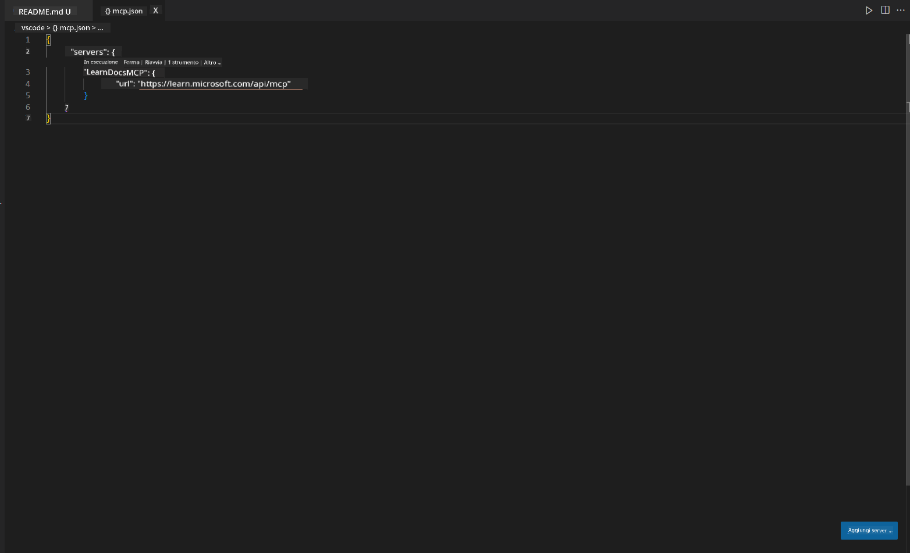
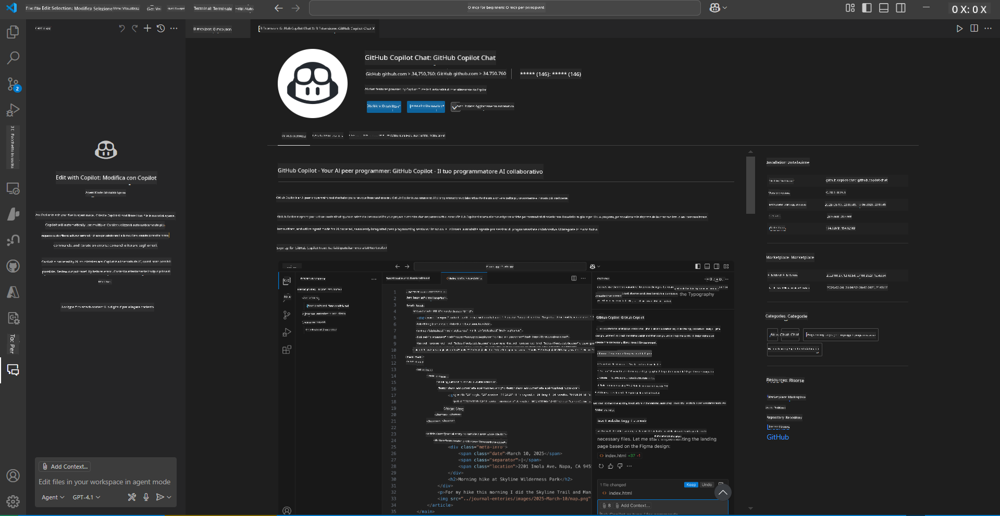
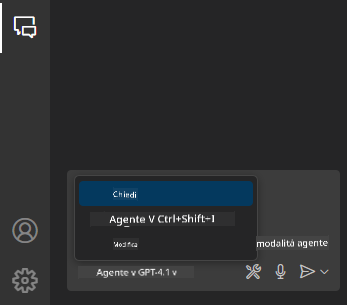
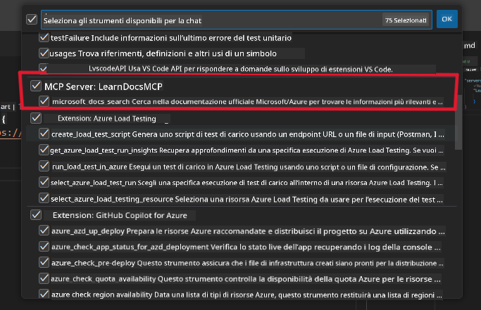
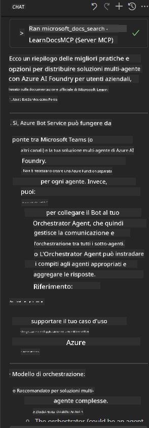

<!--
CO_OP_TRANSLATOR_METADATA:
{
  "original_hash": "db532b1ec386c9ce38c791653dc3c881",
  "translation_date": "2025-06-21T14:39:06+00:00",
  "source_file": "09-CaseStudy/docs-mcp/solution/scenario3/README.md",
  "language_code": "it"
}
-->
# Scenario 3: Documentazione in-Editor con MCP Server in VS Code

## Panoramica

In questo scenario, imparerai come integrare Microsoft Learn Docs direttamente nel tuo ambiente Visual Studio Code utilizzando il server MCP. Invece di passare continuamente da una scheda del browser all’altra per cercare documentazione, potrai accedere, cercare e consultare la documentazione ufficiale direttamente all’interno del tuo editor. Questo approccio semplifica il flusso di lavoro, ti mantiene concentrato e permette un’integrazione fluida con strumenti come GitHub Copilot.

- Cerca e leggi la documentazione dentro VS Code senza uscire dall’ambiente di sviluppo.
- Consulta la documentazione e inserisci link direttamente nei tuoi file README o nei materiali del corso.
- Usa GitHub Copilot e MCP insieme per un flusso di lavoro documentale potenziato dall’IA.

## Obiettivi di apprendimento

Al termine di questo capitolo, saprai come configurare e utilizzare il server MCP all’interno di VS Code per migliorare il tuo flusso di lavoro di documentazione e sviluppo. Sarai in grado di:

- Configurare il tuo workspace per utilizzare il server MCP nella ricerca della documentazione.
- Cercare e inserire documentazione direttamente da VS Code.
- Combinare la potenza di GitHub Copilot e MCP per un flusso di lavoro più produttivo e supportato dall’IA.

Queste competenze ti aiuteranno a mantenere la concentrazione, migliorare la qualità della documentazione e aumentare la tua produttività come sviluppatore o technical writer.

## Soluzione

Per ottenere l’accesso alla documentazione direttamente nell’editor, seguirai una serie di passaggi che integrano il server MCP con VS Code e GitHub Copilot. Questa soluzione è ideale per autori di corsi, redattori di documentazione e sviluppatori che vogliono rimanere focalizzati nell’editor mentre lavorano con la documentazione e Copilot.

- Aggiungi rapidamente link di riferimento a un README mentre scrivi un corso o la documentazione di un progetto.
- Usa Copilot per generare codice e MCP per trovare e citare immediatamente la documentazione pertinente.
- Rimani concentrato nell’editor e aumenta la produttività.

### Guida passo passo

Per iniziare, segui questi passaggi. Per ogni step, puoi aggiungere uno screenshot dalla cartella assets per illustrare visivamente il processo.

1. **Aggiungi la configurazione MCP:**  
   Nella root del tuo progetto, crea un file `.vscode/mcp.json` e aggiungi la seguente configurazione:  
   ```json
   {
     "servers": {
       "LearnDocsMCP": {
         "url": "https://learn.microsoft.com/api/mcp"
       }
     }
   }
   ```  
   Questa configurazione indica a VS Code come connettersi al [`Microsoft Learn Docs MCP server`](https://github.com/MicrosoftDocs/mcp).
   
   
    
2. **Apri il pannello GitHub Copilot Chat:**  
   Se non hai ancora installato l’estensione GitHub Copilot, vai alla vista Estensioni in VS Code e installala. Puoi scaricarla direttamente dal [Visual Studio Code Marketplace](https://marketplace.visualstudio.com/items?itemName=GitHub.copilot-chat). Poi, apri il pannello Copilot Chat dalla barra laterale.

   

3. **Abilita la modalità agent e verifica gli strumenti:**  
   Nel pannello Copilot Chat, attiva la modalità agent.

   

   Dopo aver abilitato la modalità agent, verifica che il server MCP sia elencato tra gli strumenti disponibili. Questo garantisce che l’agente Copilot possa accedere al server di documentazione per recuperare informazioni rilevanti.
   
   

4. **Avvia una nuova chat e interroga l’agente:**  
   Apri una nuova chat nel pannello Copilot Chat. Ora puoi porre domande all’agente riguardo alla documentazione. L’agente utilizzerà il server MCP per recuperare e mostrare la documentazione Microsoft Learn pertinente direttamente nel tuo editor.

   - *"Sto cercando di scrivere un piano di studio per l’argomento X. Lo studierò per 8 settimane, per ogni settimana suggerisci il contenuto da seguire."*

   

5. **Query in tempo reale:**

   > Prendiamo una query in tempo reale dalla sezione [#get-help](https://discord.gg/D6cRhjHWSC) del Discord Azure AI Foundry ([vedi messaggio originale](https://discord.com/channels/1113626258182504448/1385498306720829572)):
   
   *"Sto cercando risposte su come distribuire una soluzione multi-agente con agenti AI sviluppati su Azure AI Foundry. Ho notato che non esiste un metodo diretto di deployment, come i canali di Copilot Studio. Quindi, quali sono i diversi modi per eseguire questo deployment affinché gli utenti enterprise possano interagire e portare a termine il lavoro?  
Ci sono numerosi articoli/blog che suggeriscono di usare Azure Bot service per questo scopo, che potrebbe fungere da ponte tra MS Teams e gli agenti Azure AI Foundry. Funzionerebbe se configuro un bot Azure che si collega all’Orchestrator Agent su Azure AI Foundry tramite Azure function per gestire l’orchestrazione, oppure devo creare una Azure function per ciascuno degli agenti AI della soluzione multi-agente per orchestrare tutto tramite Bot framework? Altri suggerimenti sono ben accetti."*

   

   L’agente risponderà con link e riassunti pertinenti della documentazione, che potrai inserire direttamente nei tuoi file markdown o usare come riferimenti nel codice.

### Esempi di query

Ecco alcune query di esempio che puoi provare. Queste dimostrano come MCP server e Copilot possano collaborare per fornire documentazione e riferimenti contestuali in tempo reale senza uscire da VS Code:

- "Mostrami come usare i trigger di Azure Functions."
- "Inserisci un link alla documentazione ufficiale di Azure Key Vault."
- "Quali sono le best practice per la sicurezza delle risorse Azure?"
- "Trova un quickstart per i servizi Azure AI."

Queste query dimostrano come MCP server e Copilot lavorino insieme per fornire documentazione e riferimenti contestuali in modo immediato senza uscire da VS Code.

---

**Avvertenza**:  
Questo documento è stato tradotto utilizzando il servizio di traduzione automatica [Co-op Translator](https://github.com/Azure/co-op-translator). Pur impegnandoci per garantire accuratezza, si prega di considerare che le traduzioni automatiche possono contenere errori o imprecisioni. Il documento originale nella sua lingua nativa deve essere considerato la fonte autorevole. Per informazioni critiche, si raccomanda una traduzione professionale effettuata da un essere umano. Non ci assumiamo responsabilità per eventuali incomprensioni o interpretazioni errate derivanti dall’uso di questa traduzione.