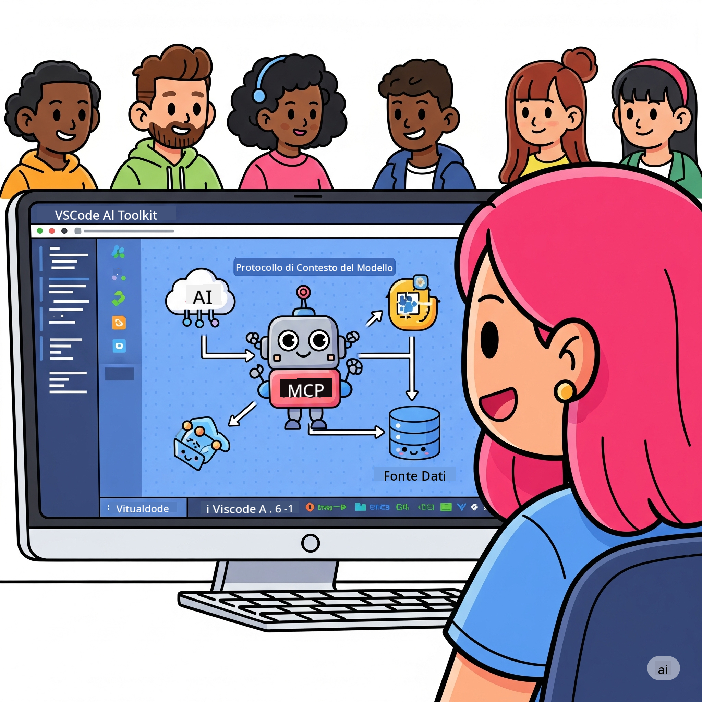

<!--
CO_OP_TRANSLATOR_METADATA:
{
  "original_hash": "787440926586cd064b0899fd1c514f52",
  "translation_date": "2025-07-14T07:06:14+00:00",
  "source_file": "10-StreamliningAIWorkflowsBuildingAnMCPServerWithAIToolkit/README.md",
  "language_code": "it"
}
-->
# Snellire i Flussi di Lavoro AI: Costruire un Server MCP con AI Toolkit

## 🎯 Panoramica

Benvenuti al **Workshop sul Model Context Protocol (MCP)**! Questo workshop pratico e completo unisce due tecnologie all’avanguardia per rivoluzionare lo sviluppo di applicazioni AI:

- **🔗 Model Context Protocol (MCP)**: uno standard aperto per un’integrazione fluida degli strumenti AI
- **🛠️ AI Toolkit per Visual Studio Code (AITK)**: la potente estensione di Microsoft per lo sviluppo AI

### 🎓 Cosa Imparerai

Al termine di questo workshop, sarai in grado di costruire applicazioni intelligenti che collegano modelli AI con strumenti e servizi reali. Dai test automatizzati alle integrazioni API personalizzate, acquisirai competenze pratiche per risolvere sfide aziendali complesse.

## 🏗️ Stack Tecnologico

### 🔌 Model Context Protocol (MCP)

MCP è il **“USB-C per l’AI”** – uno standard universale che connette modelli AI a strumenti esterni e fonti di dati.

**✨ Caratteristiche principali:**
- 🔄 **Integrazione Standardizzata**: interfaccia universale per collegare strumenti AI
- 🏛️ **Architettura Flessibile**: server locali e remoti tramite trasporto stdio/SSE
- 🧰 **Ecosistema Completo**: strumenti, prompt e risorse in un unico protocollo
- 🔒 **Pronto per l’Impresa**: sicurezza e affidabilità integrate

**🎯 Perché MCP è Importante:**
Proprio come USB-C ha eliminato il caos dei cavi, MCP semplifica le integrazioni AI. Un protocollo, infinite possibilità.

### 🤖 AI Toolkit per Visual Studio Code (AITK)

L’estensione di punta di Microsoft per lo sviluppo AI che trasforma VS Code in una centrale AI.

**🚀 Funzionalità principali:**
- 📦 **Catalogo Modelli**: accesso a modelli da Azure AI, GitHub, Hugging Face, Ollama
- ⚡ **Inferenza Locale**: esecuzione ottimizzata ONNX su CPU/GPU/NPU
- 🏗️ **Agent Builder**: sviluppo visuale di agenti AI con integrazione MCP
- 🎭 **Multi-Modale**: supporto per testo, visione e output strutturati

**💡 Vantaggi per lo Sviluppo:**
- Deploy di modelli senza configurazioni complesse
- Ingegneria visuale dei prompt
- Playground per test in tempo reale
- Integrazione fluida con server MCP

## 📚 Percorso di Apprendimento

### [🚀 Modulo 1: Fondamenti di AI Toolkit](./lab1/README.md)
**Durata**: 15 minuti
- 🛠️ Installare e configurare AI Toolkit per VS Code
- 🗂️ Esplorare il Catalogo Modelli (oltre 100 modelli da GitHub, ONNX, OpenAI, Anthropic, Google)
- 🎮 Padroneggiare l’Interactive Playground per testare modelli in tempo reale
- 🤖 Costruire il primo agente AI con Agent Builder
- 📊 Valutare le prestazioni del modello con metriche integrate (F1, rilevanza, similarità, coerenza)
- ⚡ Imparare l’elaborazione batch e il supporto multi-modale

**🎯 Obiettivo di Apprendimento**: Creare un agente AI funzionante con una comprensione completa delle capacità di AITK

### [🌐 Modulo 2: MCP con Fondamenti di AI Toolkit](./lab2/README.md)
**Durata**: 20 minuti
- 🧠 Approfondire architettura e concetti del Model Context Protocol (MCP)
- 🌐 Esplorare l’ecosistema dei server MCP di Microsoft
- 🤖 Costruire un agente di automazione browser usando Playwright MCP server
- 🔧 Integrare server MCP con AI Toolkit Agent Builder
- 📊 Configurare e testare strumenti MCP all’interno degli agenti
- 🚀 Esportare e distribuire agenti potenziati da MCP per l’uso in produzione

**🎯 Obiettivo di Apprendimento**: Distribuire un agente AI potenziato con strumenti esterni tramite MCP

### [🔧 Modulo 3: Sviluppo Avanzato MCP con AI Toolkit](./lab3/README.md)
**Durata**: 20 minuti
- 💻 Creare server MCP personalizzati usando AI Toolkit
- 🐍 Configurare e utilizzare l’ultima versione del MCP Python SDK (v1.9.3)
- 🔍 Impostare e usare MCP Inspector per il debugging
- 🛠️ Costruire un Weather MCP Server con flussi di lavoro di debug professionali
- 🧪 Debuggare server MCP sia in Agent Builder che in Inspector

**🎯 Obiettivo di Apprendimento**: Sviluppare e debugare server MCP personalizzati con strumenti moderni

### [🐙 Modulo 4: Sviluppo Pratico MCP - Server GitHub Clone Personalizzato](./lab4/README.md)
**Durata**: 30 minuti
- 🏗️ Costruire un server MCP GitHub Clone reale per flussi di lavoro di sviluppo
- 🔄 Implementare clonazione intelligente di repository con validazione e gestione errori
- 📁 Creare gestione intelligente delle directory e integrazione con VS Code
- 🤖 Usare GitHub Copilot Agent Mode con strumenti MCP personalizzati
- 🛡️ Applicare affidabilità pronta per la produzione e compatibilità cross-platform

**🎯 Obiettivo di Apprendimento**: Distribuire un server MCP pronto per la produzione che semplifica flussi di lavoro reali

## 💡 Applicazioni e Impatti nel Mondo Reale

### 🏢 Casi d’Uso Aziendali

#### 🔄 Automazione DevOps
Trasforma il tuo flusso di lavoro di sviluppo con automazione intelligente:
- **Gestione Intelligente dei Repository**: revisione codice e decisioni di merge guidate dall’AI
- **CI/CD Intelligente**: ottimizzazione automatica delle pipeline basata sui cambiamenti di codice
- **Triage delle Issue**: classificazione e assegnazione automatica dei bug

#### 🧪 Rivoluzione del Quality Assurance
Migliora i test con automazione AI-powered:
- **Generazione Intelligente di Test**: creazione automatica di suite di test complete
- **Test di Regressione Visiva**: rilevamento AI dei cambiamenti UI
- **Monitoraggio delle Prestazioni**: identificazione e risoluzione proattiva dei problemi

#### 📊 Intelligenza nei Data Pipeline
Costruisci flussi di lavoro di elaborazione dati più intelligenti:
- **Processi ETL Adattivi**: trasformazioni dati auto-ottimizzanti
- **Rilevamento Anomalie**: monitoraggio qualità dati in tempo reale
- **Instradamento Intelligente**: gestione smart del flusso dati

#### 🎧 Miglioramento dell’Esperienza Cliente
Crea interazioni cliente eccezionali:
- **Supporto Contestuale**: agenti AI con accesso alla storia cliente
- **Risoluzione Proattiva dei Problemi**: assistenza predittiva
- **Integrazione Multi-Canale**: esperienza AI unificata su più piattaforme

## 🛠️ Prerequisiti e Configurazione

### 💻 Requisiti di Sistema

| Componente | Requisito | Note |
|------------|-----------|------|
| **Sistema Operativo** | Windows 10+, macOS 10.15+, Linux | Qualsiasi OS moderno |
| **Visual Studio Code** | Ultima versione stabile | Necessario per AITK |
| **Node.js** | v18.0+ e npm | Per sviluppo server MCP |
| **Python** | 3.10+ | Opzionale per server MCP in Python |
| **Memoria** | Minimo 8GB RAM | Consigliati 16GB per modelli locali |

### 🔧 Ambiente di Sviluppo

#### Estensioni VS Code Consigliate
- **AI Toolkit** (ms-windows-ai-studio.windows-ai-studio)
- **Python** (ms-python.python)
- **Python Debugger** (ms-python.debugpy)
- **GitHub Copilot** (GitHub.copilot) - opzionale ma utile

#### Strumenti Opzionali
- **uv**: moderno package manager Python
- **MCP Inspector**: strumento visuale per il debug di server MCP
- **Playwright**: per esempi di automazione web

## 🎖️ Risultati di Apprendimento e Percorso di Certificazione

### 🏆 Checklist di Competenze

Completando questo workshop, raggiungerai la padronanza in:

#### 🎯 Competenze Chiave
- [ ] **Padronanza del Protocollo MCP**: comprensione approfondita di architettura e pattern di implementazione
- [ ] **Competenza AITK**: uso esperto di AI Toolkit per sviluppo rapido
- [ ] **Sviluppo Server Personalizzati**: costruzione, deploy e manutenzione di server MCP in produzione
- [ ] **Eccellenza nell’Integrazione Strumenti**: collegamento fluido dell’AI con flussi di lavoro esistenti
- [ ] **Applicazione alla Risoluzione di Problemi**: utilizzo delle competenze per sfide aziendali reali

#### 🔧 Competenze Tecniche
- [ ] Configurare e impostare AI Toolkit in VS Code
- [ ] Progettare e implementare server MCP personalizzati
- [ ] Integrare modelli GitHub con architettura MCP
- [ ] Costruire flussi di lavoro di test automatizzati con Playwright
- [ ] Distribuire agenti AI per uso in produzione
- [ ] Debuggare e ottimizzare le prestazioni dei server MCP

#### 🚀 Capacità Avanzate
- [ ] Progettare integrazioni AI su scala enterprise
- [ ] Implementare best practice di sicurezza per applicazioni AI
- [ ] Progettare architetture scalabili per server MCP
- [ ] Creare catene di strumenti personalizzati per domini specifici
- [ ] Fare da mentore nello sviluppo AI-native

## 📖 Risorse Aggiuntive
- [MCP Specification](https://modelcontextprotocol.io/docs)
- [AI Toolkit GitHub Repository](https://github.com/microsoft/vscode-ai-toolkit)
- [Sample MCP Servers Collection](https://github.com/modelcontextprotocol/servers)
- [Best Practices Guide](https://modelcontextprotocol.io/docs/best-practices)

---

**🚀 Pronto a rivoluzionare il tuo flusso di lavoro nello sviluppo AI?**

Costruiamo insieme il futuro delle applicazioni intelligenti con MCP e AI Toolkit!

**Disclaimer**:  
Questo documento è stato tradotto utilizzando il servizio di traduzione automatica [Co-op Translator](https://github.com/Azure/co-op-translator). Pur impegnandoci per garantire l’accuratezza, si prega di notare che le traduzioni automatiche possono contenere errori o imprecisioni. Il documento originale nella sua lingua nativa deve essere considerato la fonte autorevole. Per informazioni critiche, si raccomanda una traduzione professionale effettuata da un umano. Non ci assumiamo alcuna responsabilità per eventuali malintesi o interpretazioni errate derivanti dall’uso di questa traduzione.