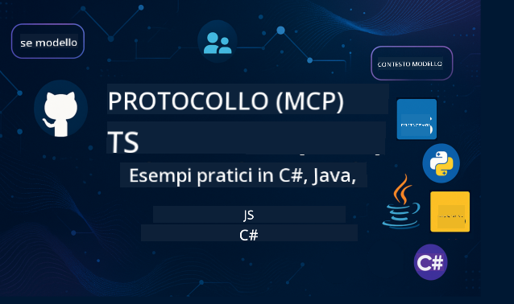

<!--
CO_OP_TRANSLATOR_METADATA:
{
  "original_hash": "2a21391378c12ecfef50f866329dfde0",
  "translation_date": "2025-05-17T05:24:26+00:00",
  "source_file": "README.md",
  "language_code": "it"
}
-->

Segui questi passaggi per iniziare a utilizzare queste risorse:
1. **Fai un Fork del Repository**: Clicca 
2. **Clona il Repository**: `git clone https://github.com/microsoft/mcp-for-beginners.git`
3. [**Unisciti al Discord di Microsoft Azure AI Foundry e incontra esperti e altri sviluppatori**](https://discord.com/invite/ByRwuEEgH4)

### 🌐 Supporto Multilingue

#### Supportato tramite GitHub Action (Automatizzato e Sempre Aggiornato)
[Francese](../fr/README.md) | [Spagnolo](../es/README.md) | [Tedesco](../de/README.md) | [Russo](../ru/README.md) | [Arabo](../ar/README.md) | [Persiano (Farsi)](../fa/README.md) | [Urdu](../ur/README.md) | [Cinese (Semplificato)](../zh/README.md) | [Cinese (Tradizionale, Macao)](../mo/README.md) | [Cinese (Tradizionale, Hong Kong)](../hk/README.md) | [Cinese (Tradizionale, Taiwan)](../tw/README.md) | [Giapponese](../ja/README.md) | [Coreano](../ko/README.md) | [Hindi](../hi/README.md) | [Bengalese](../bn/README.md) | [Marathi](../mr/README.md) | [Nepalese](../ne/README.md) | [Punjabi (Gurmukhi)](../pa/README.md) | [Portoghese (Portogallo)](../pt/README.md) | [Portoghese (Brasile)](../br/README.md) | [Italiano](./README.md) | [Polacco](../pl/README.md) | [Turco](../tr/README.md) | [Greco](../el/README.md) | [Tailandese](../th/README.md) | [Svedese](../sv/README.md) | [Danese](../da/README.md) | [Norvegese](../no/README.md) | [Finlandese](../fi/README.md) | [Olandese](../nl/README.md) | [Ebraico](../he/README.md) | [Vietnamita](../vi/README.md) | [Indonesiano](../id/README.md) | [Malese](../ms/README.md) | [Tagalog (Filippino)](../tl/README.md) | [Swahili](../sw/README.md) | [Ungherese](../hu/README.md) | [Ceco](../cs/README.md) | [Slovacco](../sk/README.md) | [Rumeno](../ro/README.md) | [Bulgaro](../bg/README.md) | [Serbo (Cirillico)](../sr/README.md) | [Croato](../hr/README.md) | [Sloveno](../sl/README.md)
# 🚀 Guida definitiva al curriculum del Model Context Protocol (MCP) per principianti

## **Impara MCP con esempi di codice pratici in C#, Java, JavaScript, Python e TypeScript**

## 🧠 Panoramica del curriculum del Model Context Protocol

Il **Model Context Protocol (MCP)** è un framework all'avanguardia progettato per standardizzare le interazioni tra modelli AI e applicazioni client. Questo curriculum open-source offre un percorso di apprendimento strutturato, completo di esempi di codifica pratici e casi d'uso reali, attraverso linguaggi di programmazione popolari tra cui C#, Java, JavaScript, TypeScript e Python.

Che tu sia uno sviluppatore AI, un architetto di sistemi o un ingegnere del software, questa guida è la tua risorsa completa per padroneggiare i fondamenti e le strategie di implementazione del MCP.

## 🔗 Risorse ufficiali MCP

- 📘 [Documentazione MCP](https://modelcontextprotocol.io/) – Tutorial dettagliati e guide utente  
- 📜 [Specifiche MCP](https://spec.modelcontextprotocol.io/) – Architettura del protocollo e riferimenti tecnici  
- 🧑‍💻 [Repository GitHub MCP](https://github.com/modelcontextprotocol) – SDK open-source, strumenti e esempi di codice  

## 🧭 Struttura completa del curriculum MCP

### 📌 [Introduzione a MCP](./00-Introduction/README.md)

- Cos'è il Model Context Protocol?
- Perché la standardizzazione è importante nei pipeline AI
- Casi d'uso pratici e benefici del MCP

### 🧩 [Concetti chiave spiegati](./01-CoreConcepts/README.md)

- Comprendere l'architettura client-server nel MCP
- Componenti chiave del protocollo: richieste, risposte e schemi
- Modelli di messaggistica e scambio dati nel MCP

### 🔐 [Sicurezza nel MCP](./02-Security/readme.md)

- Identificare le minacce alla sicurezza nei sistemi basati su MCP
- Tecniche e migliori pratiche per proteggere le implementazioni

### 🚀 [Iniziare con MCP](./03-GettingStarted/README.md)

- Configurazione e impostazione dell'ambiente
- Creazione di server e client MCP di base
- Integrazione di MCP con applicazioni esistenti

#### 🧮 Progetti di esempio MCP Calculator:

  
<strong>Esplora implementazioni di codice per linguaggio</strong>

  - [Esempio di server MCP C#](./03-GettingStarted/samples/csharp/README.md)
  - [Calcolatrice MCP Java](./03-GettingStarted/samples/java/calculator/README.md)
  - [Demo MCP JavaScript](./03-GettingStarted/samples/javascript/README.md)
  - [Server MCP Python](../../03-GettingStarted/samples/python/mcp_calculator_server.py)
  - [Esempio MCP TypeScript](./03-GettingStarted/samples/typescript/README.md)

### 🛠️ [Implementazione pratica](./04-PracticalImplementation/README.md)

- Utilizzo di SDK in diversi linguaggi
- Debug, test e validazione
- Creazione di modelli di prompt e workflow riutilizzabili

#### 💡 Progetti avanzati MCP Calculator:

  
<strong>Esplora campioni avanzati</strong>

  - [Campione avanzato C#](./04-PracticalImplementation/samples/csharp/README.md)
  - [Esempio di app container Java](./04-PracticalImplementation/samples/java/containerapp/README.md)
  - [Campione avanzato JavaScript](./04-PracticalImplementation/samples/javascript/README.md)
  - [Implementazione complessa Python](../../04-PracticalImplementation/samples/python/mcp_sample.py)
  - [Campione container TypeScript](./04-PracticalImplementation/samples/typescript/README.md)

### 🎓 [Argomenti avanzati in MCP](./05-AdvancedTopics/README.md)

- Workflow AI multimodali e estensibilità
- Strategie di scaling sicure
- MCP negli ecosistemi aziendali

### 🌍 [Contributi della comunità](./06-CommunityContributions/README.md)

- Come contribuire con codice e documenti
- Collaborare tramite GitHub
- Miglioramenti e feedback guidati dalla comunità

### 📈 [Approfondimenti dall'adozione precoce](./07-CaseStudies/README.md)

- Implementazioni reali e cosa ha funzionato
- Creazione e distribuzione di soluzioni basate su MCP
- Tendenze e roadmap futura

### 📏 [Migliori pratiche per MCP](./08-BestPractices/README.md)

- Ottimizzazione delle prestazioni
- Progettazione di sistemi MCP tolleranti ai guasti
- Strategie di test e resilienza

### 📊 [Studi di caso MCP](./09-CaseStudy/Readme.md)

- Approfondimenti nelle architetture di soluzioni MCP
- Schemi di distribuzione e suggerimenti per l'integrazione
- Diagrammi annotati e walkthrough dei progetti

## 🎯 Prerequisiti per apprendere MCP

Per ottenere il massimo da questo curriculum, dovresti avere:

- Conoscenze di base di C#, Java o Python
- Comprensione del modello client-server e delle API
- (Opzionale) Familiarità con i concetti di machine learning

## 🛠️ Come utilizzare efficacemente questo curriculum

Ogni lezione in questa guida include:

1. Spiegazioni chiare dei concetti MCP  
2. Esempi di codice dal vivo in più linguaggi  
3. Esercizi per costruire applicazioni MCP reali  
4. Risorse extra per studenti avanzati  

## 📜 Informazioni sulla licenza

Questo contenuto è concesso in licenza sotto la **MIT License**. Per termini e condizioni, vedere il [LICENSE](../../LICENSE).

## 🤝 Linee guida per i contributi

Questo progetto accoglie contributi e suggerimenti. La maggior parte dei contributi richiede di accettare un
Contributor License Agreement (CLA) dichiarando che hai il diritto di, e effettivamente, concederci
i diritti di utilizzare il tuo contributo. Per dettagli, visita <https://cla.opensource.microsoft.com>.

Quando invii una pull request, un bot CLA determinerà automaticamente se devi fornire
un CLA e decorerà il PR di conseguenza (es., controllo dello stato, commento). Segui semplicemente le istruzioni
fornite dal bot. Dovrai farlo solo una volta per tutti i repository che utilizzano il nostro CLA.

Questo progetto ha adottato il [Codice di condotta Open Source di Microsoft](https://opensource.microsoft.com/codeofconduct/).
Per ulteriori informazioni, consulta le [FAQ sul Codice di Condotta](https://opensource.microsoft.com/codeofconduct/faq/) o
contatta [opencode@microsoft.com](mailto:opencode@microsoft.com) per eventuali domande o commenti aggiuntivi.

## ™️ Avviso sui marchi

Questo progetto può contenere marchi o loghi per progetti, prodotti o servizi. L'uso autorizzato dei marchi o loghi di Microsoft è soggetto a e deve seguire
le [Linee guida sui marchi e il brand di Microsoft](https://www.microsoft.com/legal/intellectualproperty/trademarks/usage/general).
L'uso dei marchi o loghi di Microsoft in versioni modificate di questo progetto non deve causare confusione o implicare la sponsorizzazione di Microsoft.
Qualsiasi uso di marchi o loghi di terze parti è soggetto alle politiche di tali terze parti.

**Disclaimer**:
Questo documento è stato tradotto utilizzando il servizio di traduzione AI [Co-op Translator](https://github.com/Azure/co-op-translator). Sebbene ci impegniamo per l'accuratezza, si prega di essere consapevoli che le traduzioni automatiche possono contenere errori o imprecisioni. Il documento originale nella sua lingua madre dovrebbe essere considerato la fonte autorevole. Per informazioni critiche, si raccomanda la traduzione professionale umana. Non siamo responsabili per eventuali incomprensioni o interpretazioni errate derivanti dall'uso di questa traduzione.