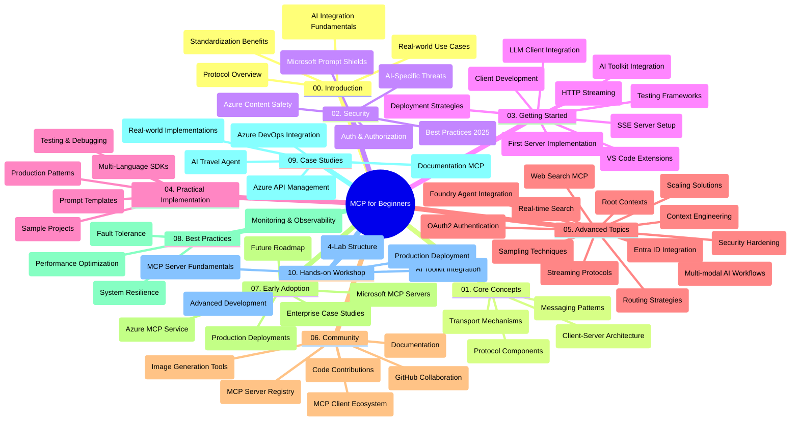

<!--
CO_OP_TRANSLATOR_METADATA:
{
  "original_hash": "e2c6ed897fa98fa08e0146101776c7ff",
  "translation_date": "2025-07-18T09:43:42+00:00",
  "source_file": "study_guide.md",
  "language_code": "it"
}
-->
# Model Context Protocol (MCP) per Principianti - Guida di Studio

Questa guida di studio offre una panoramica della struttura e del contenuto del repository per il curriculum "Model Context Protocol (MCP) per Principianti". Usa questa guida per navigare nel repository in modo efficiente e sfruttare al meglio le risorse disponibili.

## Panoramica del Repository

Il Model Context Protocol (MCP) è un framework standardizzato per le interazioni tra modelli AI e applicazioni client. Inizialmente creato da Anthropic, MCP è ora mantenuto dalla comunità MCP più ampia tramite l’organizzazione ufficiale su GitHub. Questo repository offre un curriculum completo con esempi pratici di codice in C#, Java, JavaScript, Python e TypeScript, pensato per sviluppatori AI, architetti di sistema e ingegneri del software.

## Mappa Visiva del Curriculum

## Struttura del Repository

Il repository è organizzato in dieci sezioni principali, ognuna focalizzata su diversi aspetti di MCP:

1. **Introduzione (00-Introduction/)**
   - Panoramica del Model Context Protocol
   - Perché la standardizzazione è importante nelle pipeline AI
   - Casi d’uso pratici e vantaggi

2. **Concetti Fondamentali (01-CoreConcepts/)**
   - Architettura client-server
   - Componenti chiave del protocollo
   - Pattern di messaggistica in MCP

3. **Sicurezza (02-Security/)**
   - Minacce alla sicurezza nei sistemi basati su MCP
   - Best practice per proteggere le implementazioni
   - Strategie di autenticazione e autorizzazione
   - **Documentazione Completa sulla Sicurezza**:
     - MCP Security Best Practices 2025
     - Guida all’implementazione di Azure Content Safety
     - Controlli e tecniche di sicurezza MCP
     - Riferimento rapido alle best practice MCP
   - **Argomenti Chiave sulla Sicurezza**:
     - Attacchi di prompt injection e tool poisoning
     - Hijacking di sessione e problemi di confused deputy
     - Vulnerabilità di token passthrough
     - Permessi e controllo accessi eccessivi
     - Sicurezza della supply chain per componenti AI
     - Integrazione con Microsoft Prompt Shields

4. **Primi Passi (03-GettingStarted/)**
   - Configurazione e setup dell’ambiente
   - Creazione di server e client MCP di base
   - Integrazione con applicazioni esistenti
   - Include sezioni per:
     - Prima implementazione server
     - Sviluppo client
     - Integrazione client LLM
     - Integrazione con VS Code
     - Server-Sent Events (SSE)
     - Streaming HTTP
     - Integrazione AI Toolkit
     - Strategie di testing
     - Linee guida per il deployment

5. **Implementazione Pratica (04-PracticalImplementation/)**
   - Uso degli SDK in diversi linguaggi di programmazione
   - Tecniche di debug, testing e validazione
   - Creazione di template di prompt e workflow riutilizzabili
   - Progetti di esempio con implementazioni pratiche

6. **Argomenti Avanzati (05-AdvancedTopics/)**
   - Tecniche di context engineering
   - Integrazione con Foundry agent
   - Workflow AI multimodali
   - Demo di autenticazione OAuth2
   - Capacità di ricerca in tempo reale
   - Streaming in tempo reale
   - Implementazione di root contexts
   - Strategie di routing
   - Tecniche di sampling
   - Approcci di scaling
   - Considerazioni sulla sicurezza
   - Integrazione sicurezza Entra ID
   - Integrazione con ricerca web

7. **Contributi della Comunità (06-CommunityContributions/)**
   - Come contribuire con codice e documentazione
   - Collaborazione tramite GitHub
   - Miglioramenti e feedback guidati dalla comunità
   - Uso di vari client MCP (Claude Desktop, Cline, VSCode)
   - Lavorare con server MCP popolari inclusa generazione di immagini

8. **Lezioni dall’Adozione Iniziale (07-LessonsfromEarlyAdoption/)**
   - Implementazioni reali e storie di successo
   - Costruzione e deployment di soluzioni basate su MCP
   - Tendenze e roadmap futura
   - **Guida ai Server MCP Microsoft**: Guida completa a 10 server MCP Microsoft pronti per la produzione, tra cui:
     - Microsoft Learn Docs MCP Server
     - Azure MCP Server (oltre 15 connettori specializzati)
     - GitHub MCP Server
     - Azure DevOps MCP Server
     - MarkItDown MCP Server
     - SQL Server MCP Server
     - Playwright MCP Server
     - Dev Box MCP Server
     - Azure AI Foundry MCP Server
     - Microsoft 365 Agents Toolkit MCP Server

9. **Best Practice (08-BestPractices/)**
   - Ottimizzazione e tuning delle performance
   - Progettazione di sistemi MCP fault-tolerant
   - Strategie di testing e resilienza

10. **Case Study (09-CaseStudy/)**
    - Esempio di integrazione con Azure API Management
    - Esempio di implementazione per agenzia di viaggi
    - Integrazione Azure DevOps con aggiornamenti YouTube
    - Esempi di implementazione MCP per documentazione
    - Esempi di implementazione con documentazione dettagliata

11. **Workshop Pratico (10-StreamliningAIWorkflowsBuildingAnMCPServerWithAIToolkit/)**
    - Workshop pratico completo che combina MCP con AI Toolkit
    - Costruzione di applicazioni intelligenti che collegano modelli AI con strumenti reali
    - Moduli pratici che coprono fondamentali, sviluppo server personalizzato e strategie di deployment in produzione
    - **Struttura del Lab**:
      - Lab 1: Fondamenti del Server MCP
      - Lab 2: Sviluppo Avanzato Server MCP
      - Lab 3: Integrazione AI Toolkit
      - Lab 4: Deployment e Scaling in Produzione
    - Approccio di apprendimento basato su lab con istruzioni passo passo

## Risorse Aggiuntive

Il repository include risorse di supporto:

- **Cartella Immagini**: Contiene diagrammi e illustrazioni usate nel curriculum
- **Traduzioni**: Supporto multilingue con traduzioni automatiche della documentazione
- **Risorse Ufficiali MCP**:
  - [MCP Documentation](https://modelcontextprotocol.io/)
  - [MCP Specification](https://spec.modelcontextprotocol.io/)
  - [MCP GitHub Repository](https://github.com/modelcontextprotocol)

## Come Usare Questo Repository

1. **Apprendimento Sequenziale**: Segui i capitoli in ordine (da 00 a 10) per un’esperienza di apprendimento strutturata.
2. **Focus su Linguaggi Specifici**: Se ti interessa un linguaggio di programmazione in particolare, esplora le directory dei sample per implementazioni nel linguaggio preferito.
3. **Implementazione Pratica**: Inizia dalla sezione "Primi Passi" per configurare l’ambiente e creare il tuo primo server e client MCP.
4. **Esplorazione Avanzata**: Una volta acquisiti i concetti base, approfondisci gli argomenti avanzati per ampliare le tue conoscenze.
5. **Coinvolgimento nella Comunità**: Unisciti alla comunità MCP tramite discussioni su GitHub e canali Discord per connetterti con esperti e altri sviluppatori.

## Client e Strumenti MCP

Il curriculum copre vari client e strumenti MCP:

1. **Client Ufficiali**:
   - Visual Studio Code
   - MCP in Visual Studio Code
   - Claude Desktop
   - Claude in VSCode
   - Claude API

2. **Client della Comunità**:
   - Cline (basato su terminale)
   - Cursor (editor di codice)
   - ChatMCP
   - Windsurf

3. **Strumenti di Gestione MCP**:
   - MCP CLI
   - MCP Manager
   - MCP Linker
   - MCP Router

## Server MCP Popolari

Il repository presenta diversi server MCP, tra cui:

1. **Server MCP Ufficiali Microsoft**:
   - Microsoft Learn Docs MCP Server
   - Azure MCP Server (oltre 15 connettori specializzati)
   - GitHub MCP Server
   - Azure DevOps MCP Server
   - MarkItDown MCP Server
   - SQL Server MCP Server
   - Playwright MCP Server
   - Dev Box MCP Server
   - Azure AI Foundry MCP Server
   - Microsoft 365 Agents Toolkit MCP Server

2. **Server di Riferimento Ufficiali**:
   - Filesystem
   - Fetch
   - Memory
   - Sequential Thinking

3. **Generazione Immagini**:
   - Azure OpenAI DALL-E 3
   - Stable Diffusion WebUI
   - Replicate

4. **Strumenti di Sviluppo**:
   - Git MCP
   - Terminal Control
   - Code Assistant

5. **Server Specializzati**:
   - Salesforce
   - Microsoft Teams
   - Jira & Confluence

## Contributi

Questo repository accoglie contributi dalla comunità. Consulta la sezione Contributi della Comunità per indicazioni su come contribuire efficacemente all’ecosistema MCP.

## Changelog

| Data | Modifiche |
|------|-----------|
| 18 luglio 2025 | - Aggiornata la struttura del repository per includere la Guida ai Server MCP Microsoft - Aggiunta lista completa di 10 server MCP Microsoft pronti per la produzione - Migliorata la sezione Server MCP Popolari con i Server MCP Ufficiali Microsoft - Aggiornata la sezione Case Study con esempi di file reali - Aggiunti dettagli sulla Struttura del Lab per il Workshop Pratico |
| 16 luglio 2025 | - Aggiornata la struttura del repository per riflettere i contenuti attuali - Aggiunta la sezione Client e Strumenti MCP - Aggiunta la sezione Server MCP Popolari - Aggiornata la Mappa Visiva del Curriculum con tutti gli argomenti attuali - Migliorata la sezione Argomenti Avanzati con tutte le aree specializzate - Aggiornati i Case Study con esempi reali - Chiarita l’origine di MCP come creato da Anthropic |
| 11 giugno 2025 | - Creazione iniziale della guida di studio - Aggiunta Mappa Visiva del Curriculum - Definita la struttura del repository - Inclusi progetti di esempio e risorse aggiuntive |

---

*Questa guida di studio è stata aggiornata il 18 luglio 2025 e fornisce una panoramica del repository a quella data. Il contenuto del repository potrebbe essere aggiornato successivamente.*

**Disclaimer**:  
Questo documento è stato tradotto utilizzando il servizio di traduzione automatica [Co-op Translator](https://github.com/Azure/co-op-translator). Pur impegnandoci per garantire l’accuratezza, si prega di notare che le traduzioni automatiche possono contenere errori o imprecisioni. Il documento originale nella sua lingua nativa deve essere considerato la fonte autorevole. Per informazioni critiche, si raccomanda la traduzione professionale effettuata da un umano. Non ci assumiamo alcuna responsabilità per eventuali malintesi o interpretazioni errate derivanti dall’uso di questa traduzione.