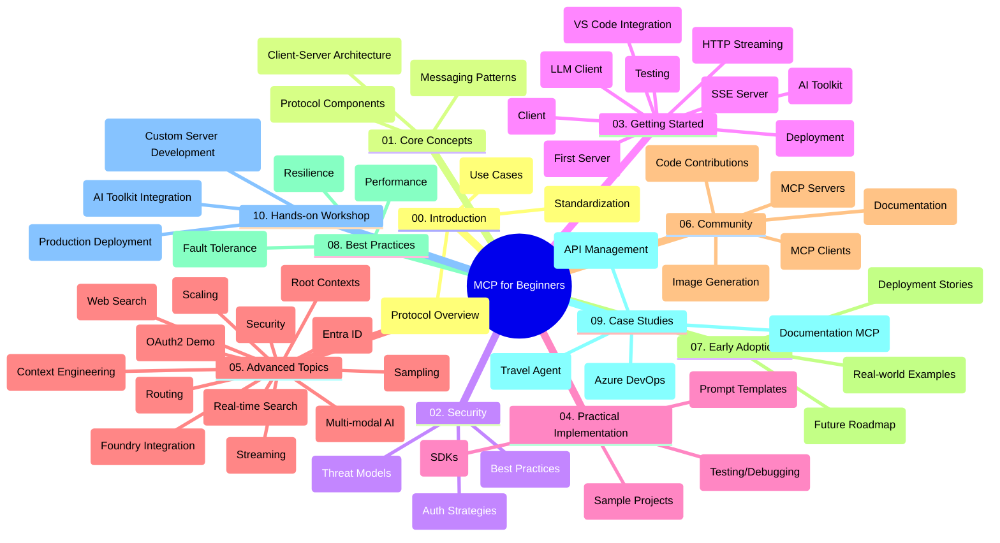

<!--
CO_OP_TRANSLATOR_METADATA:
{
  "original_hash": "77bfab7090f987a5b9fe078f50dbda13",
  "translation_date": "2025-07-17T01:11:09+00:00",
  "source_file": "study_guide.md",
  "language_code": "it"
}
-->
# Model Context Protocol (MCP) per Principianti - Guida di Studio

Questa guida di studio offre una panoramica della struttura e del contenuto del repository per il curriculum "Model Context Protocol (MCP) per Principianti". Usa questa guida per navigare nel repository in modo efficiente e sfruttare al meglio le risorse disponibili.

## Panoramica del Repository

Il Model Context Protocol (MCP) è un framework standardizzato per le interazioni tra modelli AI e applicazioni client. Inizialmente creato da Anthropic, MCP è ora mantenuto dalla più ampia comunità MCP tramite l’organizzazione ufficiale su GitHub. Questo repository offre un curriculum completo con esempi pratici di codice in C#, Java, JavaScript, Python e TypeScript, pensato per sviluppatori AI, architetti di sistema e ingegneri del software.

## Mappa Visiva del Curriculum

## Struttura del Repository

Il repository è organizzato in dieci sezioni principali, ognuna focalizzata su diversi aspetti di MCP:

1. **Introduzione (00-Introduction/)**
   - Panoramica del Model Context Protocol
   - Perché la standardizzazione è importante nelle pipeline AI
   - Casi d’uso pratici e vantaggi

2. **Concetti Fondamentali (01-CoreConcepts/)**
   - Architettura client-server
   - Componenti chiave del protocollo
   - Pattern di messaggistica in MCP

3. **Sicurezza (02-Security/)**
   - Minacce alla sicurezza nei sistemi basati su MCP
   - Best practice per proteggere le implementazioni
   - Strategie di autenticazione e autorizzazione

4. **Primi Passi (03-GettingStarted/)**
   - Configurazione e preparazione dell’ambiente
   - Creazione di server e client MCP di base
   - Integrazione con applicazioni esistenti
   - Include sezioni su:
     - Prima implementazione del server
     - Sviluppo client
     - Integrazione client LLM
     - Integrazione con VS Code
     - Server-Sent Events (SSE)
     - Streaming HTTP
     - Integrazione AI Toolkit
     - Strategie di testing
     - Linee guida per il deployment

5. **Implementazione Pratica (04-PracticalImplementation/)**
   - Uso degli SDK in diversi linguaggi di programmazione
   - Tecniche di debug, testing e validazione
   - Creazione di template di prompt e workflow riutilizzabili
   - Progetti di esempio con implementazioni pratiche

6. **Argomenti Avanzati (05-AdvancedTopics/)**
   - Tecniche di context engineering
   - Integrazione con agenti Foundry
   - Workflow AI multimodali
   - Demo di autenticazione OAuth2
   - Funzionalità di ricerca in tempo reale
   - Streaming in tempo reale
   - Implementazione di root contexts
   - Strategie di routing
   - Tecniche di sampling
   - Approcci di scaling
   - Considerazioni sulla sicurezza
   - Integrazione sicurezza Entra ID
   - Integrazione con ricerca web

7. **Contributi della Comunità (06-CommunityContributions/)**
   - Come contribuire con codice e documentazione
   - Collaborazione tramite GitHub
   - Miglioramenti e feedback guidati dalla comunità
   - Uso di vari client MCP (Claude Desktop, Cline, VSCode)
   - Lavorare con server MCP popolari, inclusa la generazione di immagini

8. **Lezioni dall’Adozione Iniziale (07-LessonsfromEarlyAdoption/)**
   - Implementazioni reali e storie di successo
   - Costruzione e deployment di soluzioni basate su MCP
   - Tendenze e roadmap futura

9. **Best Practice (08-BestPractices/)**
   - Ottimizzazione e tuning delle performance
   - Progettazione di sistemi MCP fault-tolerant
   - Strategie di testing e resilienza

10. **Case Study (09-CaseStudy/)**
    - Case study: integrazione con Azure API Management
    - Case study: implementazione per agenzia di viaggi
    - Case study: integrazione Azure DevOps con YouTube
    - Esempi di implementazione con documentazione dettagliata

11. **Workshop Pratico (10-StreamliningAIWorkflowsBuildingAnMCPServerWithAIToolkit/)**
    - Workshop pratico completo che combina MCP con AI Toolkit
    - Costruzione di applicazioni intelligenti che collegano modelli AI con strumenti reali
    - Moduli pratici che coprono fondamentali, sviluppo server personalizzati e strategie di deployment in produzione
    - Approccio di apprendimento basato su laboratori con istruzioni passo-passo

## Risorse Aggiuntive

Il repository include risorse di supporto:

- **Cartella Immagini**: contiene diagrammi e illustrazioni usate nel curriculum
- **Traduzioni**: supporto multilingue con traduzioni automatiche della documentazione
- **Risorse Ufficiali MCP**:
  - [MCP Documentation](https://modelcontextprotocol.io/)
  - [MCP Specification](https://spec.modelcontextprotocol.io/)
  - [MCP GitHub Repository](https://github.com/modelcontextprotocol)

## Come Usare Questo Repository

1. **Apprendimento Sequenziale**: Segui i capitoli in ordine (da 00 a 10) per un’esperienza di apprendimento strutturata.
2. **Focus sul Linguaggio**: Se ti interessa un linguaggio di programmazione specifico, esplora le directory dei sample per le implementazioni nella tua lingua preferita.
3. **Implementazione Pratica**: Inizia dalla sezione "Primi Passi" per configurare l’ambiente e creare il tuo primo server e client MCP.
4. **Esplorazione Avanzata**: Una volta acquisiti i concetti base, approfondisci gli argomenti avanzati per ampliare le tue conoscenze.
5. **Coinvolgimento nella Comunità**: Unisciti alla comunità MCP tramite le discussioni su GitHub e i canali Discord per connetterti con esperti e altri sviluppatori.

## Client e Strumenti MCP

Il curriculum copre vari client e strumenti MCP:

1. **Client Ufficiali**:
   - Claude Desktop
   - Claude in VSCode
   - Claude API

2. **Client della Comunità**:
   - Cline (basato su terminale)
   - Cursor (editor di codice)
   - ChatMCP
   - Windsurf

3. **Strumenti di Gestione MCP**:
   - MCP CLI
   - MCP Manager
   - MCP Linker
   - MCP Router

## Server MCP Popolari

Il repository presenta diversi server MCP, tra cui:

1. **Server di Riferimento Ufficiali**:
   - Filesystem
   - Fetch
   - Memory
   - Sequential Thinking

2. **Generazione Immagini**:
   - Azure OpenAI DALL-E 3
   - Stable Diffusion WebUI
   - Replicate

3. **Strumenti di Sviluppo**:
   - Git MCP
   - Terminal Control
   - Code Assistant

4. **Server Specializzati**:
   - Salesforce
   - Microsoft Teams
   - Jira & Confluence

## Contribuire

Questo repository accoglie contributi dalla comunità. Consulta la sezione Contributi della Comunità per indicazioni su come contribuire efficacemente all’ecosistema MCP.

## Changelog

| Data | Modifiche |
|------|-----------|
| 16 luglio 2025 | - Aggiornata la struttura del repository per riflettere i contenuti attuali - Aggiunta la sezione Client e Strumenti MCP - Aggiunta la sezione Server MCP Popolari - Aggiornata la Mappa Visiva del Curriculum con tutti gli argomenti attuali - Potenziata la sezione Argomenti Avanzati con tutte le aree specializzate - Aggiornati i Case Study con esempi reali - Chiarita l’origine di MCP come creato da Anthropic |
| 11 giugno 2025 | - Creazione iniziale della guida di studio - Aggiunta della Mappa Visiva del Curriculum - Definizione della struttura del repository - Inclusi progetti di esempio e risorse aggiuntive |

---

*Questa guida di studio è stata aggiornata il 16 luglio 2025 e fornisce una panoramica del repository a quella data. Il contenuto del repository potrebbe essere aggiornato successivamente.*

**Disclaimer**:  
Questo documento è stato tradotto utilizzando il servizio di traduzione automatica [Co-op Translator](https://github.com/Azure/co-op-translator). Pur impegnandoci per garantire l’accuratezza, si prega di notare che le traduzioni automatiche possono contenere errori o imprecisioni. Il documento originale nella sua lingua nativa deve essere considerato la fonte autorevole. Per informazioni critiche, si raccomanda una traduzione professionale effettuata da un umano. Non ci assumiamo alcuna responsabilità per eventuali malintesi o interpretazioni errate derivanti dall’uso di questa traduzione.