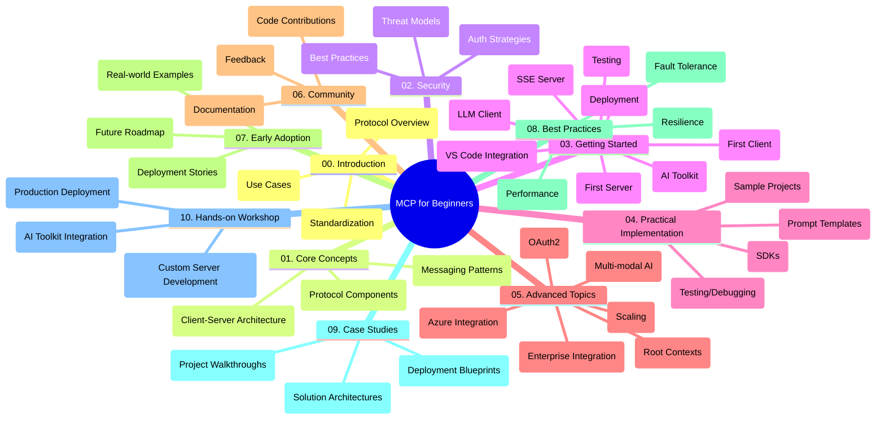

<!--
CO_OP_TRANSLATOR_METADATA:
{
  "original_hash": "a607d4febc94caee9a12b77795f7fc9a",
  "translation_date": "2025-06-11T16:43:02+00:00",
  "source_file": "study_guide.md",
  "language_code": "it"
}
-->
# Protocollo del Contesto Modello (MCP) per Principianti - Guida di Studio

Questa guida di studio fornisce una panoramica della struttura e dei contenuti del repository per il curriculum "Protocollo del Contesto Modello (MCP) per Principianti". Usa questa guida per navigare nel repository in modo efficiente e sfruttare al massimo le risorse disponibili.

## Panoramica del Repository

Il Protocollo del Contesto Modello (MCP) è un framework standardizzato per le interazioni tra modelli AI e applicazioni client. Questo repository offre un curriculum completo con esempi pratici di codice in C#, Java, JavaScript, Python e TypeScript, pensato per sviluppatori AI, architetti di sistema e ingegneri del software.

## Mappa Visiva del Curriculum

## Struttura del Repository

Il repository è organizzato in dieci sezioni principali, ognuna focalizzata su diversi aspetti del MCP:

1. **Introduzione (00-Introduction/)**
   - Panoramica del Protocollo del Contesto Modello
   - Perché la standardizzazione è importante nelle pipeline AI
   - Casi d’uso pratici e vantaggi

2. **Concetti Fondamentali (01-CoreConcepts/)**
   - Architettura client-server
   - Componenti chiave del protocollo
   - Pattern di messaggistica in MCP

3. **Sicurezza (02-Security/)**
   - Minacce alla sicurezza nei sistemi basati su MCP
   - Best practice per implementazioni sicure
   - Strategie di autenticazione e autorizzazione

4. **Primi Passi (03-GettingStarted/)**
   - Configurazione dell’ambiente
   - Creazione di server e client MCP di base
   - Integrazione con applicazioni esistenti
   - Sottosezioni per primo server, primo client, client LLM, integrazione con VS Code, server SSE, AI Toolkit, testing e deployment

5. **Implementazione Pratica (04-PracticalImplementation/)**
   - Uso degli SDK in diversi linguaggi di programmazione
   - Tecniche di debugging, testing e validazione
   - Creazione di template di prompt riutilizzabili e workflow
   - Progetti di esempio con implementazioni pratiche

6. **Argomenti Avanzati (05-AdvancedTopics/)**
   - Workflow AI multi-modale e estendibilità
   - Strategie di scaling sicuro
   - MCP negli ecosistemi enterprise
   - Temi specializzati tra cui integrazione Azure, multi-modality, OAuth2, root contexts, routing, sampling, scaling, sicurezza, integrazione web search e streaming.

7. **Contributi della Comunità (06-CommunityContributions/)**
   - Come contribuire con codice e documentazione
   - Collaborazione tramite GitHub
   - Miglioramenti guidati dalla comunità e feedback

8. **Lezioni dall’Adozione Precoce (07-LessonsfromEarlyAdoption/)**
   - Implementazioni reali e casi di successo
   - Costruzione e deployment di soluzioni basate su MCP
   - Tendenze e roadmap futura

9. **Best Practices (08-BestPractices/)**
   - Ottimizzazione delle prestazioni
   - Progettazione di sistemi MCP fault-tolerant
   - Strategie di testing e resilienza

10. **Case Study (09-CaseStudy/)**
    - Analisi approfondite di architetture di soluzioni MCP
    - Blueprint di deployment e suggerimenti per l’integrazione
    - Diagrammi annotati e walkthrough di progetti

11. **Workshop Pratico (10-StreamliningAIWorkflowsBuildingAnMCPServerWithAIToolkit/)**
    - Workshop pratico completo che unisce MCP e AI Toolkit di Microsoft per VS Code
    - Costruzione di applicazioni intelligenti che collegano modelli AI con strumenti reali
    - Moduli pratici che coprono fondamentali, sviluppo di server personalizzati e strategie di deployment in produzione

## Progetti di Esempio

Il repository include diversi progetti di esempio che mostrano l’implementazione di MCP in vari linguaggi di programmazione:

### Esempi Base di Calcolatore MCP
- Esempio di Server MCP in C#
- Calcolatore MCP in Java
- Demo MCP in JavaScript
- Server MCP in Python
- Esempio MCP in TypeScript

### Progetti Avanzati di Calcolatore MCP
- Esempio Avanzato in C#
- Applicazione Container Java
- Esempio Avanzato in JavaScript
- Implementazione Complessa in Python
- Esempio Container in TypeScript

## Risorse Aggiuntive

Il repository include risorse di supporto:

- **Cartella Images**: contiene diagrammi e illustrazioni usati nel curriculum
- **Traduzioni**: supporto multilingue con traduzioni automatiche della documentazione
- **Risorse Ufficiali MCP**:
  - [MCP Documentation](https://modelcontextprotocol.io/)
  - [MCP Specification](https://spec.modelcontextprotocol.io/)
  - [MCP GitHub Repository](https://github.com/modelcontextprotocol)

## Come Usare Questo Repository

1. **Apprendimento Sequenziale**: Segui i capitoli in ordine (da 00 a 10) per un’esperienza di apprendimento strutturata.
2. **Focus su Linguaggi Specifici**: Se ti interessa un linguaggio di programmazione in particolare, esplora le cartelle dei sample per le implementazioni nella tua lingua preferita.
3. **Implementazione Pratica**: Inizia dalla sezione "Getting Started" per configurare l’ambiente e creare il tuo primo server e client MCP.
4. **Esplorazione Avanzata**: Una volta acquisiti i concetti base, approfondisci gli argomenti avanzati per ampliare le tue conoscenze.
5. **Coinvolgimento nella Comunità**: Unisciti al [Azure AI Foundry Discord](https://discord.com/invite/ByRwuEEgH4) per connetterti con esperti e altri sviluppatori.

## Contributi

Questo repository accoglie contributi dalla comunità. Consulta la sezione Community Contributions per indicazioni su come partecipare.

---

*Questa guida di studio è stata creata l’11 giugno 2025 e fornisce una panoramica del repository aggiornata a quella data. I contenuti del repository potrebbero essere stati aggiornati successivamente.*

**Disclaimer**:  
Questo documento è stato tradotto utilizzando il servizio di traduzione AI [Co-op Translator](https://github.com/Azure/co-op-translator). Pur impegnandoci per l'accuratezza, si prega di notare che le traduzioni automatiche possono contenere errori o imprecisioni. Il documento originale nella sua lingua nativa deve essere considerato la fonte autorevole. Per informazioni critiche, si raccomanda la traduzione professionale umana. Non siamo responsabili per eventuali malintesi o interpretazioni errate derivanti dall'uso di questa traduzione.