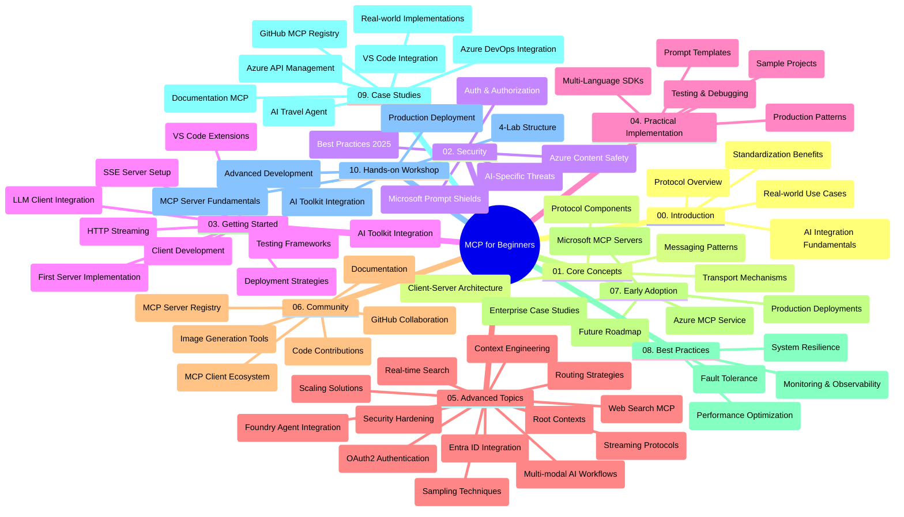

<!--
CO_OP_TRANSLATOR_METADATA:
{
  "original_hash": "719117a0a5f34ade7b5dfb61ee06fb13",
  "translation_date": "2025-09-26T18:19:01+00:00",
  "source_file": "study_guide.md",
  "language_code": "it"
}
-->
# Protocollo di Contesto Modello (MCP) per Principianti - Guida allo Studio

Questa guida allo studio offre una panoramica della struttura e dei contenuti del repository per il curriculum "Protocollo di Contesto Modello (MCP) per Principianti". Utilizza questa guida per navigare nel repository in modo efficiente e sfruttare al meglio le risorse disponibili.

## Panoramica del Repository

Il Protocollo di Contesto Modello (MCP) è un framework standardizzato per le interazioni tra modelli di intelligenza artificiale e applicazioni client. Creato inizialmente da Anthropic, MCP è ora mantenuto dalla comunità MCP attraverso l'organizzazione ufficiale su GitHub. Questo repository offre un curriculum completo con esempi pratici di codice in C#, Java, JavaScript, Python e TypeScript, pensato per sviluppatori AI, architetti di sistema e ingegneri software.

## Mappa Visiva del Curriculum

## Struttura del Repository

Il repository è organizzato in dieci sezioni principali, ciascuna focalizzata su diversi aspetti del MCP:

1. **Introduzione (00-Introduction/)**
   - Panoramica del Protocollo di Contesto Modello
   - Perché la standardizzazione è importante nei flussi di lavoro AI
   - Casi d'uso pratici e benefici

2. **Concetti Fondamentali (01-CoreConcepts/)**
   - Architettura client-server
   - Componenti chiave del protocollo
   - Modelli di messaggistica nel MCP

3. **Sicurezza (02-Security/)**
   - Minacce alla sicurezza nei sistemi basati su MCP
   - Migliori pratiche per implementazioni sicure
   - Strategie di autenticazione e autorizzazione
   - **Documentazione Completa sulla Sicurezza**:
     - Migliori Pratiche di Sicurezza MCP 2025
     - Guida all'Implementazione di Sicurezza su Azure
     - Controlli e Tecniche di Sicurezza MCP
     - Riferimento Rapido alle Migliori Pratiche MCP
   - **Argomenti Chiave sulla Sicurezza**:
     - Attacchi di iniezione di prompt e avvelenamento degli strumenti
     - Furto di sessione e problemi di delega confusa
     - Vulnerabilità nel passaggio di token
     - Permessi eccessivi e controllo degli accessi
     - Sicurezza della catena di approvvigionamento per componenti AI
     - Integrazione con Microsoft Prompt Shields

4. **Iniziare (03-GettingStarted/)**
   - Configurazione dell'ambiente
   - Creazione di server e client MCP di base
   - Integrazione con applicazioni esistenti
   - Include sezioni su:
     - Prima implementazione del server
     - Sviluppo del client
     - Integrazione con client LLM
     - Integrazione con VS Code
     - Server Server-Sent Events (SSE)
     - Streaming HTTP
     - Integrazione con AI Toolkit
     - Strategie di test
     - Linee guida per il deployment

5. **Implementazione Pratica (04-PracticalImplementation/)**
   - Utilizzo di SDK in diversi linguaggi di programmazione
   - Tecniche di debug, test e validazione
   - Creazione di modelli di prompt e flussi di lavoro riutilizzabili
   - Progetti di esempio con implementazioni pratiche

6. **Argomenti Avanzati (05-AdvancedTopics/)**
   - Tecniche di ingegneria del contesto
   - Integrazione con agenti Foundry
   - Flussi di lavoro AI multi-modali
   - Demo di autenticazione OAuth2
   - Capacità di ricerca in tempo reale
   - Streaming in tempo reale
   - Implementazione di contesti radice
   - Strategie di routing
   - Tecniche di campionamento
   - Approcci di scalabilità
   - Considerazioni sulla sicurezza
   - Integrazione di sicurezza Entra ID
   - Integrazione con ricerca web

7. **Contributi della Comunità (06-CommunityContributions/)**
   - Come contribuire con codice e documentazione
   - Collaborazione tramite GitHub
   - Miglioramenti e feedback guidati dalla comunità
   - Utilizzo di vari client MCP (Claude Desktop, Cline, VSCode)
   - Lavorare con server MCP popolari, inclusa la generazione di immagini

8. **Lezioni dall'Adozione Iniziale (07-LessonsfromEarlyAdoption/)**
   - Implementazioni reali e storie di successo
   - Creazione e deployment di soluzioni basate su MCP
   - Tendenze e roadmap futura
   - **Guida ai Server MCP di Microsoft**: Guida completa a 10 server MCP Microsoft pronti per la produzione, tra cui:
     - Server MCP Microsoft Learn Docs
     - Server MCP Azure (15+ connettori specializzati)
     - Server MCP GitHub
     - Server MCP Azure DevOps
     - Server MCP MarkItDown
     - Server MCP SQL Server
     - Server MCP Playwright
     - Server MCP Dev Box
     - Server MCP Azure AI Foundry
     - Server MCP Microsoft 365 Agents Toolkit

9. **Migliori Pratiche (08-BestPractices/)**
   - Ottimizzazione delle prestazioni
   - Progettazione di sistemi MCP tolleranti ai guasti
   - Strategie di test e resilienza

10. **Studi di Caso (09-CaseStudy/)**
    - **Sette studi di caso completi** che dimostrano la versatilità del MCP in scenari diversi:
    - **Agenti di Viaggio AI su Azure**: Orchestrazione multi-agente con Azure OpenAI e AI Search
    - **Integrazione con Azure DevOps**: Automazione dei processi di workflow con aggiornamenti di dati YouTube
    - **Recupero di Documentazione in Tempo Reale**: Client console Python con streaming HTTP
    - **Generatore Interattivo di Piani di Studio**: App web Chainlit con AI conversazionale
    - **Documentazione In-Editor**: Integrazione con VS Code e flussi di lavoro GitHub Copilot
    - **Gestione API su Azure**: Integrazione API aziendale con creazione di server MCP
    - **Registro MCP su GitHub**: Sviluppo dell'ecosistema e piattaforma di integrazione agentica
    - Esempi di implementazione che spaziano dall'integrazione aziendale alla produttività degli sviluppatori e allo sviluppo dell'ecosistema

11. **Workshop Pratico (10-StreamliningAIWorkflowsBuildingAnMCPServerWithAIToolkit/)**
    - Workshop pratico completo che combina MCP con AI Toolkit
    - Creazione di applicazioni intelligenti che collegano modelli AI con strumenti reali
    - Moduli pratici che coprono i fondamenti, lo sviluppo di server personalizzati e le strategie di deployment in produzione
    - **Struttura del Laboratorio**:
      - Lab 1: Fondamenti del Server MCP
      - Lab 2: Sviluppo Avanzato del Server MCP
      - Lab 3: Integrazione con AI Toolkit
      - Lab 4: Deployment in Produzione e Scalabilità
    - Approccio di apprendimento basato su laboratori con istruzioni passo-passo

## Risorse Aggiuntive

Il repository include risorse di supporto:

- **Cartella Immagini**: Contiene diagrammi e illustrazioni utilizzati nel curriculum
- **Traduzioni**: Supporto multilingue con traduzioni automatiche della documentazione
- **Risorse Ufficiali MCP**:
  - [Documentazione MCP](https://modelcontextprotocol.io/)
  - [Specifiche MCP](https://spec.modelcontextprotocol.io/)
  - [Repository GitHub MCP](https://github.com/modelcontextprotocol)

## Come Utilizzare Questo Repository

1. **Apprendimento Sequenziale**: Segui i capitoli in ordine (da 00 a 10) per un'esperienza di apprendimento strutturata.
2. **Focus su Linguaggi Specifici**: Se sei interessato a un linguaggio di programmazione specifico, esplora le directory di esempio per implementazioni nel tuo linguaggio preferito.
3. **Implementazione Pratica**: Inizia con la sezione "Iniziare" per configurare l'ambiente e creare il tuo primo server e client MCP.
4. **Esplorazione Avanzata**: Una volta acquisita familiarità con le basi, approfondisci gli argomenti avanzati per ampliare le tue conoscenze.
5. **Coinvolgimento della Comunità**: Unisciti alla comunità MCP tramite discussioni su GitHub e canali Discord per connetterti con esperti e altri sviluppatori.

## Client e Strumenti MCP

Il curriculum copre vari client e strumenti MCP:

1. **Client Ufficiali**:
   - Visual Studio Code 
   - MCP in Visual Studio Code
   - Claude Desktop
   - Claude in VSCode 
   - Claude API

2. **Client della Comunità**:
   - Cline (basato su terminale)
   - Cursor (editor di codice)
   - ChatMCP
   - Windsurf

3. **Strumenti di Gestione MCP**:
   - MCP CLI
   - MCP Manager
   - MCP Linker
   - MCP Router

## Server MCP Popolari

Il repository introduce vari server MCP, tra cui:

1. **Server MCP Ufficiali di Microsoft**:
   - Server MCP Microsoft Learn Docs
   - Server MCP Azure (15+ connettori specializzati)
   - Server MCP GitHub
   - Server MCP Azure DevOps
   - Server MCP MarkItDown
   - Server MCP SQL Server
   - Server MCP Playwright
   - Server MCP Dev Box
   - Server MCP Azure AI Foundry
   - Server MCP Microsoft 365 Agents Toolkit

2. **Server di Riferimento Ufficiali**:
   - Filesystem
   - Fetch
   - Memory
   - Sequential Thinking

3. **Generazione di Immagini**:
   - Azure OpenAI DALL-E 3
   - Stable Diffusion WebUI
   - Replicate

4. **Strumenti di Sviluppo**:
   - Git MCP
   - Controllo Terminale
   - Assistente Codice

5. **Server Specializzati**:
   - Salesforce
   - Microsoft Teams
   - Jira & Confluence

## Contributi

Questo repository accoglie contributi dalla comunità. Consulta la sezione Contributi della Comunità per indicazioni su come contribuire efficacemente all'ecosistema MCP.

## Registro delle Modifiche

| Data | Modifiche |
|------|-----------|
| 26 settembre 2025 | - Aggiunto studio di caso GitHub MCP Registry alla sezione 09-CaseStudy - Aggiornati gli studi di caso per riflettere sette studi completi - Migliorate le descrizioni degli studi di caso con dettagli specifici di implementazione - Aggiornata la Mappa Visiva del Curriculum per includere GitHub MCP Registry - Rivista la struttura della guida allo studio per riflettere il focus sullo sviluppo dell'ecosistema |
| 18 luglio 2025 | - Aggiornata la struttura del repository per includere la Guida ai Server MCP di Microsoft - Aggiunta lista completa di 10 server MCP Microsoft pronti per la produzione - Migliorata la sezione Server MCP Popolari con Server MCP Ufficiali di Microsoft - Aggiornata la sezione Studi di Caso con esempi di file reali - Aggiunti dettagli sulla Struttura del Laboratorio per il Workshop Pratico |
| 16 luglio 2025 | - Aggiornata la struttura del repository per riflettere i contenuti attuali - Aggiunta la sezione Client e Strumenti MCP - Aggiunta la sezione Server MCP Popolari - Aggiornata la Mappa Visiva del Curriculum con tutti gli argomenti attuali - Migliorata la sezione Argomenti Avanzati con tutte le aree specializzate - Aggiornata la sezione Studi di Caso per riflettere esempi reali - Chiarita l'origine del MCP come creato da Anthropic |
| 11 giugno 2025 | - Creazione iniziale della guida allo studio - Aggiunta Mappa Visiva del Curriculum - Struttura del repository delineata - Inclusi progetti di esempio e risorse aggiuntive |

---

*Questa guida allo studio è stata aggiornata il 26 settembre 2025 e offre una panoramica del repository a quella data. I contenuti del repository potrebbero essere aggiornati dopo questa data.*

---

