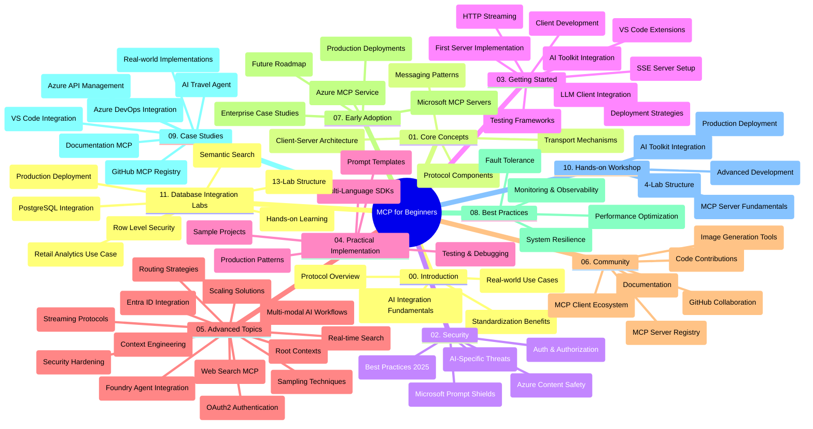

<!--
CO_OP_TRANSLATOR_METADATA:
{
  "original_hash": "aa1ce97bc694b08faf3018bab6d275b9",
  "translation_date": "2025-09-30T16:19:06+00:00",
  "source_file": "study_guide.md",
  "language_code": "it"
}
-->
# Protocollo di Contesto Modello (MCP) per Principianti - Guida allo Studio

Questa guida allo studio offre una panoramica della struttura e dei contenuti del repository per il curriculum "Protocollo di Contesto Modello (MCP) per Principianti". Utilizza questa guida per navigare nel repository in modo efficiente e sfruttare al meglio le risorse disponibili.

## Panoramica del Repository

Il Protocollo di Contesto Modello (MCP) è un framework standardizzato per le interazioni tra modelli di intelligenza artificiale e applicazioni client. Creato inizialmente da Anthropic, MCP è ora mantenuto dalla comunità MCP attraverso l'organizzazione ufficiale su GitHub. Questo repository offre un curriculum completo con esempi pratici di codice in C#, Java, JavaScript, Python e TypeScript, progettato per sviluppatori AI, architetti di sistema e ingegneri software.

## Mappa Visiva del Curriculum

## Struttura del Repository

Il repository è organizzato in undici sezioni principali, ciascuna focalizzata su diversi aspetti del MCP:

1. **Introduzione (00-Introduction/)**
   - Panoramica del Protocollo di Contesto Modello
   - Perché la standardizzazione è importante nei flussi di lavoro AI
   - Casi d'uso pratici e benefici

2. **Concetti Fondamentali (01-CoreConcepts/)**
   - Architettura client-server
   - Componenti chiave del protocollo
   - Modelli di messaggistica nel MCP

3. **Sicurezza (02-Security/)**
   - Minacce alla sicurezza nei sistemi basati su MCP
   - Migliori pratiche per implementazioni sicure
   - Strategie di autenticazione e autorizzazione
   - **Documentazione Completa sulla Sicurezza**:
     - Migliori Pratiche di Sicurezza MCP 2025
     - Guida all'Implementazione di Sicurezza di Azure
     - Controlli e Tecniche di Sicurezza MCP
     - Riferimento Rapido alle Migliori Pratiche MCP
   - **Argomenti Chiave sulla Sicurezza**:
     - Attacchi di iniezione di prompt e avvelenamento degli strumenti
     - Furto di sessione e problemi di delega confusa
     - Vulnerabilità nel passaggio di token
     - Permessi eccessivi e controllo degli accessi
     - Sicurezza della catena di approvvigionamento per componenti AI
     - Integrazione di Microsoft Prompt Shields

4. **Iniziare (03-GettingStarted/)**
   - Configurazione dell'ambiente
   - Creazione di server e client MCP di base
   - Integrazione con applicazioni esistenti
   - Include sezioni su:
     - Prima implementazione del server
     - Sviluppo del client
     - Integrazione del client LLM
     - Integrazione con VS Code
     - Server Server-Sent Events (SSE)
     - Streaming HTTP
     - Integrazione con AI Toolkit
     - Strategie di test
     - Linee guida per il deployment

5. **Implementazione Pratica (04-PracticalImplementation/)**
   - Utilizzo di SDK in diversi linguaggi di programmazione
   - Tecniche di debug, test e validazione
   - Creazione di modelli di prompt e flussi di lavoro riutilizzabili
   - Progetti di esempio con esempi di implementazione

6. **Argomenti Avanzati (05-AdvancedTopics/)**
   - Tecniche di ingegneria del contesto
   - Integrazione di agenti Foundry
   - Flussi di lavoro AI multi-modali
   - Demo di autenticazione OAuth2
   - Capacità di ricerca in tempo reale
   - Streaming in tempo reale
   - Implementazione di contesti radice
   - Strategie di routing
   - Tecniche di campionamento
   - Approcci di scalabilità
   - Considerazioni sulla sicurezza
   - Integrazione di sicurezza Entra ID
   - Integrazione con la ricerca web

7. **Contributi della Comunità (06-CommunityContributions/)**
   - Come contribuire con codice e documentazione
   - Collaborare tramite GitHub
   - Miglioramenti e feedback guidati dalla comunità
   - Utilizzo di vari client MCP (Claude Desktop, Cline, VSCode)
   - Lavorare con server MCP popolari inclusa la generazione di immagini

8. **Lezioni dall'Adozione Iniziale (07-LessonsfromEarlyAdoption/)**
   - Implementazioni reali e storie di successo
   - Creazione e deployment di soluzioni basate su MCP
   - Tendenze e roadmap futura
   - **Guida ai Server MCP di Microsoft**: Guida completa a 10 server MCP Microsoft pronti per la produzione, tra cui:
     - Server MCP Microsoft Learn Docs
     - Server MCP Azure (15+ connettori specializzati)
     - Server MCP GitHub
     - Server MCP Azure DevOps
     - Server MCP MarkItDown
     - Server MCP SQL Server
     - Server MCP Playwright
     - Server MCP Dev Box
     - Server MCP Azure AI Foundry
     - Server MCP Microsoft 365 Agents Toolkit

9. **Migliori Pratiche (08-BestPractices/)**
   - Ottimizzazione delle prestazioni
   - Progettazione di sistemi MCP tolleranti ai guasti
   - Strategie di test e resilienza

10. **Studi di Caso (09-CaseStudy/)**
    - **Sette studi di caso completi** che dimostrano la versatilità del MCP in diversi scenari:
    - **Agenti di Viaggio AI di Azure**: Orchestrazione multi-agente con Azure OpenAI e AI Search
    - **Integrazione Azure DevOps**: Automazione dei processi di flusso di lavoro con aggiornamenti di dati YouTube
    - **Recupero Documentazione in Tempo Reale**: Client console Python con streaming HTTP
    - **Generatore di Piani di Studio Interattivo**: App web Chainlit con AI conversazionale
    - **Documentazione In-Editor**: Integrazione VS Code con flussi di lavoro GitHub Copilot
    - **Gestione API Azure**: Integrazione API aziendale con creazione di server MCP
    - **Registro MCP GitHub**: Sviluppo dell'ecosistema e piattaforma di integrazione agentica
    - Esempi di implementazione che spaziano dall'integrazione aziendale alla produttività degli sviluppatori e allo sviluppo dell'ecosistema

11. **Workshop Pratico (10-StreamliningAIWorkflowsBuildingAnMCPServerWithAIToolkit/)**
    - Workshop pratico completo che combina MCP con AI Toolkit
    - Creazione di applicazioni intelligenti che collegano modelli AI con strumenti reali
    - Moduli pratici che coprono i fondamenti, lo sviluppo di server personalizzati e le strategie di deployment in produzione
    - **Struttura del Laboratorio**:
      - Lab 1: Fondamenti del Server MCP
      - Lab 2: Sviluppo Avanzato del Server MCP
      - Lab 3: Integrazione AI Toolkit
      - Lab 4: Deployment e Scalabilità in Produzione
    - Approccio di apprendimento basato su laboratori con istruzioni passo-passo

12. **Laboratori di Integrazione Database Server MCP (11-MCPServerHandsOnLabs/)**
    - **Percorso di apprendimento completo di 13 laboratori** per la creazione di server MCP pronti per la produzione con integrazione PostgreSQL
    - **Implementazione di analisi retail reale** utilizzando il caso d'uso Zava Retail
    - **Modelli aziendali di livello enterprise** inclusi Row Level Security (RLS), ricerca semantica e accesso ai dati multi-tenant
    - **Struttura Completa del Laboratorio**:
      - **Laboratori 00-03: Fondamenti** - Introduzione, Architettura, Sicurezza, Configurazione dell'Ambiente
      - **Laboratori 04-06: Creazione del Server MCP** - Progettazione del Database, Implementazione del Server MCP, Sviluppo degli Strumenti
      - **Laboratori 07-09: Funzionalità Avanzate** - Ricerca Semantica, Test & Debugging, Integrazione VS Code
      - **Laboratori 10-12: Produzione & Migliori Pratiche** - Deployment, Monitoraggio, Ottimizzazione
    - **Tecnologie Coperte**: Framework FastMCP, PostgreSQL, Azure OpenAI, Azure Container Apps, Application Insights
    - **Risultati dell'Apprendimento**: Server MCP pronti per la produzione, modelli di integrazione database, analisi AI-powered, sicurezza aziendale

## Risorse Aggiuntive

Il repository include risorse di supporto:

- **Cartella Immagini**: Contiene diagrammi e illustrazioni utilizzati nel curriculum
- **Traduzioni**: Supporto multilingue con traduzioni automatiche della documentazione
- **Risorse Ufficiali MCP**:
  - [Documentazione MCP](https://modelcontextprotocol.io/)
  - [Specifiche MCP](https://spec.modelcontextprotocol.io/)
  - [Repository GitHub MCP](https://github.com/modelcontextprotocol)

## Come Utilizzare Questo Repository

1. **Apprendimento Sequenziale**: Segui i capitoli in ordine (00-11) per un'esperienza di apprendimento strutturata.
2. **Focus Specifico sul Linguaggio**: Se sei interessato a un linguaggio di programmazione specifico, esplora le directory dei campioni per implementazioni nel tuo linguaggio preferito.
3. **Implementazione Pratica**: Inizia con la sezione "Iniziare" per configurare il tuo ambiente e creare il tuo primo server e client MCP.
4. **Esplorazione Avanzata**: Una volta acquisita familiarità con le basi, approfondisci gli argomenti avanzati per espandere le tue conoscenze.
5. **Coinvolgimento della Comunità**: Unisciti alla comunità MCP tramite discussioni su GitHub e canali Discord per connetterti con esperti e altri sviluppatori.

## Client e Strumenti MCP

Il curriculum copre vari client e strumenti MCP:

1. **Client Ufficiali**:
   - Visual Studio Code
   - MCP in Visual Studio Code
   - Claude Desktop
   - Claude in VSCode
   - Claude API

2. **Client della Comunità**:
   - Cline (basato su terminale)
   - Cursor (editor di codice)
   - ChatMCP
   - Windsurf

3. **Strumenti di Gestione MCP**:
   - MCP CLI
   - MCP Manager
   - MCP Linker
   - MCP Router

## Server MCP Popolari

Il repository introduce vari server MCP, tra cui:

1. **Server MCP Ufficiali di Microsoft**:
   - Server MCP Microsoft Learn Docs
   - Server MCP Azure (15+ connettori specializzati)
   - Server MCP GitHub
   - Server MCP Azure DevOps
   - Server MCP MarkItDown
   - Server MCP SQL Server
   - Server MCP Playwright
   - Server MCP Dev Box
   - Server MCP Azure AI Foundry
   - Server MCP Microsoft 365 Agents Toolkit

2. **Server di Riferimento Ufficiali**:
   - Filesystem
   - Fetch
   - Memory
   - Sequential Thinking

3. **Generazione di Immagini**:
   - Azure OpenAI DALL-E 3
   - Stable Diffusion WebUI
   - Replicate

4. **Strumenti di Sviluppo**:
   - Git MCP
   - Controllo Terminale
   - Assistente Codice

5. **Server Specializzati**:
   - Salesforce
   - Microsoft Teams
   - Jira & Confluence

## Contributi

Questo repository accoglie contributi dalla comunità. Consulta la sezione Contributi della Comunità per indicazioni su come contribuire efficacemente all'ecosistema MCP.

## Registro delle Modifiche

| Data | Modifiche |
|------|---------||
| 29 settembre 2025 | - Aggiunta sezione 11-MCPServerHandsOnLabs con percorso di apprendimento completo di 13 laboratori per integrazione database - Aggiornata Mappa Visiva del Curriculum per includere Laboratori di Integrazione Database - Migliorata struttura del repository per riflettere undici sezioni principali - Aggiunta descrizione dettagliata dell'integrazione PostgreSQL, caso d'uso analisi retail e modelli aziendali - Aggiornata guida alla navigazione per includere sezioni 00-11 |
| 26 settembre 2025 | - Aggiunto studio di caso Registro MCP GitHub alla sezione 09-CaseStudy - Aggiornati Studi di Caso per riflettere sette studi di caso completi - Migliorate descrizioni degli studi di caso con dettagli specifici di implementazione - Aggiornata Mappa Visiva del Curriculum per includere Registro MCP GitHub - Rivista struttura della guida allo studio per riflettere il focus sullo sviluppo dell'ecosistema |
| 18 luglio 2025 | - Aggiornata struttura del repository per includere Guida ai Server MCP di Microsoft - Aggiunta lista completa di 10 server MCP Microsoft pronti per la produzione - Migliorata sezione Server MCP Popolari con Server MCP Ufficiali di Microsoft - Aggiornata sezione Studi di Caso con esempi di file reali - Aggiunti dettagli sulla Struttura del Laboratorio per Workshop Pratico |
| 16 luglio 2025 | - Aggiornata struttura del repository per riflettere i contenuti attuali - Aggiunta sezione Client e Strumenti MCP - Aggiunta sezione Server MCP Popolari - Aggiornata Mappa Visiva del Curriculum con tutti gli argomenti attuali - Migliorata sezione Argomenti Avanzati con tutte le aree specializzate - Aggiornata sezione Studi di Caso per riflettere esempi reali - Chiarita origine MCP come creato da Anthropic |
| 11 giugno 2025 | - Creazione iniziale della guida allo studio - Aggiunta Mappa Visiva del Curriculum - Struttura del repository delineata - Inclusi progetti di esempio e risorse aggiuntive |

---

*Questa guida allo studio è stata aggiornata il 29 settembre 2025 e offre una panoramica del repository alla data indicata. I contenuti del repository potrebbero essere aggiornati dopo questa data.*

---

**Disclaimer**:  
Questo documento è stato tradotto utilizzando il servizio di traduzione AI [Co-op Translator](https://github.com/Azure/co-op-translator). Sebbene ci impegniamo per garantire l'accuratezza, si prega di notare che le traduzioni automatizzate possono contenere errori o imprecisioni. Il documento originale nella sua lingua nativa dovrebbe essere considerato la fonte autorevole. Per informazioni critiche, si raccomanda una traduzione professionale effettuata da un traduttore umano. Non siamo responsabili per eventuali incomprensioni o interpretazioni errate derivanti dall'uso di questa traduzione.