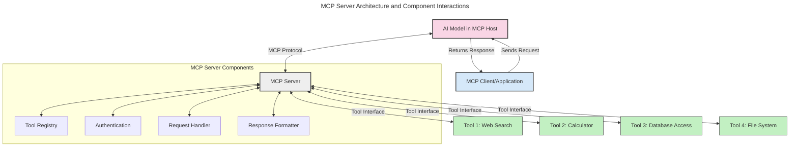
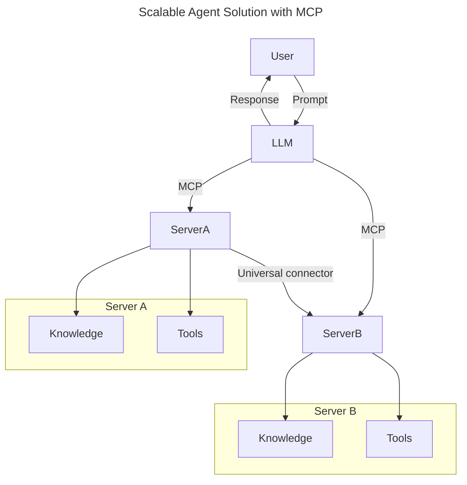
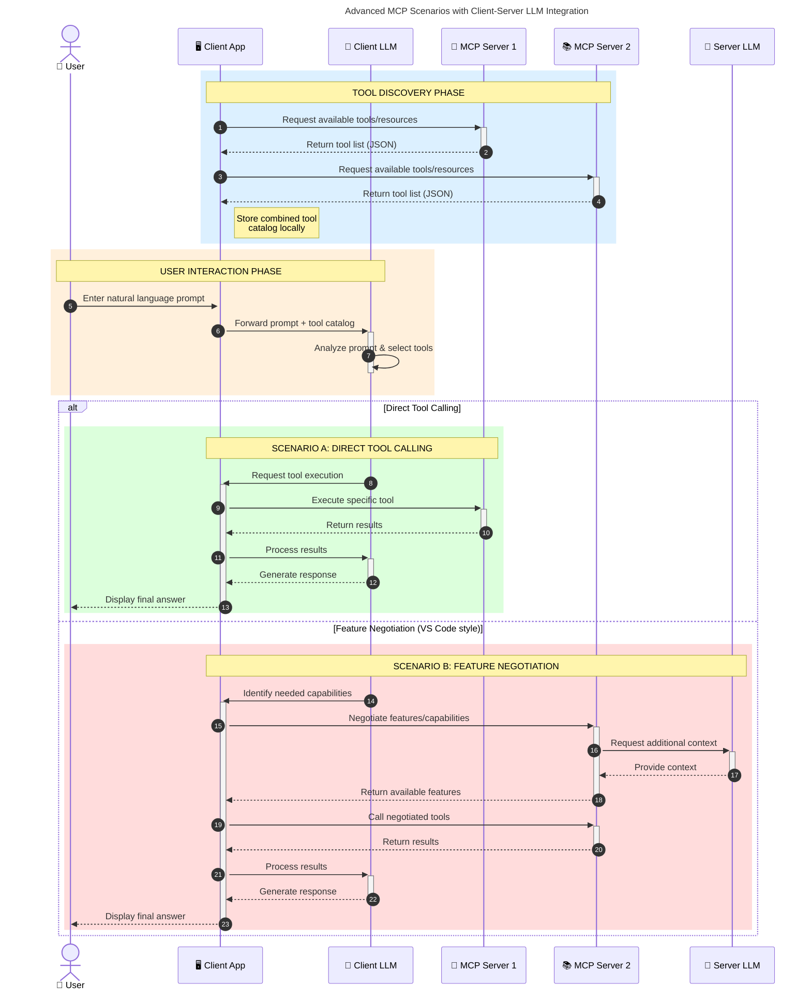

<!--
CO_OP_TRANSLATOR_METADATA:
{
  "original_hash": "1446979020432f512c883848d7eca144",
  "translation_date": "2025-05-29T21:43:36+00:00",
  "source_file": "00-Introduction/README.md",
  "language_code": "ja"
}
-->
# モデルコンテキストプロトコル（MCP）入門：スケーラブルなAIアプリケーションにおける重要性

生成AIアプリケーションは、ユーザーが自然言語プロンプトで操作できる点で大きな進歩です。しかし、こうしたアプリにより多くの時間とリソースを投入するにつれて、機能やリソースを簡単に統合できること、複数のモデルを扱えること、そしてさまざまなモデルの複雑さに対応できることが重要になります。要するに、生成AIアプリは始めるのは簡単ですが、成長し複雑化するにつれてアーキテクチャを定義し、標準に頼る必要が出てきます。ここでMCPが登場し、仕組みを整理し標準を提供します。

---

## **🔍 モデルコンテキストプロトコル（MCP）とは？**

**モデルコンテキストプロトコル（MCP）**は、**オープンで標準化されたインターフェース**であり、大規模言語モデル（LLM）が外部ツール、API、データソースとシームレスに連携できるようにします。これにより、AIモデルの機能をトレーニングデータの枠を超えて強化し、より賢く、スケーラブルで応答性の高いAIシステムを実現します。

---

## **🎯 AIにおける標準化が重要な理由**

生成AIアプリケーションが複雑になるにつれて、**スケーラビリティ、拡張性、保守性**を確保するための標準採用が不可欠です。MCPは以下の課題に対応します：

- モデルとツールの統合を統一
- 脆弱で一時的なカスタムソリューションの削減
- 複数モデルの共存を可能にするエコシステムの構築

---

## **📚 学習目標**

この記事を読み終える頃には、以下が理解できるようになります：

- **モデルコンテキストプロトコル（MCP）**の定義とユースケース
- MCPがモデルとツールの通信をどのように標準化しているか
- MCPアーキテクチャの主要コンポーネントの特定
- エンタープライズや開発現場におけるMCPの実際の活用例の理解

---

## **💡 MCPがもたらす革新性**

### **🔗 MCPはAI連携の断片化を解消**

MCP以前は、モデルとツールの統合に以下の課題がありました：

- ツールとモデルの組み合わせごとにカスタムコードが必要
- ベンダーごとに異なる非標準API
- 更新により頻繁に動作が壊れる
- ツールが増えるとスケールしにくい

### **✅ MCP標準化のメリット**

| **メリット**               | **説明**                                                                 |
|----------------------------|-------------------------------------------------------------------------|
| 相互運用性                 | LLMが異なるベンダーのツールとシームレスに連携                           |
| 一貫性                     | プラットフォームやツール間で統一された動作                             |
| 再利用性                   | 一度作ったツールを複数のプロジェクトやシステムで使い回せる             |
| 開発加速                   | 標準化されたプラグアンドプレイインターフェースで開発時間を短縮         |

---

## **🧱 MCPのハイレベルアーキテクチャ概要**

MCPは**クライアント・サーバーモデル**を採用し、以下の役割があります：

- **MCPホスト**がAIモデルを実行
- **MCPクライアント**がリクエストを発行
- **MCPサーバー**がコンテキスト、ツール、機能を提供

### **主要コンポーネント:**

- **リソース** – モデル向けの静的または動的データ  
- **プロンプト** – ガイド付き生成のための事前定義されたワークフロー  
- **ツール** – 検索や計算などの実行可能な関数  
- **サンプリング** – 再帰的なやり取りによるエージェント的振る舞い

---

## MCPサーバーの動作仕組み

MCPサーバーは次のように動作します：

- **リクエストの流れ**:  
    1. MCPクライアントがMCPホスト上のAIモデルにリクエストを送信。  
    2. AIモデルは外部ツールやデータが必要なタイミングを特定。  
    3. モデルは標準化されたプロトコルを使ってMCPサーバーと通信。

- **MCPサーバーの機能**:  
    - ツールレジストリ：利用可能なツールと機能のカタログを管理。  
    - 認証：ツールアクセス権限の検証。  
    - リクエストハンドラー：モデルからのツールリクエストを処理。  
    - レスポンスフォーマッター：ツールの出力をモデルが理解できる形式に整形。

- **ツール実行**:  
    - サーバーは適切な外部ツールへリクエストをルーティング。  
    - ツールは検索、計算、データベース問い合わせなどの専門機能を実行。  
    - 結果を一貫した形式でモデルに返却。

- **レスポンス完了**:  
    - AIモデルはツールの出力を回答に組み込み、  
    - 最終的な応答をクライアントアプリケーションに送信。

## 👨‍💻 MCPサーバーの構築方法（例付き）

MCPサーバーは、LLMの機能をデータや機能で拡張することができます。

試してみたい方へ、異なる言語での簡単なMCPサーバー作成例はこちら：

- **Python例**: https://github.com/modelcontextprotocol/python-sdk

- **TypeScript例**: https://github.com/modelcontextprotocol/typescript-sdk

- **Java例**: https://github.com/modelcontextprotocol/java-sdk

- **C#/.NET例**: https://github.com/modelcontextprotocol/csharp-sdk

## 🌍 MCPの実世界での活用例

MCPはAIの機能を拡張し、多様な用途に対応可能です：

| **用途**                   | **説明**                                                                    |
|----------------------------|-----------------------------------------------------------------------------|
| エンタープライズデータ統合 | LLMをデータベース、CRM、内部ツールに接続                                   |
| エージェントAIシステム     | ツールアクセスと意思決定ワークフローを備えた自律エージェントを実現         |
| マルチモーダルアプリ       | テキスト、画像、音声ツールを一つの統合AIアプリ内で組み合わせ                 |
| リアルタイムデータ統合     | ライブデータをAI対話に取り込み、より正確で最新の出力を実現                 |

### 🧠 MCP = AI連携のユニバーサルスタンダード

モデルコンテキストプロトコル（MCP）は、USB-Cが物理接続を標準化したように、AI連携の共通標準として機能します。AIの世界では、MCPがモデル（クライアント）と外部ツールやデータプロバイダー（サーバー）との一貫したインターフェースを提供し、APIやデータソースごとに異なるカスタムプロトコルを不要にします。

MCP対応ツール（MCPサーバー）は統一規格に従い、提供可能なツールやアクションを一覧表示し、AIエージェントからの要求に応じてそれらを実行します。MCP対応エージェントプラットフォームは、サーバーのツールを検出し、この標準プロトコルを通じて呼び出すことが可能です。

### 💡 知識アクセスの促進

MCPはツール提供にとどまらず、知識へのアクセスも促進します。アプリケーションがLLMにコンテキストを提供するため、様々なデータソースと連携可能です。例えば、MCPサーバーが企業の文書リポジトリを表し、エージェントが必要な情報をオンデマンドで取得できるようにします。また別のサーバーはメール送信や記録更新などの特定アクションを担当します。エージェントから見ると、これらは単なるツールであり、一部はデータ（知識コンテキスト）を返し、他はアクションを実行します。MCPはこれら両方を効率的に管理します。

エージェントがMCPサーバーに接続すると、標準フォーマットを通じてサーバーの機能や利用可能なデータを自動的に把握します。この標準化により、ツールの動的な利用が可能です。たとえば、新しいMCPサーバーをエージェントシステムに追加すると、追加のカスタマイズなしにその機能が即座に利用可能になります。

このシンプルな統合は、mermaid図で示されるように、サーバーがツールと知識の両方を提供し、システム間のスムーズな連携を保証します。

### 👉 例：スケーラブルなエージェントソリューション

### 🔄 クライアント側LLM統合による高度なMCPシナリオ

基本的なMCPアーキテクチャを超え、クライアントとサーバー双方にLLMを搭載し、より高度な相互作用を実現するシナリオもあります：

## 🔐 MCPの実用的なメリット

MCPを利用することで得られる実用的な利点は以下の通りです：

- **最新性**：モデルはトレーニングデータを超えた最新情報にアクセス可能  
- **機能拡張**：モデルが学習していないタスクにも特化ツールを活用可能  
- **誤認減少**：外部データソースにより事実に基づく回答を強化  
- **プライバシー**：機密データをプロンプトに埋め込むことなく安全に管理可能

## 📌 重要ポイントまとめ

MCP利用の重要ポイントは以下です：

- **MCP**はAIモデルとツール・データの連携を標準化  
- 拡張性、一貫性、相互運用性を促進  
- 開発時間短縮、信頼性向上、モデル機能拡張に寄与  
- クライアント・サーバーアーキテクチャにより柔軟で拡張可能なAIアプリケーションを実現

## 🧠 演習

あなたが開発したいAIアプリケーションについて考えてみましょう。

- どのような**外部ツールやデータ**が機能強化に役立つでしょうか？  
- MCPは統合をどのように**簡単かつ信頼性の高いもの**にできるでしょうか？

## 追加リソース

- [MCP GitHubリポジトリ](https://github.com/modelcontextprotocol)

## 次に読むべき内容

次へ：[第1章：コアコンセプト](/01-CoreConcepts/README.md)

**免責事項**：  
本書類はAI翻訳サービス「Co-op Translator」（https://github.com/Azure/co-op-translator）を使用して翻訳されています。正確性を期しておりますが、自動翻訳には誤りや不正確な部分が含まれる可能性があります。原文の言語によるオリジナル文書が正式な情報源としてご参照ください。重要な情報については、専門の人間による翻訳を推奨いたします。本翻訳の利用により生じたいかなる誤解や誤訳についても、当方は責任を負いかねます。