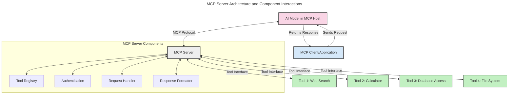
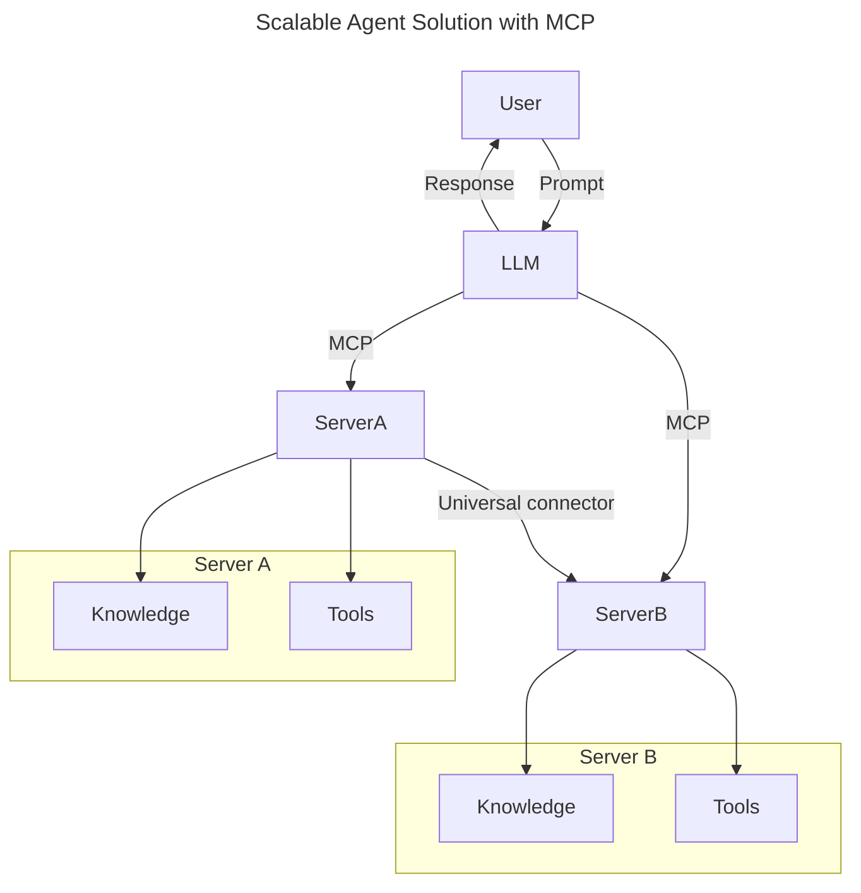
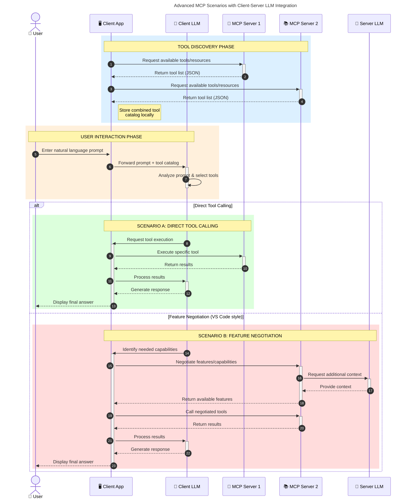

<!--
CO_OP_TRANSLATOR_METADATA:
{
  "original_hash": "105c2ddbb77bc38f7e9df009e1b06e45",
  "translation_date": "2025-07-13T15:28:27+00:00",
  "source_file": "00-Introduction/README.md",
  "language_code": "ja"
}
-->
# モデルコンテキストプロトコル（MCP）入門：スケーラブルなAIアプリケーションにおける重要性

生成AIアプリケーションは、ユーザーが自然言語のプロンプトで操作できる点で大きな進歩です。しかし、こうしたアプリにより多くの時間とリソースを投入するにつれて、機能やリソースを簡単に統合でき、拡張しやすく、複数のモデルを扱い、さまざまなモデルの複雑さに対応できるようにしたいと考えるでしょう。つまり、生成AIアプリの構築は最初は簡単ですが、成長し複雑になるにつれてアーキテクチャを定義し始め、アプリを一貫した方法で構築するための標準に頼る必要が出てきます。ここでMCPが登場し、整理と標準化を提供します。

---

## **🔍 モデルコンテキストプロトコル（MCP）とは？**

**モデルコンテキストプロトコル（MCP）**は、**大規模言語モデル（LLM）が外部ツール、API、データソースとシームレスに連携できるオープンで標準化されたインターフェース**です。トレーニングデータを超えたAIモデルの機能強化を可能にし、より賢く、スケーラブルで応答性の高いAIシステムを実現するための一貫したアーキテクチャを提供します。

---

## **🎯 AIにおける標準化が重要な理由**

生成AIアプリケーションが複雑化するにつれて、**スケーラビリティ、拡張性、保守性**を確保するための標準を採用することが不可欠です。MCPは以下の課題に対応します：

- モデルとツールの統合を統一
- 脆弱で一時的なカスタムソリューションの削減
- 複数モデルが共存できるエコシステムの実現

---

## **📚 学習目標**

この記事を読み終える頃には、以下ができるようになります：

- **モデルコンテキストプロトコル（MCP）**の定義とユースケースの理解
- MCPがモデルとツール間の通信をどのように標準化しているかの理解
- MCPアーキテクチャの主要コンポーネントの特定
- 企業や開発現場でのMCPの実際の応用例の探求

---

## **💡 モデルコンテキストプロトコル（MCP）が画期的な理由**

### **🔗 MCPはAIインタラクションの断片化を解消**

MCP以前は、モデルとツールの統合には以下が必要でした：

- ツールとモデルの組み合わせごとのカスタムコード
- ベンダーごとに異なる非標準API
- アップデートによる頻繁な障害
- ツールが増えるとスケーラビリティが低下

### **✅ MCP標準化のメリット**

| **メリット**             | **説明**                                                                    |
|--------------------------|-----------------------------------------------------------------------------|
| 相互運用性               | LLMが異なるベンダーのツールとシームレスに連携                              |
| 一貫性                   | プラットフォームやツール間での均一な動作                                   |
| 再利用性                 | 一度作ったツールを複数のプロジェクトやシステムで活用可能                   |
| 開発の加速               | 標準化されたプラグアンドプレイのインターフェースで開発時間を短縮           |

---

## **🧱 MCPアーキテクチャの概要**

MCPは**クライアント・サーバーモデル**に従い、

- **MCPホスト**がAIモデルを実行
- **MCPクライアント**がリクエストを開始
- **MCPサーバー**がコンテキスト、ツール、機能を提供

### **主要コンポーネント：**

- **リソース** – モデル向けの静的または動的データ  
- **プロンプト** – ガイド付き生成のための事前定義されたワークフロー  
- **ツール** – 検索や計算などの実行可能な関数  
- **サンプリング** – 再帰的なやり取りによるエージェント的振る舞い

---

## MCPサーバーの動作

MCPサーバーは以下のように動作します：

- **リクエストの流れ**：  
    1. MCPクライアントがMCPホスト上のAIモデルにリクエストを送信。  
    2. AIモデルが外部ツールやデータが必要なタイミングを特定。  
    3. モデルは標準化されたプロトコルを使ってMCPサーバーと通信。

- **MCPサーバーの機能**：  
    - ツールレジストリ：利用可能なツールとその機能のカタログを管理。  
    - 認証：ツールアクセスの権限を検証。  
    - リクエストハンドラー：モデルからのツールリクエストを処理。  
    - レスポンスフォーマッター：ツールの出力をモデルが理解できる形式に整形。

- **ツールの実行**：  
    - サーバーはリクエストを適切な外部ツールにルーティング。  
    - ツールは検索、計算、データベースクエリなどの専門機能を実行。  
    - 結果は一貫した形式でモデルに返される。

- **レスポンスの完結**：  
    - AIモデルはツールの出力を応答に組み込み、  
    - 最終的な応答をクライアントアプリケーションに返す。

## 👨‍💻 MCPサーバーの構築方法（例付き）

MCPサーバーは、LLMの機能をデータや機能で拡張することを可能にします。

試してみたいですか？以下は異なる言語でのシンプルなMCPサーバー作成例です：

- **Python例**: https://github.com/modelcontextprotocol/python-sdk

- **TypeScript例**: https://github.com/modelcontextprotocol/typescript-sdk

- **Java例**: https://github.com/modelcontextprotocol/java-sdk

- **C#/.NET例**: https://github.com/modelcontextprotocol/csharp-sdk

## 🌍 MCPの実際のユースケース

MCPはAIの能力を拡張し、さまざまなアプリケーションを可能にします：

| **用途**                   | **説明**                                                                    |
|----------------------------|-----------------------------------------------------------------------------|
| 企業データ統合             | LLMをデータベース、CRM、社内ツールに接続                                   |
| エージェントAIシステム     | ツールアクセスと意思決定ワークフローを備えた自律エージェントを実現         |
| マルチモーダルアプリ       | テキスト、画像、音声ツールを統合した単一のAIアプリ                         |
| リアルタイムデータ統合     | ライブデータをAIインタラクションに取り込み、より正確で最新の出力を実現     |

### 🧠 MCP = AIインタラクションのためのユニバーサル標準

モデルコンテキストプロトコル（MCP）は、USB-Cがデバイスの物理接続を標準化したのと同様に、AIインタラクションのユニバーサル標準として機能します。AIの世界では、MCPが一貫したインターフェースを提供し、モデル（クライアント）が外部ツールやデータプロバイダー（サーバー）とシームレスに統合できるようにします。これにより、APIやデータソースごとに異なるカスタムプロトコルを使う必要がなくなります。

MCP対応ツール（MCPサーバーと呼ばれる）は統一された標準に従い、提供可能なツールやアクションを一覧表示し、AIエージェントからの要求に応じてそれらを実行します。MCPをサポートするAIエージェントプラットフォームは、サーバーから利用可能なツールを検出し、この標準プロトコルを通じて呼び出すことができます。

### 💡 知識へのアクセスを促進

ツールの提供に加え、MCPは知識へのアクセスも促進します。アプリケーションが大規模言語モデル（LLM）にコンテキストを提供するために、さまざまなデータソースとリンクできるようにします。例えば、MCPサーバーが企業の文書リポジトリを表し、エージェントが必要に応じて関連情報を取得できるようにすることが可能です。別のサーバーはメール送信や記録更新などの特定のアクションを担当するかもしれません。エージェントから見ると、これらは単なるツールであり、データ（知識コンテキスト）を返すものもあれば、アクションを実行するものもあります。MCPは両方を効率的に管理します。

エージェントがMCPサーバーに接続すると、標準フォーマットを通じてサーバーの利用可能な機能やアクセス可能なデータを自動的に学習します。この標準化により、ツールの動的な利用が可能になります。例えば、新しいMCPサーバーをエージェントのシステムに追加すると、その機能が即座に利用可能になり、エージェントの指示を追加でカスタマイズする必要がありません。

このスムーズな統合は、mermaid図に示された流れと一致しており、サーバーがツールと知識の両方を提供し、システム間のシームレスな連携を保証します。

### 👉 例：スケーラブルなエージェントソリューション

### 🔄 クライアント側LLM統合を伴う高度なMCPシナリオ

基本的なMCPアーキテクチャを超え、クライアントとサーバーの両方にLLMが存在し、より高度なインタラクションを可能にするシナリオもあります：

## 🔐 MCPの実用的なメリット

MCPを使うことで得られる実用的なメリットは以下の通りです：

- **最新性**：モデルはトレーニングデータを超えた最新情報にアクセス可能  
- **機能拡張**：モデルが訓練されていないタスクに特化したツールを活用可能  
- **幻覚の減少**：外部データソースが事実に基づく裏付けを提供  
- **プライバシー**：機密データはプロンプトに埋め込むのではなく安全な環境内に保持可能

## 📌 重要なポイント

MCP利用の重要なポイントは以下の通りです：

- **MCP**はAIモデルとツール・データのやり取りを標準化  
- **拡張性、一貫性、相互運用性**を促進  
- MCPは**開発時間の短縮、信頼性向上、モデル機能の拡張**に寄与  
- クライアント・サーバーアーキテクチャにより**柔軟で拡張可能なAIアプリケーション**を実現

## 🧠 演習

あなたが興味のあるAIアプリケーションについて考えてみましょう。

- どのような**外部ツールやデータ**がその機能を強化できるでしょうか？  
- MCPは統合をどのように**簡単かつ信頼性の高いものに**できるでしょうか？

## 追加リソース

- [MCP GitHubリポジトリ](https://github.com/modelcontextprotocol)

## 次に読むべき内容

次へ：[第1章：コアコンセプト](../01-CoreConcepts/README.md)

**免責事項**：  
本書類はAI翻訳サービス「[Co-op Translator](https://github.com/Azure/co-op-translator)」を使用して翻訳されました。正確性を期しておりますが、自動翻訳には誤りや不正確な部分が含まれる可能性があります。原文の言語によるオリジナル文書が正式な情報源とみなされるべきです。重要な情報については、専門の人間による翻訳を推奨します。本翻訳の利用により生じたいかなる誤解や誤訳についても、当方は責任を負いかねます。