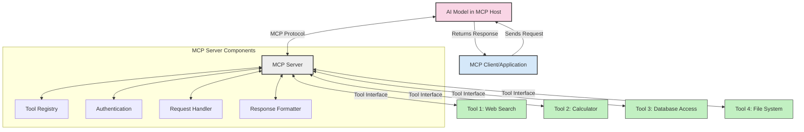
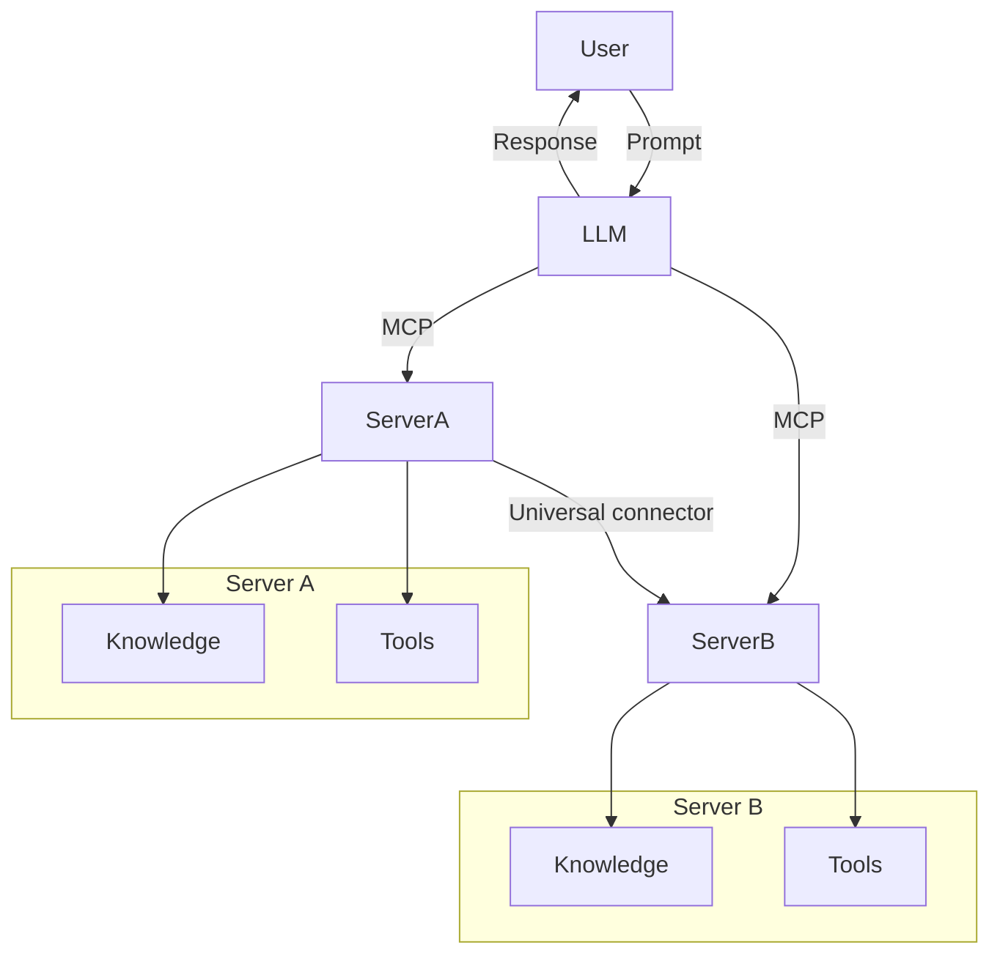

<!--
CO_OP_TRANSLATOR_METADATA:
{
  "original_hash": "cf84f987e1b771d2201408e110dfd2db",
  "translation_date": "2025-05-20T16:15:22+00:00",
  "source_file": "00-Introduction/README.md",
  "language_code": "ja"
}
-->
# モデルコンテキストプロトコル（MCP）入門：スケーラブルなAIアプリケーションにおける重要性

生成AIアプリケーションは、ユーザーが自然言語のプロンプトで操作できる点で大きな進歩です。しかし、こうしたアプリにより多くの時間やリソースを投資するにつれて、機能やリソースを簡単に統合できる仕組みが必要になります。複数のモデルを扱い、その複雑さに対応できるアプリを作るには、最初は簡単でも成長とともにアーキテクチャを定義し、標準に依拠する必要が出てきます。ここでMCPが登場し、体系的に整理し標準を提供します。

---

## **🔍 モデルコンテキストプロトコル（MCP）とは？**

**モデルコンテキストプロトコル（MCP）**は、**大規模言語モデル（LLM）が外部ツール、API、データソースとシームレスに連携できるオープンで標準化されたインターフェース**です。これにより、AIモデルは学習データを超えた機能を持ち、より賢く、スケーラブルで応答性の高いAIシステムが実現します。

---

## **🎯 AIにおける標準化が重要な理由**

生成AIアプリケーションが複雑になるにつれて、**スケーラビリティ、拡張性、保守性**を保証する標準の採用が不可欠です。MCPは以下の課題に対応します：

- モデルとツールの統合を統一
- 脆弱で一時的なカスタムソリューションの削減
- 複数モデルの共存を可能にするエコシステムの構築

---

## **📚 学習目標**

この記事を読み終える頃には、以下が理解できます：

- **モデルコンテキストプロトコル（MCP）**の定義とユースケース
- MCPがモデルとツール間の通信をどのように標準化しているか
- MCPアーキテクチャの主要コンポーネント
- 企業や開発現場でのMCPの実際の応用例

---

## **💡 MCPがもたらす革新性**

### **🔗 MCPはAIの断片化問題を解決する**

MCP以前は、モデルとツールの統合には以下が必要でした：

- ツールとモデルごとのカスタムコード
- 各ベンダーごとの非標準API
- アップデートによる頻繁な障害
- ツール数増加に伴うスケールの悪さ

### **✅ MCP標準化のメリット**

| **メリット**              | **説明**                                                                     |
|--------------------------|------------------------------------------------------------------------------|
| 相互運用性               | LLMが異なるベンダーのツールとシームレスに連携                              |
| 一貫性                   | プラットフォームやツール間での均一な挙動                                    |
| 再利用性                 | 一度構築したツールを複数プロジェクトやシステムで活用可能                   |
| 開発の加速               | 標準化されたプラグアンドプレイ型インターフェースで開発時間を短縮           |

---

## **🧱 MCPのアーキテクチャ概要**

MCPは**クライアント・サーバーモデル**を採用しており、

- **MCPホスト**がAIモデルを実行
- **MCPクライアント**がリクエストを開始
- **MCPサーバー**がコンテキスト、ツール、機能を提供

### **主な構成要素：**

- **Resources（リソース）** – モデル用の静的または動的データ  
- **Prompts（プロンプト）** – ガイド付き生成のための事前定義されたワークフロー  
- **Tools（ツール）** – 検索や計算などの実行可能な関数  
- **Sampling（サンプリング）** – 再帰的なやり取りを通じたエージェント的振る舞い

---

## MCPサーバーの動作仕組み

MCPサーバーは以下のように動作します：

- **リクエストの流れ**：  
    1. MCPクライアントがMCPホスト上のAIモデルにリクエストを送信  
    2. AIモデルが外部ツールやデータを必要と判断  
    3. モデルは標準化されたプロトコルでMCPサーバーと通信  

- **MCPサーバーの機能**：  
    - ツールレジストリ：利用可能なツールとその機能を管理  
    - 認証：ツールアクセスの権限確認  
    - リクエストハンドラー：モデルからのツール要求を処理  
    - レスポンスフォーマッター：モデルが理解できる形式でツールの出力を整形  

- **ツール実行**：  
    - サーバーは適切な外部ツールへリクエストをルーティング  
    - ツールは検索、計算、データベースクエリなどの専門機能を実行  
    - 結果は一貫したフォーマットでモデルに返される  

- **レスポンスの完結**：  
    - AIモデルはツールの出力を応答に組み込み  
    - 最終的な応答がクライアントアプリケーションに返される  

## 👨‍💻 MCPサーバーの構築方法（例付き）

MCPサーバーは、LLMの能力をデータや機能で拡張できます。

試してみたいですか？異なる言語でのシンプルなMCPサーバー作成例はこちら：

- **Python例**: https://github.com/modelcontextprotocol/python-sdk

- **TypeScript例**: https://github.com/modelcontextprotocol/typescript-sdk

- **Java例**: https://github.com/modelcontextprotocol/java-sdk

- **C#/.NET例**: https://github.com/modelcontextprotocol/csharp-sdk

## 🌍 MCPの実世界でのユースケース

MCPはAIの機能拡張により多様なアプリケーションを可能にします：

| **用途**                     | **説明**                                                                      |
|------------------------------|-------------------------------------------------------------------------------|
| エンタープライズデータ統合   | LLMをデータベース、CRM、社内ツールに接続                                    |
| エージェントAIシステム       | ツールアクセスと意思決定ワークフローを持つ自律エージェントを実現            |
| マルチモーダルアプリケーション| テキスト、画像、音声ツールを一つの統合AIアプリで組み合わせ                   |
| リアルタイムデータ統合       | ライブデータをAI対話に取り込み、より正確で最新の出力を実現                  |

### 🧠 MCP＝AIインタラクションのユニバーサル標準

モデルコンテキストプロトコル（MCP）は、USB-Cが物理的な接続を標準化したのと同様に、AIのインタラクションを統一する標準です。AIの世界では、MCPがモデル（クライアント）と外部ツールやデータ提供者（サーバー）を一貫したインターフェースで繋ぎます。これにより、APIやデータソースごとに異なるカスタムプロトコルが不要になります。

MCP対応のツール（MCPサーバー）は統一された標準に従い、提供可能なツールやアクションのリストを提示し、AIエージェントからの要求に応じて実行します。MCPをサポートするAIエージェントプラットフォームは、サーバーから利用可能なツールを検出し、この標準プロトコルで呼び出せます。

### 💡 知識へのアクセスを促進

MCPは単なるツール提供にとどまらず、知識へのアクセスも促進します。アプリケーションがLLMにコンテキストを提供するために多様なデータソースと連携可能です。例えば、MCPサーバーが企業の文書リポジトリを表し、エージェントが必要な情報をオンデマンドで取得できます。別のサーバーはメール送信や記録更新など特定のアクションを担当。エージェントから見ると、これらは単なるツールであり、一部はデータ（知識コンテキスト）を返し、他はアクションを実行します。MCPは両者を効率的に管理します。

エージェントがMCPサーバーに接続すると、標準フォーマットでサーバーの利用可能な機能やアクセス可能なデータを自動的に把握します。この標準化により、ツールの動的な利用が可能です。例えば、新たなMCPサーバーをエージェントのシステムに追加すると、追加設定なしにすぐにその機能が利用可能になります。

このスムーズな統合は、mermaid図で示された流れと一致し、サーバーがツールと知識の両方を提供し、システム間のシームレスな連携を実現します。

### 👉 例：スケーラブルなエージェントソリューション

## 🔐 MCPの実用的な利点

MCP利用の実用的な利点は以下の通りです：

- **最新性**：モデルは学習データを超えた最新情報にアクセス可能  
- **機能拡張**：モデルが訓練されていないタスクでも専門ツールを活用可能  
- **幻覚の削減**：外部データソースが事実に基づく裏付けを提供  
- **プライバシー**：機密データはプロンプトに埋め込まず安全な環境内に保持可能  

## 📌 まとめ

MCP利用におけるポイントは：

- **MCP**はAIモデルとツール・データのやり取りを標準化  
- 拡張性、一貫性、相互運用性を促進  
- MCPは開発時間短縮、信頼性向上、モデル機能拡張に貢献  
- クライアント・サーバーアーキテクチャにより柔軟で拡張可能なAIアプリを実現  

## 🧠 演習

あなたが作りたいAIアプリケーションについて考えてみましょう。

- どんな**外部ツールやデータ**が機能強化に役立ちそうですか？  
- MCPを使うことで統合はどのように**簡単で信頼性の高いもの**になるでしょうか？  

## 追加リソース

- [MCP GitHubリポジトリ](https://github.com/modelcontextprotocol)

## 次に読むべき内容

次へ：[Chapter 1: Core Concepts](/01-CoreConcepts/README.md)

**免責事項**：  
本書類はAI翻訳サービス「[Co-op Translator](https://github.com/Azure/co-op-translator)」を使用して翻訳されています。正確性の向上に努めておりますが、自動翻訳には誤りや不正確な箇所が含まれる可能性があることをご了承ください。原文の言語による文書が正式な情報源とみなされます。重要な情報については、専門の人間による翻訳を推奨します。本翻訳の利用により生じた誤解や誤訳について、一切の責任を負いかねます。