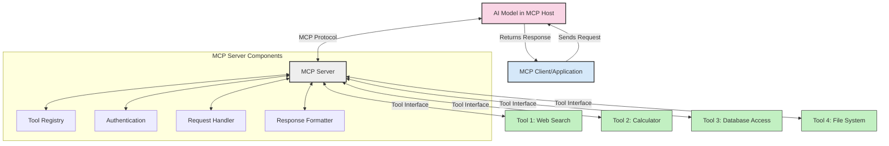
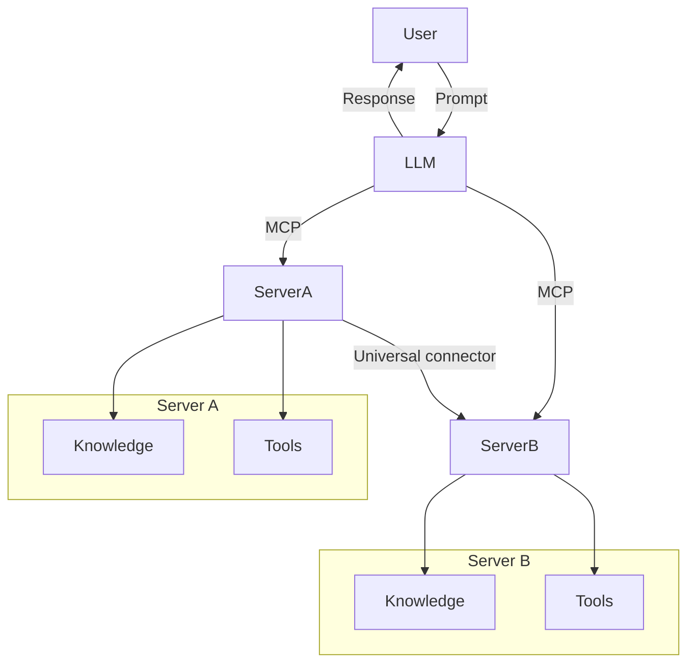
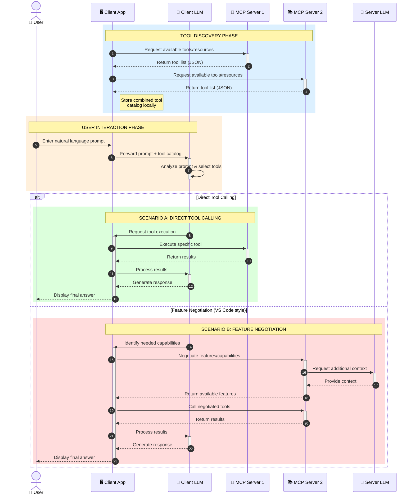

<!--
CO_OP_TRANSLATOR_METADATA:
{
  "original_hash": "25a94c681cf43612ff394d8cf78a74de",
  "translation_date": "2025-05-27T15:58:05+00:00",
  "source_file": "00-Introduction/README.md",
  "language_code": "ja"
}
-->
# モデルコンテキストプロトコル（MCP）入門：スケーラブルなAIアプリケーションにおける重要性

生成AIアプリケーションは、ユーザーが自然言語のプロンプトで操作できる点で大きな進歩です。しかし、こうしたアプリにより多くの時間やリソースを投入するにつれて、機能やリソースを簡単に統合できること、複数のモデルに対応できること、そしてさまざまなモデルの複雑さに対処できることが重要になります。つまり、生成AIアプリの構築は最初は簡単ですが、規模が大きく複雑になるにつれてアーキテクチャを定義し、標準に基づいて一貫性のある設計を行う必要があります。ここでMCPが登場し、整理と標準化を提供します。

---

## **🔍 モデルコンテキストプロトコル（MCP）とは？**

**モデルコンテキストプロトコル（MCP）**は、**大規模言語モデル（LLM）が外部ツール、API、データソースとシームレスに連携するためのオープンで標準化されたインターフェース**です。トレーニングデータを超えてAIモデルの機能を強化し、よりスマートでスケーラブル、かつ応答性の高いAIシステムを実現するための一貫したアーキテクチャを提供します。

---

## **🎯 AIにおける標準化が重要な理由**

生成AIアプリケーションが複雑化するにつれて、**スケーラビリティ、拡張性、保守性**を保証する標準の採用が不可欠です。MCPは以下の課題に対応します：

- モデルとツールの統合を統一
- 脆弱で使い捨てのカスタムソリューションを削減
- 複数モデルの共存を可能にするエコシステムの構築

---

## **📚 学習目標**

この記事を読み終える頃には、以下が理解できるようになります：

- **モデルコンテキストプロトコル（MCP）**の定義と利用例
- MCPがモデルとツール間の通信をどのように標準化しているか
- MCPアーキテクチャの主要コンポーネント
- 企業や開発現場でのMCPの実際の活用例

---

## **💡 MCPがもたらす革新**

### **🔗 MCPがAI連携の断片化を解消**

MCP以前は、モデルとツールの連携に以下の課題がありました：

- ツールとモデルの組み合わせごとにカスタムコードが必要
- ベンダーごとに非標準のAPIが存在
- 更新による頻繁な連携障害
- ツールが増えるほどスケールしにくい

### **✅ MCP標準化のメリット**

| **メリット**              | **説明**                                                                    |
|--------------------------|-----------------------------------------------------------------------------|
| 相互運用性               | LLMが異なるベンダーのツールとシームレスに連携                             |
| 一貫性                   | プラットフォームやツール間で均一な動作を保証                               |
| 再利用性                 | 一度作ったツールを複数のプロジェクトやシステムで活用可能                   |
| 開発加速                 | 標準化されたプラグアンドプレイのインターフェースで開発時間を短縮           |

---

## **🧱 MCPアーキテクチャ概要**

MCPは**クライアント-サーバーモデル**に従い、

- **MCPホスト**がAIモデルを稼働
- **MCPクライアント**がリクエストを開始
- **MCPサーバー**がコンテキスト、ツール、機能を提供

### **主要コンポーネント：**

- **リソース** – モデル向けの静的または動的データ  
- **プロンプト** – ガイド付き生成のための定義済みワークフロー  
- **ツール** – 検索や計算などの実行可能な関数  
- **サンプリング** – 再帰的な対話によるエージェント的振る舞い

---

## MCPサーバーの動作

MCPサーバーは以下のように機能します：

- **リクエストの流れ**：
    1. MCPクライアントがMCPホスト上のAIモデルにリクエストを送信
    2. AIモデルが外部ツールやデータが必要なタイミングを検出
    3. モデルは標準化されたプロトコルを使ってMCPサーバーと通信

- **MCPサーバーの機能**：
    - ツールレジストリ：利用可能なツールとその機能を管理
    - 認証：ツールアクセスの権限確認
    - リクエストハンドラー：モデルからのツールリクエストを処理
    - レスポンスフォーマッター：ツールの出力をモデルが理解できる形式に整形

- **ツール実行**：
    - サーバーはリクエストを適切な外部ツールにルーティング
    - ツールは検索、計算、データベースクエリなどの専門機能を実行
    - 結果を一貫したフォーマットでモデルに返す

- **レスポンスの完結**：
    - AIモデルはツールの出力を応答に統合
    - 最終応答をクライアントアプリケーションに返送

## 👨‍💻 MCPサーバーの構築方法（例付き）

MCPサーバーは、LLMの機能をデータや機能で拡張できます。

試してみたい方へ、各言語でのシンプルなMCPサーバー構築例：

- **Python例**: https://github.com/modelcontextprotocol/python-sdk

- **TypeScript例**: https://github.com/modelcontextprotocol/typescript-sdk

- **Java例**: https://github.com/modelcontextprotocol/java-sdk

- **C#/.NET例**: https://github.com/modelcontextprotocol/csharp-sdk

## 🌍 MCPの実用的なユースケース

MCPはAIの能力を拡張し、幅広い用途を可能にします：

| **用途**                    | **説明**                                                                     |
|----------------------------|------------------------------------------------------------------------------|
| エンタープライズデータ統合  | LLMをデータベース、CRM、社内ツールに接続                                   |
| エージェントAIシステム      | ツールアクセスと意思決定ワークフローを持つ自律エージェントを実現            |
| マルチモーダルアプリケーション | テキスト、画像、音声ツールを単一の統合AIアプリで組み合わせ                   |
| リアルタイムデータ統合      | 最新のデータをAI対話に取り込み、より正確で現状に即した出力を実現             |

### 🧠 MCP = AI連携のユニバーサルスタンダード

モデルコンテキストプロトコル（MCP）は、USB-Cが物理的な接続を標準化したように、AIの連携における共通の標準を提供します。AIの世界では、MCPがモデル（クライアント）と外部ツールやデータ提供者（サーバー）を一貫したインターフェースでつなぎ、多様でカスタムなプロトコルを排除します。

MCP対応ツール（MCPサーバー）は統一された標準に従い、提供可能なツールやアクションをリストアップし、AIエージェントからのリクエストに応じてそれらを実行します。MCP対応のAIエージェントプラットフォームは、サーバーから利用可能なツールを発見し、この標準プロトコルを通じて呼び出せます。

### 💡 知識アクセスの促進

ツール提供に加え、MCPは知識へのアクセスも促進します。アプリケーションがLLMに文脈を与えるために、さまざまなデータソースと連携できるようにします。例えば、MCPサーバーが企業のドキュメントリポジトリを表し、エージェントが必要な情報をオンデマンドで取得できるようにすることが可能です。別のサーバーはメール送信やレコード更新などの特定アクションを担当します。エージェントから見ると、これらは単なるツールであり、データ（知識コンテキスト）を返すものもあれば、アクションを実行するものもあります。MCPは両方を効率的に管理します。

エージェントがMCPサーバーに接続すると、標準フォーマットを通じてサーバーの利用可能な機能やアクセス可能なデータを自動的に学習します。この標準化により、ツールの動的な利用が可能になります。たとえば、新しいMCPサーバーをエージェントのシステムに追加すると、その機能が即座に使えるようになり、エージェントの指示を追加で変更する必要がありません。

このスムーズな統合は、mermaid図に示されるように、サーバーがツールと知識の両方を提供し、システム間のシームレスな連携を保証します。

### 👉 例：スケーラブルなエージェントソリューション

### 🔄 クライアント側LLM統合による高度なMCPシナリオ

基本的なMCPアーキテクチャを超え、クライアントとサーバーの両方にLLMが存在する高度なシナリオもあります。これにより、より洗練された相互作用が可能になります：

## 🔐 MCPの実用的なメリット

MCPを使うことで得られる具体的な利点：

- **新鮮さ**：トレーニングデータを超えた最新情報にアクセス可能
- **機能拡張**：モデルが未学習のタスクに特化したツールを活用できる
- **幻覚の軽減**：外部データソースが事実の裏付けを提供
- **プライバシー**：機密データはプロンプトに埋め込むことなく安全な環境内に保持可能

## 📌 重要なポイント

MCP利用の重要なポイント：

- **MCP**はAIモデルとツール・データの連携を標準化
- **拡張性、一貫性、相互運用性**を促進
- MCPは**開発時間短縮、信頼性向上、モデル機能拡張**に貢献
- クライアント-サーバーアーキテクチャは**柔軟で拡張可能なAIアプリケーション**を可能にする

## 🧠 演習

構築したいAIアプリケーションについて考えてみましょう。

- どのような**外部ツールやデータ**が機能強化に役立つでしょうか？
- MCPは統合をどのように**簡単かつ信頼性の高いもの**にできるでしょうか？

## 追加リソース

- [MCP GitHubリポジトリ](https://github.com/modelcontextprotocol)

## 次に読む

次へ：[第1章：コアコンセプト](/01-CoreConcepts/README.md)

**免責事項**：  
本書類はAI翻訳サービス「[Co-op Translator](https://github.com/Azure/co-op-translator)」を使用して翻訳されています。正確性には努めておりますが、自動翻訳には誤りや不正確な箇所が含まれる可能性があることをご了承ください。原文の言語による文書が正式な情報源とみなされるべきです。重要な情報については、専門の人間による翻訳を推奨します。本翻訳の利用により生じたいかなる誤解や誤訳についても責任を負いかねます。