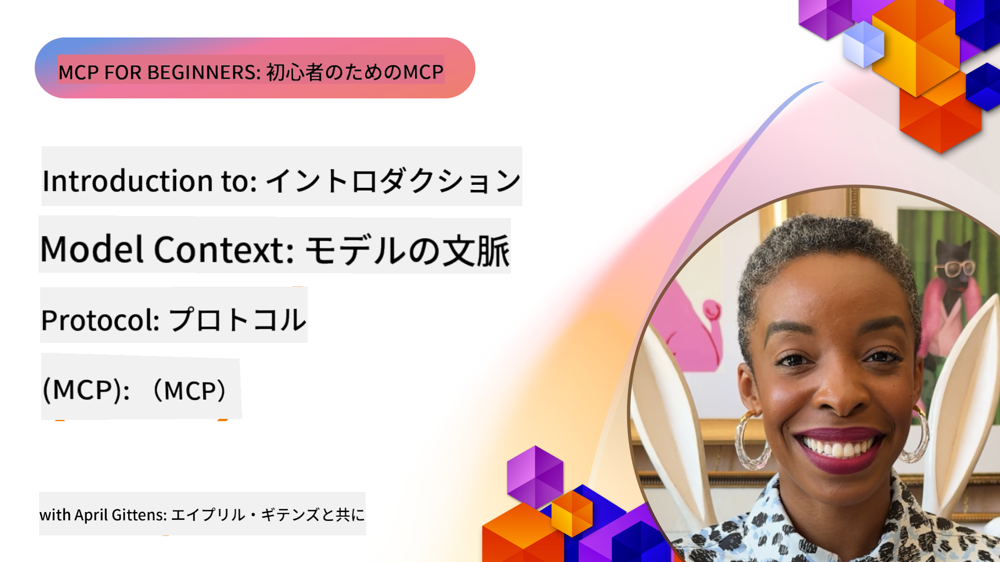
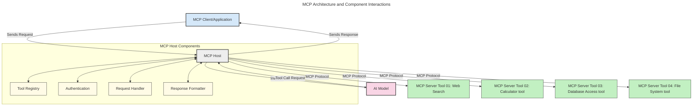
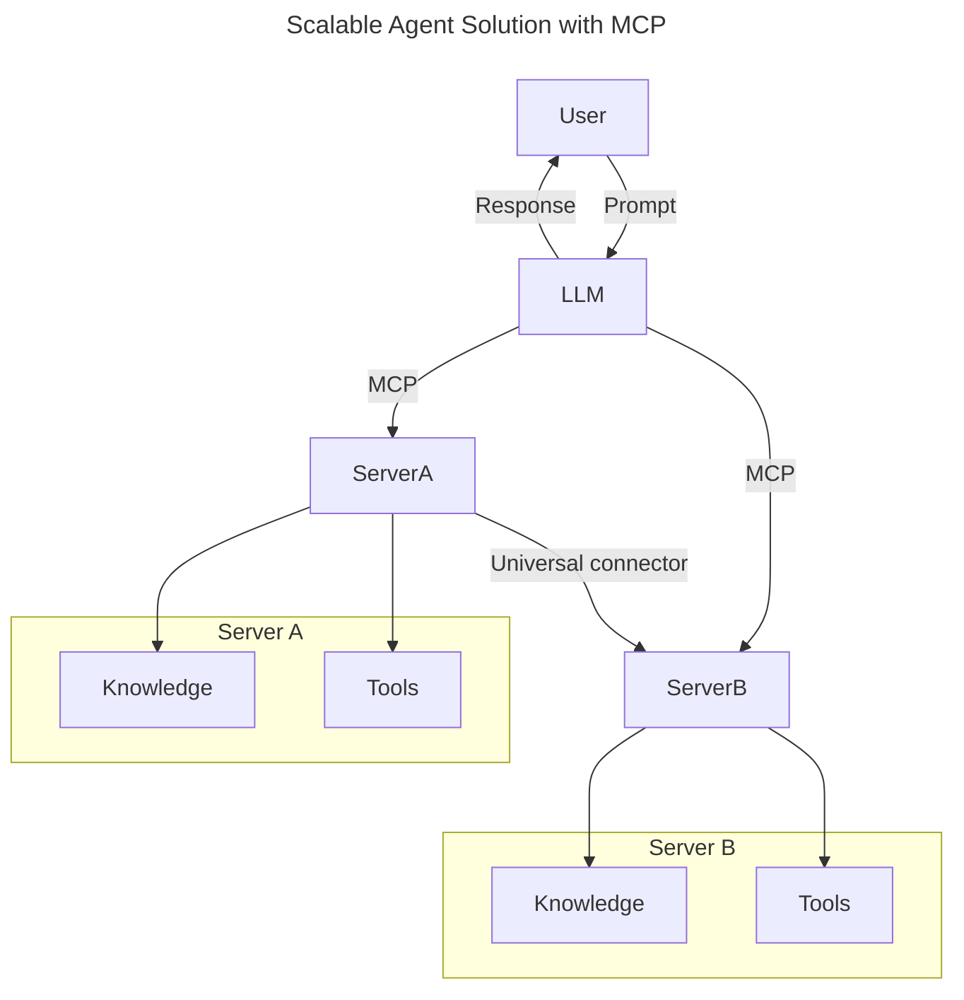
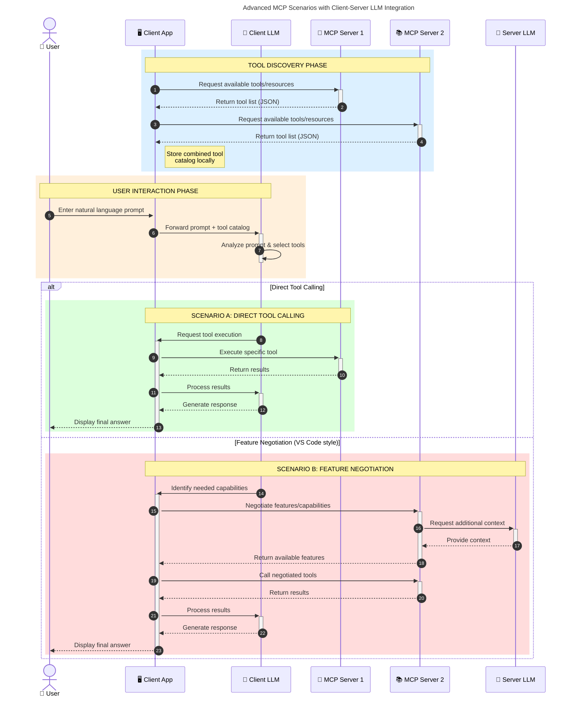

<!--
CO_OP_TRANSLATOR_METADATA:
{
  "original_hash": "85eb103a78a43a542f2890a3d7d62318",
  "translation_date": "2025-08-11T10:32:29+00:00",
  "source_file": "00-Introduction/README.md",
  "language_code": "ja"
}
-->
# モデルコンテキストプロトコル (MCP) 入門: スケーラブルなAIアプリケーションにおける重要性

_(上の画像をクリックして、このレッスンの動画をご覧ください)_

生成AIアプリケーションは、自然言語プロンプトを使用してアプリとやり取りできる点で大きな進歩を遂げています。しかし、こうしたアプリに時間やリソースを投資するにつれて、機能やリソースを簡単に統合できるようにし、複数のモデルを利用できるようにし、さまざまなモデルの特性に対応できるようにする必要があります。つまり、生成AIアプリの構築は最初は簡単ですが、成長して複雑になるにつれて、アーキテクチャを定義し、アプリを一貫性のある方法で構築するための標準に頼る必要が出てきます。ここでMCPが登場し、整理と標準化を提供します。

---

## **🔍 モデルコンテキストプロトコル (MCP) とは？**

**モデルコンテキストプロトコル (MCP)** は、**オープンで標準化されたインターフェース**であり、大規模言語モデル (LLM) が外部ツール、API、データソースとシームレスに連携できるようにします。これにより、トレーニングデータを超えたAIモデルの機能を強化し、よりスマートでスケーラブル、かつ応答性の高いAIシステムを実現します。

---

## **🎯 AIにおける標準化の重要性**

生成AIアプリケーションが複雑化するにつれて、**スケーラビリティ、拡張性、保守性**を確保し、**ベンダーロックインを回避**するための標準を採用することが重要です。MCPは以下のニーズに対応します：

- モデルとツールの統合を統一化
- 脆弱で一時的なカスタムソリューションを削減
- 異なるベンダーの複数のモデルが1つのエコシステム内で共存可能

**Note:** MCPはオープンスタンダードを謳っていますが、IEEE、IETF、W3C、ISOなどの既存の標準化団体を通じて標準化する計画はありません。

---

## **📚 学習目標**

この記事を読み終えるまでに、以下ができるようになります：

- **モデルコンテキストプロトコル (MCP)** とそのユースケースを定義する
- MCPがモデルとツール間の通信をどのように標準化するかを理解する
- MCPアーキテクチャの主要コンポーネントを特定する
- 企業や開発の文脈でのMCPの実際の応用を探る

---

## **💡 モデルコンテキストプロトコル (MCP) がもたらす変革**

### **🔗 MCPはAIの相互作用の断片化を解消する**

MCPが登場する前は、モデルとツールの統合には以下が必要でした：

- ツールとモデルのペアごとのカスタムコード
- 各ベンダーごとの非標準API
- アップデートによる頻繁な破損
- ツールが増えるにつれてスケーラビリティが低下

### **✅ MCP標準化のメリット**

| **メリット**              | **説明**                                                                |
|--------------------------|------------------------------------------------------------------------|
| 相互運用性              | 異なるベンダーのツールとLLMがシームレスに連携                          |
| 一貫性                  | プラットフォームやツール間での統一された動作                            |
| 再利用性                | 一度構築したツールを複数のプロジェクトやシステムで再利用可能            |
| 開発の加速              | 標準化されたプラグアンドプレイインターフェースで開発時間を短縮          |

---

## **🧱 MCPのハイレベルアーキテクチャ概要**

MCPは**クライアント-サーバーモデル**に従います。このモデルでは：

- **MCPホスト**がAIモデルを実行
- **MCPクライアント**がリクエストを開始
- **MCPサーバー**がコンテキスト、ツール、機能を提供

### **主要コンポーネント：**

- **リソース** – モデル用の静的または動的データ  
- **プロンプト** – ガイド付き生成のための事前定義されたワークフロー  
- **ツール** – 検索や計算などの実行可能な機能  
- **サンプリング** – 再帰的な相互作用を通じたエージェント的な振る舞い  

---

## MCPサーバーの動作

MCPサーバーは以下のように動作します：

- **リクエストフロー**：
    1. エンドユーザーまたはその代理として動作するソフトウェアがリクエストを開始します。
    2. **MCPクライアント**がリクエストを**MCPホスト**に送信し、AIモデルのランタイムを管理します。
    3. **AIモデル**がユーザープロンプトを受け取り、外部ツールやデータへのアクセスを1つ以上のツール呼び出しを通じて要求する場合があります。
    4. **MCPホスト**がモデルではなく、標準化されたプロトコルを使用して適切な**MCPサーバー**と通信します。
- **MCPホストの機能**：
    - **ツールレジストリ**：利用可能なツールとその機能のカタログを維持
    - **認証**：ツールアクセスの権限を確認
    - **リクエストハンドラー**：モデルからのツールリクエストを処理
    - **レスポンスフォーマッター**：ツールの出力をモデルが理解できる形式に構造化
- **MCPサーバーの実行**：
    - **MCPホスト**がツール呼び出しを1つ以上の**MCPサーバー**にルーティングし、それぞれが検索、計算、データベースクエリなどの専門機能を提供
    - **MCPサーバー**がそれぞれの操作を実行し、結果を一貫した形式で**MCPホスト**に返送
    - **MCPホスト**がこれらの結果をフォーマットし、**AIモデル**に中継
- **レスポンスの完了**：
    - **AIモデル**がツールの出力を最終的なレスポンスに組み込みます。
    - **MCPホスト**がこのレスポンスを**MCPクライアント**に送り返し、エンドユーザーまたは呼び出し元のソフトウェアに届けます。

## 👨‍💻 MCPサーバーの構築方法（例付き）

MCPサーバーを使用すると、LLMの機能をデータや機能で拡張できます。

試してみたいですか？以下は、異なる言語やスタックでシンプルなMCPサーバーを作成するためのSDKと例です：

- **Python SDK**: https://github.com/modelcontextprotocol/python-sdk

- **TypeScript SDK**: https://github.com/modelcontextprotocol/typescript-sdk

- **Java SDK**: https://github.com/modelcontextprotocol/java-sdk

- **C#/.NET SDK**: https://github.com/modelcontextprotocol/csharp-sdk

---

## 🌍 MCPの実世界でのユースケース

MCPはAIの機能を拡張することで、幅広いアプリケーションを可能にします：

| **アプリケーション**          | **説明**                                                                |
|------------------------------|------------------------------------------------------------------------|
| 企業データ統合              | LLMをデータベース、CRM、または内部ツールに接続                          |
| エージェント型AIシステム     | ツールアクセスと意思決定ワークフローを備えた自律エージェントを実現      |
| マルチモーダルアプリケーション | テキスト、画像、音声ツールを単一の統一されたAIアプリ内で組み合わせる    |
| リアルタイムデータ統合       | 最新のデータをAIとのやり取りに取り入れ、より正確で最新の出力を提供      |

### 🧠 MCP = AIインタラクションのユニバーサルスタンダード

モデルコンテキストプロトコル (MCP) は、AIインタラクションのユニバーサルスタンダードとして機能します。これは、USB-Cがデバイスの物理的な接続を標準化したのと同じようなものです。AIの世界では、MCPが一貫したインターフェースを提供し、モデル（クライアント）が外部ツールやデータプロバイダー（サーバー）とシームレスに統合できるようにします。これにより、各APIやデータソースごとに多様でカスタムなプロトコルを必要とする状況が解消されます。

MCPに準拠したツール（MCPサーバーと呼ばれる）は、統一された標準に従います。これらのサーバーは、提供するツールやアクションをリスト化し、AIエージェントからのリクエストに応じてそれらを実行します。MCPをサポートするAIエージェントプラットフォームは、サーバーから利用可能なツールを発見し、この標準プロトコルを通じてそれらを呼び出すことができます。

### 💡 知識へのアクセスを促進

ツールの提供に加えて、MCPは知識へのアクセスも促進します。これにより、アプリケーションがさまざまなデータソースにリンクすることで、大規模言語モデル（LLM）にコンテキストを提供できます。たとえば、MCPサーバーが企業の文書リポジトリを表し、エージェントが必要に応じて関連情報を取得できるようにすることが可能です。別のサーバーは、メール送信やレコード更新などの特定のアクションを処理することもできます。エージェントの視点から見ると、これらは単に利用可能なツールにすぎません。一部のツールはデータ（知識コンテキスト）を返し、他のツールはアクションを実行します。MCPはこれらの両方を効率的に管理します。

エージェントがMCPサーバーに接続すると、サーバーが提供する機能やアクセス可能なデータを標準フォーマットで自動的に学習します。この標準化により、ツールの動的な利用が可能になります。たとえば、新しいMCPサーバーをエージェントのシステムに追加すると、その機能が即座に利用可能になり、エージェントの指示をさらにカスタマイズする必要がなくなります。

この統合プロセスは、以下の図に示されるように、サーバーがツールと知識の両方を提供し、システム間のシームレスなコラボレーションを確保する流れに沿っています。

### 👉 例: スケーラブルなエージェントソリューション

### 🔄 クライアント側LLM統合を伴う高度なMCPシナリオ

基本的なMCPアーキテクチャを超えて、クライアントとサーバーの両方にLLMを含む高度なシナリオでは、より洗練された相互作用が可能です。以下の図では、**クライアントアプリ**がIDEであり、ユーザーが利用可能な複数のMCPツールを備えている場合を示しています：

---

## 🔐 MCPの実用的なメリット

MCPを使用することで得られる実用的なメリットは以下の通りです：

- **最新性**：モデルがトレーニングデータを超えた最新情報にアクセス可能
- **機能拡張**：モデルがトレーニングされていないタスクに特化したツールを活用可能
- **幻覚の削減**：外部データソースが事実に基づいた根拠を提供
- **プライバシー**：機密データをプロンプトに埋め込むのではなく、安全な環境内に保持可能

---

## 📌 重要なポイント

MCPを使用する際の重要なポイントは以下の通りです：

- **MCP**はAIモデルがツールやデータとどのように連携するかを標準化
- **拡張性、一貫性、相互運用性**を促進
- MCPは**開発時間を短縮し、信頼性を向上させ、モデルの機能を拡張**
- クライアント-サーバーアーキテクチャにより、**柔軟で拡張可能なAIアプリケーション**を実現

---

## 🧠 演習

構築したいAIアプリケーションについて考えてみましょう。

- どのような**外部ツールやデータ**がその機能を強化できますか？
- MCPは統合をどのように**簡単かつ信頼性の高いもの**にできるでしょうか？

---

## 追加リソース

- [MCP GitHubリポジトリ](https://github.com/modelcontextprotocol)

---

## 次に進む

次へ: [第1章: コアコンセプト](../01-CoreConcepts/README.md)

**免責事項**:  
この文書は、AI翻訳サービス [Co-op Translator](https://github.com/Azure/co-op-translator) を使用して翻訳されています。正確性を追求しておりますが、自動翻訳には誤りや不正確な部分が含まれる可能性があることをご承知ください。元の言語で記載された文書が正式な情報源とみなされるべきです。重要な情報については、専門の人間による翻訳を推奨します。この翻訳の使用に起因する誤解や誤認について、当方は一切の責任を負いません。