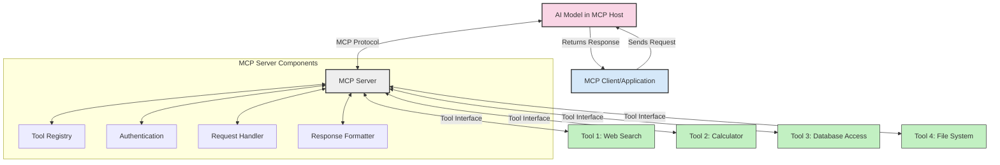
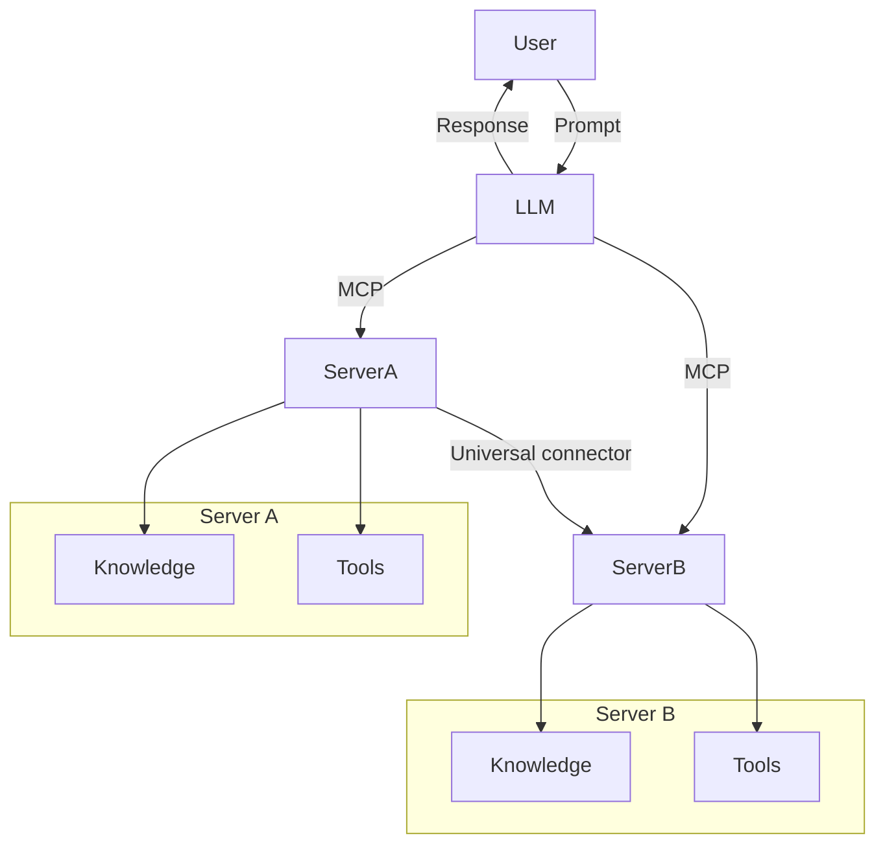

<!--
CO_OP_TRANSLATOR_METADATA:
{
  "original_hash": "1d88dee994dcbb3fa52c271d0c0817b5",
  "translation_date": "2025-05-20T20:45:03+00:00",
  "source_file": "00-Introduction/README.md",
  "language_code": "ja"
}
-->
# モデルコンテキストプロトコル（MCP）入門：スケーラブルなAIアプリケーションにおける重要性

生成AIアプリケーションは、ユーザーが自然言語のプロンプトでやり取りできる点で大きな進歩です。しかし、こうしたアプリにより多くの時間とリソースを投入するにつれて、機能やリソースを簡単に統合できること、複数のモデルを扱えること、そしてさまざまなモデルの複雑さに対応できることが重要になります。つまり、生成AIアプリの開発は始めは簡単でも、規模が大きく複雑になるにつれて、アーキテクチャを定義し、標準に基づいて一貫性のある構築が求められます。ここでMCPが登場し、整理と標準化を提供します。

---

## **🔍 モデルコンテキストプロトコル（MCP）とは？**

**モデルコンテキストプロトコル（MCP）**は、**大規模言語モデル（LLM）が外部ツール、API、データソースとシームレスに連携するためのオープンで標準化されたインターフェース**です。モデルの学習データを超えて機能を拡張し、より賢くスケーラブルで応答性の高いAIシステムを実現するための一貫したアーキテクチャを提供します。

---

## **🎯 AIにおける標準化が重要な理由**

生成AIアプリケーションが複雑化する中で、**スケーラビリティ、拡張性、保守性**を確保するための標準採用が不可欠です。MCPは以下の課題に対応します：

- モデルとツールの統合を統一
- 脆弱で一回限りのカスタムソリューションを削減
- 複数モデルの共存を可能にする

---

## **📚 学習目標**

この記事を読み終える頃には、以下ができるようになります：

- **モデルコンテキストプロトコル（MCP）**の定義とユースケースの理解
- MCPがモデルとツール間の通信をどのように標準化するかの理解
- MCPアーキテクチャの主要コンポーネントの特定
- 企業や開発現場でのMCPの実際の応用例の探求

---

## **💡 MCPがもたらす革新性**

### **🔗 MCPはAIインタラクションの断片化を解消**

MCP登場以前は、モデルとツールの統合に以下が必要でした：

- ツールとモデルごとのカスタムコード
- ベンダーごとに異なる非標準API
- 更新による頻繁な障害発生
- ツール増加によるスケール困難

### **✅ MCP標準化の利点**

| **利点**                 | **説明**                                                                    |
|--------------------------|-----------------------------------------------------------------------------|
| 相互運用性               | 異なるベンダーのツールとLLMがシームレスに連携                             |
| 一貫性                   | プラットフォームやツール間での統一された動作                              |
| 再利用性                 | 一度構築したツールを複数プロジェクトやシステムで活用可能                  |
| 開発の加速               | 標準化されたプラグアンドプレイインターフェースで開発時間を短縮             |

---

## **🧱 MCPアーキテクチャ概要**

MCPは**クライアント・サーバーモデル**に基づいており、

- **MCPホスト**はAIモデルを実行
- **MCPクライアント**はリクエストを開始
- **MCPサーバー**はコンテキスト、ツール、機能を提供

### **主要コンポーネント:**

- **リソース** – モデル向けの静的または動的データ  
- **プロンプト** – ガイド付き生成のための事前定義ワークフロー  
- **ツール** – 検索や計算などの実行可能な関数  
- **サンプリング** – 再帰的インタラクションによるエージェント的振る舞い

---

## MCPサーバーの動作

MCPサーバーは以下の流れで動作します：

- **リクエストの流れ**:  
    1. MCPクライアントがMCPホスト上のAIモデルにリクエストを送信  
    2. AIモデルが外部ツールやデータが必要なタイミングを認識  
    3. モデルは標準化されたプロトコルを使ってMCPサーバーと通信  

- **MCPサーバーの機能**:  
    - ツールレジストリ：利用可能なツールと機能のカタログ管理  
    - 認証：ツールアクセスの権限確認  
    - リクエストハンドラ：モデルからのツールリクエスト処理  
    - レスポンスフォーマッタ：ツール出力をモデルが理解できる形式に整形  

- **ツールの実行**:  
    - サーバーは適切な外部ツールへリクエストをルーティング  
    - ツールは専門的な機能（検索、計算、データベースクエリなど）を実行  
    - 結果は一貫した形式でモデルに返される  

- **レスポンスの完成**:  
    - AIモデルはツールの出力を応答に組み込み  
    - 最終的な応答がクライアントアプリに返送される  

## 👨‍💻 MCPサーバーの構築方法（例付き）

MCPサーバーはデータや機能を提供し、LLMの能力を拡張します。

試してみたいですか？以下は異なる言語でのシンプルなMCPサーバー作成例です：

- **Python例**: https://github.com/modelcontextprotocol/python-sdk

- **TypeScript例**: https://github.com/modelcontextprotocol/typescript-sdk

- **Java例**: https://github.com/modelcontextprotocol/java-sdk

- **C#/.NET例**: https://github.com/modelcontextprotocol/csharp-sdk

## 🌍 MCPの実際のユースケース

MCPはAIの機能を拡張し、多様なアプリケーションを実現します：

| **用途**                   | **説明**                                                                 |
|----------------------------|--------------------------------------------------------------------------|
| 企業データ統合             | LLMをデータベース、CRM、社内ツールに接続                               |
| エージェント型AIシステム   | ツールアクセスと意思決定ワークフローを持つ自律エージェントを実現       |
| マルチモーダルアプリ       | テキスト、画像、音声ツールを一つの統合AIアプリで組み合わせ             |
| リアルタイムデータ統合     | ライブデータをAI対話に取り込み、より正確で最新の出力を実現             |

### 🧠 MCP＝AIインタラクションのユニバーサルスタンダード

モデルコンテキストプロトコル（MCP）は、USB-Cがデバイスの物理接続を標準化したように、AIインタラクションの標準として機能します。AIの世界でMCPは一貫したインターフェースを提供し、モデル（クライアント）が外部ツールやデータプロバイダー（サーバー）とシームレスに統合できるようにします。これにより、各APIやデータソースごとに異なるカスタムプロトコルを作成する必要がなくなります。

MCP対応ツール（MCPサーバーと呼ばれる）は統一された標準に従い、提供するツールやアクションの一覧を提示し、AIエージェントの要求に応じてそれらを実行します。MCP対応のエージェントプラットフォームは、サーバーから利用可能なツールを検出し、この標準プロトコルで呼び出すことが可能です。

### 💡 知識アクセスの促進

MCPはツール提供に加え、知識アクセスも促進します。アプリケーションが大規模言語モデル（LLM）にコンテキストを提供するために、さまざまなデータソースとリンクさせることができます。たとえば、MCPサーバーが企業のドキュメントリポジトリを表し、エージェントが必要に応じて関連情報を取得できるようにします。別のサーバーはメール送信や記録更新など特定のアクションを処理するかもしれません。エージェントから見ると、これらは単なる利用可能なツールであり、データ（知識コンテキスト）を返すものもあれば、アクションを実行するものもあります。MCPは両方を効率的に管理します。

エージェントがMCPサーバーに接続すると、サーバーの利用可能な機能やアクセス可能なデータを標準フォーマットで自動的に学習します。この標準化により、動的なツール利用が可能になります。たとえば、新しいMCPサーバーをエージェントのシステムに追加すると、その機能は即座に利用でき、エージェントの指示を追加でカスタマイズする必要がありません。

このシームレスな統合は、mermaid図で示された流れに沿っており、サーバーがツールと知識の両方を提供し、システム間の円滑な連携を実現します。

### 👉 例：スケーラブルなエージェントソリューション

## 🔐 MCPの実用的な利点

MCPを使うことで得られる実用的な利点は以下の通りです：

- **最新性**：モデルは学習データを超えた最新情報にアクセス可能  
- **機能拡張**：モデルが訓練されていないタスクに対して専門ツールを活用可能  
- **幻覚の軽減**：外部データソースにより事実に基づく根拠を提供  
- **プライバシー**：機密データはプロンプトに含めず、安全な環境内に保持可能  

## 📌 まとめ

MCPの利用にあたってのポイントは以下の通りです：

- **MCP**はAIモデルとツール・データのやり取りを標準化  
- 拡張性、一貫性、相互運用性を促進  
- 開発時間の短縮、信頼性向上、モデル機能の拡張に寄与  
- クライアント・サーバーアーキテクチャにより柔軟で拡張性の高いAIアプリを実現  

## 🧠 演習

興味のあるAIアプリケーションについて考えてみましょう。

- どの**外部ツールやデータ**が機能強化に役立つでしょうか？  
- MCPは統合をどのように**簡単かつ信頼性の高いもの**にできるでしょうか？  

## 追加リソース

- [MCP GitHubリポジトリ](https://github.com/modelcontextprotocol)

## 次に進む

次へ：[第1章：コアコンセプト](/01-CoreConcepts/README.md)

**免責事項**：  
本書類はAI翻訳サービス「[Co-op Translator](https://github.com/Azure/co-op-translator)」を使用して翻訳されています。正確性の確保に努めておりますが、自動翻訳には誤りや不正確な部分が含まれる可能性があります。原文の母国語版が正式な情報源とみなされるべきです。重要な情報については、専門の人間による翻訳を推奨します。本翻訳の利用により生じた誤解や誤訳について、当方は一切の責任を負いかねます。