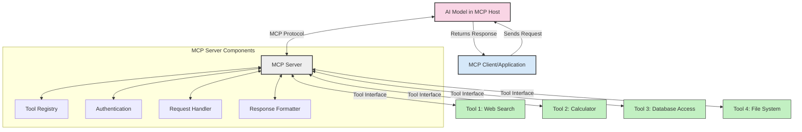
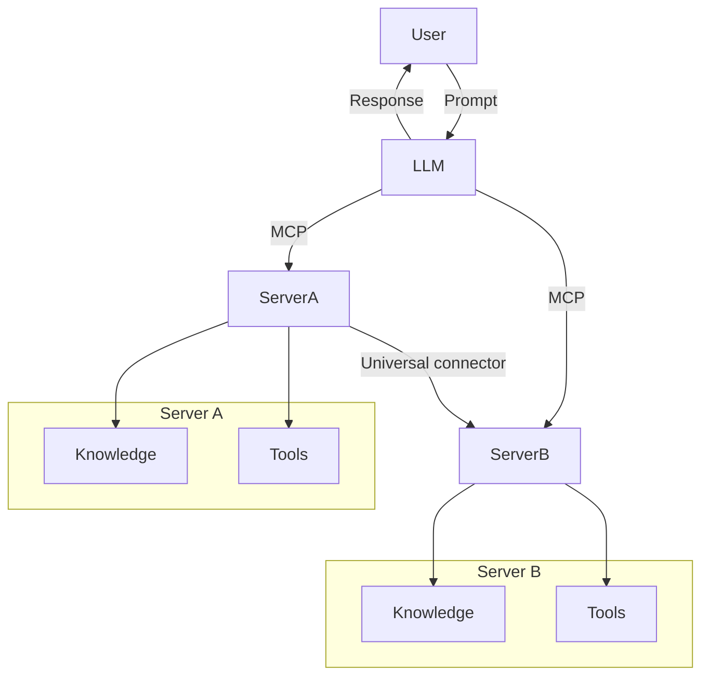

<!--
CO_OP_TRANSLATOR_METADATA:
{
  "original_hash": "02301140adbd807ecf0f17720fa307bc",
  "translation_date": "2025-05-16T14:32:27+00:00",
  "source_file": "00-Introduction/README.md",
  "language_code": "ja"
}
-->
# モデルコンテキストプロトコル（MCP）入門：スケーラブルなAIアプリケーションにおける重要性

生成AIアプリケーションは、自然言語のプロンプトを使ってユーザーが操作できる点で大きな進歩です。しかし、こうしたアプリにより多くの時間やリソースを投入するほど、機能やリソースを簡単に統合し、拡張しやすく、複数モデルやその複雑さに対応できるようにしたいと考えるでしょう。つまり、生成AIアプリは始めは簡単に作れますが、規模が大きくなり複雑になるにつれて、アーキテクチャを定義し、標準に依存して一貫性のある構築が必要になります。そこでMCPが登場し、仕組みを整理し標準を提供します。

---

## **🔍 モデルコンテキストプロトコル（MCP）とは？**

**モデルコンテキストプロトコル（MCP）**は、**大規模言語モデル（LLM）が外部ツール、API、データソースとシームレスに連携できるオープンで標準化されたインターフェース**です。トレーニングデータを超えたAIモデルの機能強化を可能にし、よりスマートでスケーラブル、応答性の高いAIシステムを実現します。

---

## **🎯 AIにおける標準化が重要な理由**

生成AIアプリケーションが複雑になるにつれて、**スケーラビリティ、拡張性、保守性**を保証する標準の採用が不可欠です。MCPは以下の課題に対応します：

- モデルとツールの統合を一元化
- 壊れやすいワンオフのカスタムソリューションを減少
- 複数モデルが共存できるエコシステムの実現

---

## **📚 学習目標**

この記事を読み終えると、以下が理解できます：

- **モデルコンテキストプロトコル（MCP）**の定義と利用ケース
- MCPがモデルとツール間の通信をどのように標準化するか
- MCPアーキテクチャの主要コンポーネントの特定
- 企業や開発現場でのMCPの実際の応用例の探索

---

## **💡 MCPがゲームチェンジャーである理由**

### **🔗 MCPはAIの相互作用の断片化を解消**

MCP登場前は、モデルとツールの統合に以下が必要でした：

- ツールとモデルごとのカスタムコード
- ベンダーごとに異なる非標準API
- 更新による頻繁な不具合発生
- ツールが増えるとスケールしにくい構造

### **✅ MCP標準化のメリット**

| **メリット**           | **説明**                                                                     |
|-----------------------|------------------------------------------------------------------------------|
| 相互運用性            | 異なるベンダーのツールとLLMがシームレスに連携                               |
| 一貫性                | プラットフォームやツール間での統一された動作                                |
| 再利用性              | 一度作ったツールを複数プロジェクトやシステムで活用可能                       |
| 開発の加速            | 標準化されたプラグアンドプレイのインターフェースで開発時間を短縮             |

---

## **🧱 MCPアーキテクチャの概要**

MCPは**クライアント・サーバーモデル**に従い、

- **MCPホスト**がAIモデルを実行
- **MCPクライアント**がリクエストを開始
- **MCPサーバー**がコンテキスト、ツール、機能を提供

### **主要コンポーネント：**

- **リソース** – モデル用の静的または動的データ  
- **プロンプト** – ガイド付き生成のための事前定義されたワークフロー  
- **ツール** – 検索や計算などの実行可能な関数  
- **サンプリング** – 再帰的な相互作用を通じたエージェント的振る舞い

---

## MCPサーバーの動作

MCPサーバーは以下の流れで動作します：

- **リクエストの流れ**:  
    1. MCPクライアントがMCPホスト上のAIモデルにリクエストを送信。  
    2. AIモデルが外部ツールやデータが必要なタイミングを認識。  
    3. モデルは標準化されたプロトコルを使ってMCPサーバーと通信。

- **MCPサーバーの機能**:  
    - ツールレジストリ：利用可能なツールと機能のカタログを管理。  
    - 認証：ツールアクセスの権限を検証。  
    - リクエストハンドラー：モデルからのツールリクエストを処理。  
    - レスポンスフォーマッター：ツール出力をモデルが理解できる形式に整形。

- **ツール実行**:  
    - サーバーがリクエストを適切な外部ツールにルーティング。  
    - ツールは検索、計算、データベースクエリなど専門機能を実行。  
    - 結果を一貫した形式でモデルに返す。

- **レスポンス完了**:  
    - AIモデルはツールの出力を応答に組み込み。  
    - 最終応答がクライアントアプリケーションに送信される。

## 👨‍💻 MCPサーバーの構築方法（例付き）

MCPサーバーは、データや機能を提供してLLMの能力を拡張します。

試してみたいですか？以下は異なる言語でのシンプルなMCPサーバー作成例です：

- **Python例**: https://github.com/modelcontextprotocol/python-sdk

- **TypeScript例**: https://github.com/modelcontextprotocol/typescript-sdk

- **Java例**: https://github.com/modelcontextprotocol/java-sdk

- **C#/.NET例**: https://github.com/modelcontextprotocol/csharp-sdk

## 🌍 MCPの実際のユースケース

MCPはAIの機能を拡張し、幅広いアプリケーションを可能にします：

| **用途**                  | **説明**                                                                   |
|---------------------------|----------------------------------------------------------------------------|
| 企業データ統合            | LLMをデータベース、CRM、社内ツールに接続                                  |
| エージェント型AIシステム   | ツールアクセスや意思決定ワークフローを備えた自律型エージェントを実現       |
| マルチモーダルアプリ      | テキスト、画像、音声ツールを統合した単一のAIアプリ                         |
| リアルタイムデータ統合    | ライブデータをAIインタラクションに取り込み、より正確で最新の出力を実現     |

### 🧠 MCP = AI相互作用のユニバーサルスタンダード

モデルコンテキストプロトコル（MCP）は、USB-Cがデバイスの物理接続を標準化したように、AI相互作用の共通標準として機能します。AIの世界では、MCPが一貫したインターフェースを提供し、モデル（クライアント）が外部ツールやデータプロバイダー（サーバー）とシームレスに統合できるようにします。これにより、各APIやデータソースごとに異なるカスタムプロトコルを作る必要がなくなります。

MCP対応ツール（MCPサーバーと呼ばれる）は統一された標準に従い、提供可能なツールやアクションを一覧表示し、AIエージェントからのリクエストに応じてそれらを実行します。MCP対応のAIエージェントプラットフォームは、サーバーから利用可能なツールを発見し、この標準プロトコルを通じて呼び出すことができます。

### 💡 知識へのアクセスを促進

ツール提供に加え、MCPは知識へのアクセスも促進します。アプリケーションがLLMにコンテキストを提供できるよう、様々なデータソースに接続します。例えば、MCPサーバーは企業の文書リポジトリを表し、エージェントが必要に応じて関連情報を取得できます。別のサーバーはメール送信や記録更新など特定のアクションを扱います。エージェントから見ると、これらは単なるツールで、一部はデータ（知識コンテキスト）を返し、他はアクションを実行します。MCPは両方を効率的に管理します。

エージェントがMCPサーバーに接続すると、標準フォーマットを通じてサーバーの利用可能な機能やアクセス可能なデータを自動的に学習します。この標準化により、ツールの動的な利用が可能です。例えば、新しいMCPサーバーをエージェントのシステムに追加すれば、エージェントの指示を変更せずに即座にその機能が使えるようになります。

このスムーズな統合は、mermaid図に示された流れと一致し、サーバーがツールと知識の両方を提供し、システム間のシームレスな連携を保証します。

### 👉 例：スケーラブルなエージェントソリューション

## 🔐 MCPの実用的なメリット

MCPを使うことで得られる実用的なメリット：

- **最新性**：モデルはトレーニングデータを超えた最新情報にアクセス可能  
- **能力拡張**：未学習のタスクに特化したツールを活用可能  
- **幻覚の軽減**：外部データソースが事実に基づく裏付けを提供  
- **プライバシー**：機密データをプロンプトに埋め込まず安全な環境に保持可能

## 📌 重要ポイント

MCP利用の重要ポイント：

- **MCP**はAIモデルとツール・データのやり取りを標準化  
- **拡張性、一貫性、相互運用性**を促進  
- MCPは**開発時間短縮、信頼性向上、モデル能力拡張**に寄与  
- クライアント・サーバーアーキテクチャで**柔軟かつ拡張性の高いAIアプリケーション**を実現

## 🧠 演習

あなたが作りたいAIアプリケーションについて考えてみましょう。

- どんな**外部ツールやデータ**が能力を高めるでしょうか？  
- MCPは統合をどのように**簡単かつ信頼性の高いもの**にできるでしょうか？

## 追加リソース

- [MCP GitHubリポジトリ](https://github.com/modelcontextprotocol)

## 次のステップ

次へ：[第1章：コアコンセプト](/01-CoreConcepts/README.md)

**免責事項**：  
本書類はAI翻訳サービス「[Co-op Translator](https://github.com/Azure/co-op-translator)」を使用して翻訳されています。正確性には努めておりますが、自動翻訳には誤りや不正確な部分が含まれる可能性があることをご了承ください。原文はあくまで正式な情報源としてご参照ください。重要な情報については、専門の人間による翻訳を推奨します。本翻訳の利用により生じたいかなる誤解や誤訳についても、一切の責任を負いかねます。