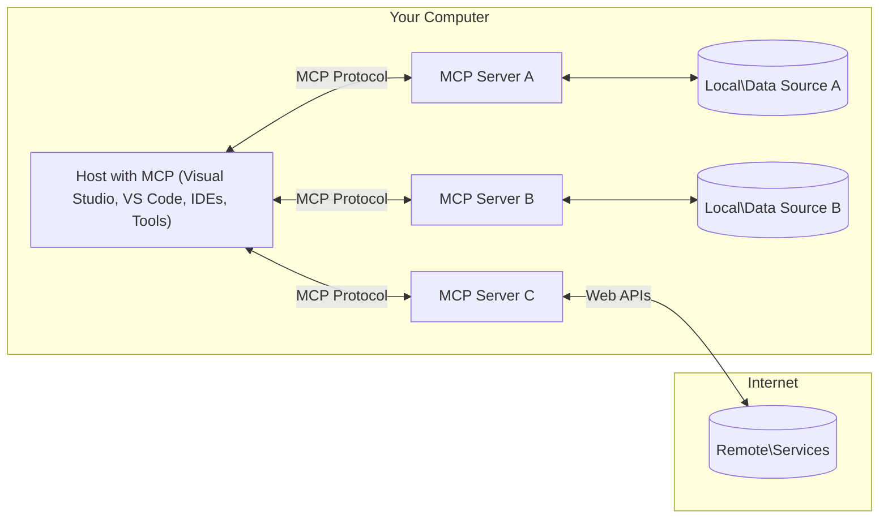

<!--
CO_OP_TRANSLATOR_METADATA:
{
  "original_hash": "88b863a69b4f18b15e82da358ffd3489",
  "translation_date": "2025-08-21T12:42:35+00:00",
  "source_file": "01-CoreConcepts/README.md",
  "language_code": "ja"
}
-->
# MCPの基本概念: AI統合のためのモデルコンテキストプロトコルの習得

[](https://youtu.be/earDzWGtE84)

_(上の画像をクリックすると、このレッスンの動画をご覧いただけます)_

[Model Context Protocol (MCP)](https://github.com/modelcontextprotocol)は、Large Language Models (LLMs)と外部ツール、アプリケーション、データソース間の通信を最適化する強力で標準化されたフレームワークです。このガイドでは、MCPの基本概念について説明します。クライアント-サーバーアーキテクチャ、主要な構成要素、通信の仕組み、実装のベストプラクティスについて学びます。

- **明確なユーザー同意**: すべてのデータアクセスと操作は、実行前に明確なユーザー承認が必要です。ユーザーは、どのデータがアクセスされ、どのアクションが実行されるかを明確に理解し、権限と認可を細かく制御できる必要があります。

- **データプライバシー保護**: ユーザーデータは明確な同意がある場合のみ公開され、インタラクションのライフサイクル全体を通じて強力なアクセス制御によって保護される必要があります。不正なデータ送信を防ぎ、厳格なプライバシー境界を維持することが求められます。

- **ツール実行の安全性**: すべてのツール呼び出しには、ツールの機能、パラメータ、および潜在的な影響を明確に理解した上でのユーザーの明確な同意が必要です。不意の、安全でない、または悪意のあるツール実行を防ぐための強力なセキュリティ境界が必要です。

- **トランスポート層のセキュリティ**: すべての通信チャネルは適切な暗号化と認証メカニズムを使用する必要があります。リモート接続では、安全なトランスポートプロトコルと適切な資格情報管理を実装する必要があります。

#### 実装ガイドライン:

- **権限管理**: サーバー、ツール、リソースへのアクセスをユーザーが制御できる細かい権限システムを実装する
- **認証と認可**: 安全な認証方法（OAuth、APIキー）を使用し、適切なトークン管理と有効期限を設定する  
- **入力検証**: 定義されたスキーマに従ってすべてのパラメータとデータ入力を検証し、インジェクション攻撃を防ぐ
- **監査ログ**: セキュリティ監視とコンプライアンスのためにすべての操作の包括的なログを保持する

## 概要

このレッスンでは、Model Context Protocol (MCP)エコシステムを構成する基本的なアーキテクチャとコンポーネントについて探ります。クライアント-サーバーアーキテクチャ、主要な構成要素、およびMCPインタラクションを支える通信メカニズムについて学びます。

## 学習目標

このレッスンの終了時には、以下を理解できるようになります:

- MCPのクライアント-サーバーアーキテクチャを理解する
- ホスト、クライアント、サーバーの役割と責任を特定する
- MCPを柔軟な統合レイヤーにする主要な機能を分析する
- MCPエコシステム内で情報がどのように流れるかを学ぶ
- .NET、Java、Python、JavaScriptのコード例を通じて実践的な洞察を得る

## MCPアーキテクチャ: 詳細な解説

MCPエコシステムはクライアント-サーバーモデルに基づいて構築されています。このモジュール構造により、AIアプリケーションがツール、データベース、API、コンテキストリソースと効率的にやり取りすることが可能になります。このアーキテクチャを主要な構成要素に分解してみましょう。

MCPの基本はクライアント-サーバーアーキテクチャであり、ホストアプリケーションが複数のサーバーに接続できるようになっています:



- **MCPホスト**: VSCode、Claude Desktop、IDE、またはMCPを介してデータにアクセスしたいAIツールなどのプログラム
- **MCPクライアント**: サーバーとの1対1の接続を維持するプロトコルクライアント
- **MCPサーバー**: 標準化されたModel Context Protocolを通じて特定の機能を公開する軽量プログラム
- **ローカルデータソース**: MCPサーバーが安全にアクセスできるコンピュータのファイル、データベース、サービス
- **リモートサービス**: APIを介してMCPサーバーが接続できるインターネット上の外部システム

MCPプロトコルは日付ベースのバージョン管理（YYYY-MM-DD形式）を使用する進化する標準です。現在のプロトコルバージョンは**2025-06-18**です。[プロトコル仕様](https://modelcontextprotocol.io/specification/2025-06-18/)の最新情報をご覧ください。

### 1. ホスト

Model Context Protocol (MCP)において、**ホスト**はプロトコルを通じてユーザーが操作する主要なインターフェースとして機能するAIアプリケーションです。ホストは複数のMCPサーバーへの接続を管理し、各サーバー接続に専用のMCPクライアントを作成します。ホストの例には以下が含まれます:

- **AIアプリケーション**: Claude Desktop、Visual Studio Code、Claude Code
- **開発環境**: MCP統合を備えたIDEやコードエディタ  
- **カスタムアプリケーション**: 特定用途向けに構築されたAIエージェントやツール

**ホスト**はAIモデルとのインタラクションを調整するアプリケーションです。以下の役割を果たします:

- **AIモデルのオーケストレーション**: LLMを実行または操作して応答を生成し、AIワークフローを調整する
- **クライアント接続の管理**: 各MCPサーバー接続ごとに1つのMCPクライアントを作成・維持する
- **ユーザーインターフェースの制御**: 会話の流れ、ユーザーインタラクション、応答の表示を管理する  
- **セキュリティの強化**: 権限、セキュリティ制約、認証を管理する
- **ユーザー同意の処理**: データ共有やツール実行に関するユーザー承認を管理する

### 2. クライアント

**クライアント**は、ホストとMCPサーバー間の専用の1対1接続を維持する重要なコンポーネントです。各MCPクライアントはホストによって特定のMCPサーバーに接続するためにインスタンス化され、整理された安全な通信チャネルを確保します。複数のクライアントにより、ホストは複数のサーバーに同時に接続できます。

**クライアント**はホストアプリケーション内のコネクタコンポーネントです。以下の役割を果たします:

- **プロトコル通信**: JSON-RPC 2.0リクエストをサーバーに送信し、プロンプトや指示を伝える
- **機能交渉**: 初期化時にサーバーとサポートされる機能やプロトコルバージョンを交渉する
- **ツール実行**: モデルからのツール実行リクエストを管理し、応答を処理する
- **リアルタイム更新**: サーバーからの通知やリアルタイム更新を処理する
- **応答処理**: サーバー応答をユーザーに表示するために処理・フォーマットする

### 3. サーバー

**サーバー**は、MCPクライアントにコンテキスト、ツール、機能を提供するプログラムです。ローカル（ホストと同じマシン）またはリモート（外部プラットフォーム）で実行可能で、クライアントリクエストを処理し、構造化された応答を提供する役割を担います。サーバーは標準化されたModel Context Protocolを通じて特定の機能を公開します。

**サーバー**はコンテキストと機能を提供するサービスです。以下の役割を果たします:

- **機能登録**: 利用可能なプリミティブ（リソース、プロンプト、ツール）をクライアントに登録・公開する
- **リクエスト処理**: クライアントからのツール呼び出し、リソースリクエスト、プロンプトリクエストを受け取り、実行する
- **コンテキスト提供**: モデル応答を向上させるためのコンテキスト情報やデータを提供する
- **状態管理**: セッション状態を維持し、必要に応じて状態を伴うインタラクションを処理する
- **リアルタイム通知**: 接続されたクライアントに機能変更や更新を通知する

サーバーは誰でも開発可能で、モデルの機能を拡張する専門的な機能を提供します。ローカルおよびリモートの展開シナリオをサポートします。

### 4. サーバープリミティブ

Model Context Protocol (MCP)のサーバーは、クライアント、ホスト、言語モデル間の豊かなインタラクションを可能にする基本的な構成要素である3つの**プリミティブ**を提供します。これらのプリミティブは、プロトコルを通じて利用可能なコンテキスト情報やアクションの種類を定義します。

MCPサーバーは以下の3つの基本プリミティブのいずれかまたは組み合わせを公開できます:

#### リソース

**リソース**は、AIアプリケーションにコンテキスト情報を提供するデータソースです。モデルの理解や意思決定を向上させる静的または動的なコンテンツを表します:

- **コンテキストデータ**: AIモデルが消費するための構造化情報とコンテキスト
- **ナレッジベース**: 文書リポジトリ、記事、マニュアル、研究論文
- **ローカルデータソース**: ファイル、データベース、ローカルシステム情報  
- **外部データ**: API応答、ウェブサービス、リモートシステムデータ
- **動的コンテンツ**: 外部条件に基づいて更新されるリアルタイムデータ

リソースはURIで識別され、`resources/list`を通じて発見され、`resources/read`メソッドを通じて取得されます:

```text
file://documents/project-spec.md
database://production/users/schema
api://weather/current
```

#### プロンプト

**プロンプト**は、言語モデルとのインタラクションを構造化するための再利用可能なテンプレートです。標準化されたインタラクションパターンやテンプレート化されたワークフローを提供します:

- **テンプレートベースのインタラクション**: 事前構造化されたメッセージや会話の開始
- **ワークフローテンプレート**: 一般的なタスクやインタラクションの標準化されたシーケンス
- **Few-shot例**: モデル指示のための例ベースのテンプレート
- **システムプロンプト**: モデルの動作やコンテキストを定義する基盤プロンプト
- **動的テンプレート**: 特定のコンテキストに適応するパラメータ化されたプロンプト

プロンプトは変数置換をサポートし、`prompts/list`を通じて発見され、`prompts/get`で取得されます:

```markdown
Generate a {{task_type}} for {{product}} targeting {{audience}} with the following requirements: {{requirements}}
```

#### ツール

**ツール**は、AIモデルが特定のアクションを実行するために呼び出すことができる実行可能な機能です。MCPエコシステムの「動詞」を表し、モデルが外部システムとやり取りすることを可能にします:

- **実行可能な機能**: 特定のパラメータでモデルが呼び出すことができる個別の操作
- **外部システム統合**: API呼び出し、データベースクエリ、ファイル操作、計算
- **ユニークな識別子**: 各ツールには固有の名前、説明、パラメータスキーマがある
- **構造化された入出力**: ツールは検証されたパラメータを受け入れ、構造化された型付き応答を返す
- **アクション機能**: モデルが実世界のアクションを実行し、ライブデータを取得することを可能にする

ツールはパラメータ検証のためにJSON Schemaで定義され、`tools/list`を通じて発見され、`tools/call`を介して実行されます:

```typescript
server.tool(
  "search_products", 
  {
    query: z.string().describe("Search query for products"),
    category: z.string().optional().describe("Product category filter"),
    max_results: z.number().default(10).describe("Maximum results to return")
  }, 
  async (params) => {
    // Execute search and return structured results
    return await productService.search(params);
  }
);
```

## クライアントプリミティブ

Model Context Protocol (MCP)では、**クライアント**がプリミティブを公開することで、サーバーがホストアプリケーションから追加の機能を要求できるようになります。これらのクライアント側プリミティブにより、サーバーはAIモデルの機能やユーザーインタラクションにアクセスできる、より豊かでインタラクティブな実装を可能にします。

### サンプリング

**サンプリング**は、サーバーがクライアントのAIアプリケーションから言語モデルの補完を要求できるようにします。このプリミティブにより、サーバーは独自のモデル依存性を埋め込むことなくLLM機能にアクセスできます:

- **モデル非依存アクセス**: サーバーはLLM SDKを含めたりモデルアクセスを管理したりすることなく補完を要求できる
- **サーバー主導のAI**: サーバーがクライアントのAIモデルを使用してコンテンツを自律的に生成できる
- **再帰的なLLMインタラクション**: サーバーが処理のためにAI支援を必要とする複雑なシナリオをサポートする
- **動的コンテンツ生成**: サーバーがホストのモデルを使用してコンテキストに応じた応答を生成できる

サンプリングは`sampling/complete`メソッドを通じて開始され、サーバーがクライアントに補完リクエストを送信します。

### 引き出し

**引き出し**は、サーバーがクライアントインターフェースを通じてユーザーから追加情報や確認を要求できるようにします:

- **ユーザー入力リクエスト**: サーバーがツール実行に必要な追加情報を要求できる
- **確認ダイアログ**: 敏感または影響の大きい操作についてユーザー承認を要求する
- **インタラクティブなワークフロー**: サーバーがステップバイステップのユーザーインタラクションを作成できる
- **動的パラメータ収集**: ツール実行中に不足しているまたはオプションのパラメータを収集する

引き出しリクエストは`elicitation/request`メソッドを使用して、クライアントのインターフェースを通じてユーザー入力を収集します。

### ロギング

**ロギング**は、サーバーがクライアントに構造化されたログメッセージを送信し、デバッグ、監視、運用の可視性を提供できるようにします:

- **デバッグサポート**: サーバーがトラブルシューティングのための詳細な実行ログを提供できる
- **運用監視**: クライアントにステータス更新やパフォーマンスメトリクスを送信
- **JSON-RPC 2.0 プロトコル**: すべての通信は、メソッド呼び出し、応答、通知のために標準化された JSON-RPC 2.0 メッセージ形式を使用します  
- **ライフサイクル管理**: クライアントとサーバー間の接続初期化、機能交渉、セッション終了を管理します  
- **サーバープリミティブ**: サーバーがツール、リソース、プロンプトを通じてコア機能を提供できるようにします  
- **クライアントプリミティブ**: サーバーが LLM からのサンプリング要求、ユーザー入力の引き出し、ログメッセージの送信を行えるようにします  
- **リアルタイム通知**: ポーリングなしで動的な更新を可能にする非同期通知をサポートします  

#### 主な特徴:

- **プロトコルバージョン交渉**: 日付ベースのバージョニング (YYYY-MM-DD) を使用して互換性を確保します  
- **機能検出**: 初期化時にクライアントとサーバーがサポートする機能情報を交換します  
- **ステートフルセッション**: 複数のやり取りにわたって接続状態を維持し、コンテキストの継続性を確保します  

### トランスポート層

**トランスポート層**は、MCP 参加者間の通信チャネル、メッセージフレーミング、認証を管理します。

#### サポートされるトランスポートメカニズム:

1. **STDIO トランスポート**:
   - 標準入力/出力ストリームを使用して直接プロセス間通信を行います  
   - ネットワークのオーバーヘッドがない同一マシン上のローカルプロセスに最適です  
   - ローカル MCP サーバー実装で一般的に使用されます  

2. **ストリーム可能な HTTP トランスポート**:
   - クライアントからサーバーへのメッセージに HTTP POST を使用  
   - サーバーからクライアントへのストリーミングにはオプションで Server-Sent Events (SSE) を使用  
   - ネットワークを越えたリモートサーバーとの通信を可能にします  
   - 標準的な HTTP 認証 (ベアラートークン、API キー、カスタムヘッダー) をサポート  
   - MCP は安全なトークンベース認証のために OAuth を推奨します  

#### トランスポート抽象化:

トランスポート層は、すべてのトランスポートメカニズムで同じ JSON-RPC 2.0 メッセージ形式を使用できるように、通信の詳細をデータ層から抽象化します。この抽象化により、アプリケーションはローカルサーバーとリモートサーバーをシームレスに切り替えることができます。

### セキュリティに関する考慮事項

MCP の実装は、すべてのプロトコル操作において安全で信頼性があり、セキュアなやり取りを確保するために、いくつかの重要なセキュリティ原則に従う必要があります。

- **ユーザーの同意と管理**: データにアクセスしたり操作を実行したりする前に、ユーザーの明示的な同意を得る必要があります。ユーザーは、どのデータが共有され、どの操作が許可されるかを明確に管理できる必要があり、アクティビティを確認および承認するための直感的なユーザーインターフェースがサポートされるべきです。

- **データプライバシー**: ユーザーデータは明示的な同意がある場合にのみ公開され、適切なアクセス制御によって保護される必要があります。MCP の実装は、不正なデータ送信を防ぎ、すべてのやり取りにおいてプライバシーが維持されるようにする必要があります。

- **ツールの安全性**: いかなるツールを呼び出す前にも、明示的なユーザーの同意が必要です。ユーザーは各ツールの機能を明確に理解できる必要があり、意図しないまたは安全でないツールの実行を防ぐために、強固なセキュリティ境界が施行されるべきです。

これらのセキュリティ原則に従うことで、MCP はすべてのプロトコル操作においてユーザーの信頼、プライバシー、安全性を維持しながら、強力な AI 統合を可能にします。

## コード例: 主要コンポーネント

以下は、主要な MCP サーバーコンポーネントとツールを実装する方法を示す、いくつかの人気のあるプログラミング言語でのコード例です。

### .NET の例: ツールを備えたシンプルな MCP サーバーの作成

以下は、カスタムツールを使用してシンプルな MCP サーバーを実装する方法を示す実用的な .NET のコード例です。この例では、ツールを定義して登録し、リクエストを処理し、Model Context Protocol を使用してサーバーを接続する方法を紹介します。

```csharp
using System;
using System.Threading.Tasks;
using ModelContextProtocol.Server;
using ModelContextProtocol.Server.Transport;
using ModelContextProtocol.Server.Tools;

public class WeatherServer
{
    public static async Task Main(string[] args)
    {
        // Create an MCP server
        var server = new McpServer(
            name: "Weather MCP Server",
            version: "1.0.0"
        );
        
        // Register our custom weather tool
        server.AddTool<string, WeatherData>("weatherTool", 
            description: "Gets current weather for a location",
            execute: async (location) => {
                // Call weather API (simplified)
                var weatherData = await GetWeatherDataAsync(location);
                return weatherData;
            });
        
        // Connect the server using stdio transport
        var transport = new StdioServerTransport();
        await server.ConnectAsync(transport);
        
        Console.WriteLine("Weather MCP Server started");
        
        // Keep the server running until process is terminated
        await Task.Delay(-1);
    }
    
    private static async Task<WeatherData> GetWeatherDataAsync(string location)
    {
        // This would normally call a weather API
        // Simplified for demonstration
        await Task.Delay(100); // Simulate API call
        return new WeatherData { 
            Temperature = 72.5,
            Conditions = "Sunny",
            Location = location
        };
    }
}

public class WeatherData
{
    public double Temperature { get; set; }
    public string Conditions { get; set; }
    public string Location { get; set; }
}
```

### Java の例: MCP サーバーコンポーネント

この例では、上記の .NET の例と同じ MCP サーバーとツール登録を Java で実装する方法を示します。

```java
import io.modelcontextprotocol.server.McpServer;
import io.modelcontextprotocol.server.McpToolDefinition;
import io.modelcontextprotocol.server.transport.StdioServerTransport;
import io.modelcontextprotocol.server.tool.ToolExecutionContext;
import io.modelcontextprotocol.server.tool.ToolResponse;

public class WeatherMcpServer {
    public static void main(String[] args) throws Exception {
        // Create an MCP server
        McpServer server = McpServer.builder()
            .name("Weather MCP Server")
            .version("1.0.0")
            .build();
            
        // Register a weather tool
        server.registerTool(McpToolDefinition.builder("weatherTool")
            .description("Gets current weather for a location")
            .parameter("location", String.class)
            .execute((ToolExecutionContext ctx) -> {
                String location = ctx.getParameter("location", String.class);
                
                // Get weather data (simplified)
                WeatherData data = getWeatherData(location);
                
                // Return formatted response
                return ToolResponse.content(
                    String.format("Temperature: %.1f°F, Conditions: %s, Location: %s", 
                    data.getTemperature(), 
                    data.getConditions(), 
                    data.getLocation())
                );
            })
            .build());
        
        // Connect the server using stdio transport
        try (StdioServerTransport transport = new StdioServerTransport()) {
            server.connect(transport);
            System.out.println("Weather MCP Server started");
            // Keep server running until process is terminated
            Thread.currentThread().join();
        }
    }
    
    private static WeatherData getWeatherData(String location) {
        // Implementation would call a weather API
        // Simplified for example purposes
        return new WeatherData(72.5, "Sunny", location);
    }
}

class WeatherData {
    private double temperature;
    private String conditions;
    private String location;
    
    public WeatherData(double temperature, String conditions, String location) {
        this.temperature = temperature;
        this.conditions = conditions;
        this.location = location;
    }
    
    public double getTemperature() {
        return temperature;
    }
    
    public String getConditions() {
        return conditions;
    }
    
    public String getLocation() {
        return location;
    }
}
```

### Python の例: MCP サーバーの構築

この例では、Python を使用して MCP サーバーを構築する方法を示します。また、ツールを作成する 2 つの異なる方法も紹介します。

```python
#!/usr/bin/env python3
import asyncio
from mcp.server.fastmcp import FastMCP
from mcp.server.transports.stdio import serve_stdio

# Create a FastMCP server
mcp = FastMCP(
    name="Weather MCP Server",
    version="1.0.0"
)

@mcp.tool()
def get_weather(location: str) -> dict:
    """Gets current weather for a location."""
    # This would normally call a weather API
    # Simplified for demonstration
    return {
        "temperature": 72.5,
        "conditions": "Sunny",
        "location": location
    }

# Alternative approach using a class
class WeatherTools:
    @mcp.tool()
    def forecast(self, location: str, days: int = 1) -> dict:
        """Gets weather forecast for a location for the specified number of days."""
        # This would normally call a weather API forecast endpoint
        # Simplified for demonstration
        return {
            "location": location,
            "forecast": [
                {"day": i+1, "temperature": 70 + i, "conditions": "Partly Cloudy"}
                for i in range(days)
            ]
        }

# Instantiate the class to register its tools
weather_tools = WeatherTools()

# Start the server using stdio transport
if __name__ == "__main__":
    asyncio.run(serve_stdio(mcp))
```

### JavaScript の例: MCP サーバーの作成

この例では、JavaScript を使用して MCP サーバーを作成し、2 つの天気関連ツールを登録する方法を示します。

```javascript
// Using the official Model Context Protocol SDK
import { McpServer } from "@modelcontextprotocol/sdk/server/mcp.js";
import { StdioServerTransport } from "@modelcontextprotocol/sdk/server/stdio.js";
import { z } from "zod"; // For parameter validation

// Create an MCP server
const server = new McpServer({
  name: "Weather MCP Server",
  version: "1.0.0"
});

// Define a weather tool
server.tool(
  "weatherTool",
  {
    location: z.string().describe("The location to get weather for")
  },
  async ({ location }) => {
    // This would normally call a weather API
    // Simplified for demonstration
    const weatherData = await getWeatherData(location);
    
    return {
      content: [
        { 
          type: "text", 
          text: `Temperature: ${weatherData.temperature}°F, Conditions: ${weatherData.conditions}, Location: ${weatherData.location}` 
        }
      ]
    };
  }
);

// Define a forecast tool
server.tool(
  "forecastTool",
  {
    location: z.string(),
    days: z.number().default(3).describe("Number of days for forecast")
  },
  async ({ location, days }) => {
    // This would normally call a weather API
    // Simplified for demonstration
    const forecast = await getForecastData(location, days);
    
    return {
      content: [
        { 
          type: "text", 
          text: `${days}-day forecast for ${location}: ${JSON.stringify(forecast)}` 
        }
      ]
    };
  }
);

// Helper functions
async function getWeatherData(location) {
  // Simulate API call
  return {
    temperature: 72.5,
    conditions: "Sunny",
    location: location
  };
}

async function getForecastData(location, days) {
  // Simulate API call
  return Array.from({ length: days }, (_, i) => ({
    day: i + 1,
    temperature: 70 + Math.floor(Math.random() * 10),
    conditions: i % 2 === 0 ? "Sunny" : "Partly Cloudy"
  }));
}

// Connect the server using stdio transport
const transport = new StdioServerTransport();
server.connect(transport).catch(console.error);

console.log("Weather MCP Server started");
```

この JavaScript の例では、サーバーに接続し、プロンプトを送信し、ツール呼び出しを含む応答を処理する MCP クライアントを作成する方法を示します。

## セキュリティと認可

MCP には、プロトコル全体でセキュリティと認可を管理するためのいくつかの組み込みの概念とメカニズムが含まれています。

1. **ツールの権限管理**:  
   クライアントは、セッション中にモデルが使用できるツールを指定できます。これにより、明示的に許可されたツールのみがアクセス可能となり、意図しないまたは安全でない操作のリスクを軽減します。権限は、ユーザーの好み、組織のポリシー、またはやり取りのコンテキストに基づいて動的に設定できます。

2. **認証**:  
   サーバーは、ツール、リソース、または機密操作へのアクセスを許可する前に認証を要求できます。これには、API キー、OAuth トークン、その他の認証スキームが含まれる場合があります。適切な認証により、信頼できるクライアントとユーザーのみがサーバー側の機能を呼び出せるようになります。

3. **検証**:  
   すべてのツール呼び出しに対してパラメータ検証が強制されます。各ツールは、パラメータの期待される型、形式、および制約を定義し、サーバーはそれに応じて受信リクエストを検証します。これにより、不正な形式や悪意のある入力がツール実装に到達するのを防ぎ、操作の整合性を維持します。

4. **レート制限**:  
   サーバーリソースの乱用を防ぎ、公平な使用を確保するために、MCP サーバーはツール呼び出しやリソースアクセスに対してレート制限を実装できます。レート制限は、ユーザーごと、セッションごと、または全体で適用でき、サービス拒否攻撃や過剰なリソース消費から保護します。

これらのメカニズムを組み合わせることで、MCP は言語モデルを外部ツールやデータソースと統合するための安全な基盤を提供し、アクセスと使用に関してユーザーや開発者に細かい制御を可能にします。

## プロトコルメッセージと通信フロー

MCP の通信は、ホスト、クライアント、サーバー間の明確で信頼性のあるやり取りを促進するために、構造化された **JSON-RPC 2.0** メッセージを使用します。このプロトコルは、さまざまな操作タイプに対して特定のメッセージパターンを定義します。

### コアメッセージタイプ:

#### **初期化メッセージ**
- **`initialize` リクエスト**: 接続を確立し、プロトコルバージョンと機能を交渉します  
- **`initialize` 応答**: サポートされている機能とサーバー情報を確認します  
- **`notifications/initialized`**: 初期化が完了し、セッションが準備完了であることを通知します  

#### **検出メッセージ**
- **`tools/list` リクエスト**: サーバーから利用可能なツールを検出します  
- **`resources/list` リクエスト**: 利用可能なリソース (データソース) を一覧表示します  
- **`prompts/list` リクエスト**: 利用可能なプロンプトテンプレートを取得します  

#### **実行メッセージ**  
- **`tools/call` リクエスト**: 指定されたパラメータで特定のツールを実行します  
- **`resources/read` リクエスト**: 特定のリソースからコンテンツを取得します  
- **`prompts/get` リクエスト**: オプションのパラメータ付きでプロンプトテンプレートを取得します  

#### **クライアント側メッセージ**
- **`sampling/complete` リクエスト**: サーバーがクライアントに LLM の補完を要求します  
- **`elicitation/request`**: サーバーがクライアントインターフェースを通じてユーザー入力を要求します  
- **ログメッセージ**: サーバーが構造化されたログメッセージをクライアントに送信します  

#### **通知メッセージ**
- **`notifications/tools/list_changed`**: サーバーがツールの変更をクライアントに通知します  
- **`notifications/resources/list_changed`**: サーバーがリソースの変更をクライアントに通知します  
- **`notifications/prompts/list_changed`**: サーバーがプロンプトの変更をクライアントに通知します  

### メッセージ構造:

すべての MCP メッセージは JSON-RPC 2.0 形式に従います:
- **リクエストメッセージ**: `id`、`method`、およびオプションの `params` を含みます  
- **応答メッセージ**: `id` と `result` または `error` を含みます  
- **通知メッセージ**: `method` とオプションの `params` を含みます (`id` や応答は不要)  

この構造化された通信により、リアルタイム更新、ツールチェーン、堅牢なエラーハンドリングなどの高度なシナリオをサポートする信頼性の高い追跡可能なやり取りが可能になります。

## 重要なポイント

- **アーキテクチャ**: MCP は、ホストが複数のクライアント接続をサーバーに管理するクライアントサーバーアーキテクチャを使用します  
- **参加者**: エコシステムには、ホスト (AI アプリケーション)、クライアント (プロトコルコネクタ)、サーバー (機能プロバイダー) が含まれます  
- **トランスポートメカニズム**: 通信は STDIO (ローカル) と Streamable HTTP (リモート) をサポートし、オプションで SSE を利用可能  
- **コアプリミティブ**: サーバーはツール (実行可能な関数)、リソース (データソース)、プロンプト (テンプレート) を公開します  
- **クライアントプリミティブ**: サーバーはクライアントにサンプリング (LLM 補完)、引き出し (ユーザー入力)、ログ記録を要求できます  
- **プロトコル基盤**: JSON-RPC 2.0 に基づき、日付ベースのバージョニングを採用 (現在: 2025-06-18)  
- **リアルタイム機能**: 動的更新とリアルタイム同期のための通知をサポート  
- **セキュリティ第一**: 明示的なユーザー同意、データプライバシー保護、安全なトランスポートが必須要件  

## 演習

あなたの分野で役立つシンプルな MCP ツールを設計してください。以下を定義してください:
1. ツールの名前  
2. 受け取るパラメータ  
3. 返す出力  
4. モデルがこのツールを使用してユーザーの問題をどのように解決するか  

---

## 次のステップ

次: [第2章: セキュリティ](../02-Security/README.md)  

**免責事項**:  
この文書は、AI翻訳サービス [Co-op Translator](https://github.com/Azure/co-op-translator) を使用して翻訳されています。正確性を追求しておりますが、自動翻訳には誤りや不正確な部分が含まれる可能性があります。元の言語で記載された原文が正式な情報源と見なされるべきです。重要な情報については、専門の人間による翻訳を推奨します。この翻訳の利用に起因する誤解や誤認について、当方は一切の責任を負いません。