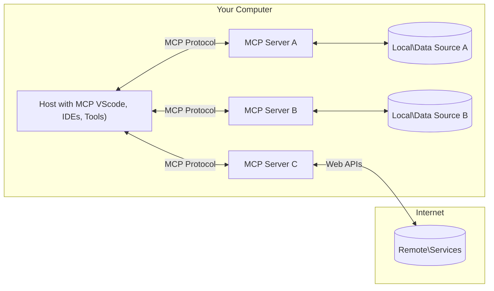

<!--
CO_OP_TRANSLATOR_METADATA:
{
  "original_hash": "355b12a5970c5c9e6db0bee970c751ba",
  "translation_date": "2025-07-04T16:13:36+00:00",
  "source_file": "01-CoreConcepts/README.md",
  "language_code": "ja"
}
-->
# 📖 MCPコアコンセプト：AI統合のためのModel Context Protocolの習得

[Model Context Protocol (MCP)](https://github.com/modelcontextprotocol)は、大規模言語モデル（LLM）と外部ツール、アプリケーション、データソース間の通信を最適化する強力で標準化されたフレームワークです。このSEO最適化されたガイドでは、MCPのクライアント-サーバーアーキテクチャ、主要コンポーネント、通信メカニズム、実装のベストプラクティスを理解できるように、コアコンセプトを丁寧に解説します。

## 概要

このレッスンでは、Model Context Protocol（MCP）エコシステムを構成する基本的なアーキテクチャとコンポーネントについて学びます。クライアント-サーバーアーキテクチャ、主要コンポーネント、MCPのやり取りを支える通信メカニズムについて理解を深めましょう。

## 👩‍🎓 主な学習目標

このレッスンを終える頃には、以下ができるようになります：

- MCPのクライアント-サーバーアーキテクチャを理解する
- Hosts、Clients、Serversの役割と責任を識別する
- MCPを柔軟な統合レイヤーにしているコア機能を分析する
- MCPエコシステム内での情報の流れを学ぶ
- .NET、Java、Python、JavaScriptのコード例を通じて実践的な知見を得る

## 🔎 MCPアーキテクチャ：詳細解説

MCPエコシステムはクライアント-サーバーモデルに基づいて構築されています。このモジュラー構造により、AIアプリケーションはツール、データベース、API、コンテキストリソースと効率的に連携できます。アーキテクチャの主要コンポーネントを分解して見ていきましょう。

MCPは基本的にクライアント-サーバーアーキテクチャを採用しており、ホストアプリケーションは複数のサーバーに接続可能です：



- **MCP Hosts**：VSCode、Claude Desktop、IDE、またはMCPを通じてデータにアクセスしたいAIツールなどのプログラム
- **MCP Clients**：サーバーと1対1の接続を維持するプロトコルクライアント
- **MCP Servers**：標準化されたModel Context Protocolを通じて特定の機能を提供する軽量プログラム
- **ローカルデータソース**：MCPサーバーが安全にアクセスできる、コンピューターのファイル、データベース、サービス
- **リモートサービス**：インターネット経由で利用可能な外部システムで、MCPサーバーがAPIを通じて接続可能

MCPプロトコルは進化し続ける標準仕様であり、最新の更新は[プロトコル仕様](https://modelcontextprotocol.io/specification/2025-06-18/)で確認できます。

### 1. Hosts

Model Context Protocol（MCP）において、Hostsはユーザーがプロトコルとやり取りする主要なインターフェースとして重要な役割を果たします。HostsはMCPサーバーへの接続を開始し、データ、ツール、プロンプトにアクセスするアプリケーションや環境です。例としてはVisual Studio Codeのような統合開発環境（IDE）、Claude DesktopのようなAIツール、特定のタスク向けにカスタム構築されたエージェントなどがあります。

**Hosts**はLLMアプリケーションであり、以下の役割を担います：

- AIモデルを実行または操作して応答を生成する
- MCPサーバーへの接続を開始する
- 会話の流れとユーザーインターフェースを管理する
- 権限とセキュリティ制約を制御する
- データ共有やツール実行に関するユーザーの同意を扱う

### 2. Clients

ClientsはHostsとMCPサーバー間のやり取りを円滑にする重要なコンポーネントです。Clientsは仲介者として機能し、HostsがMCPサーバーの機能を利用できるようにします。MCPアーキテクチャ内でのスムーズな通信と効率的なデータ交換を保証する役割を果たします。

**Clients**はホストアプリケーション内のコネクターであり、以下を行います：

- プロンプトや指示を含むリクエストをサーバーに送信する
- サーバーと機能の交渉を行う
- モデルからのツール実行リクエストを管理する
- ユーザーへの応答を処理・表示する

### 3. Servers

ServersはMCPクライアントからのリクエストを処理し、適切な応答を提供する役割を担います。データ取得、ツール実行、プロンプト生成などの操作を管理し、クライアントとHosts間の通信が効率的かつ信頼性の高いものとなるようにします。やり取りの整合性を維持することも重要です。

**Servers**はコンテキストと機能を提供するサービスであり、以下を行います：

- 利用可能な機能（リソース、プロンプト、ツール）を登録する
- クライアントからのツール呼び出しを受け取り実行する
- モデルの応答を強化するためのコンテキスト情報を提供する
- 出力をクライアントに返す
- 必要に応じてやり取りの状態を維持する

Serversは誰でも開発可能で、専門的な機能でモデルの能力を拡張できます。

### 4. Server Features

Model Context Protocol（MCP）のServersは、クライアント、ホスト、言語モデル間の豊かなやり取りを可能にする基本的な構成要素を提供します。これらの機能は、構造化されたコンテキスト、ツール、プロンプトを提供することでMCPの能力を高めるよう設計されています。

MCPサーバーは以下のいずれかの機能を提供できます：

#### 📑 リソース

Model Context Protocol（MCP）におけるリソースは、ユーザーやAIモデルが活用できるさまざまな種類のコンテキストやデータを指します。具体的には：

- **コンテキストデータ**：意思決定やタスク実行に役立つ情報や状況
- **ナレッジベースやドキュメントリポジトリ**：記事、マニュアル、研究論文などの構造化・非構造化データのコレクション
- **ローカルファイルやデータベース**：デバイス上やデータベース内に保存され、処理や分析に利用可能なデータ
- **APIやウェブサービス**：追加のデータや機能を提供し、さまざまなオンラインリソースやツールと統合可能な外部インターフェース

リソースの例としては、データベーススキーマや以下のようにアクセス可能なファイルがあります：

```text
file://log.txt
database://schema
```

### 🤖 プロンプト

Model Context Protocol（MCP）におけるプロンプトは、ユーザーのワークフローを効率化し、コミュニケーションを強化するためのさまざまな事前定義されたテンプレートや対話パターンを含みます。具体的には：

- **テンプレート化されたメッセージやワークフロー**：特定のタスクややり取りを案内する事前構造化されたメッセージやプロセス
- **事前定義された対話パターン**：一貫性と効率的なコミュニケーションを促進する標準化されたアクションと応答のシーケンス
- **専門的な会話テンプレート**：特定の会話タイプに合わせてカスタマイズ可能なテンプレートで、関連性が高く文脈に適したやり取りを実現

プロンプトテンプレートの例は以下の通りです：

```markdown
Generate a product slogan based on the following {{product}} with the following {{keywords}}
```

#### ⛏️ ツール

Model Context Protocol（MCP）におけるツールは、AIモデルが特定のタスクを実行するために呼び出せる関数です。これらのツールは、構造化され信頼性の高い操作を提供することでAIモデルの能力を強化します。主な特徴は：

- **AIモデルが実行可能な関数**：ツールはAIモデルが呼び出してさまざまなタスクを実行できる関数
- **固有の名前と説明**：各ツールには目的と機能を説明する明確な名前と詳細な説明がある
- **パラメーターと出力**：特定のパラメーターを受け取り、構造化された出力を返すことで一貫性と予測可能性を確保
- **個別の機能**：ウェブ検索、計算、データベースクエリなどの個別機能を実行

ツールの例は以下のようになります：

```typescript
server.tool(
  "GetProducts",
  {
    pageSize: z.string().optional(),
    pageCount: z.string().optional()
  }, () => {
    // return results from API
  }
)
```

## クライアント機能

Model Context Protocol（MCP）において、クライアントはサーバーに対していくつかの重要な機能を提供し、プロトコル内の全体的な機能性とやり取りを向上させます。特に注目すべき機能の一つがSamplingです。

### 👉 Sampling

- **サーバー主導のエージェント的動作**：クライアントはサーバーが特定のアクションや動作を自律的に開始できるようにし、システムの動的能力を高める
- **再帰的なLLMインタラクション**：大規模言語モデル（LLM）との再帰的なやり取りを可能にし、より複雑で反復的なタスク処理を実現
- **追加のモデル補完要求**：サーバーはモデルに対して追加の補完を要求でき、応答が十分かつ文脈に即したものになるようにする

## MCPにおける情報の流れ

Model Context Protocol（MCP）は、ホスト、クライアント、サーバー、モデル間の情報の流れを構造化して定義しています。この流れを理解することで、ユーザーのリクエストがどのように処理され、外部ツールやデータがモデルの応答に統合されるかが明確になります。

- **ホストが接続を開始**  
  IDEやチャットインターフェースなどのホストアプリケーションが、通常はSTDIO、WebSocket、または他のサポートされるトランスポートを介してMCPサーバーに接続を確立します。

- **機能の交渉**  
  ホストに組み込まれたクライアントとサーバーが、サポートされる機能、ツール、リソース、プロトコルバージョンについて情報を交換します。これにより、両者がセッションで利用可能な機能を理解します。

- **ユーザーリクエスト**  
  ユーザーがホストとやり取り（例：プロンプトやコマンドの入力）し、ホストはこの入力をクライアントに渡して処理します。

- **リソースまたはツールの利用**  
  - クライアントは、モデルの理解を深めるためにサーバーから追加のコンテキストやリソース（ファイル、データベースエントリ、ナレッジベース記事など）を要求することがあります。  
  - モデルがツールの利用を判断した場合（例：データ取得、計算、API呼び出し）、クライアントはツール名とパラメーターを指定してサーバーにツール呼び出しリクエストを送信します。

- **サーバーの実行**  
  サーバーはリソースまたはツールのリクエストを受け取り、必要な操作（関数の実行、データベースクエリ、ファイル取得など）を行い、結果を構造化された形式でクライアントに返します。

- **応答生成**  
  クライアントはサーバーの応答（リソースデータ、ツール出力など）をモデルとのやり取りに統合し、モデルはこれらの情報を用いて包括的かつ文脈に即した応答を生成します。

- **結果の提示**  
  ホストはクライアントから最終出力を受け取り、モデルの生成テキストやツール実行・リソース参照の結果を含めてユーザーに提示します。

この流れにより、MCPはモデルと外部ツールやデータソースをシームレスに接続し、高度でインタラクティブかつ文脈認識型のAIアプリケーションをサポートします。

## プロトコルの詳細

MCP（Model Context Protocol）は[JSON-RPC 2.0](https://www.jsonrpc.org/)の上に構築されており、ホスト、クライアント、サーバー間の通信に標準化された言語非依存のメッセージフォーマットを提供します。この基盤により、多様なプラットフォームやプログラミング言語間で信頼性が高く構造化された拡張可能なやり取りが可能になります。

### 主要なプロトコル機能

MCPはJSON-RPC 2.0を拡張し、ツール呼び出し、リソースアクセス、プロンプト管理のための追加規約を設けています。複数のトランスポート層（STDIO、WebSocket、SSE）をサポートし、コンポーネント間の安全で拡張性のある言語非依存通信を実現します。

#### 🧢 基本プロトコル

- **JSON-RPCメッセージフォーマット**：すべてのリクエストとレスポンスはJSON-RPC 2.0仕様に準拠し、メソッド呼び出し、パラメーター、結果、エラー処理の一貫した構造を保証
- **ステートフル接続**：MCPセッションは複数のリクエストにわたり状態を維持し、継続的な会話、コンテキストの蓄積、リソース管理をサポート
- **機能交渉**：接続設定時にクライアントとサーバーがサポート機能、プロトコルバージョン、利用可能なツールやリソースについて情報交換し、双方が相手の能力を理解し適応可能にする

#### ➕ 追加ユーティリティ

以下はMCPが開発者体験を向上させ、高度なシナリオを可能にするために提供する追加のユーティリティやプロトコル拡張です：

- **設定オプション**：ツールの権限、リソースアクセス、モデル設定など、各やり取りに合わせたセッションパラメーターの動的設定を許可
- **進捗追跡**：長時間実行される操作が進捗状況を報告でき、複雑なタスク中の応答性の高いユーザーインターフェースを実現
- **リクエストキャンセル**：クライアントは進行中のリクエストをキャンセル可能で、不要または時間がかかりすぎる操作を中断できる
- **エラー報告**：標準化されたエラーメッセージとコードにより問題の診断、障害の優雅な処理、ユーザーや開発者への実用的なフィードバックを提供
- **ログ記録**：クライアントとサーバーの両方が監査、デバッグ、プロトコルのやり取りの監視のために構造化ログを出力可能

これらのプロトコル機能を活用することで、MCPは言語モデルと外部ツールやデータソース間の堅牢で安全かつ柔軟な通信を保証します。

### 🔐 セキュリティ上の考慮事項

MCPの実装は、安全で信頼できるやり取りを確保するために以下の主要なセキュリティ原則を遵守すべきです：

- **ユーザーの同意と制御**：データアクセスや操作実行の前にユーザーの明示
MCPには、プロトコル全体でセキュリティと認可を管理するためのいくつかの組み込みの概念と仕組みが含まれています。

1. **ツールの権限管理**  
  クライアントは、セッション中にモデルが使用できるツールを指定できます。これにより、明示的に許可されたツールのみが利用可能となり、意図しないまたは安全でない操作のリスクを減らせます。権限はユーザーの好み、組織のポリシー、または対話の状況に応じて動的に設定可能です。

2. **認証**  
  サーバーは、ツールやリソース、機密操作へのアクセスを許可する前に認証を要求できます。これにはAPIキー、OAuthトークン、その他の認証方式が含まれます。適切な認証により、信頼できるクライアントやユーザーのみがサーバー側の機能を呼び出せるようになります。

3. **検証**  
  すべてのツール呼び出しに対してパラメータの検証が行われます。各ツールはパラメータの期待される型、形式、制約を定義しており、サーバーは受信したリクエストをそれに基づいて検証します。これにより、不正な入力や悪意のある入力がツールの実装に届くのを防ぎ、操作の整合性を保ちます。

4. **レート制限**  
  悪用を防ぎ、サーバーリソースの公平な利用を確保するために、MCPサーバーはツール呼び出しやリソースアクセスに対してレート制限を実装できます。レート制限はユーザー単位、セッション単位、または全体で適用可能で、サービス拒否攻撃や過剰なリソース消費から保護します。

これらの仕組みを組み合わせることで、MCPは言語モデルと外部ツールやデータソースの統合において安全な基盤を提供し、ユーザーや開発者に対してアクセスや利用の細かな制御を可能にします。

## プロトコルメッセージ

MCPの通信は構造化されたJSONメッセージを使用し、クライアント、サーバー、モデル間の明確で信頼性の高いやり取りを実現します。主なメッセージタイプは以下の通りです。

- **Client Request**  
  クライアントからサーバーへ送信されるメッセージで、通常以下を含みます。  
  - ユーザーのプロンプトやコマンド  
  - コンテキストとしての会話履歴  
  - ツールの設定や権限情報  
  - その他のメタデータやセッション情報

- **Model Response**  
  モデル（クライアント経由）から返されるメッセージで、以下を含みます。  
  - プロンプトとコンテキストに基づく生成テキストや補完結果  
  - モデルがツールの呼び出しを判断した場合のツール呼び出し指示（任意）  
  - 必要に応じたリソースや追加コンテキストへの参照

- **Tool Request**  
  ツールの実行が必要な際にクライアントからサーバーへ送信されるメッセージで、以下を含みます。  
  - 呼び出すツールの名前  
  - ツールのスキーマに基づいて検証されたパラメータ  
  - リクエストの追跡用のコンテキスト情報や識別子

- **Tool Response**  
  ツール実行後にサーバーから返されるメッセージで、以下を提供します。  
  - ツール実行の結果（構造化データやコンテンツ）  
  - ツール呼び出しが失敗した場合のエラーやステータス情報  
  - 実行に関連する追加のメタデータやログ（任意）

これらの構造化メッセージにより、MCPの各ステップは明確で追跡可能かつ拡張可能となり、多ターン会話、ツールの連鎖、堅牢なエラー処理など高度なシナリオをサポートします。

## 重要なポイント

- MCPはクライアント・サーバーアーキテクチャを用いてモデルと外部機能を接続する  
- エコシステムはクライアント、ホスト、サーバー、ツール、データソースで構成される  
- 通信はSTDIO、SSE、WebSocketsを通じて行われる  
- ツールはモデルに公開される基本的な機能単位である  
- 構造化された通信プロトコルにより一貫したやり取りが保証される

## 演習

あなたの分野で役立つシンプルなMCPツールを設計してください。以下を定義しましょう。  
1. ツールの名前  
2. 受け付けるパラメータ  
3. 出力内容  
4. モデルがこのツールを使ってユーザーの問題をどのように解決するか

---

## 次に進む

次へ: [Chapter 2: Security](../02-Security/README.md)

**免責事項**：  
本書類はAI翻訳サービス「[Co-op Translator](https://github.com/Azure/co-op-translator)」を使用して翻訳されました。正確性を期しておりますが、自動翻訳には誤りや不正確な部分が含まれる可能性があります。原文の言語による文書が正式な情報源とみなされるべきです。重要な情報については、専門の人間による翻訳を推奨します。本翻訳の利用により生じた誤解や誤訳について、当方は一切の責任を負いかねます。