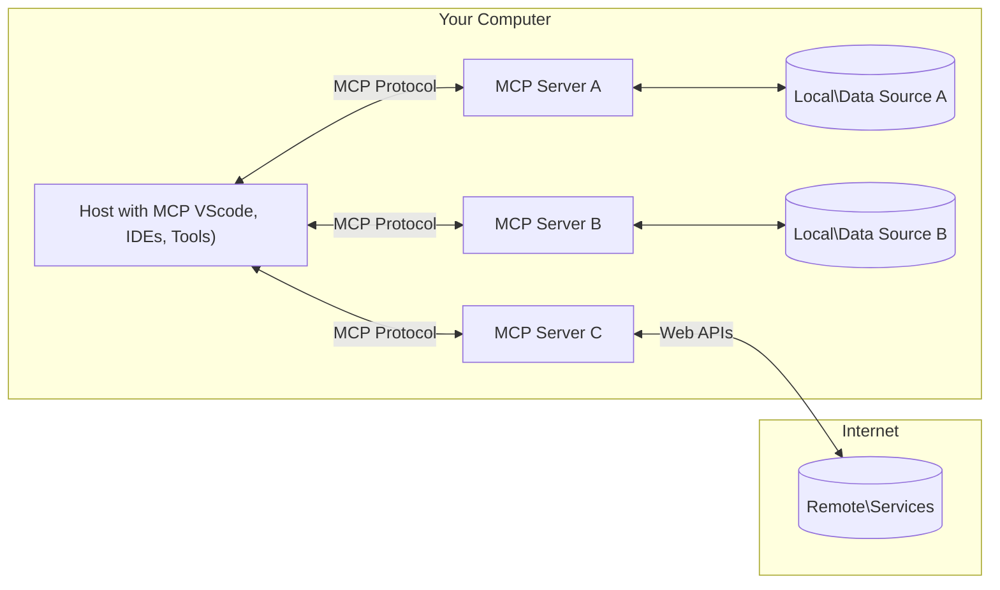

<!--
CO_OP_TRANSLATOR_METADATA:
{
  "original_hash": "b3b4a6ad10c3c0edbf7fa7cfa0ec496b",
  "translation_date": "2025-07-02T07:02:11+00:00",
  "source_file": "01-CoreConcepts/README.md",
  "language_code": "ja"
}
-->
# 📖 MCPコアコンセプト：AI統合のためのModel Context Protocolのマスター

[Model Context Protocol (MCP)](https://github.com/modelcontextprotocol)は、大規模言語モデル（LLM）と外部ツール、アプリケーション、データソース間の通信を最適化する強力で標準化されたフレームワークです。このSEO最適化されたガイドでは、MCPのクライアント-サーバーアーキテクチャ、主要コンポーネント、通信メカニズム、実装のベストプラクティスを理解できるように、コアコンセプトを詳しく解説します。

## 概要

このレッスンでは、Model Context Protocol (MCP) エコシステムを構成する基本的なアーキテクチャとコンポーネントを探ります。クライアント-サーバーアーキテクチャ、主要な構成要素、MCPのやり取りを支える通信メカニズムについて学びます。

## 👩‍🎓 主な学習目標

このレッスンの終わりまでに、あなたは以下を理解できるようになります：

- MCPのクライアント-サーバーアーキテクチャ
- Hosts、Clients、Serversの役割と責任
- MCPが柔軟な統合レイヤーとなるコア機能の分析
- MCPエコシステム内の情報の流れ
- .NET、Java、Python、JavaScriptによるコード例を通じた実践的な知見

## 🔎 MCPアーキテクチャ：詳細解説

MCPエコシステムはクライアント-サーバーモデルに基づいて構築されています。このモジュール式の構造により、AIアプリケーションはツール、データベース、API、コンテキストリソースと効率的にやり取りできます。このアーキテクチャの主要コンポーネントを分解して見てみましょう。

MCPは基本的にクライアント-サーバーアーキテクチャを採用しており、ホストアプリケーションは複数のサーバーに接続可能です：



- **MCP Hosts**：VSCode、Claude Desktop、IDE、またはMCP経由でデータにアクセスしたいAIツールなどのプログラム
- **MCP Clients**：サーバーと1対1の接続を維持するプロトコルクライアント
- **MCP Servers**：標準化されたModel Context Protocolを通じて特定の機能を提供する軽量プログラム
- **ローカルデータソース**：MCPサーバーが安全にアクセスできるコンピューター内のファイル、データベース、サービス
- **リモートサービス**：MCPサーバーがAPI経由で接続できるインターネット上の外部システム

MCPプロトコルは進化し続ける標準であり、最新の更新は[プロトコル仕様](https://modelcontextprotocol.io/specification/2025-06-18/)で確認できます。

### 1. Hosts

Model Context Protocol (MCP)におけるHostsは、ユーザーがプロトコルとやり取りする主要なインターフェースとして重要な役割を果たします。HostsはMCPサーバーへの接続を開始し、データ、ツール、プロンプトにアクセスするアプリケーションや環境です。例としては、Visual Studio Codeのような統合開発環境（IDE）、Claude DesktopのようなAIツール、特定タスク向けにカスタム構築されたエージェントなどがあります。

**Hosts**はLLMアプリケーションであり、以下を行います：

- AIモデルを実行または操作して応答を生成する
- MCPサーバーとの接続を開始する
- 会話の流れとユーザーインターフェースを管理する
- 権限とセキュリティ制約を制御する
- データ共有やツール実行に対するユーザーの同意を扱う

### 2. Clients

ClientsはHostsとMCPサーバー間のやり取りを円滑にする重要なコンポーネントです。Clientsは仲介役として機能し、HostsがMCPサーバーの提供する機能を利用できるようにします。MCPアーキテクチャ内でスムーズな通信と効率的なデータ交換を保証する役割を担います。

**Clients**はホストアプリケーション内のコネクタであり、以下を行います：

- プロンプトや指示を含むリクエストをサーバーに送信する
- サーバーとの機能交渉を行う
- モデルからのツール実行リクエストを管理する
- ユーザーへの応答を処理・表示する

### 3. Servers

ServersはMCPクライアントからのリクエストを処理し、適切な応答を提供します。データ取得、ツール実行、プロンプト生成などの操作を管理し、クライアントとHosts間の通信が効率的かつ信頼性高く行われるようにします。対話の整合性も維持します。

**Servers**はコンテキストと機能を提供するサービスであり、以下を行います：

- 利用可能な機能（リソース、プロンプト、ツール）を登録する
- クライアントからのツール呼び出しを受け取り実行する
- モデルの応答を強化するためのコンテキスト情報を提供する
- 出力をクライアントに返す
- 必要に応じて対話の状態を保持する

Serversは誰でも開発可能で、専門的な機能でモデルの能力を拡張できます。

### 4. Server Features

Model Context Protocol (MCP)のServersは、クライアント、ホスト、言語モデル間の豊かなやり取りを可能にする基本的な構成要素を提供します。これらの機能は構造化されたコンテキスト、ツール、プロンプトを提供し、MCPの能力を高めるよう設計されています。

MCPサーバーは以下のいずれかの機能を提供できます：

#### 📑 Resources

MCPにおけるリソースは、ユーザーやAIモデルが活用できる様々な種類のコンテキストやデータを指します。これには以下が含まれます：

- **コンテキストデータ**：意思決定やタスク実行のためにユーザーやAIモデルが利用できる情報や文脈
- **ナレッジベースやドキュメントリポジトリ**：記事、マニュアル、研究論文などの構造化・非構造化データのコレクションで、有益な知見や情報を提供
- **ローカルファイルやデータベース**：デバイス上やデータベース内に保存され、処理や分析のためにアクセス可能なデータ
- **APIやウェブサービス**：外部のインターフェースやサービスで、追加のデータや機能を提供し、様々なオンラインリソースやツールとの統合を可能にする

リソースの例として、データベーススキーマや以下のようにアクセスできるファイルがあります：

```text
file://log.txt
database://schema
```

### 🤖 Prompts

MCPのプロンプトは、ユーザーワークフローを効率化し、コミュニケーションを向上させるために設計された様々な定義済みテンプレートや対話パターンを含みます。これには以下が含まれます：

- **テンプレート化されたメッセージやワークフロー**：特定のタスクや対話を案内する事前構造化されたメッセージやプロセス
- **定義済みの対話パターン**：一貫性と効率的なコミュニケーションを促進する標準化されたアクションと応答のシーケンス
- **専門的な会話テンプレート**：特定の会話タイプに合わせてカスタマイズ可能なテンプレートで、関連性が高く文脈に適した対話を保証

プロンプトテンプレートの例は以下の通りです：

```markdown
Generate a product slogan based on the following {{product}} with the following {{keywords}}
```

#### ⛏️ Tools

MCPのツールは、AIモデルが特定のタスクを実行するために呼び出せる関数です。これらのツールは、AIモデルの能力を拡張し、構造化され信頼性の高い操作を提供するよう設計されています。主な特徴は以下の通りです：

- **AIモデルが実行可能な関数**：ツールはAIモデルが呼び出して様々なタスクを実行できる関数
- **固有の名前と説明**：各ツールには目的と機能を説明する明確な名前と詳細な説明が付与されている
- **パラメーターと出力**：ツールは特定のパラメーターを受け取り、構造化された出力を返すことで、一貫性と予測可能な結果を保証
- **独立した機能**：ウェブ検索、計算、データベースクエリなどの独立した機能を実行

ツールの例は以下の通りです：

```typescript
server.tool(
  "GetProducts",
  {
    pageSize: z.string().optional(),
    pageCount: z.string().optional()
  }, () => {
    // return results from API
  }
)
```

## Client Features

MCPにおけるクライアントは、サーバーに対していくつかの重要な機能を提供し、プロトコル内の全体的な機能性とインタラクションを向上させます。代表的な機能の一つにSamplingがあります。

### 👉 Sampling

- **サーバー主導のエージェント的動作**：クライアントはサーバーが特定のアクションや動作を自律的に開始できるようにし、システムの動的な能力を強化
- **再帰的なLLMインタラクション**：大規模言語モデル（LLM）との再帰的なやり取りを可能にし、より複雑で反復的なタスク処理を実現
- **追加のモデル補完要求**：サーバーはモデルに対して追加の補完を要求でき、応答が十分かつ文脈に即したものになるよう保証

## MCPにおける情報の流れ

Model Context Protocol (MCP)は、Hosts、Clients、Servers、モデル間の情報の流れを構造化して定義しています。この流れを理解することで、ユーザーリクエストがどのように処理され、外部ツールやデータがモデルの応答に統合されるかが明確になります。

- **Hostが接続を開始**  
  IDEやチャットインターフェースなどのホストアプリケーションが、通常はSTDIO、WebSocket、またはその他のサポートされたトランスポート経由でMCPサーバーに接続を確立します。

- **機能交渉**  
  ホストに組み込まれたクライアントとサーバーは、それぞれのサポート機能、ツール、リソース、プロトコルバージョンに関する情報を交換します。これにより、両者がセッションで利用可能な機能を理解します。

- **ユーザーリクエスト**  
  ユーザーがホストと対話（例：プロンプトやコマンドの入力）し、その入力がクライアントに渡され処理されます。

- **リソースまたはツールの利用**  
  - クライアントは、モデルの理解を深めるためにサーバーから追加のコンテキストやリソース（ファイル、データベースのエントリ、ナレッジベースの記事など）を要求することがあります。
  - モデルがツールの使用が必要と判断した場合（例：データ取得、計算、API呼び出し）、クライアントはツール名とパラメーターを指定してサーバーにツール呼び出しリクエストを送信します。

- **サーバーの実行**  
  サーバーはリソースやツールのリクエストを受け取り、必要な操作（関数実行、データベースクエリ、ファイル取得など）を行い、結果を構造化された形式でクライアントに返します。

- **応答生成**  
  クライアントはサーバーの応答（リソースデータ、ツール出力など）をモデルとの対話に統合します。モデルはこれらの情報を活用して、包括的かつ文脈に即した応答を生成します。

- **結果の提示**  
  ホストはクライアントから最終出力を受け取り、モデルが生成したテキストやツール実行結果を含めてユーザーに提示します。

この流れにより、MCPはモデルと外部ツールやデータソースをシームレスに接続し、高度でインタラクティブかつコンテキスト対応のAIアプリケーションをサポートします。

## プロトコルの詳細

MCP（Model Context Protocol）は[JSON-RPC 2.0](https://www.jsonrpc.org/)の上に構築されており、ホスト、クライアント、サーバー間の通信に標準化された言語非依存のメッセージフォーマットを提供します。この基盤により、多様なプラットフォームやプログラミング言語間で信頼性が高く構造化された拡張可能なやり取りが可能になります。

### 主要なプロトコル機能

MCPはJSON-RPC 2.0を拡張し、ツール呼び出し、リソースアクセス、プロンプト管理のための追加規約を提供します。複数のトランスポート層（STDIO、WebSocket、SSE）をサポートし、コンポーネント間で安全かつ拡張性のある言語非依存の通信を実現します。

#### 🧢 ベースプロトコル

- **JSON-RPCメッセージフォーマット**：すべてのリクエストとレスポンスはJSON-RPC 2.0仕様に従い、メソッド呼び出し、パラメーター、結果、エラー処理の一貫した構造を保証
- **ステートフル接続**：MCPセッションは複数リクエストにまたがって状態を保持し、継続的な会話、コンテキスト蓄積、リソース管理をサポート
- **機能交渉**：接続確立時にクライアントとサーバーはサポート機能、プロトコルバージョン、利用可能なツールやリソースに関する情報を交換し、双方の機能理解と適応を促進

#### ➕ 追加ユーティリティ

以下は、MCPが開発者体験を向上させ、高度なシナリオを可能にするために提供する追加ユーティリティやプロトコル拡張です：

- **設定オプション**：ツールの権限、リソースアクセス、モデル設定など、各インタラクションに合わせてセッションパラメーターを動的に設定可能
- **進捗追跡**：長時間かかる操作の進捗更新を報告でき、応答性の高いユーザーインターフェースと快適なユーザー体験を提供
- **リクエストキャンセル**：クライアントは進行中のリクエストをキャンセルでき、不要または時間がかかりすぎる操作を中断可能
- **エラー報告**：標準化されたエラーメッセージとコードにより、問題の診断、障害の優雅な処理、ユーザーや開発者への具体的なフィードバックを支援
- **ログ記録**：クライアントとサーバーは監査、デバッグ、プロトコルインタラクションの監視のために構造化ログを生成可能

これらのプロトコル機能を活用することで、MCPは言語モデルと外部ツールやデータソース間の堅牢で安全かつ柔軟な通信を実現します。

### 🔐 セキュリティ上の考慮事項

MCPの実装は、安全で信頼できるインタラクションを確保するために以下の重要なセキュリティ原則を遵守すべきです：

- **ユーザーの同意と制御**：データアクセスや操作の実行前にユーザーの明示的な同意を得る必要があります。共有するデータや許可するアクションをユーザーが明確に制御できるようにし、活動のレビューや承認が直感的に行えるユーザーインターフ

**免責事項**：  
本書類はAI翻訳サービス「[Co-op Translator](https://github.com/Azure/co-op-translator)」を使用して翻訳されました。正確性を期しておりますが、自動翻訳には誤りや不正確な部分が含まれる可能性があります。原文の言語によるオリジナル文書が正式な情報源とみなされるべきです。重要な情報については、専門の人間による翻訳を推奨します。本翻訳の利用により生じた誤解や誤訳について、一切の責任を負いかねますのでご了承ください。