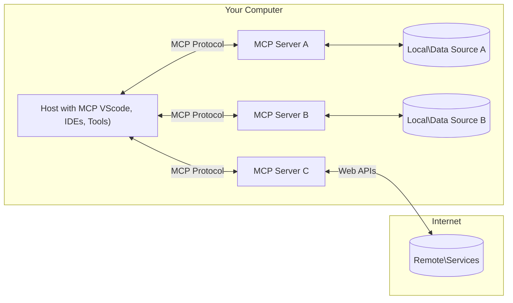

<!--
CO_OP_TRANSLATOR_METADATA:
{
  "original_hash": "2222cbf8a23394076ef76c616b65aede",
  "translation_date": "2025-07-29T00:15:17+00:00",
  "source_file": "01-CoreConcepts/README.md",
  "language_code": "ja"
}
-->
# 📖 MCPの基本概念: AI統合のためのモデルコンテキストプロトコルをマスターする

[](https://youtu.be/earDzWGtE84)

_(上の画像をクリックすると、このレッスンの動画をご覧いただけます)_

[Model Context Protocol (MCP)](https://github.com/modelcontextprotocol)は、大規模言語モデル（LLM）と外部ツール、アプリケーション、データソース間の通信を最適化するための強力で標準化されたフレームワークです。このSEO最適化されたガイドでは、MCPのクライアント-サーバーアーキテクチャ、主要コンポーネント、通信メカニズム、実装のベストプラクティスについて詳しく説明します。

## 概要

このレッスンでは、Model Context Protocol (MCP)エコシステムを構成する基本的なアーキテクチャとコンポーネントについて探ります。クライアント-サーバーアーキテクチャ、主要コンポーネント、MCPの相互作用を支える通信メカニズムについて学びます。

## 👩‍🎓 主な学習目標

このレッスンの終わりまでに、以下を理解できるようになります：

- MCPのクライアント-サーバーアーキテクチャを理解する。
- Hosts、Clients、Serversの役割と責任を特定する。
- MCPを柔軟な統合レイヤーにする主要な特徴を分析する。
- MCPエコシステム内での情報の流れを学ぶ。
- .NET、Java、Python、JavaScriptのコード例を通じて実践的な洞察を得る。

## 🔎 MCPアーキテクチャ: 詳細な解説

MCPエコシステムはクライアント-サーバーモデルに基づいて構築されています。このモジュール構造により、AIアプリケーションがツール、データベース、API、コンテキストリソースと効率的にやり取りすることが可能です。このアーキテクチャを主要なコンポーネントに分解してみましょう。

MCPの基本は、ホストアプリケーションが複数のサーバーに接続できるクライアント-サーバーアーキテクチャに従っています：



- **MCP Hosts**: VSCode、Claude Desktop、IDE、またはMCPを通じてデータにアクセスしたいAIツールなどのプログラム
- **MCP Clients**: サーバーと1対1の接続を維持するプロトコルクライアント
- **MCP Servers**: 標準化されたModel Context Protocolを通じて特定の機能を提供する軽量プログラム
- **ローカルデータソース**: MCPサーバーが安全にアクセスできるコンピュータのファイル、データベース、サービス
- **リモートサービス**: MCPサーバーがAPIを通じて接続できるインターネット上の外部システム

MCPプロトコルは進化し続ける標準であり、[プロトコル仕様](https://modelcontextprotocol.io/specification/2025-06-18/)の最新情報を確認できます。

### 1. Hosts

Model Context Protocol (MCP)において、Hostsはプロトコルとユーザーがやり取りするための主要なインターフェースとして重要な役割を果たします。Hostsは、MCPサーバーと接続を開始し、データ、ツール、プロンプトにアクセスするアプリケーションや環境です。例としては、Visual Studio Codeのような統合開発環境（IDE）、Claude DesktopのようなAIツール、または特定のタスク向けに設計されたカスタムエージェントが挙げられます。

**Hosts**は接続を開始するLLMアプリケーションであり、以下を行います：

- AIモデルを実行または操作して応答を生成する。
- MCPサーバーとの接続を開始する。
- 会話の流れとユーザーインターフェースを管理する。
- 権限とセキュリティ制約を制御する。
- データ共有やツール実行に関するユーザーの同意を管理する。

### 2. Clients

Clientsは、HostsとMCPサーバー間のやり取りを円滑にする重要なコンポーネントです。Clientsは仲介者として機能し、HostsがMCPサーバーの提供する機能を利用できるようにします。MCPアーキテクチャ内でのスムーズな通信と効率的なデータ交換を確保する上で重要な役割を果たします。

**Clients**はホストアプリケーション内のコネクタであり、以下を行います：

- プロンプトや指示をサーバーに送信する。
- サーバーとの機能交渉を行う。
- モデルからのツール実行リクエストを管理する。
- ユーザーに応答を処理して表示する。

### 3. Servers

Serversは、MCPクライアントからのリクエストを処理し、適切な応答を提供する役割を担います。データ取得、ツール実行、プロンプト生成などのさまざまな操作を管理します。Serversは、クライアントとHosts間の通信が効率的かつ信頼性の高いものとなるようにし、相互作用プロセスの整合性を維持します。

**Servers**はコンテキストと機能を提供するサービスであり、以下を行います：

- 利用可能な機能（リソース、プロンプト、ツール）を登録する。
- クライアントからのツール呼び出しを受信して実行する。
- モデルの応答を強化するためのコンテキスト情報を提供する。
- 出力をクライアントに返す。
- 必要に応じて相互作用間で状態を維持する。

Serversは、モデルの機能を拡張するために誰でも開発可能です。

### 4. サーバーの機能

Model Context Protocol (MCP)のサーバーは、クライアント、ホスト、言語モデル間の豊かな相互作用を可能にする基本的な構成要素を提供します。これらの機能は、MCPの能力を強化し、構造化されたコンテキスト、ツール、プロンプトを提供するよう設計されています。

MCPサーバーは以下の機能を提供できます：

#### 📑 リソース

Model Context Protocol (MCP)におけるリソースは、ユーザーやAIモデルが活用できるさまざまな種類のコンテキストやデータを指します。これには以下が含まれます：

- **コンテキストデータ**: 意思決定やタスク実行のためにユーザーやAIモデルが活用できる情報やコンテキスト。
- **ナレッジベースと文書リポジトリ**: 記事、マニュアル、研究論文などの構造化および非構造化データのコレクション。
- **ローカルファイルとデータベース**: デバイスやデータベース内にローカルに保存され、処理や分析に利用可能なデータ。
- **APIとウェブサービス**: さまざまなオンラインリソースやツールとの統合を可能にする外部インターフェースとサービス。

リソースの例としては、以下のようにアクセスできるデータベーススキーマやファイルが挙げられます：

```text
file://log.txt
database://schema
```

### 🤖 プロンプト

Model Context Protocol (MCP)におけるプロンプトには、ユーザーのワークフローを効率化し、コミュニケーションを強化するために設計されたさまざまな事前定義のテンプレートや相互作用パターンが含まれます。これには以下が含まれます：

- **テンプレート化されたメッセージとワークフロー**: 特定のタスクや相互作用をガイドするための事前構造化されたメッセージやプロセス。
- **事前定義された相互作用パターン**: 一貫性と効率的なコミュニケーションを促進する標準化されたアクションと応答のシーケンス。
- **特化型会話テンプレート**: 特定の種類の会話に合わせてカスタマイズされたテンプレートで、関連性が高くコンテキストに適した相互作用を保証する。

プロンプトテンプレートの例は以下のようになります：

```markdown
Generate a product slogan based on the following {{product}} with the following {{keywords}}
```

#### ⛏️ ツール

Model Context Protocol (MCP)におけるツールは、AIモデルが特定のタスクを実行するために使用できる機能です。これらのツールは、構造化され信頼性のある操作を提供することで、AIモデルの能力を強化します。主な特徴は以下の通りです：

- **AIモデルが実行するための関数**: ツールは、AIモデルがさまざまなタスクを実行するために呼び出せる実行可能な関数です。
- **一意の名前と説明**: 各ツールには固有の名前と、その目的や機能を説明する詳細な説明があります。
- **パラメータと出力**: ツールは特定のパラメータを受け取り、構造化された出力を返すことで、一貫性と予測可能な結果を保証します。
- **個別の機能**: ツールは、ウェブ検索、計算、データベースクエリなどの個別の機能を実行します。

ツールの例は以下のようになります：

```typescript
server.tool(
  "GetProducts",
  {
    pageSize: z.string().optional(),
    pageCount: z.string().optional()
  }, () => {
    // return results from API
  }
)
```

## クライアントの機能

Model Context Protocol (MCP)において、クライアントはサーバーにいくつかの重要な機能を提供し、プロトコル内での全体的な機能と相互作用を強化します。その中でも注目すべき機能の1つがサンプリングです。

### 👉 サンプリング

- **サーバー主導のエージェント的行動**: クライアントは、サーバーが特定のアクションや行動を自律的に開始できるようにし、システムの動的な能力を強化します。
- **再帰的なLLM相互作用**: この機能により、大規模言語モデル（LLM）との再帰的な相互作用が可能になり、より複雑で反復的なタスク処理が実現します。
- **追加のモデル補完のリクエスト**: サーバーはモデルに追加の補完をリクエストすることで、応答が徹底的でコンテキストに適したものになるようにします。

## MCPにおける情報の流れ

Model Context Protocol (MCP)は、ホスト、クライアント、サーバー、モデル間の情報の流れを構造化して定義しています。この流れを理解することで、ユーザーリクエストがどのように処理され、外部ツールやデータがモデル応答に統合されるかを明確にすることができます。

- **ホストが接続を開始**  
  ホストアプリケーション（例: IDEやチャットインターフェース）がMCPサーバーへの接続を確立します。通常、STDIO、WebSocket、または他のサポートされているトランスポートを介して行われます。

- **機能交渉**  
  クライアント（ホストに埋め込まれている）とサーバーが、サポートされている機能、ツール、リソース、プロトコルバージョンに関する情報を交換します。これにより、セッションで利用可能な機能を両者が理解できるようになります。

- **ユーザーリクエスト**  
  ユーザーがホストとやり取りします（例: プロンプトやコマンドを入力）。ホストはこの入力を収集し、処理のためにクライアントに渡します。

- **リソースまたはツールの使用**  
  - クライアントは、モデルの理解を深めるために、サーバーから追加のコンテキストやリソース（例: ファイル、データベースエントリ、ナレッジベースの記事）をリクエストする場合があります。
  - モデルがツールを必要とすると判断した場合（例: データの取得、計算の実行、APIの呼び出し）、クライアントはツール名とパラメータを指定してサーバーにツール呼び出しリクエストを送信します。

- **サーバーの実行**  
  サーバーはリソースまたはツールリクエストを受信し、必要な操作（例: 関数の実行、データベースのクエリ、ファイルの取得）を実行し、構造化された形式で結果をクライアントに返します。

- **応答生成**  
  クライアントは、サーバーの応答（リソースデータ、ツールの出力など）を進行中のモデル相互作用に統合します。モデルはこの情報を使用して、包括的でコンテキストに適した応答を生成します。

- **結果の提示**  
  ホストはクライアントから最終的な出力を受け取り、ユーザーに提示します。通常、モデルが生成したテキストとツール実行やリソース検索の結果の両方が含まれます。

この流れにより、MCPはモデルと外部ツールやデータソースをシームレスに接続することで、高度でインタラクティブかつコンテキスト対応のAIアプリケーションをサポートします。

## プロトコルの詳細

MCP（Model Context Protocol）は[JSON-RPC 2.0](https://www.jsonrpc.org/)の上に構築されており、ホスト、クライアント、サーバー間の通信のための標準化された言語非依存のメッセージ形式を提供します。この基盤により、多様なプラットフォームやプログラミング言語間で信頼性が高く、構造化され、拡張可能な相互作用が可能になります。

### プロトコルの主な特徴

MCPは、ツール呼び出し、リソースアクセス、プロンプト管理のための追加の規約をJSON-RPC 2.0に拡張しています。複数のトランスポートレイヤー（STDIO、WebSocket、SSE）をサポートし、コンポーネント間の安全で拡張可能かつ言語非依存の通信を可能にします。

#### 🧢 基本プロトコル

- **JSON-RPCメッセージ形式**: すべてのリクエストとレスポンスはJSON-RPC 2.0仕様を使用し、メソッド呼び出し、パラメータ、結果、エラーハンドリングの一貫した構造を保証します。
- **ステートフル接続**: MCPセッションは複数のリクエストにわたって状態を維持し、継続的な会話、コンテキストの蓄積、リソース管理をサポートします。
- **機能交渉**: 接続設定中に、クライアントとサーバーはサポートされている機能、プロトコルバージョン、利用可能なツール、リソースに関する情報を交換します。これにより、両者が互いの能力を理解し、それに応じて適応できるようになります。

#### ➕ 追加ユーティリティ

以下は、MCPが開発者体験を向上させ、高度なシナリオを可能にするために提供する追加のユーティリティとプロトコル拡張です：

- **設定オプション**: MCPは、ツールの権限、リソースアクセス、モデル設定などのセッションパラメータを動的に構成することを可能にし、各相互作用に合わせて調整します。
- **進行状況の追跡**: 長時間実行される操作は進行状況の更新を報告でき、複雑なタスク中のレスポンシブなユーザーインターフェースと優れたユーザー体験を実現します。
- **リクエストのキャンセル**: クライアントは進行中のリクエストをキャンセルでき、不要になった操作や時間がかかりすぎる操作を中断できます。
- **エラーレポート
```javascript
// Using the official Model Context Protocol SDK
import { McpServer } from "@modelcontextprotocol/sdk/server/mcp.js";
import { StdioServerTransport } from "@modelcontextprotocol/sdk/server/stdio.js";
import { z } from "zod"; // For parameter validation

// Create an MCP server
const server = new McpServer({
  name: "Weather MCP Server",
  version: "1.0.0"
});

// Define a weather tool
server.tool(
  "weatherTool",
  {
    location: z.string().describe("The location to get weather for")
  },
  async ({ location }) => {
    // This would normally call a weather API
    // Simplified for demonstration
    const weatherData = await getWeatherData(location);
    
    return {
      content: [
        { 
          type: "text", 
          text: `Temperature: ${weatherData.temperature}°F, Conditions: ${weatherData.conditions}, Location: ${weatherData.location}` 
        }
      ]
    };
  }
);

// Define a forecast tool
server.tool(
  "forecastTool",
  {
    location: z.string(),
    days: z.number().default(3).describe("Number of days for forecast")
  },
  async ({ location, days }) => {
    // This would normally call a weather API
    // Simplified for demonstration
    const forecast = await getForecastData(location, days);
    
    return {
      content: [
        { 
          type: "text", 
          text: `${days}-day forecast for ${location}: ${JSON.stringify(forecast)}` 
        }
      ]
    };
  }
);

// Helper functions
async function getWeatherData(location) {
  // Simulate API call
  return {
    temperature: 72.5,
    conditions: "Sunny",
    location: location
  };
}

async function getForecastData(location, days) {
  // Simulate API call
  return Array.from({ length: days }, (_, i) => ({
    day: i + 1,
    temperature: 70 + Math.floor(Math.random() * 10),
    conditions: i % 2 === 0 ? "Sunny" : "Partly Cloudy"
  }));
}

// Connect the server using stdio transport
const transport = new StdioServerTransport();
server.connect(transport).catch(console.error);

console.log("Weather MCP Server started");
```

このJavaScriptの例では、MCPクライアントを作成し、サーバーに接続してプロンプトを送信し、ツール呼び出しを含むレスポンスを処理する方法を示しています。

## セキュリティと認証

MCPは、プロトコル全体でセキュリティと認証を管理するためのいくつかの組み込みの概念と仕組みを提供しています。

1. **ツールの権限管理**:  
   クライアントは、セッション中にモデルが使用できるツールを指定できます。これにより、明示的に許可されたツールのみがアクセス可能となり、意図しない操作や安全でない操作のリスクを軽減します。権限は、ユーザーの好み、組織のポリシー、またはインタラクションのコンテキストに基づいて動的に設定できます。

2. **認証**:  
   サーバーは、ツール、リソース、または機密操作へのアクセスを許可する前に認証を要求することができます。これには、APIキー、OAuthトークン、その他の認証方式が含まれる場合があります。適切な認証により、信頼できるクライアントやユーザーのみがサーバー側の機能を呼び出せるようになります。

3. **検証**:  
   すべてのツール呼び出しに対してパラメータ検証が実施されます。各ツールは、パラメータの期待される型、形式、制約を定義し、サーバーは受信リクエストをそれに基づいて検証します。これにより、不正な入力や悪意のある入力がツールの実装に到達するのを防ぎ、操作の整合性を維持します。

4. **レート制限**:  
   MCPサーバーは、ツール呼び出しやリソースアクセスに対してレート制限を実施することで、濫用を防ぎ、サーバーリソースの公平な使用を確保します。レート制限は、ユーザーごと、セッションごと、または全体的に適用することができ、サービス拒否攻撃や過剰なリソース消費から保護します。

これらの仕組みを組み合わせることで、MCPは外部ツールやデータソースと統合するための安全な基盤を提供し、ユーザーや開発者にアクセスと使用に関する細かい制御を可能にします。

## プロトコルメッセージ

MCPの通信は、クライアント、サーバー、モデル間の明確で信頼性のあるやり取りを促進するために、構造化されたJSONメッセージを使用します。主なメッセージタイプは以下の通りです。

- **クライアントリクエスト**  
  クライアントからサーバーに送信されるメッセージで、通常以下を含みます:
  - ユーザーのプロンプトやコマンド
  - コンテキストとしての会話履歴
  - ツールの設定と権限
  - その他のメタデータやセッション情報

- **モデルレスポンス**  
  モデル（クライアント経由）から返されるメッセージで、以下を含みます:
  - プロンプトとコンテキストに基づいて生成されたテキストや補完
  - モデルがツールを呼び出すべきと判断した場合のツール呼び出し指示
  - 必要に応じたリソースや追加のコンテキストへの参照

- **ツールリクエスト**  
  ツールを実行する必要がある場合にクライアントからサーバーに送信されるメッセージで、以下を含みます:
  - 呼び出すツールの名前
  - ツールが必要とするパラメータ（ツールのスキーマに基づいて検証）
  - リクエストを追跡するためのコンテキスト情報や識別子

- **ツールレスポンス**  
  ツールを実行した後にサーバーから返されるメッセージで、以下を提供します:
  - ツール実行の結果（構造化データやコンテンツ）
  - ツール呼び出しが失敗した場合のエラーやステータス情報
  - 必要に応じて、実行に関連する追加のメタデータやログ

これらの構造化メッセージにより、MCPワークフローの各ステップが明確で追跡可能かつ拡張可能となり、複数ターンの会話、ツールの連鎖、堅牢なエラー処理などの高度なシナリオをサポートします。

## 重要なポイント

- MCPはクライアント-サーバーアーキテクチャを使用してモデルを外部機能と接続します
- エコシステムはクライアント、ホスト、サーバー、ツール、データソースで構成されています
- 通信はSTDIO、SSE、またはWebSocketsを介して行われます
- ツールはモデルに公開される基本的な機能単位です
- 構造化された通信プロトコルにより、一貫したやり取りが保証されます

## 演習

あなたの分野で役立つシンプルなMCPツールを設計してください。以下を定義してください:
1. ツールの名前
2. 受け入れるパラメータ
3. 返す出力
4. モデルがこのツールを使用してユーザーの問題を解決する方法

---

## 次のステップ

次: [第2章: セキュリティ](../02-Security/README.md)

**免責事項**:  
この文書はAI翻訳サービス[Co-op Translator](https://github.com/Azure/co-op-translator)を使用して翻訳されています。正確性を追求しておりますが、自動翻訳には誤りや不正確な部分が含まれる可能性があります。元の言語で記載された文書を正式な情報源としてお考えください。重要な情報については、専門の人間による翻訳を推奨します。この翻訳の使用に起因する誤解や誤解について、当社は責任を負いません。