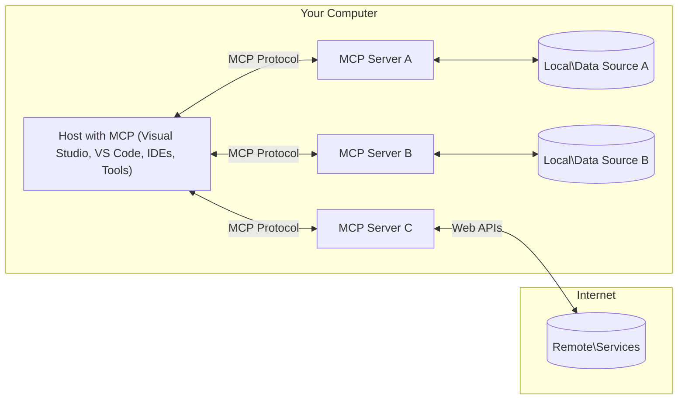

<!--
CO_OP_TRANSLATOR_METADATA:
{
  "original_hash": "11010ad254e48628bb6a457be2211640",
  "translation_date": "2025-08-12T07:45:29+00:00",
  "source_file": "01-CoreConcepts/README.md",
  "language_code": "ja"
}
-->
# 📖 MCPの基本概念: AI統合のためのモデルコンテキストプロトコルを習得する

[](https://youtu.be/earDzWGtE84)

_(上の画像をクリックすると、このレッスンの動画が視聴できます)_

[Model Context Protocol (MCP)](https://github.com/modelcontextprotocol)は、Large Language Models (LLMs)と外部ツール、アプリケーション、データソース間の通信を最適化する強力で標準化されたフレームワークです。このガイドでは、MCPのクライアント-サーバーアーキテクチャ、主要なコンポーネント、通信メカニズム、実装のベストプラクティスについて説明します。

## 概要

このレッスンでは、Model Context Protocol (MCP)エコシステムを構成する基本的なアーキテクチャとコンポーネントについて探ります。クライアント-サーバーアーキテクチャ、主要なコンポーネント、MCPのやり取りを支える通信メカニズムについて学びます。

## 👩‍🎓 学習目標

このレッスンの終了時には以下を理解できます:

- MCPのクライアント-サーバーアーキテクチャを理解する。
- Hosts、Clients、Serversの役割と責任を特定する。
- MCPを柔軟な統合レイヤーにする主要な特徴を分析する。
- MCPエコシステム内で情報がどのように流れるかを学ぶ。
- .NET、Java、Python、JavaScriptのコード例を通じて実践的な洞察を得る。

## 🔎 MCPアーキテクチャ: 詳細な解説

MCPエコシステムはクライアント-サーバーモデルに基づいて構築されています。このモジュール構造により、AIアプリケーションがツール、データベース、API、コンテキストリソースと効率的にやり取りできます。このアーキテクチャを主要なコンポーネントに分解してみましょう。

MCPはクライアント-サーバーアーキテクチャに従い、ホストアプリケーションが複数のサーバーに接続できます:



- **MCP Hosts**: VSCode、Claude Desktop、IDE、またはMCPを通じてデータにアクセスしたいAIツールなどのプログラム
- **MCP Clients**: サーバーと1対1の接続を維持するプロトコルクライアント
- **MCP Servers**: 標準化されたModel Context Protocolを通じて特定の機能を公開する軽量プログラム
- **ローカルデータソース**: MCPサーバーが安全にアクセスできるコンピュータのファイル、データベース、サービス
- **リモートサービス**: MCPサーバーがAPIを通じて接続できるインターネット上の外部システム

MCPプロトコルは進化する標準です。[プロトコル仕様](https://modelcontextprotocol.io/specification/2025-06-18/)の最新情報をご覧ください。

### 1. Hosts

Model Context Protocol (MCP)では、Hostsはプロトコルとユーザーがやり取りする主要なインターフェースとして重要な役割を果たします。Hostsは、MCPサーバーとの接続を開始し、データ、ツール、プロンプトにアクセスするアプリケーションや環境です。Hostsの例には、Visual Studio Codeのような統合開発環境（IDE）、Claude DesktopのようなAIツール、特定のタスク向けに設計されたカスタムエージェントなどがあります。

**Hosts**はLLMsとの接続を開始するアプリケーションです。以下を行います:

- AIモデルを実行またはやり取りして応答を生成する。
- MCPサーバーとの接続を開始する。
- 会話の流れとユーザーインターフェースを管理する。
- 権限とセキュリティ制約を制御する。
- データ共有やツール実行に関するユーザーの同意を管理する。

### 2. Clients

Clientsは、HostsとMCPサーバー間のやり取りを促進する重要なコンポーネントです。Clientsは仲介役として機能し、HostsがMCPサーバーの提供する機能を利用できるようにします。MCPアーキテクチャ内で円滑な通信と効率的なデータ交換を確保する上で重要な役割を果たします。

**Clients**はホストアプリケーション内のコネクタです。以下を行います:

- プロンプトや指示を含むリクエストをサーバーに送信する。
- サーバーと機能を交渉する。
- モデルからのツール実行リクエストを管理する。
- ユーザーに応答を処理して表示する。

### 3. Servers

ServersはMCPクライアントからのリクエストを処理し、適切な応答を提供する役割を担います。最も一般的には、ServersはLLMに特定の機能を提供するツールとして機能します。データ取得、ツール実行、プロンプト生成などのさまざまな操作を管理します。Serversは、クライアントとHosts間の通信が効率的で信頼性が高いことを保証し、やり取りプロセスの整合性を維持します。

**Servers**はコンテキストと機能を提供するサービスです。以下を行います:

- 利用可能な機能（リソース、プロンプト、ツール）を登録する。
- クライアントからのツール呼び出しを受け取り、実行する。
- モデル応答を向上させるためのコンテキスト情報を提供する。
- クライアントに出力を返す。
- 必要に応じてやり取り間で状態を維持する。

Serversは、専門的な機能を備えたモデル能力を拡張するために誰でも開発できます。

### 4. Server Features

Model Context Protocol (MCP)のServersは、クライアント、Hosts、言語モデル間の豊かなやり取りを可能にする基本的な構成要素を提供します。これらの機能は、MCPの能力を向上させ、構造化されたコンテキスト、ツール、プロンプトを提供するよう設計されています。

MCPサーバーは以下の機能を提供できます:

#### 📑 リソース

Model Context Protocol (MCP)のリソースは、ユーザーやAIモデルが利用できるさまざまな種類のコンテキストやデータを含みます。これには以下が含まれます:

- **コンテキストデータ**: ユーザーやAIモデルが意思決定やタスク実行に活用できる情報とコンテキスト。
- **知識ベースと文書リポジトリ**: 記事、マニュアル、研究論文などの構造化および非構造化データのコレクション。
- **ローカルファイルとデータベース**: デバイスやデータベースに保存されたデータで、処理や分析が可能。
- **APIとウェブサービス**: 追加のデータや機能を提供する外部インターフェースとサービスで、さまざまなオンラインリソースやツールとの統合を可能にする。

リソースの例として、データベーススキーマや以下のようにアクセス可能なファイルがあります:

```text
file://log.txt
database://schema
```

### 🤖 プロンプト

Model Context Protocol (MCP)のプロンプトには、ユーザーのワークフローを効率化し、コミュニケーションを向上させるために設計されたさまざまな事前定義テンプレートややり取りパターンが含まれます。これには以下が含まれます:

- **テンプレート化されたメッセージとワークフロー**: 特定のタスクややり取りをガイドする構造化されたメッセージとプロセス。
- **事前定義されたやり取りパターン**: 一貫性と効率的なコミュニケーションを促進する標準化されたアクションと応答のシーケンス。
- **専門的な会話テンプレート**: 特定の種類の会話に合わせてカスタマイズされたテンプレートで、関連性がありコンテキストに適したやり取りを保証する。

プロンプトテンプレートは以下のように見える場合があります:

```markdown
Generate a product slogan based on the following {{product}} with the following {{keywords}}
```

#### ⛏️ ツール

Model Context Protocol (MCP)のツールは、AIモデルが特定のタスクを実行するために使用できる機能です。これらのツールは、AIモデルの能力を向上させ、構造化された信頼性の高い操作を提供するよう設計されています。主な側面は以下の通りです:

- **AIモデルが実行する機能**: ツールは、AIモデルがさまざまなタスクを実行するために呼び出すことができる実行可能な機能です。
- **ユニークな名前と説明**: 各ツールには独自の名前と、その目的や機能を説明する詳細な説明があります。
- **パラメータと出力**: ツールは特定のパラメータを受け取り、構造化された出力を返すことで、一貫性のある予測可能な結果を保証します。
- **個別の機能**: ツールはウェブ検索、計算、データベースクエリなどの個別の機能を実行します。

ツールの例は以下のように見える場合があります:

```typescript
server.tool(
  "GetProducts",
  {
    pageSize: z.string().optional(),
    pageCount: z.string().optional()
  }, () => {
    // return results from API
  }
)
```

## クライアント機能

Model Context Protocol (MCP)では、クライアントがサーバーにいくつかの重要な機能を提供し、プロトコル内での全体的な機能とやり取りを向上させます。その中でも注目すべき機能の一つがSamplingです。

### 👉 Sampling

- **サーバー主導のエージェント的行動**: クライアントはサーバーが特定のアクションや行動を自律的に開始できるようにし、システムの動的な能力を向上させます。
- **再帰的なLLMのやり取り**: この機能により、大規模言語モデル（LLM）との再帰的なやり取りが可能になり、より複雑で反復的なタスク処理が実現します。
- **追加のモデル完了リクエスト**: サーバーはモデルから追加の完了をリクエストすることで、応答が徹底的でコンテキストに適したものになるようにします。

## MCPにおける情報の流れ

Model Context Protocol (MCP)は、Hosts、Clients、Servers、Models間の情報の流れを構造化して定義しています。この流れを理解することで、ユーザーリクエストがどのように処理され、外部ツールやデータがモデル応答に統合されるかを明確にすることができます。

- **Hostが接続を開始**  
  Hostアプリケーション（IDEやチャットインターフェースなど）がSTDIO、WebSocket、またはその他のサポートされているトランスポートを介してMCPサーバーへの接続を確立します。

- **機能交渉**  
  Hostに埋め込まれたクライアントとサーバーが、サポートされている機能、ツール、リソース、プロトコルバージョンについて情報を交換します。これにより、セッションで利用可能な機能を両者が理解します。

- **ユーザーリクエスト**  
  ユーザーがHostとやり取りします（例: プロンプトやコマンドを入力）。Hostはこの入力を収集し、クライアントに処理のために渡します。

- **リソースまたはツールの使用**  
  - クライアントは、モデルの理解を深めるためにサーバーから追加のコンテキストやリソース（ファイル、データベースエントリ、知識ベース記事など）をリクエストする場合があります。
  - モデルがツールを必要とすると判断した場合（例: データ取得、計算実行、API呼び出しなど）、クライアントはツール名とパラメータを指定してサーバーにツール呼び出しリクエストを送信します。

- **サーバー実行**  
  サーバーはリソースまたはツールリクエストを受け取り、必要な操作（関数の実行、データベースクエリ、ファイルの取得など）を実行し、構造化された形式で結果をクライアントに返します。

- **応答生成**  
  クライアントはサーバーの応答（リソースデータ、ツール出力など）を進行中のモデルやり取りに統合します。モデルはこの情報を使用して包括的でコンテキストに適した応答を生成します。

- **結果の提示**  
  Hostはクライアントから最終的な出力を受け取り、ユーザーに提示します。これには、モデルが生成したテキストとツール実行やリソース検索の結果が含まれることがよくあります。

この流れにより、MCPはモデルを外部ツールやデータソースとシームレスに接続することで、高度でインタラクティブなコンテキスト対応のAIアプリケーションをサポートします。

## プロトコルの詳細

MCP (Model Context Protocol)は[JSON-RPC 2.0](https://www.jsonrpc.org/)の上に構築されており、Hosts、Clients、Servers間の通信のための標準化された言語非依存のメッセージ形式を提供します。この基盤により、さまざまなプラットフォームやプログラミング言語間で信頼性が高く、構造化され、拡張可能なやり取りが可能になります。

### プロトコルの主要な特徴

MCPはJSON-RPC 2.0を拡張し、ツール呼び出し、リソースアクセス、プロンプト管理のための追加の規約を提供します。複数のトランスポートレイヤー（STDIO、WebSocket、SSE）をサポートし、コンポーネント間の安全で拡張可能な言語非依存の通信を可能にします。

#### 🧢 基本プロトコル

- **JSON-RPCメッセージ形式**: すべてのリクエストと応答はJSON-RPC 2.0仕様を使用し、メソッド呼び出し、パラメータ、結果、エラー処理の一貫した構造を保証します。
- **状態保持接続**: MCPセッションは複数のリクエスト間で状態を維持し、継続的な会話、コンテキストの蓄積、リソース管理をサポートします。
- **機能交渉**: 接続セットアップ中に、クライアントとサーバーがサポートされている機能、プロトコルバージョン、利用可能なツール、リソースについて情報を交換します。これにより、両者が互いの能力を理解し、それに応じて適応できます。

#### ➕ 追加ユーティリティ

以下は、開発者の体験を向上させ、高度なシナリオを可能にするためにMCPが提供する追加ユーティリティとプロトコル拡張です:

- **設定オプション**: MCPは、ツールの権限、リソースアクセス、モデル設定などのセッションパラメータを動的に構成でき、各やり取りに合わせて調整可能です。
- **進捗追跡**: 長時間実行される操作は進捗状況を報告でき、複雑なタスク中のレスポンシブなユーザーインターフェースと優れたユーザー体験を可能にします。
- **リクエストのキャンセル**: クライアントは進行中のリクエストをキャンセルでき、不要になった操作や時間がかかりすぎる操作を中断できます。
- **エラー報告**: 標準化されたエラーメッセージとコードは問題の診断、失敗の優雅な処理、ユーザーや開発者への実用的なフィードバックを提供します。
- **ログ記録**: クライアントとサーバーの両方がプロトコルのやり取り
この例では、JavaScriptでMCPサーバーを作成し、天気に関連する2つのツールを登録する方法を示しています。

```javascript
// Using the official Model Context Protocol SDK
import { McpServer } from "@modelcontextprotocol/sdk/server/mcp.js";
import { StdioServerTransport } from "@modelcontextprotocol/sdk/server/stdio.js";
import { z } from "zod"; // For parameter validation

// Create an MCP server
const server = new McpServer({
  name: "Weather MCP Server",
  version: "1.0.0"
});

// Define a weather tool
server.tool(
  "weatherTool",
  {
    location: z.string().describe("The location to get weather for")
  },
  async ({ location }) => {
    // This would normally call a weather API
    // Simplified for demonstration
    const weatherData = await getWeatherData(location);
    
    return {
      content: [
        { 
          type: "text", 
          text: `Temperature: ${weatherData.temperature}°F, Conditions: ${weatherData.conditions}, Location: ${weatherData.location}` 
        }
      ]
    };
  }
);

// Define a forecast tool
server.tool(
  "forecastTool",
  {
    location: z.string(),
    days: z.number().default(3).describe("Number of days for forecast")
  },
  async ({ location, days }) => {
    // This would normally call a weather API
    // Simplified for demonstration
    const forecast = await getForecastData(location, days);
    
    return {
      content: [
        { 
          type: "text", 
          text: `${days}-day forecast for ${location}: ${JSON.stringify(forecast)}` 
        }
      ]
    };
  }
);

// Helper functions
async function getWeatherData(location) {
  // Simulate API call
  return {
    temperature: 72.5,
    conditions: "Sunny",
    location: location
  };
}

async function getForecastData(location, days) {
  // Simulate API call
  return Array.from({ length: days }, (_, i) => ({
    day: i + 1,
    temperature: 70 + Math.floor(Math.random() * 10),
    conditions: i % 2 === 0 ? "Sunny" : "Partly Cloudy"
  }));
}

// Connect the server using stdio transport
const transport = new StdioServerTransport();
server.connect(transport).catch(console.error);

console.log("Weather MCP Server started");
```

このJavaScriptの例は、MCPクライアントを作成し、サーバーに接続してプロンプトを送信し、ツール呼び出しを含むレスポンスを処理する方法を示しています。

## セキュリティと認証

MCPは、プロトコル全体でセキュリティと認証を管理するためのいくつかの組み込みの概念と仕組みを提供しています。

1. **ツールの権限管理**:  
   クライアントは、セッション中にモデルが使用できるツールを指定できます。これにより、明示的に許可されたツールのみがアクセス可能となり、意図しない操作や安全でない操作のリスクを軽減します。権限は、ユーザーの設定、組織のポリシー、またはインタラクションのコンテキストに基づいて動的に構成できます。

2. **認証**:  
   サーバーは、ツール、リソース、または機密操作へのアクセスを許可する前に認証を要求することができます。これには、APIキー、OAuthトークン、その他の認証方式が含まれます。適切な認証により、信頼できるクライアントやユーザーのみがサーバー側の機能を呼び出せるようになります。

3. **検証**:  
   すべてのツール呼び出しに対してパラメータ検証が実施されます。各ツールは、期待される型、形式、制約を定義し、サーバーは受信したリクエストをそれに基づいて検証します。これにより、不正な入力や悪意のある入力がツールの実装に到達するのを防ぎ、操作の整合性を維持します。

4. **レート制限**:  
   サーバーリソースの乱用を防ぎ、公平な使用を確保するために、MCPサーバーはツール呼び出しやリソースアクセスに対してレート制限を実施できます。レート制限は、ユーザーごと、セッションごと、または全体に適用され、サービス拒否攻撃や過剰なリソース消費から保護します。

これらの仕組みを組み合わせることで、MCPは外部ツールやデータソースと統合するための安全な基盤を提供し、ユーザーや開発者にアクセスと使用に関する細かい制御を可能にします。

## プロトコルメッセージ

MCPの通信は、クライアント、サーバー、モデル間の明確で信頼性のあるやり取りを促進するために構造化されたJSONメッセージを使用します。主なメッセージタイプは以下の通りです。

- **クライアントリクエスト**  
  クライアントからサーバーに送信されるメッセージで、通常以下を含みます:
  - ユーザーのプロンプトやコマンド
  - コンテキストとしての会話履歴
  - ツールの構成と権限
  - その他のメタデータやセッション情報

- **モデルレスポンス**  
  モデル（クライアント経由）から返されるメッセージで、以下を含みます:
  - プロンプトとコンテキストに基づいて生成されたテキストや補完
  - モデルがツールを呼び出すべきと判断した場合のツール呼び出し指示
  - 必要に応じたリソースや追加のコンテキストへの参照

- **ツールリクエスト**  
  ツールを実行する必要がある場合にクライアントからサーバーに送信されるメッセージで、以下を含みます:
  - 呼び出すツールの名前
  - ツールが必要とするパラメータ（ツールのスキーマに基づいて検証）
  - リクエストを追跡するためのコンテキスト情報や識別子

- **ツールレスポンス**  
  ツールを実行した後にサーバーから返されるメッセージで、以下を提供します:
  - ツール実行の結果（構造化データやコンテンツ）
  - ツール呼び出しが失敗した場合のエラーやステータス情報
  - 必要に応じて、実行に関連する追加のメタデータやログ

これらの構造化メッセージにより、MCPワークフローの各ステップが明確で追跡可能かつ拡張可能となり、複数ターンの会話、ツールの連鎖、堅牢なエラー処理などの高度なシナリオをサポートします。

## 重要なポイント

- MCPはクライアント-サーバーアーキテクチャを使用してモデルを外部機能と接続します
- エコシステムはクライアント、ホスト、サーバー、ツール、データソースで構成されています
- 通信はSTDIO、SSE、またはWebSocketsを介して行われます
- ツールはモデルに公開される基本的な機能単位です
- 構造化された通信プロトコルにより、一貫したやり取りが保証されます

## 演習

あなたの分野で役立つシンプルなMCPツールを設計してください。以下を定義してください:
1. ツールの名前
2. 受け入れるパラメータ
3. 返す出力
4. モデルがこのツールを使用してユーザーの問題を解決する方法

---

## 次のステップ

次へ: [第2章: セキュリティ](../02-Security/README.md)

**免責事項**:  
この文書は、AI翻訳サービス [Co-op Translator](https://github.com/Azure/co-op-translator) を使用して翻訳されています。正確性を追求しておりますが、自動翻訳には誤りや不正確さが含まれる可能性があることをご承知おきください。元の言語で記載された原文が公式な情報源とみなされるべきです。重要な情報については、専門の人間による翻訳を推奨します。本翻訳の利用に起因する誤解や誤訳について、当方は一切の責任を負いません。