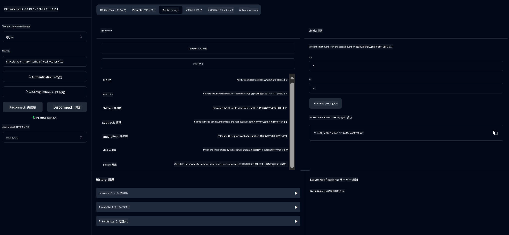
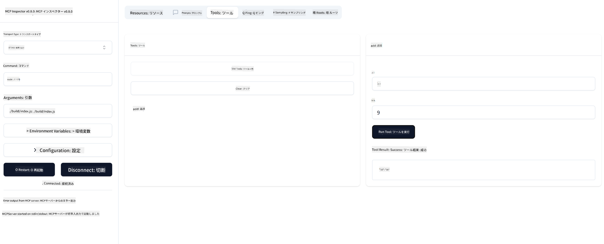

<!--
CO_OP_TRANSLATOR_METADATA:
{
  "original_hash": "ee93d6093964ea579dbdc20b4d643e9b",
  "translation_date": "2025-08-12T21:26:53+00:00",
  "source_file": "03-GettingStarted/01-first-server/README.md",
  "language_code": "ja"
}
-->
# MCPの始め方

Model Context Protocol (MCP) の最初のステップへようこそ！MCPが初めての方も、理解を深めたい方も、このガイドでは基本的なセットアップと開発プロセスを順を追って説明します。MCPがAIモデルとアプリケーション間のシームレスな統合をどのように実現するかを学び、MCPを活用したソリューションを構築・テストするための環境を迅速に整える方法を習得しましょう。

> 要約: AIアプリを構築する際、LLM（大規模言語モデル）にツールやリソースを追加して、LLMの知識を拡張できることをご存じでしょう。しかし、それらのツールやリソースをサーバーに配置すれば、アプリやサーバーの機能をLLMの有無にかかわらず、どのクライアントでも利用できるようになります。

## 概要

このレッスンでは、MCP環境のセットアップと最初のMCPアプリケーションの構築に関する実践的なガイダンスを提供します。必要なツールやフレームワークのセットアップ、基本的なMCPサーバーの構築、ホストアプリケーションの作成、実装のテスト方法を学びます。

Model Context Protocol (MCP) は、アプリケーションがLLMにコンテキストを提供する方法を標準化するオープンプロトコルです。MCPは、AIアプリケーションのためのUSB-Cポートのようなものと考えてください。さまざまなデータソースやツールにAIモデルを接続するための標準化された方法を提供します。

## 学習目標

このレッスンを終える頃には、以下ができるようになります：

- C#、Java、Python、TypeScript、RustでMCPの開発環境をセットアップする
- カスタム機能（リソース、プロンプト、ツール）を備えた基本的なMCPサーバーを構築・デプロイする
- MCPサーバーに接続するホストアプリケーションを作成する
- MCP実装をテストし、デバッグする

## MCP環境のセットアップ

MCPを使い始める前に、開発環境を準備し、基本的なワークフローを理解することが重要です。このセクションでは、MCPをスムーズに始めるための初期設定手順を説明します。

### 前提条件

MCP開発に取り組む前に、以下を確認してください：

- **開発環境**: 選択した言語（C#、Java、Python、TypeScript、Rust）用
- **IDE/エディタ**: Visual Studio、Visual Studio Code、IntelliJ、Eclipse、PyCharm、またはその他のモダンなコードエディタ
- **パッケージマネージャ**: NuGet、Maven/Gradle、pip、npm/yarn、またはCargo
- **APIキー**: ホストアプリケーションで使用するAIサービス用

## 基本的なMCPサーバー構造

MCPサーバーは通常、以下を含みます：

- **サーバー設定**: ポート、認証、その他の設定
- **リソース**: LLMに提供されるデータやコンテキスト
- **ツール**: モデルが呼び出せる機能
- **プロンプト**: テキスト生成や構造化のためのテンプレート

以下はTypeScriptでの簡単な例です：

```typescript
import { McpServer, ResourceTemplate } from "@modelcontextprotocol/sdk/server/mcp.js";
import { StdioServerTransport } from "@modelcontextprotocol/sdk/server/stdio.js";
import { z } from "zod";

// Create an MCP server
const server = new McpServer({
  name: "Demo",
  version: "1.0.0"
});

// Add an addition tool
server.tool("add",
  { a: z.number(), b: z.number() },
  async ({ a, b }) => ({
    content: [{ type: "text", text: String(a + b) }]
  })
);

// Add a dynamic greeting resource
server.resource(
  "file",
  // The 'list' parameter controls how the resource lists available files. Setting it to undefined disables listing for this resource.
  new ResourceTemplate("file://{path}", { list: undefined }),
  async (uri, { path }) => ({
    contents: [{
      uri: uri.href,
      text: `File, ${path}!`
    }]
// Add a file resource that reads the file contents
server.resource(
  "file",
  new ResourceTemplate("file://{path}", { list: undefined }),
  async (uri, { path }) => {
    let text;
    try {
      text = await fs.readFile(path, "utf8");
    } catch (err) {
      text = `Error reading file: ${err.message}`;
    }
    return {
      contents: [{
        uri: uri.href,
        text
      }]
    };
  }
);

server.prompt(
  "review-code",
  { code: z.string() },
  ({ code }) => ({
    messages: [{
      role: "user",
      content: {
        type: "text",
        text: `Please review this code:\n\n${code}`
      }
    }]
  })
);

// Start receiving messages on stdin and sending messages on stdout
const transport = new StdioServerTransport();
await server.connect(transport);
```

上記のコードでは以下を行っています：

- MCP TypeScript SDKから必要なクラスをインポート
- 新しいMCPサーバーインスタンスを作成し、設定
- カスタムツール（`calculator`）をハンドラ関数とともに登録
- サーバーを起動し、MCPリクエストを受け付ける

## テストとデバッグ

MCPサーバーをテストする前に、利用可能なツールとデバッグのベストプラクティスを理解することが重要です。効果的なテストは、サーバーが期待通りに動作することを確認し、問題を迅速に特定・解決するのに役立ちます。このセクションでは、MCP実装を検証するための推奨アプローチを説明します。

MCPはサーバーのテストとデバッグを支援するツールを提供します：

- **Inspectorツール**: グラフィカルインターフェースでサーバーに接続し、ツール、プロンプト、リソースをテスト可能
- **curl**: コマンドラインツール（curlなど）を使用してサーバーに接続し、HTTPコマンドを実行可能

### MCP Inspectorの使用

[MCP Inspector](https://github.com/modelcontextprotocol/inspector) は、以下を支援する視覚的なテストツールです：

1. **サーバー機能の検出**: 利用可能なリソース、ツール、プロンプトを自動検出
2. **ツール実行のテスト**: 異なるパラメータを試し、リアルタイムで応答を確認
3. **サーバーメタデータの表示**: サーバー情報、スキーマ、設定を確認

```bash
# ex TypeScript, installing and running MCP Inspector
npx @modelcontextprotocol/inspector node build/index.js
```

上記のコマンドを実行すると、MCP InspectorがブラウザでローカルのWebインターフェースを起動します。登録済みのMCPサーバー、利用可能なツール、リソース、プロンプトが表示されるダッシュボードが表示されます。このインターフェースを使用して、ツールの実行を対話的にテストしたり、サーバーメタデータを確認したり、リアルタイムの応答を確認したりできます。これにより、MCPサーバー実装の検証とデバッグが容易になります。

以下はそのスクリーンショットの例です：


## よくあるセットアップの問題と解決策

| 問題 | 解決策 |
|-------|-------------------|
| 接続拒否 | サーバーが起動しているか、ポートが正しいか確認 |
| ツール実行エラー | パラメータの検証とエラーハンドリングを確認 |
| 認証失敗 | APIキーと権限を確認 |
| スキーマ検証エラー | パラメータが定義されたスキーマに一致しているか確認 |
| サーバーが起動しない | ポートの競合や依存関係の不足を確認 |
| CORSエラー | クロスオリジンリクエスト用の適切なCORSヘッダーを設定 |
| 認証問題 | トークンの有効性と権限を確認 |

## ローカル開発

ローカルでの開発とテストのために、MCPサーバーを直接マシン上で実行できます：

1. **サーバープロセスの起動**: MCPサーバーアプリケーションを実行
2. **ネットワーク設定**: サーバーが期待されるポートでアクセス可能であることを確認
3. **クライアントの接続**: `http://localhost:3000` のようなローカル接続URLを使用

```bash
# Example: Running a TypeScript MCP server locally
npm run start
# Server running at http://localhost:3000
```

## 最初のMCPサーバーを構築する

以前のレッスンで[コアコンセプト](/01-CoreConcepts/README.md)を学びましたが、ここではその知識を実際に活用します。

### サーバーができること

コードを書く前に、サーバーが何をできるかを思い出してみましょう：

MCPサーバーは例えば以下を行えます：

- ローカルファイルやデータベースへのアクセス
- リモートAPIへの接続
- 計算の実行
- 他のツールやサービスとの統合
- ユーザーインターフェースの提供

では、何ができるか分かったところで、コードを書き始めましょう。

## 演習: サーバーの作成

サーバーを作成するには、以下の手順を実行します：

- MCP SDKをインストール
- プロジェクトを作成し、プロジェクト構造を設定
- サーバーコードを書く
- サーバーをテスト

### -1- プロジェクトの作成

#### TypeScript

```sh
# Create project directory and initialize npm project
mkdir calculator-server
cd calculator-server
npm init -y
```

#### Python

```sh
# Create project dir
mkdir calculator-server
cd calculator-server
# Open the folder in Visual Studio Code - Skip this if you are using a different IDE
code .
```

#### .NET

```sh
dotnet new console -n McpCalculatorServer
cd McpCalculatorServer
```

#### Java

Javaでは、Spring Bootプロジェクトを作成します：

```bash
curl https://start.spring.io/starter.zip \
  -d dependencies=web \
  -d javaVersion=21 \
  -d type=maven-project \
  -d groupId=com.example \
  -d artifactId=calculator-server \
  -d name=McpServer \
  -d packageName=com.microsoft.mcp.sample.server \
  -o calculator-server.zip
```

zipファイルを解凍します：

```bash
unzip calculator-server.zip -d calculator-server
cd calculator-server
# optional remove the unused test
rm -rf src/test/java
```

以下の完全な設定を*pom.xml*ファイルに追加します：

```xml
<?xml version="1.0" encoding="UTF-8"?>
<project xmlns="http://maven.apache.org/POM/4.0.0"
    xmlns:xsi="http://www.w3.org/2001/XMLSchema-instance"
    xsi:schemaLocation="http://maven.apache.org/POM/4.0.0 http://maven.apache.org/xsd/maven-4.0.0.xsd">
    <modelVersion>4.0.0</modelVersion>
    
    <!-- Spring Boot parent for dependency management -->
    <parent>
        <groupId>org.springframework.boot</groupId>
        <artifactId>spring-boot-starter-parent</artifactId>
        <version>3.5.0</version>
        <relativePath />
    </parent>

    <!-- Project coordinates -->
    <groupId>com.example</groupId>
    <artifactId>calculator-server</artifactId>
    <version>0.0.1-SNAPSHOT</version>
    <name>Calculator Server</name>
    <description>Basic calculator MCP service for beginners</description>

    <!-- Properties -->
    <properties>
        <java.version>21</java.version>
        <maven.compiler.source>21</maven.compiler.source>
        <maven.compiler.target>21</maven.compiler.target>
    </properties>

    <!-- Spring AI BOM for version management -->
    <dependencyManagement>
        <dependencies>
            <dependency>
                <groupId>org.springframework.ai</groupId>
                <artifactId>spring-ai-bom</artifactId>
                <version>1.0.0-SNAPSHOT</version>
                <type>pom</type>
                <scope>import</scope>
            </dependency>
        </dependencies>
    </dependencyManagement>

    <!-- Dependencies -->
    <dependencies>
        <dependency>
            <groupId>org.springframework.ai</groupId>
            <artifactId>spring-ai-starter-mcp-server-webflux</artifactId>
        </dependency>
        <dependency>
            <groupId>org.springframework.boot</groupId>
            <artifactId>spring-boot-starter-actuator</artifactId>
        </dependency>
        <dependency>
         <groupId>org.springframework.boot</groupId>
         <artifactId>spring-boot-starter-test</artifactId>
         <scope>test</scope>
      </dependency>
    </dependencies>

    <!-- Build configuration -->
    <build>
        <plugins>
            <plugin>
                <groupId>org.springframework.boot</groupId>
                <artifactId>spring-boot-maven-plugin</artifactId>
            </plugin>
            <plugin>
                <groupId>org.apache.maven.plugins</groupId>
                <artifactId>maven-compiler-plugin</artifactId>
                <configuration>
                    <release>21</release>
                </configuration>
            </plugin>
        </plugins>
    </build>

    <!-- Repositories for Spring AI snapshots -->
    <repositories>
        <repository>
            <id>spring-milestones</id>
            <name>Spring Milestones</name>
            <url>https://repo.spring.io/milestone</url>
            <snapshots>
                <enabled>false</enabled>
            </snapshots>
        </repository>
        <repository>
            <id>spring-snapshots</id>
            <name>Spring Snapshots</name>
            <url>https://repo.spring.io/snapshot</url>
            <releases>
                <enabled>false</enabled>
            </releases>
        </repository>
    </repositories>
</project>
```

#### Rust

```sh
mkdir calculator-server
cd calculator-server
cargo init
```

### -2- 依存関係の追加

プロジェクトを作成したら、次に依存関係を追加します：

#### TypeScript

```sh
# If not already installed, install TypeScript globally
npm install typescript -g

# Install the MCP SDK and Zod for schema validation
npm install @modelcontextprotocol/sdk zod
npm install -D @types/node typescript
```

#### Python

```sh
# Create a virtual env and install dependencies
python -m venv venv
venv\Scripts\activate
pip install "mcp[cli]"
```

#### Java

```bash
cd calculator-server
./mvnw clean install -DskipTests
```

#### Rust

```sh
cargo add rmcp --features server,transport-io
cargo add serde
cargo add tokio --features rt-multi-thread
```

### -3- プロジェクトファイルの作成

#### TypeScript

*package.json*ファイルを開き、以下の内容に置き換えて、サーバーをビルド・実行できるようにします：

```json
{
  "name": "calculator-server",
  "version": "1.0.0",
  "main": "index.js",
  "type": "module",
  "scripts": {
    "start": "tsc && node ./build/index.js",
    "build": "tsc && node ./build/index.js"
  },
  "keywords": [],
  "author": "",
  "license": "ISC",
  "description": "A simple calculator server using Model Context Protocol",
  "dependencies": {
    "@modelcontextprotocol/sdk": "^1.16.0",
    "zod": "^3.25.76"
  },
  "devDependencies": {
    "@types/node": "^24.0.14",
    "typescript": "^5.8.3"
  }
}
```

*tsconfig.json*を作成し、以下の内容を追加します：

```json
{
  "compilerOptions": {
    "target": "ES2022",
    "module": "Node16",
    "moduleResolution": "Node16",
    "outDir": "./build",
    "rootDir": "./src",
    "strict": true,
    "esModuleInterop": true,
    "skipLibCheck": true,
    "forceConsistentCasingInFileNames": true
  },
  "include": ["src/**/*"],
  "exclude": ["node_modules"]
}
```

ソースコード用のディレクトリを作成します：

```sh
mkdir src
touch src/index.ts
```

#### Python

*server.py*ファイルを作成します：

```sh
touch server.py
```

#### .NET

必要なNuGetパッケージをインストールします：

```sh
dotnet add package ModelContextProtocol --prerelease
dotnet add package Microsoft.Extensions.Hosting
```

#### Java

Java Spring Bootプロジェクトでは、プロジェクト構造が自動的に作成されます。

#### Rust

Rustでは、`cargo init`を実行するとデフォルトで*src/main.rs*ファイルが作成されます。このファイルを開き、デフォルトコードを削除します。

### -4- サーバーコードの作成

#### TypeScript

*index.ts*ファイルを作成し、以下のコードを追加します：

```typescript
import { McpServer, ResourceTemplate } from "@modelcontextprotocol/sdk/server/mcp.js";
import { StdioServerTransport } from "@modelcontextprotocol/sdk/server/stdio.js";
import { z } from "zod";
 
// Create an MCP server
const server = new McpServer({
  name: "Calculator MCP Server",
  version: "1.0.0"
});
```

これでサーバーが作成されましたが、まだ多くの機能はありません。これを改善しましょう。

#### Python

```python
# server.py
from mcp.server.fastmcp import FastMCP

# Create an MCP server
mcp = FastMCP("Demo")
```

#### .NET

```csharp
using Microsoft.Extensions.DependencyInjection;
using Microsoft.Extensions.Hosting;
using Microsoft.Extensions.Logging;
using ModelContextProtocol.Server;
using System.ComponentModel;

var builder = Host.CreateApplicationBuilder(args);
builder.Logging.AddConsole(consoleLogOptions =>
{
    // Configure all logs to go to stderr
    consoleLogOptions.LogToStandardErrorThreshold = LogLevel.Trace;
});

builder.Services
    .AddMcpServer()
    .WithStdioServerTransport()
    .WithToolsFromAssembly();
await builder.Build().RunAsync();

// add features
```

#### Java

Javaでは、コアサーバーコンポーネントを作成します。まず、メインアプリケーションクラスを修正します：

*src/main/java/com/microsoft/mcp/sample/server/McpServerApplication.java*:

```java
package com.microsoft.mcp.sample.server;

import org.springframework.ai.tool.ToolCallbackProvider;
import org.springframework.ai.tool.method.MethodToolCallbackProvider;
import org.springframework.boot.SpringApplication;
import org.springframework.boot.autoconfigure.SpringBootApplication;
import org.springframework.context.annotation.Bean;
import com.microsoft.mcp.sample.server.service.CalculatorService;

@SpringBootApplication
public class McpServerApplication {

    public static void main(String[] args) {
        SpringApplication.run(McpServerApplication.class, args);
    }
    
    @Bean
    public ToolCallbackProvider calculatorTools(CalculatorService calculator) {
        return MethodToolCallbackProvider.builder().toolObjects(calculator).build();
    }
}
```

計算機サービスを作成します：*src/main/java/com/microsoft/mcp/sample/server/service/CalculatorService.java*:

```java
package com.microsoft.mcp.sample.server.service;

import org.springframework.ai.tool.annotation.Tool;
import org.springframework.stereotype.Service;

/**
 * Service for basic calculator operations.
 * This service provides simple calculator functionality through MCP.
 */
@Service
public class CalculatorService {

    /**
     * Add two numbers
     * @param a The first number
     * @param b The second number
     * @return The sum of the two numbers
     */
    @Tool(description = "Add two numbers together")
    public String add(double a, double b) {
        double result = a + b;
        return formatResult(a, "+", b, result);
    }

    /**
     * Subtract one number from another
     * @param a The number to subtract from
     * @param b The number to subtract
     * @return The result of the subtraction
     */
    @Tool(description = "Subtract the second number from the first number")
    public String subtract(double a, double b) {
        double result = a - b;
        return formatResult(a, "-", b, result);
    }

    /**
     * Multiply two numbers
     * @param a The first number
     * @param b The second number
     * @return The product of the two numbers
     */
    @Tool(description = "Multiply two numbers together")
    public String multiply(double a, double b) {
        double result = a * b;
        return formatResult(a, "*", b, result);
    }

    /**
     * Divide one number by another
     * @param a The numerator
     * @param b The denominator
     * @return The result of the division
     */
    @Tool(description = "Divide the first number by the second number")
    public String divide(double a, double b) {
        if (b == 0) {
            return "Error: Cannot divide by zero";
        }
        double result = a / b;
        return formatResult(a, "/", b, result);
    }

    /**
     * Calculate the power of a number
     * @param base The base number
     * @param exponent The exponent
     * @return The result of raising the base to the exponent
     */
    @Tool(description = "Calculate the power of a number (base raised to an exponent)")
    public String power(double base, double exponent) {
        double result = Math.pow(base, exponent);
        return formatResult(base, "^", exponent, result);
    }

    /**
     * Calculate the square root of a number
     * @param number The number to find the square root of
     * @return The square root of the number
     */
    @Tool(description = "Calculate the square root of a number")
    public String squareRoot(double number) {
        if (number < 0) {
            return "Error: Cannot calculate square root of a negative number";
        }
        double result = Math.sqrt(number);
        return String.format("√%.2f = %.2f", number, result);
    }

    /**
     * Calculate the modulus (remainder) of division
     * @param a The dividend
     * @param b The divisor
     * @return The remainder of the division
     */
    @Tool(description = "Calculate the remainder when one number is divided by another")
    public String modulus(double a, double b) {
        if (b == 0) {
            return "Error: Cannot divide by zero";
        }
        double result = a % b;
        return formatResult(a, "%", b, result);
    }

    /**
     * Calculate the absolute value of a number
     * @param number The number to find the absolute value of
     * @return The absolute value of the number
     */
    @Tool(description = "Calculate the absolute value of a number")
    public String absolute(double number) {
        double result = Math.abs(number);
        return String.format("|%.2f| = %.2f", number, result);
    }

    /**
     * Get help about available calculator operations
     * @return Information about available operations
     */
    @Tool(description = "Get help about available calculator operations")
    public String help() {
        return "Basic Calculator MCP Service\n\n" +
               "Available operations:\n" +
               "1. add(a, b) - Adds two numbers\n" +
               "2. subtract(a, b) - Subtracts the second number from the first\n" +
               "3. multiply(a, b) - Multiplies two numbers\n" +
               "4. divide(a, b) - Divides the first number by the second\n" +
               "5. power(base, exponent) - Raises a number to a power\n" +
               "6. squareRoot(number) - Calculates the square root\n" + 
               "7. modulus(a, b) - Calculates the remainder of division\n" +
               "8. absolute(number) - Calculates the absolute value\n\n" +
               "Example usage: add(5, 3) will return 5 + 3 = 8";
    }

    /**
     * Format the result of a calculation
     */
    private String formatResult(double a, String operator, double b, double result) {
        return String.format("%.2f %s %.2f = %.2f", a, operator, b, result);
    }
}
```

**本番環境向けのオプションコンポーネント：**

スタートアップ設定を作成します：*src/main/java/com/microsoft/mcp/sample/server/config/StartupConfig.java*:

```java
package com.microsoft.mcp.sample.server.config;

import org.springframework.boot.CommandLineRunner;
import org.springframework.context.annotation.Bean;
import org.springframework.context.annotation.Configuration;

@Configuration
public class StartupConfig {
    
    @Bean
    public CommandLineRunner startupInfo() {
        return args -> {
            System.out.println("\n" + "=".repeat(60));
            System.out.println("Calculator MCP Server is starting...");
            System.out.println("SSE endpoint: http://localhost:8080/sse");
            System.out.println("Health check: http://localhost:8080/actuator/health");
            System.out.println("=".repeat(60) + "\n");
        };
    }
}
```

ヘルスコントローラーを作成します：*src/main/java/com/microsoft/mcp/sample/server/controller/HealthController.java*:

```java
package com.microsoft.mcp.sample.server.controller;

import org.springframework.http.ResponseEntity;
import org.springframework.web.bind.annotation.GetMapping;
import org.springframework.web.bind.annotation.RestController;
import java.time.LocalDateTime;
import java.util.HashMap;
import java.util.Map;

@RestController
public class HealthController {
    
    @GetMapping("/health")
    public ResponseEntity<Map<String, Object>> healthCheck() {
        Map<String, Object> response = new HashMap<>();
        response.put("status", "UP");
        response.put("timestamp", LocalDateTime.now().toString());
        response.put("service", "Calculator MCP Server");
        return ResponseEntity.ok(response);
    }
}
```

例外ハンドラーを作成します：*src/main/java/com/microsoft/mcp/sample/server/exception/GlobalExceptionHandler.java*:

```java
package com.microsoft.mcp.sample.server.exception;

import org.springframework.http.HttpStatus;
import org.springframework.http.ResponseEntity;
import org.springframework.web.bind.annotation.ExceptionHandler;
import org.springframework.web.bind.annotation.RestControllerAdvice;

@RestControllerAdvice
public class GlobalExceptionHandler {

    @ExceptionHandler(IllegalArgumentException.class)
    public ResponseEntity<ErrorResponse> handleIllegalArgumentException(IllegalArgumentException ex) {
        ErrorResponse error = new ErrorResponse(
            "Invalid_Input", 
            "Invalid input parameter: " + ex.getMessage());
        return new ResponseEntity<>(error, HttpStatus.BAD_REQUEST);
    }

    public static class ErrorResponse {
        private String code;
        private String message;

        public ErrorResponse(String code, String message) {
            this.code = code;
            this.message = message;
        }

        // Getters
        public String getCode() { return code; }
        public String getMessage() { return message; }
    }
}
```

カスタムバナーを作成します：*src/main/resources/banner.txt*:

```text
_____      _            _       _             
 / ____|    | |          | |     | |            
| |     __ _| | ___ _   _| | __ _| |_ ___  _ __ 
| |    / _` | |/ __| | | | |/ _` | __/ _ \| '__|
| |___| (_| | | (__| |_| | | (_| | || (_) | |   
 \_____\__,_|_|\___|\__,_|_|\__,_|\__\___/|_|   
                                                
Calculator MCP Server v1.0
Spring Boot MCP Application
```

#### Rust

*src/main.rs*ファイルの冒頭に以下のコードを追加します。これにより、MCPサーバーに必要なライブラリとモジュールがインポートされます。

```rust
use rmcp::{
    handler::server::{router::tool::ToolRouter, tool::Parameters},
    model::{ServerCapabilities, ServerInfo},
    schemars, tool, tool_handler, tool_router,
    transport::stdio,
    ServerHandler, ServiceExt,
};
use std::error::Error;
```

計算リクエストを表す構造体を作成します：

```rust
#[derive(Debug, serde::Deserialize, schemars::JsonSchema)]
pub struct CalculatorRequest {
    pub a: f64,
    pub b: f64,
}
```

次に、計算サーバーを表す構造体を作成します。この構造体はツールルーターを保持し、ツールを登録します。

```rust
#[derive(Debug, Clone)]
pub struct Calculator {
    tool_router: ToolRouter<Self>,
}
```

次に、`Calculator`構造体を実装して新しいインスタンスを作成し、サーバーハンドラーを実装してサーバー情報を提供します。

```rust
#[tool_router]
impl Calculator {
    pub fn new() -> Self {
        Self {
            tool_router: Self::tool_router(),
        }
    }
}

#[tool_handler]
impl ServerHandler for Calculator {
    fn get_info(&self) -> ServerInfo {
        ServerInfo {
            instructions: Some("A simple calculator tool".into()),
            capabilities: ServerCapabilities::builder().enable_tools().build(),
            ..Default::default()
        }
    }
}
```

最後に、サーバーを起動するメイン関数を実装します。この関数は`Calculator`構造体のインスタンスを作成し、標準入出力を介して提供します。

```rust
#[tokio::main]
async fn main() -> Result<(), Box<dyn Error>> {
    let service = Calculator::new().serve(stdio()).await?;
    service.waiting().await?;
    Ok(())
}
```

これでサーバーは基本的な情報を提供できるようになりました。次に、加算を行うツールを追加します。

### -5- ツールとリソースの追加

以下のコードを追加してツールとリソースを作成します：

#### TypeScript

```typescript
server.tool(
  "add",
  { a: z.number(), b: z.number() },
  async ({ a, b }) => ({
    content: [{ type: "text", text: String(a + b) }]
  })
);

server.resource(
  "greeting",
  new ResourceTemplate("greeting://{name}", { list: undefined }),
  async (uri, { name }) => ({
    contents: [{
      uri: uri.href,
      text: `Hello, ${name}!`
    }]
  })
);
```

ツールはパラメータ`a`と`b`を受け取り、以下の形式の応答を生成する関数を実行します：

```typescript
{
  contents: [{
    type: "text", content: "some content"
  }]
}
```

リソースは文字列"greeting"を介してアクセスされ、パラメータ`name`を受け取り、ツールと同様の応答を生成します：

```typescript
{
  uri: "<href>",
  text: "a text"
}
```

#### Python

```python
# Add an addition tool
@mcp.tool()
def add(a: int, b: int) -> int:
    """Add two numbers"""
    return a + b


# Add a dynamic greeting resource
@mcp.resource("greeting://{name}")
def get_greeting(name: str) -> str:
    """Get a personalized greeting"""
    return f"Hello, {name}!"
```

上記のコードでは以下を行っています：

- パラメータ`a`と`p`（どちらも整数）を受け取るツール`add`を定義
- パラメータ`name`を受け取るリソース`greeting`を作成

#### .NET

Program.csファイルに以下を追加します：

```csharp
[McpServerToolType]
public static class CalculatorTool
{
    [McpServerTool, Description("Adds two numbers")]
    public static string Add(int a, int b) => $"Sum {a + b}";
}
```

#### Java

ツールは前のステップですでに作成されています。

#### Rust

`impl Calculator`ブロック内に新しいツールを追加します：

```rust
#[tool(description = "Adds a and b")]
async fn add(
    &self,
    Parameters(CalculatorRequest { a, b }): Parameters<CalculatorRequest>,
) -> String {
    (a + b).to_string()
}
```

### -6- 最終コード

サーバーを起動できるように最後のコードを追加します：

#### TypeScript

```typescript
// Start receiving messages on stdin and sending messages on stdout
const transport = new StdioServerTransport();
await server.connect(transport);
```

完全なコードはこちらです：

```typescript
// index.ts
import { McpServer, ResourceTemplate } from "@modelcontextprotocol/sdk/server/mcp.js";
import { StdioServerTransport } from "@modelcontextprotocol/sdk/server/stdio.js";
import { z } from "zod";

// Create an MCP server
const server = new McpServer({
  name: "Calculator MCP Server",
  version: "1.0.0"
});

// Add an addition tool
server.tool(
  "add",
  { a: z.number(), b: z.number() },
  async ({ a, b }) => ({
    content: [{ type: "text", text: String(a + b) }]
  })
);

// Add a dynamic greeting resource
server.resource(
  "greeting",
  new ResourceTemplate("greeting://{name}", { list: undefined }),
  async (uri, { name }) => ({
    contents: [{
      uri: uri.href,
      text: `Hello, ${name}!`
    }]
  })
);

// Start receiving messages on stdin and sending messages on stdout
const transport = new StdioServerTransport();
server.connect(transport);
```

#### Python

```python
# server.py
from mcp.server.fastmcp import FastMCP

# Create an MCP server
mcp = FastMCP("Demo")


# Add an addition tool
@mcp.tool()
def add(a: int, b: int) -> int:
    """Add two numbers"""
    return a + b


# Add a dynamic greeting resource
@mcp.resource("greeting://{name}")
def get_greeting(name: str) -> str:
    """Get a personalized greeting"""
    return f"Hello, {name}!"

# Main execution block - this is required to run the server
if __name__ == "__main__":
    mcp.run()
```

#### .NET

以下の内容でProgram.csファイルを作成します：

```csharp
using Microsoft.Extensions.DependencyInjection;
using Microsoft.Extensions.Hosting;
using Microsoft.Extensions.Logging;
using ModelContextProtocol.Server;
using System.ComponentModel;

var builder = Host.CreateApplicationBuilder(args);
builder.Logging.AddConsole(consoleLogOptions =>
{
    // Configure all logs to go to stderr
    consoleLogOptions.LogToStandardErrorThreshold = LogLevel.Trace;
});

builder.Services
    .AddMcpServer()
    .WithStdioServerTransport()
    .WithToolsFromAssembly();
await builder.Build().RunAsync();

[McpServerToolType]
public static class CalculatorTool
{
    [McpServerTool, Description("Adds two numbers")]
    public static string Add(int a, int b) => $"Sum {a + b}";
}
```

#### Java

完成したメインアプリケーションクラスは以下のようになります：

```java
// McpServerApplication.java
package com.microsoft.mcp.sample.server;

import org.springframework.ai.tool.ToolCallbackProvider;
import org.springframework.ai.tool.method.MethodToolCallbackProvider;
import org.springframework.boot.SpringApplication;
import org.springframework.boot.autoconfigure.SpringBootApplication;
import org.springframework.context.annotation.Bean;
import com.microsoft.mcp.sample.server.service.CalculatorService;

@SpringBootApplication
public class McpServerApplication {

    public static void main(String[] args) {
        SpringApplication.run(McpServerApplication.class, args);
    }
    
    @Bean
    public ToolCallbackProvider calculatorTools(CalculatorService calculator) {
        return MethodToolCallbackProvider.builder().toolObjects(calculator).build();
    }
}
```

#### Rust

Rustサーバーの最終コードは以下のようになります：

```rust
use rmcp::{
    ServerHandler, ServiceExt,
    handler::server::{router::tool::ToolRouter, tool::Parameters},
    model::{ServerCapabilities, ServerInfo},
    schemars, tool, tool_handler, tool_router,
    transport::stdio,
};
use std::error::Error;

#[derive(Debug, serde::Deserialize, schemars::JsonSchema)]
pub struct CalculatorRequest {
    pub a: f64,
    pub b: f64,
}

#[derive(Debug, Clone)]
pub struct Calculator {
    tool_router: ToolRouter<Self>,
}

#[tool_router]
impl Calculator {
    pub fn new() -> Self {
        Self {
            tool_router: Self::tool_router(),
        }
    }
    
    #[tool(description = "Adds a and b")]
    async fn add(
        &self,
        Parameters(CalculatorRequest { a, b }): Parameters<CalculatorRequest>,
    ) -> String {
        (a + b).to_string()
    }
}

#[tool_handler]
impl ServerHandler for Calculator {
    fn get_info(&self) -> ServerInfo {
        ServerInfo {
            instructions: Some("A simple calculator tool".into()),
            capabilities: ServerCapabilities::builder().enable_tools().build(),
            ..Default::default()
        }
    }
}

#[tokio::main]
async fn main() -> Result<(), Box<dyn Error>> {
    let service = Calculator::new().serve(stdio()).await?;
    service.waiting().await?;
    Ok(())
}
```

### -7- サーバーのテスト

以下のコマンドでサーバーを起動します：

#### TypeScript

```sh
npm run build
```

#### Python

```sh
mcp run server.py
```

> MCP Inspectorを使用するには、`mcp dev server.py`を使用してください。これにより、Inspectorが自動的に起動し、必要なプロキシセッショントークンが提供されます。`mcp run server.py`を使用する場合は、Inspectorを手動で起動し、接続を設定する必要があります。

#### .NET

プロジェクトディレクトリにいることを確認してください：

```sh
cd McpCalculatorServer
dotnet run
```

#### Java

```bash
./mvnw clean install -DskipTests
java -jar target/calculator-server-0.0.1-SNAPSHOT.jar
```

#### Rust

以下のコマンドを実行してサーバーをフォーマットし、実行します：

```sh
cargo fmt
cargo run
```

### -8- Inspectorを使用して実行

Inspectorは、サーバーを起動し、動作を確認するための優れたツールです。起動してみましょう：

> [!NOTE]
> "command"フィールドには、特定のランタイムでサーバーを実行するためのコマンドが表示される場合があります。

#### TypeScript

```sh
npx @modelcontextprotocol/inspector node build/index.js
```

または、*package.json*に以下を追加します：`"inspector": "npx @modelcontextprotocol/inspector node build/index.js"`。その後、`npm run inspector`を実行します。

PythonはNode.jsツールであるInspectorをラップしています。このツールを以下のように直接呼び出すことも可能です：

```sh
mcp dev server.py
```

ただし、すべてのメソッドが実装されているわけではないため、以下のようにNode.jsツールを直接実行することをお勧めします：

```sh
npx @modelcontextprotocol/inspector mcp run server.py
```

スクリプトを実行するコマンドと引数を設定できるツールやIDEを使用している場合は、`Command`フィールドに`python`を、`Arguments`に`server.py`を設定してください。これにより、スクリプトが正しく実行されます。

#### .NET

プロジェクトディレクトリにいることを確認してください：

```sh
cd McpCalculatorServer
npx @modelcontextprotocol/inspector dotnet run
```

#### Java

計算機サーバーが実行中であることを確認してください。
Inspectorを実行します：

```cmd
npx @modelcontextprotocol/inspector
```

InspectorのWebインターフェースで：

1. "SSE"をトランスポートタイプとして選択
2. URLを`http://localhost:8080/sse`に設定
3. "Connect"をクリック


**サーバーに接続しました**
**Javaサーバーのテストセクションが完了しました**

次のセクションでは、サーバーとのやり取りについて説明します。

以下のユーザーインターフェースが表示されるはずです:


1. 「Connect」ボタンを選択してサーバーに接続します。
   サーバーに接続すると、次の画面が表示されるはずです:

   

1. 「Tools」と「listTools」を選択します。「Add」が表示されるはずなので、「Add」を選択し、パラメータ値を入力します。

   次のレスポンスが表示されるはずです。つまり、「add」ツールの結果です:

   

おめでとうございます！初めてのサーバーを作成して実行することができました！

#### Rust

MCP Inspector CLIを使用してRustサーバーを実行するには、以下のコマンドを使用してください:

```sh
npx @modelcontextprotocol/inspector cargo run --cli --method tools/call --tool-name add --tool-arg a=1 b=2
```

### 公式SDK

MCPは複数の言語向けに公式SDKを提供しています:

- [C# SDK](https://github.com/modelcontextprotocol/csharp-sdk) - Microsoftとの共同管理
- [Java SDK](https://github.com/modelcontextprotocol/java-sdk) - Spring AIとの共同管理
- [TypeScript SDK](https://github.com/modelcontextprotocol/typescript-sdk) - 公式TypeScript実装
- [Python SDK](https://github.com/modelcontextprotocol/python-sdk) - 公式Python実装
- [Kotlin SDK](https://github.com/modelcontextprotocol/kotlin-sdk) - 公式Kotlin実装
- [Swift SDK](https://github.com/modelcontextprotocol/swift-sdk) - Loopwork AIとの共同管理
- [Rust SDK](https://github.com/modelcontextprotocol/rust-sdk) - 公式Rust実装

## 重要なポイント

- MCP開発環境のセットアップは、言語別のSDKを使用することで簡単に行えます。
- MCPサーバーの構築では、明確なスキーマを持つツールの作成と登録が必要です。
- 信頼性の高いMCP実装には、テストとデバッグが不可欠です。

## サンプル

- [Java Calculator](../samples/java/calculator/README.md)
- [.Net Calculator](../../../../03-GettingStarted/samples/csharp)
- [JavaScript Calculator](../samples/javascript/README.md)
- [TypeScript Calculator](../samples/typescript/README.md)
- [Python Calculator](../../../../03-GettingStarted/samples/python)
- [Rust Calculator](../../../../03-GettingStarted/samples/rust)

## 課題

選択したツールを使用して、シンプルなMCPサーバーを作成してください:

1. 好きな言語（.NET、Java、Python、TypeScript、Rust）でツールを実装する。
2. 入力パラメータと返り値を定義する。
3. Inspectorツールを実行して、サーバーが正常に動作することを確認する。
4. 様々な入力で実装をテストする。

## 解答

[Solution](./solution/README.md)

## 追加リソース

- [AzureでModel Context Protocolを使用してエージェントを構築する](https://learn.microsoft.com/azure/developer/ai/intro-agents-mcp)
- [Azure Container Appsを使用したリモートMCP (Node.js/TypeScript/JavaScript)](https://learn.microsoft.com/samples/azure-samples/mcp-container-ts/mcp-container-ts/)
- [.NET OpenAI MCP Agent](https://learn.microsoft.com/samples/azure-samples/openai-mcp-agent-dotnet/openai-mcp-agent-dotnet/)

## 次のステップ

次: [MCPクライアントの使い方](../02-client/README.md)

**免責事項**:  
この文書は、AI翻訳サービス [Co-op Translator](https://github.com/Azure/co-op-translator) を使用して翻訳されています。正確性を追求しておりますが、自動翻訳には誤りや不正確な部分が含まれる可能性があります。元の言語で記載された文書を正式な情報源としてお考えください。重要な情報については、専門の人間による翻訳を推奨します。この翻訳の使用に起因する誤解や誤解について、当社は責任を負いません。