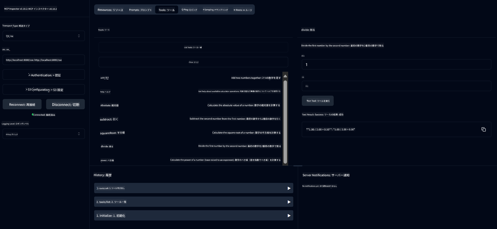

<!--
CO_OP_TRANSLATOR_METADATA:
{
  "original_hash": "ed9cab32cc67c12d8969b407aa47100a",
  "translation_date": "2025-07-13T17:52:54+00:00",
  "source_file": "03-GettingStarted/01-first-server/solution/java/README.md",
  "language_code": "ja"
}
-->
# Basic Calculator MCP Service

このサービスは、Spring BootのWebFluxトランスポートを使ってModel Context Protocol（MCP）経由で基本的な計算機能を提供します。MCPの実装を学ぶ初心者向けのシンプルな例として設計されています。

詳細は、[MCP Server Boot Starter](https://docs.spring.io/spring-ai/reference/api/mcp/mcp-server-boot-starter-docs.html)のリファレンスドキュメントをご覧ください。


## サービスの利用方法

このサービスはMCPプロトコルを通じて以下のAPIエンドポイントを公開しています：

- `add(a, b)`: 2つの数値を加算する
- `subtract(a, b)`: 2番目の数値を1番目から減算する
- `multiply(a, b)`: 2つの数値を乗算する
- `divide(a, b)`: 1番目の数値を2番目で除算する（ゼロチェックあり）
- `power(base, exponent)`: 数値のべき乗を計算する
- `squareRoot(number)`: 平方根を計算する（負の数チェックあり）
- `modulus(a, b)`: 除算の余りを計算する
- `absolute(number)`: 絶対値を計算する

## 依存関係

このプロジェクトには以下の主要な依存関係が必要です：

```xml
<dependency>
    <groupId>org.springframework.ai</groupId>
    <artifactId>spring-ai-starter-mcp-server-webflux</artifactId>
</dependency>
```

## プロジェクトのビルド

Mavenを使ってプロジェクトをビルドします：
```bash
./mvnw clean install -DskipTests
```

## サーバーの起動

### Javaを使う場合

```bash
java -jar target/calculator-server-0.0.1-SNAPSHOT.jar
```

### MCP Inspectorを使う場合

MCP InspectorはMCPサービスとやり取りするための便利なツールです。この計算機サービスで使うには：

1. **新しいターミナルでMCP Inspectorをインストールして起動する**：
   ```bash
   npx @modelcontextprotocol/inspector
   ```

2. **アプリが表示するURL（通常は http://localhost:6274）をクリックしてWeb UIにアクセスする**

3. **接続設定を行う**：
   - トランスポートタイプを「SSE」に設定
   - 実行中のサーバーのSSEエンドポイント（`http://localhost:8080/sse`）をURLに設定
   - 「Connect」をクリック

4. **ツールを使う**：
   - 「List Tools」をクリックして利用可能な計算機操作を表示
   - ツールを選択し、「Run Tool」をクリックして操作を実行



**免責事項**：  
本書類はAI翻訳サービス「[Co-op Translator](https://github.com/Azure/co-op-translator)」を使用して翻訳されました。正確性の向上に努めておりますが、自動翻訳には誤りや不正確な部分が含まれる可能性があります。原文の言語によるオリジナル文書が正式な情報源とみなされるべきです。重要な情報については、専門の人間による翻訳を推奨します。本翻訳の利用により生じたいかなる誤解や誤訳についても、当方は責任を負いかねます。