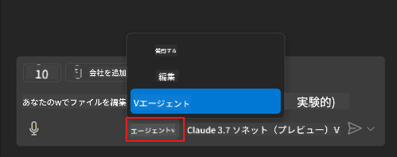
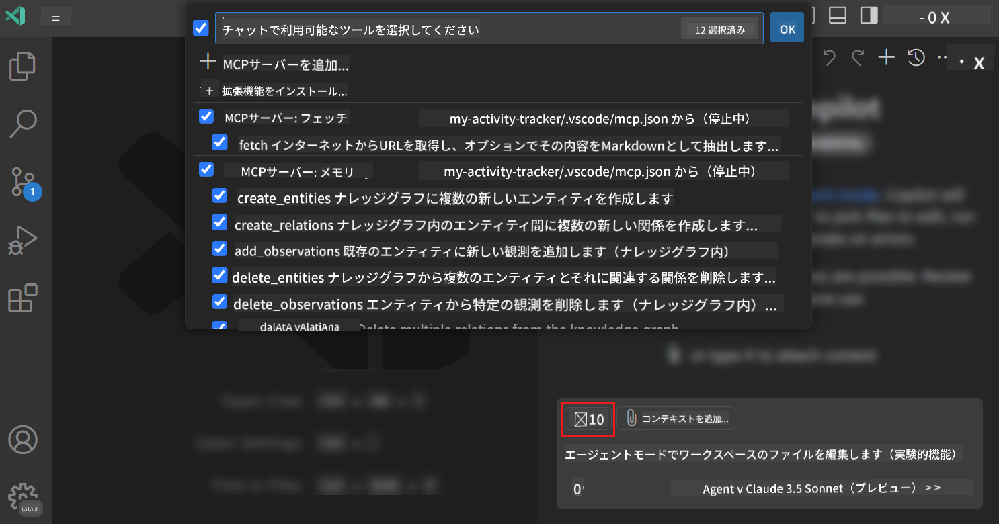
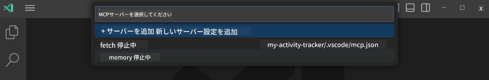
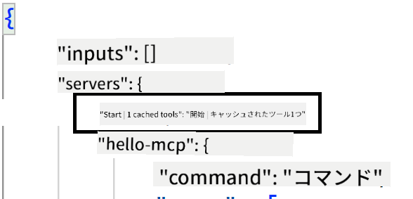
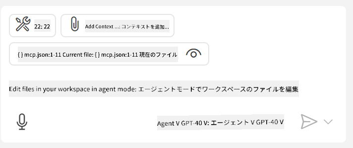

<!--
CO_OP_TRANSLATOR_METADATA:
{
  "original_hash": "d940b5e0af75e3a3a4d1c3179120d1d9",
  "translation_date": "2025-08-26T17:22:38+00:00",
  "source_file": "03-GettingStarted/04-vscode/README.md",
  "language_code": "ja"
}
-->
# GitHub Copilot Agentモードでサーバーを利用する

Visual Studio CodeとGitHub Copilotはクライアントとして動作し、MCPサーバーを利用することができます。なぜそれが必要なのかと思うかもしれませんね。それはつまり、MCPサーバーが持つ機能をIDE内で利用できるということです。例えば、GitHubのMCPサーバーを追加すると、ターミナルで特定のコマンドを入力する代わりに、プロンプトを使ってGitHubを操作できるようになります。また、開発者体験を向上させる何かを自然言語で制御できるとしたらどうでしょうか？その利点が見えてきましたね。

## 概要

このレッスンでは、Visual Studio CodeとGitHub CopilotのAgentモードをクライアントとして使用し、MCPサーバーを利用する方法を学びます。

## 学習目標

このレッスンの終わりまでに、以下ができるようになります：

- Visual Studio Codeを使ってMCPサーバーを利用する。
- GitHub Copilotを通じてツールなどの機能を実行する。
- MCPサーバーを見つけて管理するためにVisual Studio Codeを設定する。

## 使用方法

MCPサーバーを制御する方法は2つあります：

- ユーザーインターフェース：この章の後半でその方法を説明します。
- ターミナル：`code`実行ファイルを使用してターミナルから制御することが可能です。

  ユーザープロファイルにMCPサーバーを追加するには、`--add-mcp`コマンドラインオプションを使用し、JSON形式でサーバー構成を提供します。例：`{\"name\":\"server-name\",\"command\":...}`。

  ```
  code --add-mcp "{\"name\":\"my-server\",\"command\": \"uvx\",\"args\": [\"mcp-server-fetch\"]}"
  ```

### スクリーンショット

  
  
  

次のセクションで、視覚的なインターフェースの使用方法について詳しく説明します。

## アプローチ

以下のような高レベルのアプローチで進めます：

- MCPサーバーを見つけるためのファイルを設定する。
- サーバーを起動/接続して、その機能をリストアップする。
- GitHub Copilot Chatインターフェースを通じてその機能を利用する。

流れが理解できたところで、Visual Studio Codeを使ってMCPサーバーを利用する演習を試してみましょう。

## 演習：サーバーを利用する

この演習では、Visual Studio Codeを設定してMCPサーバーを見つけ、GitHub Copilot Chatインターフェースから利用できるようにします。

### -0- 前準備：MCPサーバーの検出を有効化

MCPサーバーの検出を有効化する必要があるかもしれません。

1. Visual Studio Codeのメニューから`File -> Preferences -> Settings`を開きます。

1. 「MCP」を検索し、`chat.mcp.discovery.enabled`をsettings.jsonファイルで有効化します。

### -1- 設定ファイルを作成する

プロジェクトのルートに設定ファイルを作成します。`.vscode`フォルダー内にMCP.jsonというファイルを作成する必要があります。以下のようになります：

```text
.vscode
|-- mcp.json
```

次に、サーバーエントリを追加する方法を見てみましょう。

### -2- サーバーを設定する

*mcp.json*に以下の内容を追加します：

```json
{
    "inputs": [],
    "servers": {
       "hello-mcp": {
           "command": "node",
           "args": [
               "build/index.js"
           ]
       }
    }
}
```

上記はNode.jsで書かれたサーバーを起動する簡単な例です。他のランタイムの場合は、`command`と`args`を使用して適切なコマンドを指定してください。

### -3- サーバーを起動する

エントリを追加したら、サーバーを起動します：

1. *mcp.json*内のエントリを見つけ、「再生」アイコンを確認します：

    

1. 「再生」アイコンをクリックすると、GitHub Copilot Chatのツールアイコンに利用可能なツールの数が増加するのがわかります。そのツールアイコンをクリックすると、登録されたツールのリストが表示されます。各ツールをチェック/チェック解除して、GitHub Copilotがそれらをコンテキストとして使用するかどうかを選択できます：

  

1. ツールを実行するには、ツールの説明に一致するプロンプトを入力します。例えば、「22に1を加える」というプロンプトを入力します：

  

  結果として「23」と表示されるはずです。

## 課題

*mcp.json*ファイルにサーバーエントリを追加し、サーバーを開始/停止できることを確認してください。また、GitHub Copilot Chatインターフェースを通じてサーバー上のツールと通信できることを確認してください。

## 解答

[解答](./solution/README.md)

## 重要なポイント

この章の重要なポイントは以下の通りです：

- Visual Studio Codeは、複数のMCPサーバーとそのツールを利用できる優れたクライアントです。
- GitHub Copilot Chatインターフェースを通じてサーバーと対話します。
- *mcp.json*ファイルでサーバーエントリを設定する際に、APIキーなどの入力をユーザーに求めることができます。

## サンプル

- [Java Calculator](../samples/java/calculator/README.md)  
- [.Net Calculator](../../../../03-GettingStarted/samples/csharp)  
- [JavaScript Calculator](../samples/javascript/README.md)  
- [TypeScript Calculator](../samples/typescript/README.md)  
- [Python Calculator](../../../../03-GettingStarted/samples/python)  

## 追加リソース

- [Visual Studioのドキュメント](https://code.visualstudio.com/docs/copilot/chat/mcp-servers)

## 次のステップ

- 次へ：[Stdioサーバーの作成](../05-stdio-server/README.md)

---

**免責事項**:  
この文書は、AI翻訳サービス [Co-op Translator](https://github.com/Azure/co-op-translator) を使用して翻訳されています。正確性を追求しておりますが、自動翻訳には誤りや不正確な部分が含まれる可能性があります。元の言語で記載された文書が正式な情報源とみなされるべきです。重要な情報については、専門の人間による翻訳を推奨します。この翻訳の使用に起因する誤解や誤解釈について、当社は責任を負いません。