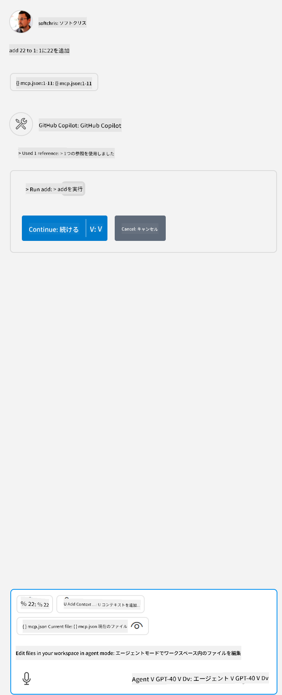

<!--
CO_OP_TRANSLATOR_METADATA:
{
  "original_hash": "5ef8f5821c1a04f7b1fc4f15098ecab8",
  "translation_date": "2025-07-13T19:40:18+00:00",
  "source_file": "03-GettingStarted/04-vscode/solution/README.md",
  "language_code": "ja"
}
-->
これは、`node build/index.js` のようなコマンドを実行することに対応しています。

- サーバーのエントリは、サーバーファイルの場所や選択したランタイムおよびサーバーの場所に応じて、サーバーを起動するために必要なコマンドに合わせて変更してください。

## サーバーで機能を利用する

- *mcp.json* を *./vscode* フォルダーに追加したら、`play` アイコンをクリックします。

    GitHub Copilot のチャットフィールドのすぐ上にあるツールアイコンが変わり、利用可能なツールの数が増えるのが確認できます。

## ツールを実行する

- チャットウィンドウに、ツールの説明に合ったプロンプトを入力します。例えば、`add` ツールを起動するには「add 3 to 20」のように入力します。

    チャットテキストボックスの上にツールが表示され、実行するために選択できることが示されます。以下のような画面イメージです：

    

    ツールを選択すると、先ほどの例のようなプロンプトの場合は「23」という数値結果が表示されるはずです。

**免責事項**：  
本書類はAI翻訳サービス「[Co-op Translator](https://github.com/Azure/co-op-translator)」を使用して翻訳されました。正確性の向上に努めておりますが、自動翻訳には誤りや不正確な部分が含まれる可能性があります。原文の言語による文書が正式な情報源とみなされるべきです。重要な情報については、専門の人間による翻訳を推奨します。本翻訳の利用により生じたいかなる誤解や誤訳についても、当方は一切の責任を負いかねます。