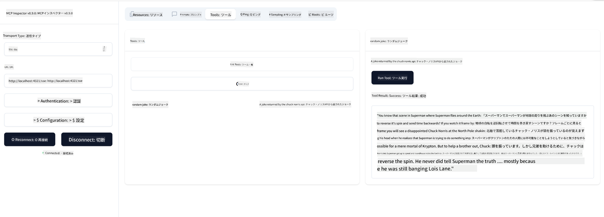

<!--
CO_OP_TRANSLATOR_METADATA:
{
  "original_hash": "1681ca3633aeb49ee03766abdbb94a93",
  "translation_date": "2025-06-17T22:00:24+00:00",
  "source_file": "03-GettingStarted/05-sse-server/README.md",
  "language_code": "ja"
}
-->
SSEについて少し理解できたところで、次はSSEサーバーを作ってみましょう。

## 演習: SSEサーバーの作成

サーバーを作る際に覚えておくべきことは次の2点です：

- 接続とメッセージ用のエンドポイントを公開するためにWebサーバーを使う必要がある。
- stdioを使っていたときと同様に、ツール、リソース、プロンプトを使ってサーバーを構築する。

### -1- サーバーインスタンスの作成

サーバーを作成するには、stdioと同じ型を使います。ただし、トランスポートとしてはSSEを選択します。 

次に必要なルートを追加しましょう。

### -2- ルートの追加

接続と受信メッセージを処理するルートを追加します。

次にサーバーの機能を追加しましょう。

### -3- サーバー機能の追加

SSE特有の部分が定義できたので、ツールやプロンプト、リソースなどのサーバー機能を追加します。

完成したコードは以下のようになります。

素晴らしい、SSEを使ったサーバーができました。次は実際に動かしてみましょう。

## 演習: Inspectorを使ったSSEサーバーのデバッグ

Inspectorは前のレッスン[最初のサーバーを作成する](/03-GettingStarted/01-first-server/README.md)で紹介した便利なツールです。ここでも使えるか試してみましょう。

### -1- Inspectorの起動

Inspectorを実行するには、まずSSEサーバーを起動しておく必要があります。では実行しましょう。

1. サーバーを起動する

1. Inspectorを起動する

    > ![NOTE]
    > Inspectorはサーバーを起動しているターミナルとは別のウィンドウで実行してください。また、以下のコマンドはサーバーが動いているURLに合わせて調整する必要があります。

    ```sh
    npx @modelcontextprotocol/inspector --cli http://localhost:8000/sse --method tools/list
    ```

Inspectorの実行方法はどのランタイムでも同じです。サーバーのパスや起動コマンドを渡す代わりに、サーバーが動作しているURLと`/sse`ルートを指定しているのがポイントです。

### -2- ツールの試用

ドロップダウンからSSEを選択し、サーバーが動いているURL（例: http://localhost:4321/sse）を入力して「Connect」ボタンを押します。あとは前と同様にツール一覧からツールを選び、入力値を渡してください。以下のような結果が表示されるはずです。



うまくInspectorを使えましたね。次はVisual Studio Codeでの使い方を見てみましょう。

## 課題

サーバーにさらに機能を追加してみましょう。例えば[こちらのページ](https://api.chucknorris.io/)を参考に、APIを呼び出すツールを作るのも良いでしょう。サーバーの内容は自由に決めてください。楽しんで取り組んでくださいね :)

## 解答例

[解答例](./solution/README.md) 動作するコードの一例を紹介しています。

## まとめ

この章のポイントは以下の通りです：

- SSEはstdioに次ぐ2つ目のサポートされているトランスポート方式です。
- SSEを使うには、Webフレームワークを用いて接続管理とメッセージ処理を行う必要があります。
- InspectorやVisual Studio Codeはstdioサーバーと同様にSSEサーバーを利用できます。ただしstdioとSSEでは少し使い方が異なり、SSEの場合はサーバーを別途起動してからInspectorを実行します。InspectorではURL指定が必要になる点も異なります。

## サンプル

- [Java Calculator](../samples/java/calculator/README.md)
- [.Net Calculator](../../../../03-GettingStarted/samples/csharp)
- [JavaScript Calculator](../samples/javascript/README.md)
- [TypeScript Calculator](../samples/typescript/README.md)
- [Python Calculator](../../../../03-GettingStarted/samples/python)

## 追加リソース

- [SSE](https://developer.mozilla.org/en-US/docs/Web/API/Server-sent_events)

## 次に学ぶこと

- 次へ: [MCPによるHTTPストリーミング (Streamable HTTP)](/03-GettingStarted/06-http-streaming/README.md)

**免責事項**：  
本書類はAI翻訳サービス「[Co-op Translator](https://github.com/Azure/co-op-translator)」を使用して翻訳されました。正確性には努めておりますが、自動翻訳には誤りや不正確な部分が含まれる可能性があることをご了承ください。原文はあくまで正式な情報源とみなされるべきです。重要な情報については、専門の人間翻訳を推奨いたします。本翻訳の使用により生じたいかなる誤解や誤訳についても、当方は責任を負いかねます。