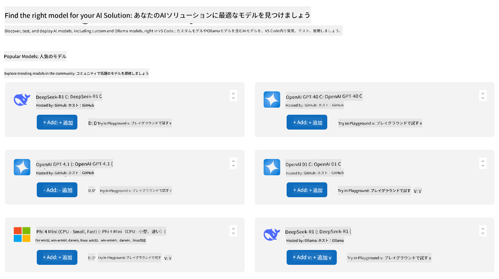

<!--
CO_OP_TRANSLATOR_METADATA:
{
  "original_hash": "a3cbadbf632058aa59a523ac659aa1df",
  "translation_date": "2025-05-16T15:29:28+00:00",
  "source_file": "03-GettingStarted/06-aitk/README.md",
  "language_code": "ja"
}
-->
# Visual Studio CodeのAI Toolkit拡張機能でサーバーを利用する

AIエージェントを構築するとき、単に賢い応答を生成するだけでなく、エージェントに行動を起こす能力を持たせることも重要です。そこで登場するのがModel Context Protocol（MCP）です。MCPを使うと、エージェントが外部のツールやサービスに一貫した方法でアクセスできるようになります。まるでエージェントを実際に使えるツールボックスに接続するようなイメージです。

例えば、エージェントを計算機のMCPサーバーに接続すると、「47かける89は？」といったプロンプトを受け取るだけで計算ができるようになります。ロジックをハードコードしたり、カスタムAPIを作る必要はありません。

## 概要

このレッスンでは、Visual Studio Codeの[AI Toolkit](https://aka.ms/AIToolkit)拡張機能を使って、計算機MCPサーバーをエージェントに接続し、自然言語で加算、減算、乗算、除算などの計算を実行できるようにする方法を解説します。

AI Toolkitは、エージェント開発を効率化する強力なVisual Studio Code拡張機能です。AIエンジニアはローカルやクラウドで生成AIモデルを開発・テストし、簡単にAIアプリケーションを構築できます。主要な生成モデルのほとんどに対応しています。

*Note*: AI Toolkitは現在PythonとTypeScriptをサポートしています。

## 学習目標

このレッスンを終えると、以下ができるようになります：

- AI Toolkitを通じてMCPサーバーを利用する。
- エージェント設定を構成し、MCPサーバーが提供するツールを検出・活用できるようにする。
- 自然言語を使ってMCPツールを利用する。

## アプローチ

大まかな流れは以下の通りです：

- エージェントを作成し、システムプロンプトを定義する。
- 計算機ツールを備えたMCPサーバーを作成する。
- Agent BuilderをMCPサーバーに接続する。
- 自然言語を使ってエージェントのツール呼び出しをテストする。

流れがわかったところで、MCPを通じて外部ツールを活用できるAIエージェントを設定し、その能力を高めましょう！

## 前提条件

- [Visual Studio Code](https://code.visualstudio.com/)
- [Visual Studio Code用AI Toolkit](https://aka.ms/AIToolkit)

## 演習：サーバーを利用する

この演習では、Visual Studio Code内でAI Toolkitを使い、MCPサーバーのツールを備えたAIエージェントを構築、実行、強化します。

### -0- 事前準備：OpenAI GPT-4oモデルをMy Modelsに追加する

この演習では**GPT-4o**モデルを使用します。エージェントを作成する前に、**My Models**にモデルを追加してください。



1. **Activity Bar**から**AI Toolkit**拡張機能を開く。
1. **Catalog**セクションで**Models**を選択し、**Model Catalog**を新しいエディタータブで開く。
1. 検索バーに**OpenAI GPT-4o**と入力する。
1. **+ Add**をクリックし、**My Models**リストに追加する。**Hosted by GitHub**のモデルを選択していることを確認する。
1. **Activity Bar**で**OpenAI GPT-4o**モデルがリストに表示されていることを確認する。

### -1- エージェントを作成する

**Agent (Prompt) Builder**を使うと、独自のAIエージェントを作成・カスタマイズできます。このセクションでは、新しいエージェントを作成し、会話を担当するモデルを割り当てます。


1. **Activity Bar**から**AI Toolkit**拡張機能を開く。
1. **Tools**セクションで**Agent (Prompt) Builder**を選択し、新しいエディタータブで開く。
1. **+ New Builder**ボタンをクリック。**Command Palette**でセットアップウィザードが起動する。
1. 名前に**Calculator Agent**と入力し、**Enter**を押す。
1. **Agent (Prompt) Builder**の**Model**フィールドで**OpenAI GPT-4o (via GitHub)**モデルを選択する。

### -2- エージェントのシステムプロンプトを作成する

エージェントの骨組みができたら、性格や目的を定義します。このセクションでは、**Generate system prompt**機能を使い、計算機エージェントとしての振る舞いを説明するシステムプロンプトをモデルに生成してもらいます。


1. **Prompts**セクションで**Generate system prompt**ボタンをクリック。プロンプトビルダーが開き、AIがシステムプロンプトを生成する。
1. **Generate a prompt**ウィンドウに以下を入力：`You are a helpful and efficient math assistant. When given a problem involving basic arithmetic, you respond with the correct result.`
1. **Generate**ボタンをクリック。右下に生成中の通知が表示される。生成が完了すると、システムプロンプトが**Agent (Prompt) Builder**の**System prompt**フィールドに表示される。
1. システムプロンプトを確認し、必要に応じて修正する。

### -3- MCPサーバーを作成する

エージェントのシステムプロンプトを定義し、振る舞いを決めたら、実際に計算を行う機能を持たせましょう。このセクションでは、加算、減算、乗算、除算を実行できる計算機MCPサーバーを作成します。このサーバーにより、エージェントは自然言語のプロンプトに対してリアルタイムで計算を行えるようになります。


AI ToolkitにはMCPサーバー作成を簡単にするテンプレートが用意されています。ここではPythonテンプレートを使って計算機MCPサーバーを作成します。

*Note*: AI Toolkitは現在PythonとTypeScriptをサポートしています。

1. **Agent (Prompt) Builder**の**Tools**セクションで**+ MCP Server**ボタンをクリック。**Command Palette**でセットアップウィザードが起動する。
1. **+ Add Server**を選択。
1. **Create a New MCP Server**を選択。
1. **python-weather**テンプレートを選択。
1. MCPサーバーテンプレートの保存先に**Default folder**を選択。
1. サーバー名に**Calculator**を入力。
1. 新しいVisual Studio Codeウィンドウが開く。**Yes, I trust the authors**を選択。
1. ターミナル（**Terminal** > **New Terminal**）で仮想環境を作成：`python -m venv .venv`
1. ターミナルで仮想環境を有効化：
    1. Windows - `.venv\Scripts\activate`
    1. macOS/Linux - `source venv/bin/activate`
1. ターミナルで依存関係をインストール：`pip install -e .[dev]`
1. **Activity Bar**の**Explorer**ビューで**src**ディレクトリを展開し、**server.py**を選択してエディターで開く。
1. **server.py**のコードを以下の内容に置き換え、保存する：

    ```python
    """
    Sample MCP Calculator Server implementation in Python.

    
    This module demonstrates how to create a simple MCP server with calculator tools
    that can perform basic arithmetic operations (add, subtract, multiply, divide).
    """
    
    from mcp.server.fastmcp import FastMCP
    
    server = FastMCP("calculator")
    
    @server.tool()
    def add(a: float, b: float) -> float:
        """Add two numbers together and return the result."""
        return a + b
    
    @server.tool()
    def subtract(a: float, b: float) -> float:
        """Subtract b from a and return the result."""
        return a - b
    
    @server.tool()
    def multiply(a: float, b: float) -> float:
        """Multiply two numbers together and return the result."""
        return a * b
    
    @server.tool()
    def divide(a: float, b: float) -> float:
        """
        Divide a by b and return the result.
        
        Raises:
            ValueError: If b is zero
        """
        if b == 0:
            raise ValueError("Cannot divide by zero")
        return a / b
    ```

### -4- 計算機MCPサーバーを使ってエージェントを実行する

エージェントにツールが備わったので、実際に使ってみましょう。このセクションでは、エージェントにプロンプトを送信し、計算機MCPサーバーの適切なツールが利用されているかをテスト・検証します。


ローカル開発マシンで計算機MCPサーバーを起動し、**Agent Builder**をMCPクライアントとして使います。

1. `F5` to start debugging the MCP server. The **Agent (Prompt) Builder** will open in a new editor tab. The status of the server is visible in the terminal.
1. In the **User prompt** field of the **Agent (Prompt) Builder**, enter the following prompt: `I bought 3 items priced at $25 each, and then used a $20 discount. How much did I pay?`
1. Click the **Run** button to generate the agent's response.
1. Review the agent output. The model should conclude that you paid **$55**.
1. Here's a breakdown of what should occur:
    - The agent selects the **multiply** and **substract** tools to aid in the calculation.
    - The respective `a` and `b` values are assigned for the **multiply** tool.
    - The respective `a` and `b` の値が**subtract**ツールに割り当てられる。
    - 各ツールの応答は対応する**Tool Response**に表示される。
    - モデルの最終出力は最終的な**Model Response**に表示される。
1. 追加のプロンプトを送信してエージェントをさらにテストできる。**User prompt**フィールドをクリックして既存のプロンプトを変更可能。
1. テストが終わったら、**terminal**で**CTRL/CMD+C**を押してサーバーを停止する。

## 課題

**server.py**ファイルに新しいツールエントリ（例：数値の平方根を返す）を追加してみましょう。新しいツール（または既存のツール）を利用するプロンプトを送信し、エージェントが正しく活用できるか確認してください。ツール追加後はサーバーを再起動して反映させるのを忘れずに。

## 解答例

[Solution](./solution/README.md)

## まとめ

この章のポイントは以下の通りです：

- AI Toolkit拡張機能は、MCPサーバーとそのツールを簡単に利用できる優れたクライアントである。
- MCPサーバーに新しいツールを追加することで、エージェントの能力を拡張し、変化する要件に対応できる。
- AI ToolkitにはPython用MCPサーバーテンプレートなど、カスタムツール作成を簡単にするテンプレートが含まれている。

## 参考資料

- [AI Toolkitドキュメント](https://aka.ms/AIToolkit/doc)

## 次に進む

次へ：[Lesson 4 Practical Implementation](/04-PracticalImplementation/README.md)

**免責事項**:  
本書類はAI翻訳サービス「Co-op Translator」（https://github.com/Azure/co-op-translator）を使用して翻訳されています。正確性には努めておりますが、自動翻訳には誤りや不正確な部分が含まれる可能性があることをご承知おきください。原文はあくまで正本としてご参照ください。重要な情報については、専門の人間による翻訳を推奨します。本翻訳の使用により生じた誤解や誤訳について、一切の責任を負いかねます。