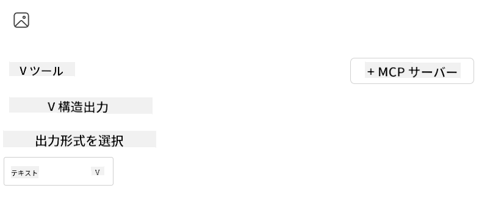

<!--
CO_OP_TRANSLATOR_METADATA:
{
  "original_hash": "8248e3491f5245ee6ab48ef724a4f65a",
  "translation_date": "2025-07-13T21:28:37+00:00",
  "source_file": "03-GettingStarted/07-aitk/README.md",
  "language_code": "ja"
}
-->
# Visual Studio Code の AI Toolkit 拡張機能でサーバーを利用する

AIエージェントを作るとき、単に賢い応答を生成するだけでなく、エージェントに行動を起こす能力を持たせることも重要です。そこで登場するのが Model Context Protocol（MCP）です。MCPは、エージェントが外部のツールやサービスに一貫した方法でアクセスできるようにします。まるでエージェントを実際に使えるツールボックスに接続するようなイメージです。

例えば、エージェントを計算機のMCPサーバーに接続すると、「47かける89は？」といったプロンプトを受け取るだけで計算ができるようになります。ロジックをハードコードしたり、カスタムAPIを作る必要はありません。

## 概要

このレッスンでは、Visual Studio Code の [AI Toolkit](https://aka.ms/AIToolkit) 拡張機能を使って、計算機のMCPサーバーをエージェントに接続し、自然言語で加算、減算、乗算、除算などの計算を行えるようにする方法を解説します。

AI Toolkitは、Visual Studio Code向けの強力な拡張機能で、エージェント開発を効率化します。AIエンジニアは、ローカルやクラウド上で生成AIモデルを開発・テストしながら、簡単にAIアプリケーションを構築できます。現在、主要な生成モデルのほとんどに対応しています。

*注*: AI Toolkitは現在、PythonとTypeScriptをサポートしています。

## 学習目標

このレッスンを終えると、以下ができるようになります：

- AI Toolkitを通じてMCPサーバーを利用する方法
- エージェント設定を構成し、MCPサーバーが提供するツールを発見・活用できるようにする方法
- 自然言語を使ってMCPツールを利用する方法

## アプローチ

大まかな流れは以下の通りです：

- エージェントを作成し、システムプロンプトを定義する
- 計算機ツールを備えたMCPサーバーを作成する
- Agent BuilderをMCPサーバーに接続する
- 自然言語でエージェントのツール呼び出しをテストする

流れがわかったところで、MCPを通じて外部ツールを活用し、エージェントの能力を強化する設定を始めましょう！

## 前提条件

- [Visual Studio Code](https://code.visualstudio.com/)
- [Visual Studio Code 用 AI Toolkit](https://aka.ms/AIToolkit)

## 演習：サーバーを利用する

この演習では、Visual Studio Code内のAI Toolkitを使って、MCPサーバーのツールを備えたAIエージェントを構築、実行、強化します。

### -0- 事前準備：OpenAI GPT-4oモデルをMy Modelsに追加する

この演習では**GPT-4o**モデルを使用します。エージェント作成前に**My Models**に追加しておいてください。


1. **Activity Bar**から**AI Toolkit**拡張機能を開きます。
1. **Catalog**セクションで**Models**を選択し、**Model Catalog**を開きます。**Models**を選ぶと新しいエディタタブで**Model Catalog**が開きます。
1. 検索バーに**OpenAI GPT-4o**と入力します。
1. **+ Add**をクリックしてモデルを**My Models**リストに追加します。**GitHubホスト**のモデルを選択していることを確認してください。
1. **Activity Bar**で**OpenAI GPT-4o**モデルがリストに表示されていることを確認します。

### -1- エージェントを作成する

**Agent (Prompt) Builder**を使うと、自分だけのAIエージェントを作成・カスタマイズできます。このセクションでは新しいエージェントを作成し、会話を支えるモデルを割り当てます。


1. **Activity Bar**から**AI Toolkit**拡張機能を開きます。
1. **Tools**セクションで**Agent (Prompt) Builder**を選択します。新しいエディタタブで**Agent (Prompt) Builder**が開きます。
1. **+ New Agent**ボタンをクリックします。コマンドパレットでセットアップウィザードが起動します。
1. 名前に**Calculator Agent**と入力し、Enterキーを押します。
1. **Agent (Prompt) Builder**の**Model**欄で**OpenAI GPT-4o (via GitHub)**モデルを選択します。

### -2- エージェントのシステムプロンプトを作成する

エージェントの骨組みができたら、次は性格や目的を定義します。このセクションでは**Generate system prompt**機能を使い、計算機エージェントとしての振る舞いを説明し、モデルにシステムプロンプトを作成してもらいます。


1. **Prompts**セクションで**Generate system prompt**ボタンをクリックします。プロンプトビルダーが開き、AIを使ってシステムプロンプトを生成します。
1. **Generate a prompt**ウィンドウに以下を入力します：`You are a helpful and efficient math assistant. When given a problem involving basic arithmetic, you respond with the correct result.`
1. **Generate**ボタンをクリックします。右下に生成中の通知が表示されます。生成が完了すると、**Agent (Prompt) Builder**の**System prompt**欄にプロンプトが表示されます。
1. **System prompt**を確認し、必要に応じて修正します。

### -3- MCPサーバーを作成する

エージェントのシステムプロンプトができたら、次は実用的な機能を持たせます。このセクションでは、加算、減算、乗算、除算の計算を実行できる計算機MCPサーバーを作成します。これにより、エージェントは自然言語のプロンプトに応じてリアルタイムで計算を行えます。



AI ToolkitにはMCPサーバー作成を簡単にするテンプレートが用意されています。ここではPythonテンプレートを使って計算機MCPサーバーを作成します。

*注*: AI Toolkitは現在、PythonとTypeScriptをサポートしています。

1. **Agent (Prompt) Builder**の**Tools**セクションで**+ MCP Server**ボタンをクリックします。コマンドパレットでセットアップウィザードが起動します。
1. **+ Add Server**を選択します。
1. **Create a New MCP Server**を選択します。
1. テンプレートとして**python-weather**を選択します。
1. MCPサーバーテンプレートの保存先に**Default folder**を選択します。
1. サーバー名に**Calculator**と入力します。
1. 新しいVisual Studio Codeウィンドウが開きます。**Yes, I trust the authors**を選択します。
1. ターミナル（**Terminal** > **New Terminal**）で仮想環境を作成します：`python -m venv .venv`
1. ターミナルで仮想環境を有効化します：
    1. Windows - `.venv\Scripts\activate`
    1. macOS/Linux - `source venv/bin/activate`
1. ターミナルで依存関係をインストールします：`pip install -e .[dev]`
1. **Activity Bar**の**Explorer**ビューで**src**ディレクトリを展開し、**server.py**を選択してエディタで開きます。
1. **server.py**のコードを以下の内容に置き換え、保存します：

    ```python
    """
    Sample MCP Calculator Server implementation in Python.

    
    This module demonstrates how to create a simple MCP server with calculator tools
    that can perform basic arithmetic operations (add, subtract, multiply, divide).
    """
    
    from mcp.server.fastmcp import FastMCP
    
    server = FastMCP("calculator")
    
    @server.tool()
    def add(a: float, b: float) -> float:
        """Add two numbers together and return the result."""
        return a + b
    
    @server.tool()
    def subtract(a: float, b: float) -> float:
        """Subtract b from a and return the result."""
        return a - b
    
    @server.tool()
    def multiply(a: float, b: float) -> float:
        """Multiply two numbers together and return the result."""
        return a * b
    
    @server.tool()
    def divide(a: float, b: float) -> float:
        """
        Divide a by b and return the result.
        
        Raises:
            ValueError: If b is zero
        """
        if b == 0:
            raise ValueError("Cannot divide by zero")
        return a / b
    ```

### -4- 計算機MCPサーバーでエージェントを実行する

エージェントにツールが備わったので、実際に使ってみましょう。このセクションでは、エージェントにプロンプトを送信し、計算機MCPサーバーの適切なツールを使っているかをテスト・検証します。


ローカル開発マシンで計算機MCPサーバーを**Agent Builder**をMCPクライアントとして実行します。

1. `F5`キーを押してMCPサーバーのデバッグを開始します。**Agent (Prompt) Builder**が新しいエディタタブで開きます。ターミナルにサーバーの状態が表示されます。
1. **Agent (Prompt) Builder**の**User prompt**欄に以下のプロンプトを入力します：`I bought 3 items priced at $25 each, and then used a $20 discount. How much did I pay?`
1. **Run**ボタンをクリックしてエージェントの応答を生成します。
1. エージェントの出力を確認します。モデルは支払額が**$55**であると結論づけるはずです。
1. 起こるべき処理の内訳は以下の通りです：
    - エージェントは計算を助けるために**multiply**と**subtract**ツールを選択します。
    - **multiply**ツールにはそれぞれ`a`と`b`の値が割り当てられます。
    - **subtract**ツールにもそれぞれ`a`と`b`の値が割り当てられます。
    - 各ツールからの応答が**Tool Response**に表示されます。
    - 最終的なモデルの応答が**Model Response**に表示されます。
1. さらにプロンプトを送信してエージェントをテストしてください。**User prompt**欄をクリックして既存のプロンプトを編集できます。
1. テストが終わったら、**terminal**で**CTRL/CMD+C**を入力してサーバーを停止します。

## 課題

**server.py**ファイルに新しいツール（例：数値の平方根を返すツール）を追加してみましょう。新しいツール（または既存のツール）を使うようなプロンプトを送信してエージェントをテストしてください。新しいツールを読み込むためにサーバーの再起動を忘れずに行ってください。

## 解答例

[解答例](./solution/README.md)

## まとめ

この章のポイントは以下の通りです：

- AI Toolkit拡張機能は、MCPサーバーとそのツールを利用するのに最適なクライアントです。
- MCPサーバーに新しいツールを追加することで、エージェントの機能を拡張し、変化する要件に対応できます。
- AI ToolkitにはPythonのMCPサーバーテンプレートなど、カスタムツール作成を簡単にするテンプレートが含まれています。

## 追加リソース

- [AI Toolkit ドキュメント](https://aka.ms/AIToolkit/doc)

## 次に進む
- 次へ：[テストとデバッグ](../08-testing/README.md)

**免責事項**：  
本書類はAI翻訳サービス「[Co-op Translator](https://github.com/Azure/co-op-translator)」を使用して翻訳されました。正確性の向上に努めておりますが、自動翻訳には誤りや不正確な部分が含まれる可能性があります。原文の言語によるオリジナル文書が正式な情報源とみなされるべきです。重要な情報については、専門の人間による翻訳を推奨します。本翻訳の利用により生じたいかなる誤解や誤訳についても、当方は一切の責任を負いかねます。