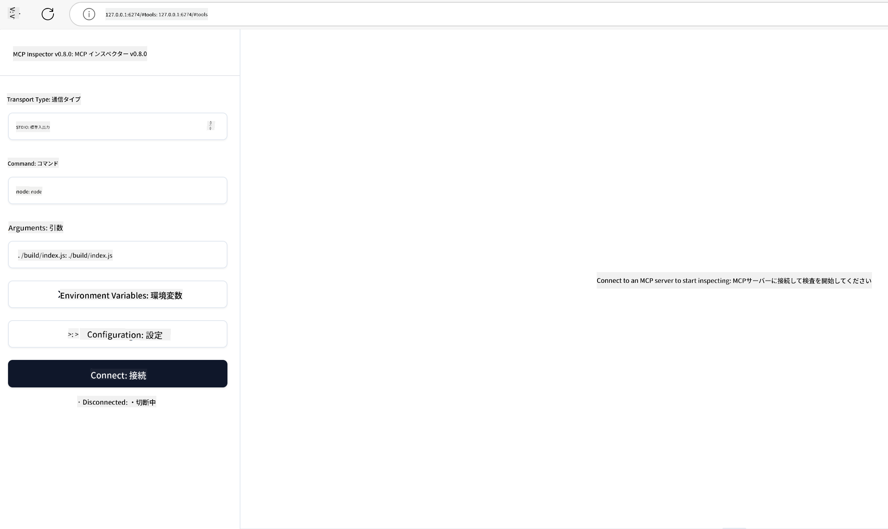

<!--
CO_OP_TRANSLATOR_METADATA:
{
  "original_hash": "4e34e34e84f013e73c7eaa6d09884756",
  "translation_date": "2025-07-13T21:58:13+00:00",
  "source_file": "03-GettingStarted/08-testing/README.md",
  "language_code": "ja"
}
-->
## テストとデバッグ

MCPサーバーのテストを始める前に、利用可能なツールやデバッグのベストプラクティスを理解しておくことが重要です。効果的なテストはサーバーが期待通りに動作することを保証し、問題の特定と解決を迅速に行うのに役立ちます。以下のセクションでは、MCPの実装を検証するための推奨される方法を紹介します。

## 概要

このレッスンでは、適切なテスト手法の選び方と最も効果的なテストツールについて説明します。

## 学習目標

このレッスンを終えると、以下のことができるようになります：

- さまざまなテスト手法を説明できる。
- 複数のツールを使って効果的にコードをテストできる。

## MCPサーバーのテスト

MCPはサーバーのテストとデバッグを支援するツールを提供しています：

- **MCP Inspector**：CLIツールとしてもビジュアルツールとしても使えるコマンドラインツール。
- **手動テスト**：curlのようなツールを使ってWebリクエストを実行できますが、HTTPを実行できるツールなら何でも構いません。
- **ユニットテスト**：お好みのテストフレームワークを使って、サーバーとクライアントの機能をテストすることが可能です。

### MCP Inspectorの使い方

このツールの使い方は前のレッスンで説明しましたが、ここでは概要を簡単に説明します。Node.jsで作られており、`npx`コマンドを使って実行します。`npx`はツールを一時的にダウンロード・インストールし、実行後は自動的にクリーンアップします。

[MCP Inspector](https://github.com/modelcontextprotocol/inspector)は以下のことを支援します：

- **サーバー機能の発見**：利用可能なリソース、ツール、プロンプトを自動検出
- **ツール実行のテスト**：さまざまなパラメータを試し、リアルタイムでレスポンスを確認
- **サーバーメタデータの表示**：サーバー情報、スキーマ、設定の確認

ツールの典型的な実行例は以下の通りです：

```bash
npx @modelcontextprotocol/inspector node build/index.js
```

上記のコマンドはMCPとそのビジュアルインターフェースを起動し、ブラウザでローカルのWebインターフェースを開きます。登録されたMCPサーバー、利用可能なツール、リソース、プロンプトが表示されるダッシュボードが見られます。このインターフェースを使うことで、ツールの実行を対話的にテストしたり、サーバーメタデータを調査したり、リアルタイムのレスポンスを確認したりでき、MCPサーバーの実装検証やデバッグが容易になります。

画面はこのようなイメージです： 

また、`--cli`オプションを付けてCLIモードで実行することも可能です。以下はCLIモードでツール一覧を表示する例です：

```sh
npx @modelcontextprotocol/inspector --cli node build/index.js --method tools/list
```

### 手動テスト

Inspectorツールでサーバー機能をテストする以外に、curlのようなHTTPクライアントを使う方法もあります。

curlを使うと、HTTPリクエストで直接MCPサーバーをテストできます：

```bash
# Example: Test server metadata
curl http://localhost:3000/v1/metadata

# Example: Execute a tool
curl -X POST http://localhost:3000/v1/tools/execute \
  -H "Content-Type: application/json" \
  -d '{"name": "calculator", "parameters": {"expression": "2+2"}}'
```

上記のcurlの使い方からわかるように、POSTリクエストでツール名とパラメータを含むペイロードを送信してツールを呼び出します。自分に合った方法を選んでください。CLIツールは一般的に操作が速く、スクリプト化しやすいため、CI/CD環境での利用に便利です。

### ユニットテスト

ツールやリソースが期待通りに動作するかを確認するためにユニットテストを作成しましょう。以下はテストコードの例です。

```python
import pytest

from mcp.server.fastmcp import FastMCP
from mcp.shared.memory import (
    create_connected_server_and_client_session as create_session,
)

# Mark the whole module for async tests
pytestmark = pytest.mark.anyio


async def test_list_tools_cursor_parameter():
    """Test that the cursor parameter is accepted for list_tools.

    Note: FastMCP doesn't currently implement pagination, so this test
    only verifies that the cursor parameter is accepted by the client.
    """

 server = FastMCP("test")

    # Create a couple of test tools
    @server.tool(name="test_tool_1")
    async def test_tool_1() -> str:
        """First test tool"""
        return "Result 1"

    @server.tool(name="test_tool_2")
    async def test_tool_2() -> str:
        """Second test tool"""
        return "Result 2"

    async with create_session(server._mcp_server) as client_session:
        # Test without cursor parameter (omitted)
        result1 = await client_session.list_tools()
        assert len(result1.tools) == 2

        # Test with cursor=None
        result2 = await client_session.list_tools(cursor=None)
        assert len(result2.tools) == 2

        # Test with cursor as string
        result3 = await client_session.list_tools(cursor="some_cursor_value")
        assert len(result3.tools) == 2

        # Test with empty string cursor
        result4 = await client_session.list_tools(cursor="")
        assert len(result4.tools) == 2
    
```

上記のコードは以下のことを行っています：

- pytestフレームワークを利用し、関数としてテストを作成しassert文を使って検証。
- 2つの異なるツールを持つMCPサーバーを作成。
- `assert`文で特定の条件が満たされているかをチェック。

[こちらのファイル全文](https://github.com/modelcontextprotocol/python-sdk/blob/main/tests/client/test_list_methods_cursor.py)も参照してください。

このファイルを参考に、自分のサーバーが正しく機能しているかテストできます。

主要なSDKには同様のテストセクションがあるので、使用しているランタイムに合わせて調整してください。

## サンプル

- [Java Calculator](../samples/java/calculator/README.md)
- [.Net Calculator](../../../../03-GettingStarted/samples/csharp)
- [JavaScript Calculator](../samples/javascript/README.md)
- [TypeScript Calculator](../samples/typescript/README.md)
- [Python Calculator](../../../../03-GettingStarted/samples/python)

## 追加リソース

- [Python SDK](https://github.com/modelcontextprotocol/python-sdk)

## 次に進む

- 次へ：[MCPサーバーのデプロイ](../09-deployment/README.md)

**免責事項**：  

本書類はAI翻訳サービス「[Co-op Translator](https://github.com/Azure/co-op-translator)」を使用して翻訳されました。正確性を期しておりますが、自動翻訳には誤りや不正確な部分が含まれる可能性があります。原文の言語によるオリジナル文書が正式な情報源とみなされるべきです。重要な情報については、専門の人間による翻訳を推奨します。本翻訳の利用により生じたいかなる誤解や誤訳についても、当方は一切の責任を負いかねます。
