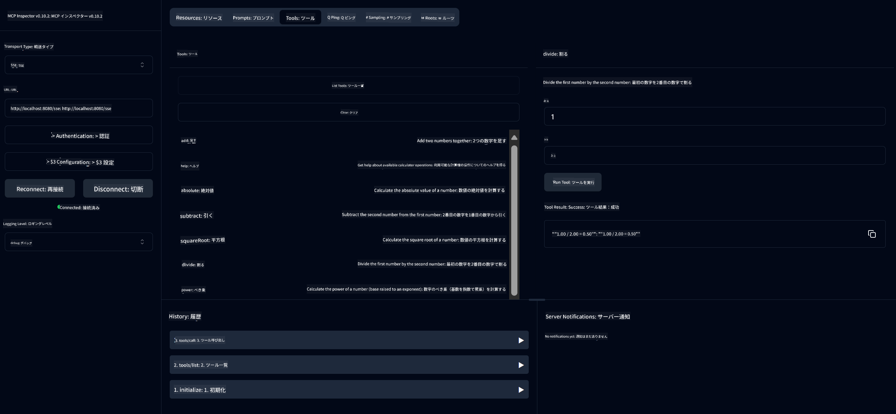

<!--
CO_OP_TRANSLATOR_METADATA:
{
  "original_hash": "13231e9951b68efd9df8c56bd5cdb27e",
  "translation_date": "2025-07-13T22:23:16+00:00",
  "source_file": "03-GettingStarted/samples/java/calculator/README.md",
  "language_code": "ja"
}
-->
# Basic Calculator MCP Service

このサービスは、Spring BootのWebFluxトランスポートを使ってModel Context Protocol（MCP）経由で基本的な計算機能を提供します。MCPの実装を学ぶ初心者向けのシンプルな例として設計されています。

詳細は、[MCP Server Boot Starter](https://docs.spring.io/spring-ai/reference/api/mcp/mcp-server-boot-starter-docs.html)のリファレンスドキュメントをご覧ください。

## 概要

このサービスの特徴：
- SSE（Server-Sent Events）対応
- Spring AIの`@Tool`アノテーションによる自動ツール登録
- 基本的な計算機能：
  - 加算、減算、乗算、除算
  - 累乗計算と平方根
  - 剰余（モジュラス）と絶対値
  - 操作説明用のヘルプ機能

## 機能

この計算機サービスが提供する機能は以下の通りです：

1. **基本的な算術演算**：
   - 2つの数の加算
   - 1つの数から別の数を減算
   - 2つの数の乗算
   - 0除算チェック付きの除算

2. **高度な演算**：
   - 累乗計算（底の数を指数でべき乗）
   - 負の数チェック付きの平方根計算
   - 剰余（余り）計算
   - 絶対値計算

3. **ヘルプシステム**：
   - 利用可能なすべての操作を説明する組み込みヘルプ機能

## サービスの利用方法

このサービスはMCPプロトコルを通じて以下のAPIエンドポイントを公開しています：

- `add(a, b)`: 2つの数を加算
- `subtract(a, b)`: 2つ目の数を1つ目の数から減算
- `multiply(a, b)`: 2つの数を乗算
- `divide(a, b)`: 0除算チェック付きで1つ目の数を2つ目の数で除算
- `power(base, exponent)`: 累乗計算
- `squareRoot(number)`: 負の数チェック付き平方根計算
- `modulus(a, b)`: 除算時の余りを計算
- `absolute(number)`: 絶対値計算
- `help()`: 利用可能な操作の情報を取得

## テストクライアント

`com.microsoft.mcp.sample.client`パッケージにシンプルなテストクライアントが含まれています。`SampleCalculatorClient`クラスは計算機サービスの利用可能な操作を示しています。

## LangChain4jクライアントの利用

プロジェクトには、`com.microsoft.mcp.sample.client.LangChain4jClient`にLangChain4jの例示クライアントが含まれており、計算機サービスをLangChain4jおよびGitHubモデルと統合する方法を示しています。

### 前提条件

1. **GitHubトークンの設定**：
   
   GitHubのAIモデル（phi-4など）を使うには、GitHubのパーソナルアクセストークンが必要です：

   a. GitHubアカウント設定にアクセス：https://github.com/settings/tokens
   
   b. 「Generate new token」→「Generate new token (classic)」をクリック
   
   c. トークンにわかりやすい名前を付ける
   
   d. 以下のスコープを選択：
      - `repo`（プライベートリポジトリのフルコントロール）
      - `read:org`（組織とチームのメンバーシップ、組織プロジェクトの読み取り）
      - `gist`（Gistの作成）
      - `user:email`（ユーザーのメールアドレスへの読み取り専用アクセス）
   
   e. 「Generate token」をクリックし、新しいトークンをコピー
   
   f. 環境変数として設定：
      
      Windowsの場合：
      ```
      set GITHUB_TOKEN=your-github-token
      ```
      
      macOS/Linuxの場合：
      ```bash
      export GITHUB_TOKEN=your-github-token
      ```

   g. 永続的に設定する場合は、システム設定の環境変数に追加してください

2. プロジェクトにLangChain4jのGitHub依存関係を追加（pom.xmlに既に含まれています）：
   ```xml
   <dependency>
       <groupId>dev.langchain4j</groupId>
       <artifactId>langchain4j-github</artifactId>
       <version>${langchain4j.version}</version>
   </dependency>
   ```

3. 計算機サーバーが`localhost:8080`で起動していることを確認

### LangChain4jクライアントの実行

この例では以下を示します：
- SSEトランスポートを使って計算機MCPサーバーに接続
- LangChain4jで計算機能を活用するチャットボットの作成
- GitHub AIモデル（現在はphi-4モデル）との統合

クライアントは以下のサンプルクエリを送信して機能をデモします：
1. 2つの数の合計計算
2. 数の平方根計算
3. 利用可能な計算機操作のヘルプ情報取得

例を実行し、コンソール出力でAIモデルが計算機ツールを使ってどのように応答するかを確認してください。

### GitHubモデルの設定

LangChain4jクライアントはGitHubのphi-4モデルを以下の設定で使用するよう構成されています：

```java
ChatLanguageModel model = GitHubChatModel.builder()
    .apiKey(System.getenv("GITHUB_TOKEN"))
    .timeout(Duration.ofSeconds(60))
    .modelName("phi-4")
    .logRequests(true)
    .logResponses(true)
    .build();
```

別のGitHubモデルを使う場合は、`modelName`パラメータを対応するモデル名（例："claude-3-haiku-20240307"、"llama-3-70b-8192"など）に変更してください。

## 依存関係

プロジェクトで必要な主な依存関係は以下の通りです：

```xml
<!-- For MCP Server -->
<dependency>
    <groupId>org.springframework.ai</groupId>
    <artifactId>spring-ai-starter-mcp-server-webflux</artifactId>
</dependency>

<!-- For LangChain4j integration -->
<dependency>
    <groupId>dev.langchain4j</groupId>
    <artifactId>langchain4j-mcp</artifactId>
    <version>${langchain4j.version}</version>
</dependency>

<!-- For GitHub models support -->
<dependency>
    <groupId>dev.langchain4j</groupId>
    <artifactId>langchain4j-github</artifactId>
    <version>${langchain4j.version}</version>
</dependency>
```

## プロジェクトのビルド

Mavenを使ってプロジェクトをビルドします：
```bash
./mvnw clean install -DskipTests
```

## サーバーの起動

### Javaを使う場合

```bash
java -jar target/calculator-server-0.0.1-SNAPSHOT.jar
```

### MCP Inspectorの利用

MCP InspectorはMCPサービスとやり取りするための便利なツールです。この計算機サービスで使うには：

1. **MCP Inspectorをインストールして起動**（新しいターミナルウィンドウで）：
   ```bash
   npx @modelcontextprotocol/inspector
   ```

2. **アプリが表示するURL（通常は http://localhost:6274）をクリックしてWeb UIにアクセス**

3. **接続設定**：
   - トランスポートタイプを「SSE」に設定
   - 実行中のサーバーのSSEエンドポイント（`http://localhost:8080/sse`）をURLに設定
   - 「Connect」をクリック

4. **ツールの利用**：
   - 「List Tools」をクリックして利用可能な計算機操作を表示
   - ツールを選択し、「Run Tool」をクリックして操作を実行



### Dockerの利用

プロジェクトにはコンテナ化用のDockerfileが含まれています：

1. **Dockerイメージのビルド**：
   ```bash
   docker build -t calculator-mcp-service .
   ```

2. **Dockerコンテナの起動**：
   ```bash
   docker run -p 8080:8080 calculator-mcp-service
   ```

これにより：
- Maven 3.9.9とEclipse Temurin 24 JDKを使ったマルチステージDockerイメージをビルド
- 最適化されたコンテナイメージを作成
- ポート8080でサービスを公開
- コンテナ内でMCP計算機サービスを起動

コンテナ起動後、`http://localhost:8080`でサービスにアクセス可能です。

## トラブルシューティング

### GitHubトークンに関するよくある問題

1. **トークンの権限不足**：403 Forbiddenエラーが出る場合は、前述の前提条件にある権限が正しく設定されているか確認してください。

2. **トークンが見つからない**：「No API key found」エラーが出る場合は、GITHUB_TOKEN環境変数が正しく設定されているか確認してください。

3. **レートリミット**：GitHub APIには利用制限があります。429エラーが出た場合は、数分待ってから再試行してください。

4. **トークンの有効期限切れ**：トークンは期限切れになることがあります。認証エラーが発生したら、新しいトークンを生成し環境変数を更新してください。

さらにサポートが必要な場合は、[LangChain4jのドキュメント](https://github.com/langchain4j/langchain4j)や[GitHub APIドキュメント](https://docs.github.com/en/rest)を参照してください。

**免責事項**：  
本書類はAI翻訳サービス「[Co-op Translator](https://github.com/Azure/co-op-translator)」を使用して翻訳されました。正確性を期しておりますが、自動翻訳には誤りや不正確な部分が含まれる可能性があります。原文の言語による文書が正式な情報源とみなされるべきです。重要な情報については、専門の人間による翻訳を推奨します。本翻訳の利用により生じた誤解や誤訳について、当方は一切の責任を負いかねます。