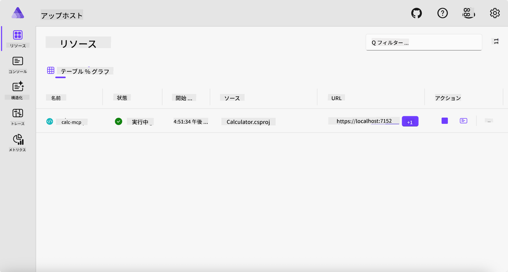
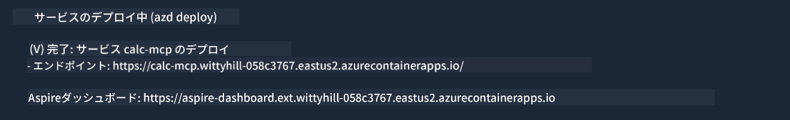

<!--
CO_OP_TRANSLATOR_METADATA:
{
  "original_hash": "0bc7bd48f55f1565f1d95ccb2c16f728",
  "translation_date": "2025-07-13T23:04:53+00:00",
  "source_file": "04-PracticalImplementation/samples/csharp/README.md",
  "language_code": "ja"
}
-->
# サンプル

前の例では、`stdio` タイプを使ったローカルの .NET プロジェクトの使い方と、コンテナ内でサーバーをローカルに起動する方法を示しました。これは多くの状況で良い解決策です。しかし、サーバーをクラウド環境のようなリモートで動かすことも有用な場合があります。そこで登場するのが `http` タイプです。

`04-PracticalImplementation` フォルダーのソリューションを見ると、前の例よりもずっと複雑に見えるかもしれません。しかし実際はそうではありません。`src/Calculator` プロジェクトをよく見ると、ほとんど前の例と同じコードであることがわかります。唯一の違いは、HTTPリクエストを処理するために別のライブラリ `ModelContextProtocol.AspNetCore` を使っていることと、`IsPrime` メソッドをプライベートに変更して、コード内でプライベートメソッドを使えることを示している点です。その他のコードは前と同じです。

他のプロジェクトは [.NET Aspire](https://learn.microsoft.com/dotnet/aspire/get-started/aspire-overview) からのものです。ソリューションに .NET Aspire を含めることで、開発やテストの体験が向上し、可観測性も助けられます。サーバーを動かすのに必須ではありませんが、ソリューションに入れておくのは良い習慣です。

## サーバーをローカルで起動する

1. VS Code（C# DevKit 拡張機能付き）から `04-PracticalImplementation/samples/csharp` ディレクトリに移動します。
1. 次のコマンドを実行してサーバーを起動します。

   ```bash
    dotnet watch run --project ./src/AppHost
   ```

1. Webブラウザで .NET Aspire ダッシュボードが開いたら、`http` のURLを確認してください。`http://localhost:5058/` のようなURLのはずです。

   

## MCP Inspector で Streamable HTTP をテストする

Node.js 22.7.5 以降をお持ちの場合、MCP Inspector を使ってサーバーをテストできます。

サーバーを起動し、ターミナルで次のコマンドを実行します。

```bash
npx @modelcontextprotocol/inspector http://localhost:5058
```


- Transport タイプとして `Streamable HTTP` を選択します。
- Url フィールドに先ほど確認したサーバーのURLを入力し、末尾に `/mcp` を追加します。`http`（`https` ではなく）で、`http://localhost:5058/mcp` のようになります。
- Connect ボタンを選択します。

Inspector の良いところは、何が起きているかを見やすく表示してくれる点です。

- 利用可能なツールの一覧を試してみてください
- いくつかのツールを試してみてください。前と同じように動作するはずです。

## VS Code の GitHub Copilot Chat で MCP サーバーをテストする

Streamable HTTP トランスポートを GitHub Copilot Chat で使うには、先に作成した `calc-mcp` サーバーの設定を次のように変更します。

```jsonc
// .vscode/mcp.json
{
  "servers": {
    "calc-mcp": {
      "type": "http",
      "url": "http://localhost:5058/mcp"
    }
  }
}
```

いくつかテストしてみましょう：

- 「6780の後の3つの素数を教えて」と尋ねてみてください。Copilot が新しいツール `NextFivePrimeNumbers` を使い、最初の3つの素数だけを返すことがわかります。
- 「111の後の7つの素数を教えて」と尋ねてみて、どうなるか見てみましょう。
- 「ジョンは24個のロリポップを3人の子供に均等に分けたい。1人あたり何個になる？」と尋ねてみて、どうなるか見てみましょう。

## サーバーを Azure にデプロイする

より多くの人が使えるように、サーバーを Azure にデプロイしましょう。

ターミナルから `04-PracticalImplementation/samples/csharp` フォルダーに移動し、次のコマンドを実行します。

```bash
azd up
```

デプロイが完了すると、次のようなメッセージが表示されるはずです。



URLを控えて、MCP Inspector や GitHub Copilot Chat で使いましょう。

```jsonc
// .vscode/mcp.json
{
  "servers": {
    "calc-mcp": {
      "type": "http",
      "url": "https://calc-mcp.gentleriver-3977fbcf.australiaeast.azurecontainerapps.io/mcp"
    }
  }
}
```

## 次は？

さまざまなトランスポートタイプやテストツールを試し、MCPサーバーを Azure にデプロイしました。しかし、もしサーバーがプライベートリソースにアクセスする必要があったらどうでしょう？例えば、データベースやプライベートAPIなどです。次の章では、サーバーのセキュリティをどのように強化できるかを見ていきます。

**免責事項**：  
本書類はAI翻訳サービス「[Co-op Translator](https://github.com/Azure/co-op-translator)」を使用して翻訳されました。正確性を期しておりますが、自動翻訳には誤りや不正確な部分が含まれる可能性があります。原文の言語による文書が正式な情報源とみなされるべきです。重要な情報については、専門の人間による翻訳を推奨します。本翻訳の利用により生じた誤解や誤訳について、当方は一切の責任を負いかねます。