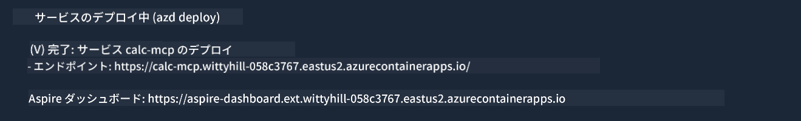

<!--
CO_OP_TRANSLATOR_METADATA:
{
  "original_hash": "5020a3e1a1c7f30c00f9e37f1fa208e3",
  "translation_date": "2025-05-16T15:40:56+00:00",
  "source_file": "04-PracticalImplementation/samples/csharp/README.md",
  "language_code": "ja"
}
-->
# Sample

前の例では、ローカルの .NET プロジェクトを `sdio` タイプで使う方法と、コンテナ内でローカルにサーバーを起動する方法を示しました。これは多くの状況で良い解決策です。しかし、クラウド環境のようにサーバーをリモートで動かすことが役立つ場合もあります。ここで `http` タイプが登場します。

`04-PracticalImplementation` フォルダー内のソリューションを見ると、前のものよりずっと複雑に見えるかもしれません。でも実際はそうではありません。`src/mcpserver/mcpserver.csproj` プロジェクトをよく見ると、ほとんど前の例と同じコードであることがわかります。唯一の違いは、HTTPリクエストを扱うために異なるライブラリ `ModelContextProtocol.AspNetCore` を使っていることと、メソッド `IsPrime` をプライベートに変更して、コード内にプライベートメソッドが持てることを示している点です。その他のコードは以前と同じです。

他のプロジェクトは [.NET Aspire](https://learn.microsoft.com/dotnet/aspire/get-started/aspire-overview) からのものです。ソリューションに .NET Aspire を含めることで、開発やテスト時の開発者体験が向上し、可観測性も助けられます。サーバーを動かすのに必須ではありませんが、ソリューションに含めておくのは良い習慣です。

## サーバーをローカルで起動する

1. VS Code（C# DevKit 拡張機能付き）から、ソリューション `04-PracticalImplementation\samples\csharp\src\Calculator-chap4.sln` を開きます。
2. `F5` を押してサーバーを起動します。すると、.NET Aspire ダッシュボードがブラウザで開くはずです。

または

1. ターミナルから `04-PracticalImplementation\samples\csharp\src` フォルダーに移動します。
2. 次のコマンドを実行してサーバーを起動します：
   ```bash
    dotnet run --project .\AppHost
   ```

3. ダッシュボードから `http` の URL を確認します。`http://localhost:5058/`.

## Test `SSE` のようになっているはずです（ModelContext Protocol Inspector付き）。

Node.js 22.7.5 以降をお使いの場合は、ModelContext Protocol Inspector を使ってサーバーをテストできます。

サーバーを起動し、ターミナルで次のコマンドを実行してください：

```bash
npx @modelcontextprotocol/inspector@latest
```


- `SSE` as the Transport type. SSE stand for Server-Sent Events. 
- In the Url field, enter the URL of the server noted earlier,and append `/sse` を選択します。`http` であるはずです（`https`) something like `http://localhost:5058/sse`.
- select the Connect button.

A nice thing about the Inspector is that it provide a nice visibility on what is happening.

- Try listing the availables tools
- Try some of them, it should works just like before.


## Test `SSE` with Github Copilot Chat in VS Code

To use the `SSE` transport with Github Copilot Chat, change the configuration of the `mcp-calc` サーバーが以前作成されたもののようになります）：

```json
"mcp-calc": {
    "type": "sse",
    "url": "http://localhost:5058/sse"
}
```

いくつかテストを行いましょう：
- 6780の後の3つの素数を尋ねてみてください。Copilot が新しいツール `NextFivePrimeNumbers` を使い、最初の3つの素数だけを返すことに注目してください。
- 111の後の7つの素数を尋ねて、どうなるか見てみましょう。

# サーバーを Azure にデプロイする

より多くの人が使えるように、サーバーを Azure にデプロイしましょう。

ターミナルで `04-PracticalImplementation\samples\csharp\src` フォルダーに移動し、次のコマンドを実行します：

```bash
azd init
```

これにより、Azureリソースの設定や Infrastructure as Code (IaC) を保存するためのファイルがローカルにいくつか作成されます。

次に、サーバーを Azure にデプロイするために次のコマンドを実行します：

```bash
azd up
```

デプロイが完了すると、次のようなメッセージが表示されるはずです：



Aspire ダッシュボードにアクセスし、MCP Inspector や Github Copilot Chat で使う `HTTP` URL を確認してください。

## 次に何をする？

異なるトランスポートタイプやテストツールを試し、MCPサーバーを Azure にデプロイしました。でも、もしサーバーがプライベートリソースにアクセスする必要があったらどうでしょう？例えば、データベースやプライベートAPIなどです。次の章では、サーバーのセキュリティを強化する方法を見ていきます。

**免責事項**：  
本書類はAI翻訳サービス「[Co-op Translator](https://github.com/Azure/co-op-translator)」を使用して翻訳されています。正確性には努めておりますが、自動翻訳には誤りや不正確な部分が含まれる可能性があることをご了承ください。原文のネイティブ言語による文書が正式な情報源とみなされます。重要な情報については、専門の人間による翻訳を推奨します。本翻訳の利用により生じた誤解や誤訳について、当方は一切責任を負いかねます。